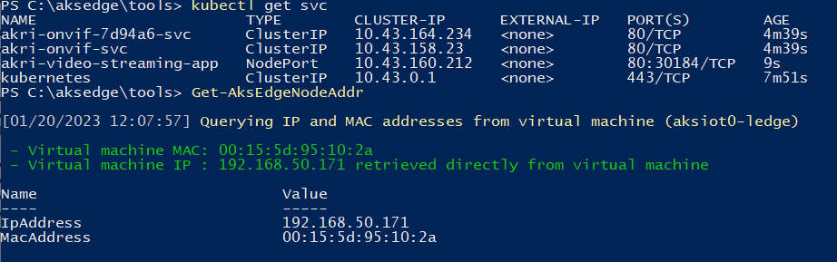

# Discover ONVIF cameras with Akri

Akri is a Kubernetes resource interface that lets you easily expose heterogeneous leaf devices (such as IP cameras and USB devices) as resources in a Kubernetes cluster, and it continually detects nodes that have access to these devices to schedule workloads based on them. Akri is a CNCF sandbox project made for the edge, handling the dynamic appearance and disappearance of leaf devices. It currently supports OPC UA, ONVIF and udev protocols, but you can also implement custom protocol handlers provided by the template. [Read more about Akri here](https://github.com/project-akri/akri-docs).

This article describes how you can discover ONVIF cameras that are connected to the same network as your AKS Edge Essentials cluster. ONVIF is an open industry standard for IP security devices, commonly used for video surveillance. [Read more about ONVIF profiles here](https://www.onvif.org/profiles-add-ons-specifications/). This demo helps you get started using Akri to discover IP cameras through the ONVIF protocol and use them via a video broker that enables you to consume the footage from the camera and display it in a web application.

[](media/aks-edge/akri-onvif-demo-flow.svg#lightbox)

## Prerequisites

- A [single-machine deployment](aks-edge-howto-single-node-deployment.md) or [full deployment](aks-edge-howto-multi-node-deployment.md) of AKS Edge Essentials up and running (if you're using a real ONVIF IP camera, you must create a full deployment with an external switch).
- Akri only works on Linux: use Linux nodes for this exercise.
- An ONVIF IP camera connected to the same network as your external switch cluster, or a mock ONVIF container running (deployment steps as follows).

> [!NOTE]
> This sample ONVIF broker currently does not support connecting to cameras that require authentication. To run this demo, disable authentication on your ONVIF camera.

### Mock ONVIF container

If you don't have an ONVIF IP camera, you can use our mock ONVIF container for this exercise. The mock container works on both a single-machine or a full deployment.

1. (Optional) If you want to set up a custom RTSP video feed for your ONVIF container, save your **mp4** video (works best if quality is SD rather than HD), and copy the file from your host machine directory into your Linux node using the following command (make sure to replace the host machine directory and appropriate video file name):

   ```powershell
   Copy-AksEdgeNodeFile -FromFile C:\Users\WinIotUser\Downloads\sample.mp4 -toFile /home/aksedge-user/sample.mp4 -PushFile
   ```

2. Open an empty YAML file and copy/paste the following contents. Make sure to replace the value after `/mnt/` with your video file name under `MP4FILE`. Save the file as **onvif-mock.yaml**:

   ```yaml
   apiVersion: apps/v1
   kind: Deployment
   metadata:
     name: onvif-camera-mocking
   spec:
     replicas: 1
     selector:
       matchLabels:
         app: onvif-camera-mocking
     strategy:
       type: RollingUpdate
       rollingUpdate:
         maxSurge: 1
         maxUnavailable: 1
     minReadySeconds: 5    
     template:
       metadata:
         labels:
           app: onvif-camera-mocking
       spec:
         nodeSelector:
           "kubernetes.io/os": linux
         containers:
         - name: azure-vote-front
           image: winiotsaleskit.azurecr.io/onvif-camera-mocking:latest
           ports:
           - containerPort: 8554
           - containerPort: 1000
           - containerPort: 3702
           env:
           - name: INTERFACE
             value: "eth0"
           - name: DIRECTORY
             value: "/onvif-camera-mock"
           - name: MP4FILE
             value: /mnt/sample.mp4 
           volumeMounts:
           - name: sample-volume
             mountPath: /mnt
         volumes:
         - name: sample-volume
           hostPath:
             path: /home/aksedge-user
             type: Directory
   ```

3. Apply the YAML and make sure that the pod is running:

   ```powershell
   kubectl apply -f onvif-mock.yaml
   kubectl get pods
   ```

4. To enable the IP rules for this mock ONVIF camera to be discovered:

    - If your CNI is Flannel:

      ```powershell
      Invoke-AksEdgeNodeCommand -NodeType "Linux" -command "sudo ip route add 239.255.255.250/32 dev cni0"
      ```

    - If your CNI is Calico:

      1. Find the IP of mock ONVIF container:

          ```powershell
          kubectl get pods -o wide
          ```

      1. Find the network interface name that matches the IP of the ONVIF pod (i.e. `cali909b8c65537`):

          ```powershell
          Invoke-AksEdgeNodeCommand -NodeType "Linux" -command "route"
          ```

      1. Now enable the ONVIF discovery:

          ```powershell
          Invoke-AksEdgeNodeCommand -NodeType "Linux" -command "sudo ip route add 239.255.255.250/32 dev <insert interface name>"
          ```

    - Additionally, if you are running a full-deployment with an external switch, enable the `dport 3702` and save the IP tables:

      ```powershell
      Invoke-AksEdgeNodeCommand -NodeType "Linux" -command "sudo iptables -A INPUT -p udp --dport 3702 -j ACCEPT"
      Invoke-AksEdgeNodeCommand -NodeType "Linux" -command "sudo sed -i '/-A OUTPUT -j ACCEPT/i-A INPUT -p udp -m udp --dport 3702 -j ACCEPT' /etc/systemd/scripts/ip4save"
      ```

Now you're ready to run Akri and discover the mock ONVIF camera.

## Run Akri

1. Add the Akri Helm charts if you've haven't already:

   ```powershell
   helm repo add akri-helm-charts https://project-akri.github.io/akri/
   ```

   If you have already added Akri helm chart previously, update your repo for the latest build:

   ```powershell
   helm repo update
   ```

2. Install Akri using Helm. When installing Akri, specify that you want to deploy the ONVIF discovery handlers by setting the helm value `onvif.discovery.enabled=true`. Also, specify that you want to deploy the ONVIF video broker:  

   ```powershell
   helm install akri akri-helm-charts/akri `
    --set onvif.discovery.enabled=true `
    --set onvif.configuration.enabled=true `
    --set onvif.configuration.capacity=2 `
    --set onvif.configuration.brokerPod.image.repository='ghcr.io/project-akri/akri/onvif-video-broker' `
    --set onvif.configuration.brokerPod.image.tag='latest'
   ```

   Learn more about the [ONVIF configuration settings here](https://docs.akri.sh/discovery-handlers/onvif).

## Open the WS-Discovery port

In order for the AKS Edge Essentials cluster to discover your camera, open the port for WS-Discovery (Web Services Dynamic Discovery), which is a multicast discovery protocol that operates over TCP and UDP port `3702`.

1. Run the following command to open `sport 3702` within the Linux node and save the IP tables:

   ```powershell
   Invoke-AksEdgeNodeCommand -NodeType "Linux" -command "sudo iptables -A INPUT -p udp --sport 3702 -j ACCEPT"
   Invoke-AksEdgeNodeCommand -NodeType "Linux" -command "sudo sed -i '/-A OUTPUT -j ACCEPT/i-A INPUT -p udp -m udp --sport 3702 -j ACCEPT' /etc/systemd/scripts/ip4save"
   ```

2. Verify that Akri can now discover your camera. You should see one Akri instance for your ONVIF camera:

   ```powershell
   kubectl get akrii
   ```

   [](media/aks-edge/akri-onvif-instance-discovered.png#lightbox)

## Deploy video streaming web application

1. Open a blank YAML file and copy/paste the following contents into the file:

    ```yaml
    apiVersion: apps/v1
    kind: Deployment
    metadata:
      name: akri-video-streaming-app
    spec:
      replicas: 1
      selector:
        matchLabels:
          app: akri-video-streaming-app
      template:
        metadata:
          labels:
            app: akri-video-streaming-app
        spec:
          nodeSelector:
            "kubernetes.io/os": linux
          serviceAccountName: akri-video-streaming-app-sa
          containers:
          - name: akri-video-streaming-app
            image: ghcr.io/project-akri/akri/video-streaming-app:latest-dev
            imagePullPolicy: Always
            env:
            - name: CONFIGURATION_NAME
              value: akri-onvif
    ---
    apiVersion: v1
    kind: Service
    metadata:
      name: akri-video-streaming-app
      namespace: default
      labels:
        app: akri-video-streaming-app
    spec:
      selector:
        app: akri-video-streaming-app
      ports:
      - name: http
        port: 80
        targetPort: 5000
      type: NodePort
    ---
    apiVersion: v1
    kind: ServiceAccount
    metadata:
      name: akri-video-streaming-app-sa
    ---
    kind: ClusterRole
    apiVersion: rbac.authorization.k8s.io/v1
    metadata:
      name: akri-video-streaming-app-role
    rules:
    - apiGroups: [""]
      resources: ["services"]
      verbs: ["list"]
    ---
    apiVersion: rbac.authorization.k8s.io/v1
    kind: ClusterRoleBinding
    metadata:
      name: akri-video-streaming-app-binding
    roleRef:
      apiGroup: ""
      kind: ClusterRole
      name: akri-video-streaming-app-role
    subjects:
      - kind: ServiceAccount
        name: akri-video-streaming-app-sa
        namespace: default
    ```

2. Save the file as **akri-video-streaming-app.yaml**.

3. In your PowerShell window, change the directory to the location of your **akri-video-straming-app.yaml** file and deploy it to your cluster:

    ```powershell
    kubectl apply -f akri-video-streaming-app.yaml
    ```

4. Make sure all your pods are up and running:

    [](media/aks-edge/akri-onvif-pods-running.png#lightbox)

5. Find your Linux node IP and the port of your web app service:

    ```powershell
    Get-AksEdgeNodeAddr
    ```

    ```powershell
    kubectl get svc
    ```

    [](media/aks-edge/akri-web-app-address.png#lightbox)

6. Now you can view the video footage by navigating to your web application, which is `<NODE IP>:<PORT OF SERVICE>`:

    [](media/aks-edge/akri-video-streaming-app.png#lightbox)

## Clean up

1. Delete the video streaming web application:

    ```powershell
    kubectl delete -f akri-video-streaming-app.yaml
    ```

2. Uninstall Akri from your cluster:

    ```powershell
    helm delete akri
    ```

3. (Optional) If you used the mock ONVIF camera, delete the deployment:

    ```powershell
    kubectl delete -f onvif-mock.yaml
    ```

## Next steps

[AKS Edge Essentials overview](aks-edge-overview.md)
