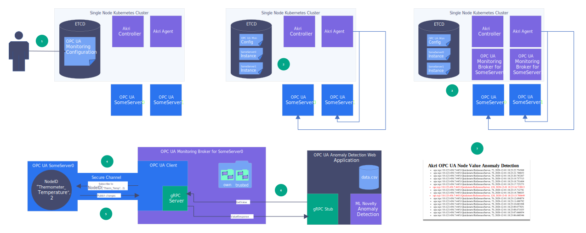
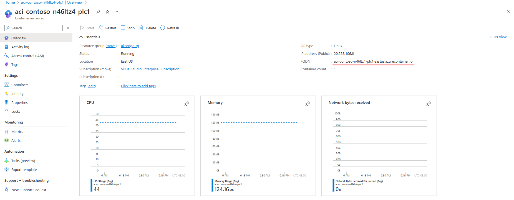

# Discover OPC UA servers with Akri

Akri is a Kubernetes resource interface that lets you easily expose heterogenous leaf devices (such as IP cameras and USB devices) as resources in a Kubernetes cluster, and it continually detects nodes that have access to these devices to schedule workloads based on them. Akri is a CNCF sandbox project made for the edge, handling the dynamic appearance and disappearance of leaf devices. It currently supports OPC UA, ONVIF and udev protocols, but you can also implement custom protocol handlers provided by the template. [Read more about Akri here](https://github.com/project-akri/akri-docs).

This article describes how you can deploy sample OPC PLC server containers in Azure and discover them by deploying Akri on your AKS Edge cluster. OPC UA is a communication protocol for industrial automation. It is a client/server technology that comes with a security and communication framework. If at any point in the demo, you want to dive deeper into OPC UA or clarify a term, you can reference the [online OPC UA specifications](https://reference.opcfoundation.org/v104/).

This demo will help you get started using Akri to discover OPC UA servers and utilize them via a broker that contains an OPC UA Client. Specifically, an Akri configuration called **OPC UA Monitoring** was created for this scenario. This configuration shows how you can use Akri to detect anomaly values of a specific OPC UA variable. To do so, the OPC UA clients in the brokers will subscribe to that variable and serve its value over gRPC for an anomaly detection web application to consume. You can use this configuration to monitor a barometer, CO detector, and more. However, for this example, the OPC UA variable will represent the PLC (programmable logic controller) values for the temperature of a thermostat. Any value outside the range of 70-80 degrees is an anomaly.

[  ](media/aks-edge/opc-ua-demo-diagram.svg#lightbox)

## Prerequisites

- AKS Edge Essentials cluster up and running.
- Azure subscription and a resource group to deploy OPC PLC servers to.
- Akri only works on Linux: use Linux nodes for this exercise.

## Create OPC UA servers

Now, create some OPC UA PLC servers to discover. Instead of starting from scratch, deploy OPC PLC server containers. You can read more about the [containers and their parameters here](https://github.com/Azure-Samples/iot-edge-opc-plc). This demo uses the template provided to deploy OPC PLC server container instances to Azure.

1. Go to [Azure IoT Edge OPC PLC sample's readme](https://github.com/Azure-Samples/iot-edge-opc-plc) and select **Deploy to Azure**.

2. Select **Edit Template** and navigate to line 172. Replace the entire line with the following to add the necessary flags for deploying the desired OPC PLC servers:

   If using security:
   
   ```json
   "[concat('./opcplc --pn=50000 --sph --fn=1 --fr=1 --ft=uint --ftl=65 --ftu=85 --ftr=True --aa --sph --ftl=65 --ftu=85 --ftr=True', ' --ph=', variables('aciPlc'), add(copyIndex(), 1), '.', resourceGroup().location, '.azurecontainer.io')]"
   ```
   
   If not using security:
   
   ```json
   "[concat('./opcplc --pn=50000 --sph --fn=1 --fr=1 --ft=uint --ftl=65 --ftu=85 --ftr=True --aa --sph --ftl=65 --ftu=85 --ftr=True --ut', ' --ph=', variables('aciPlc'), add(copyIndex(), 1), '.', resourceGroup().location, '.azurecontainer.io')]"
   ```

   You can [read more about the parameters in the readme file](https://github.com/Azure-Samples/iot-edge-opc-plc). 

3. (Only for using security) Under the "resources" section, add the following code inside the third "properties" (line 167) section (same level as `image`, `command`, `ports`, etc.).
   
   ```json
   "volumeMounts": [
                     {
                     "name": "filesharevolume",
                     "mountPath": "/app/pki"
                     }
                   ],
   ```
   
   Then add the following code inside the second "properties" (line 163) section (same level as `containers`).
   
   ```json
   "volumes": [
                  {
                     "name": "filesharevolume",
                     "azureFile": {
                           "shareName": "acishare",
                           "storageAccountName": "<storageAccName>",
                           "storageAccountKey": "<storageAccKey>"
                     }
                  }
              ]
   ```
   
4. Save the template, and fill in the project and instance details. For `Number of Simulations`, specify `2` in order to run two OPC PLC servers.

5. Select **Review and Create**, then **Create** to deploy your servers on Azure. 

You've now successfully created two OPC UA PLC servers, each with one fast PLC node, which generates an **unsigned integer** with **lower bound = 65** and **upper bound = 85** at a **rate of 1**. 


## (Optional) Create X.509 v3 certificates

> [!NOTE]
> If security is not desired, skip to "Create OPC UA Servers," as each monitoring broker will use an OPC UA security policy of **None** if it cannot find credentials mounted in its pod.

### Generate certificates

Create three (one for the broker and each server) OPC UA compliant X.509v3 certificates, ensuring that the certificate contains the [necessary components](http://opclabs.doc-that.com/files/onlinedocs/QuickOpc/Latest/User%27s%20Guide%20and%20Reference-QuickOPC/Providing%20Client%20Instance%20Certificate.html)
such as an application URI. 

Requirements for certificates:
- They should all be signed by a common Certificate Authority (CA), and the signing algorithms for all certificates should be `SHA256`. 
- The key size also must be greater than or equal to `2048` bits. 
- The DNS of server certificates and AkriBroker certificate should contain the FQDN of OPC UA server container instance created (go to Step 3 of "Run Akri" to learn how to get the FQDN).
- The OPC UA server certificate should be named as `OpcPlc` (In certificate generating term, `CN=OpcPlc`) and the Akri broker certificate should be named as `AkriBroker` (`CN=AkriBroker`) (there are no requirements for the CA name).

There are many tools for generating proper certificates for OPC UA, such as OPC Foundation's Certificate Generator or OpenSSL. OPC Foundation's Certificate Generator can be a more convenient option whereas OpenSSL provides more room for customization. 

If you choose to use OPC Foundation's Certificate Generator, here is now to build:
1. Install [Perl](https://strawberryperl.com/).
2. Download .zip file or git clone [OPC Foundation's Certificate Generator](https://github.com/OPCFoundation/Misc-Tools) (Misc-Tools)
3. Run `build_certificate-generator.bat` from VS Developer Command Prompt (Visual Studio 2022 is recommended).
4. Build `Opc.Ua.CertificateGenerator` solution from Visual Studio 2022.
5. Check if `Opc.Ua.CertificateGenerator.exe` has been successfully built in the `build/Debug/Opc.Ua.CertificateGenerator` directory.
6. Use following example command lines to create certificates. Please refer to [Misc-Tools](https://github.com/OPCFoundation/Misc-Tools) for more options.
   - Self-Signed CA:
   ```powershell
   .\Opc.Ua.CertificateGenerator.exe -cmd issue -sp . -sn CN=<CA name e.g. MyCA> -ca true -pw <password>
   ```
   - OPC UA Server Certificate
   ```powershell
   .\Opc.Ua.CertificateGenerator.exe -cmd issue -sp . -an OpcPlc -ikf '.\private\MyCA [hash].pfx' -ikp <password>-dn <DNS separated by commas>
   ```
   - Akri Broker Certificate
   ```powershell
   .\Opc.Ua.CertificateGenerator.exe -cmd issue -sp . -an AkriBroker -ikf '.\private\MyCA [hash].pfx' -ikp <password>-dn <DNS separated by commas>
   ```
7. Create a `.crl` file for CA using OpenSSL (only if you created CA from the generator whicih would be missing the `.crl` file).

If you choose to use OpenSSL, here is a list of references:
1. [OpenSSL Project](https://www.openssl.org/)
2. [OpenSSL Cookbook](https://www.feistyduck.com/library/openssl-cookbook/online/)
3. [Tutorial: Use OpenSSL to create test certificates](/azure/iot-hub/tutorial-x509-openssl)

### Create an opcua-broker-credentials Kubernetes secret

The OPC UA client certificate is passed to the OPC UA monitoring broker as a Kubernetes secret mounted as a volume.  

Create a Kubernetes secret, projecting each certificate/crl/private key with the expected key name (`client_certificate`, `client_key`, `ca_certificate`, and `ca_crl`). Specify the file paths so that they point to the credentials created in the previous section.

```powershell
kubectl create secret generic opcua-broker-credentials `
--from-file=client_certificate=/path/to/AkriBroker/own/certs/AkriBroker\ \[<hash>\].der `
--from-file=client_key=/path/to/AkriBroker/own/private/AkriBroker\ \[<hash>\].pfx `
--from-file=ca_certificate=/path/to/ca/certs/SomeCA\ \[<hash>\].der `
--from-file=ca_crl=/path/to/ca/crl/SomeCA\ \[<hash>\].crl
```

The certificate is mounted to the volume `credentials` at the `mountPath` /etc/opcua-certs/client-pki, as shown in the [OPC UA configuration helm template](https://github.com/project-akri/akri/blob/main/deployment/helm/templates/opcua-configuration.yaml). This path is where the brokers expect to find the certificates.

### Mount the folder of certificates to the ACI

[Follow these instructions](/azure/container-instances/container-instances-volume-azure-files#create-an-azure-file-share) to create an Azure file share. 

After creating the Azure file share and certificates, upload the CA and OPC UA server certificates to the file share as described. 
   
   ```
   ├── own
   │   ├── certs
   │   │   └── OpcPlc [hash].der
   │   └── private
   │       └── OpcPlc [hash].pfx
   └── trusted
       ├── certs
       │   └── CA.der
       └── crl
           └── CA.crl
   ```
 >[NOTE]: Because we added a flag for security in the template, this will cause an arbitrary certificate to be generated in the file share. Please delete any unidentified certificates in the file share (the folder paths should look exactly the same as above).

 After following these steps for security, click "Restart" on your container instances to update it and run with the mounted certificates. 
 

## Run Akri

1. Make sure your OPC UA servers are running by checking to see that the container instances have been started on your Azure portal.

2. Akri depends on `critcl` to track Pod information, and to use it, the Akri agent must know where the container runtime socket lives. To specify this information, set a variable `$AKRI_HELM_CRICTL_CONFIGURATION` and add it to each Akri installation.

   If you're using K3s:
   
   ```powershell
   $AKRI_HELM_CRICTL_CONFIGURATION="--set kubernetesDistro=k3s"
   ```
   
   If you're using K8s:
   
   ```powershell
   $AKRI_HELM_CRICTL_CONFIGURATION="--set kubernetesDistro=k8s"
   ```
   
3. In order for Akri to discover the servers properly, specify the correct discovery URLs when installing Akri. 
   
   Discovery URLs appear as `opc.tcp://<FQDN>:50000/`. In order to get the FQDNs of your OPC PLC servers, navigate to your deployments in Azure and you'll see the FQDN. Copy and paste the FQDN into your discovery URLs for each server.

   [  ](media/aks-edge/akri-opc-plc-fqdn.png#lightbox)

4. Install Akri using Helm. When installing Akri, specify that you want to deploy the OPC UA discovery handlers by setting the helm value `opcua.discovery.enabled=true`. 
   
   In this scenario, specify the `Identifier` and `NamespaceIndex` of the NodeID you want the brokers to monitor. In this case, that's the temperature variable created previously, which has an `Identifier` of `FastUInt1` and `NamespaceIndex` of `2`. 

   Make sure to replace the `opcua.configuration.discoveryDetails.discoveryUrls` with the URLs found from the previous step. 
   
   If using security, uncomment `--set opcua.configuration.mountCertificates='true'`.
    
   ```powershell
   helm repo add akri-helm-charts https://project-akri.github.io/akri/
   helm install akri akri-helm-charts/akri `
      $AKRI_HELM_CRICTL_CONFIGURATION `
      --set opcua.discovery.enabled=true `
      --set opcua.configuration.enabled=true `
      --set opcua.configuration.name=akri-opcua-monitoring `
      --set opcua.configuration.brokerPod.image.repository="ghcr.io/project-akri/akri/opcua-monitoring-broker" `
      --set opcua.configuration.brokerPod.image.tag="latest-dev" `
      --set opcua.configuration.brokerProperties.IDENTIFIER='FastUInt1' `
      --set opcua.configuration.brokerProperties.NAMESPACE_INDEX='2' `
      --set opcua.configuration.discoveryDetails.discoveryUrls[0]="opc.tcp://<FQDN of 1st container instance>:50000/" `
      --set opcua.configuration.discoveryDetails.discoveryUrls[1]="opc.tcp://<FQDN of 2nd container instance>:50000/" `
      # --set opcua.configuration.mountCertificates='true'
   ```
       
   > [!NOTE]
   > `FastUInt1` is the identifier of the [fast changing node](https://github.com/Azure-Samples/iot-edge-opc-plc#slow-and-fast-changing-nodes) that is provided by the OPC PLC server. 
   
   Learn more about the [OPC UA configuration settings here](https://docs.akri.sh/discovery-handlers/opc-ua).

5. Once Akri is installed, the Akri agent discovers the two servers and creates an instance for each server. Watch two broker pods spin up, one for each server.

   ```powershell
   kubectl get pods -o wide --watch
   ```
   You can also ensure that Akri's monitoring pod has successfully connected to the OPC UA server. 
   
   ```powershell
   kubectl logs <name of OPC UA monitoring pod>
   ```

   To inspect more of the elements of Akri:

   * Run `kubectl get crd`, and you should see the CRDs listed.
   * Run `kubectl get akric`, and you should see `akri-opcua-monitoring`. 
   * If the OPC PLC servers were discovered and pods spun up, you can see the instances by running `kubectl get akrii` and further inspected by running `kubectl get akrii akri-opcua-monitoring-<ID> -o yaml`.

## Deploy an anomaly detection web application as an end consumer of the brokers

A sample anomaly detection web application was created for this end-to-end demo. It has a gRPC stub that calls the brokers' gRPC services, getting the latest temperature value. It then determines whether this value is an outlier to the dataset using the Local Outlier Factor strategy. The dataset is simply a CSV file with the numbers between 70-80 repeated several times; therefore, any value significantly outside this range will be seen as an outlier. The web application serves as a log, displaying all the temperature values and the address of the OPC UA server that sent the values. It shows anomaly values in red. The anomalies always have a value of 120 due to how the `DoSimulation` function is set up in the OPC UA servers. 

1. Deploy the anomaly detection app and watch a pod spin up for the app.  


   ```powershell
   kubectl apply -f https://raw.githubusercontent.com/project-akri/akri/main/deployment/samples/akri-anomaly-detection-app.yaml
   ```

   ```powershell
   kubectl get pods -o wide --watch
   ```

2. Once the pods are running, get your node IP and the service port number of the app.

   ```powershell
   Get-AKSEdgeNodeAddr
   ```
   
   ```powershell
   kubectl get svc
   ```
   
3. Navigate to `http://<NODE IP>:<SERVICE PORT NUM>/`. It takes 3 seconds for the site to load, then you should see a log of the temperature values, which updates every few seconds. Note how the values come from two different discovery URLs, specifically the ones for each of the two OPC UA servers.


## Clean up

1. Delete the anomaly detection application.

   ```powershell
   kubectl delete -f https://raw.githubusercontent.com/project-akri/akri/main/deployment/samples/akri-anomaly-detection-app.yaml
   ```

2. Uninstall Akri from your cluster.

   ```powershell
   helm delete akri
   ```

3. Delete the OPC UA server deployment by navigating to your container instances and select **Delete** in the Azure portal.

## Next steps

[AKS Edge Essentials overview](aks-edge-overview.md)
