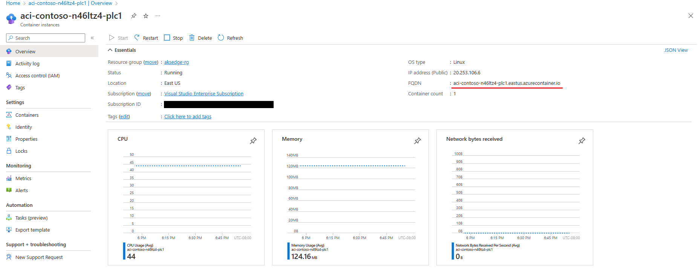
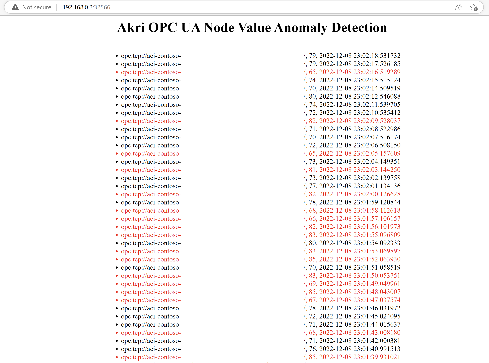

# Discover OPC UA servers with Akri

This article describes how you can deploy sample OPC PLC server containers in Azure and discover them by deploying Akri on your AKS Edge cluster. You'll also deploy a sample anomaly detection app that uses the Akri broker pods to subscribe to the OPC UA variable. This Akri configuration can be used to monitor a barometer, CO detector, and more. However, for this example, the OPC UA variable will represent the PLC values for temperature of a thermostat and any value outside the range of 70-80 degrees is an anomaly.

## Prerequisites

- AKS Edge Essentials cluster up and running.
- Azure subscription and a resource group to deploy OPC PLC servers to.
- Akri only works on Linux: use Linux nodes for this exercise.

If at any point in the demo, you want to dive deeper into OPC UA or clarify a term, you can reference the [online OPC UA specifications](https://reference.opcfoundation.org/v104/).

## (Optional) Create X.509 v3 certificates

> [!NOTE]
> If security is not desired, skip to "Create OPC UA Servers," as each monitoring broker will use an OPC UA security policy of **None** if it cannot find credentials mounted in its pod.

### Generate certificates

Create three (one for the broker and each server) OPC UA compliant X.509v3 certificates, ensuring that the certificate contains the [necessary components](http://opclabs.doc-that.com/files/onlinedocs/QuickOpc/Latest/User%27s%20Guide%20and%20Reference-QuickOPC/Providing%20Client%20Instance%20Certificate.html)
such as an application URI. They should all be signed by a common Certificate Authority (CA). There are many tools for generating proper certificates for OPC UA, such as the [OPC Foundation's Certificate Generator](https://github.com/OPCFoundation/Misc-Tools) or Openssl (as in this [walk through](https://github.com/OPCFoundation/Misc-Tools)).

### Create an opcua-broker-credentials Kubernetes secret

The OPC UA client certificate is passed to the OPC UA monitoring broker as a Kubernetes secret mounted as a volume.  

Create a Kubernetes secret, projecting each certificate/crl/private key with the expected key name (`client_certificate`, `client_key`, `ca_certificate`, and `ca_crl`). Specify the file paths so that they point to the credentials created in the previous section.

```powershell
kubectl create secret generic opcua-broker-credentials `
--from-file=client_certificate=/path/to/AkriBroker/own/certs/AkriBroker\ \[<hash>\].der `
--from-file=client_key=/path/to/AkriBroker/own/private/AkriBroker\ \[<hash>\].pfx `
--from-file=ca_certificate=/path/to/ca/certs/SomeCA\ \[<hash>\].der `
--from-file=ca_crl=/path/to/ca/crl/SomeCA\ \[<hash>\].crl
```

The certificate is mounted to the volume `credentials` at the `mountPath` /etc/opcua-certs/client-pki, as shown in the [OPC UA configuration helm template](https://github.com/project-akri/akri/blob/main/deployment/helm/templates/opcua-configuration.yaml). This path is where the brokers expect to find the certificates.

## Create OPC UA servers

Now, create some OPC UA PLC servers to discover. Instead of starting from scratch, deploy OPC PLC server containers. You can read more about the [containers and their parameters here](https://github.com/Azure-Samples/iot-edge-opc-plc). This demo uses the template provided to deploy OPC PLC server container instances to Azure.

1. Go to [Azure IoT Edge OPC PLC sample's readme](https://github.com/Azure-Samples/iot-edge-opc-plc) and select **Deploy to Azure**.

2. (Optional) If you're using security, this method requires mounting the folder containing the certificate to the ACI. [Follow these instructions](/azure/container-instances/container-instances-volume-azure-files#create-an-azure-file-share) to create an Azure file share. 

   After creating the Azure file share, add the `plc` folder to the file share in the same structure as described. Then go back to the **Deploy to Azure** page. Click **Edit template**, and add the following code inside the `container` section:
   
   ```json
   "volumeMounts": [
                     {
                     "name": "filesharevolume",
                     "mountPath": "/app/pki"
                     }
                  ],
   ```
   
   Then add the following code inside the `properties` section (same level as `container`):
   
   ```json
   "volumes": [
                  {
                     "name": "filesharevolume",
                     "azureFile": {
                           "shareName": "acishare",
                           "storageAccountName": "<storageAccName>",
                           "storageAccountKey": "<storageAccKey>"
                     }
                  }
                  ]
   ```
   
   Now the folder `plc` should be mounted to `/app/pki`.

3. Select **Edit Template** and navigate to line 172. Replace the entire line with the following to add the necessary flags for deploying the desired OPC PLC servers:

   If using security:
   
   ```json
   "[concat('./opcplc --pn=50000 --sph --fn=1 --fr=1 --ft=uint --ftl=65 --ftu=85 --ftr=True --aa --sph --ftl=65 --ftu=85 --ftr=True', ' --ph=', variables('aciPlc'), add(copyIndex(), 1), '.', resourceGroup().location, '.azurecontainer.io')]"
   ```
   
   If not using security:
   
   ```json
   "[concat('./opcplc --pn=50000 --sph --fn=1 --fr=1 --ft=uint --ftl=65 --ftu=85 --ftr=True --aa --sph --ftl=65 --ftu=85 --ftr=True --ut', ' --ph=', variables('aciPlc'), add(copyIndex(), 1), '.', resourceGroup().location, '.azurecontainer.io')]"
   ```

   You can [read more about the parameters in the readme file](https://github.com/Azure-Samples/iot-edge-opc-plc). 

4. Save the template, and fill in the project and instance details. For `Number of Simulations`, specify `2` in order to run two OPC PLC servers.

5. Select **Review and Create**, then **Create** to deploy your servers on Azure. 

You've now successfully created two OPC UA PLC servers, each with one fast PLC node, which generates an **unsigned integer** with **lower bound = 65** and **upper bound = 85** at a **rate of 1**. 

## Run Akri

1. Make sure your OPC UA servers are running.

2. Akri depends on `critcl` to track Pod information, and to use it, the Akri agent must know where the container runtime socket lives. To specify this information, set a variable `$AKRI_HELM_CRICTL_CONFIGURATION` and add it to each Akri installation.

   If you're using K3s:
   
   ```powershell
   $AKRI_HELM_CRICTL_CONFIGURATION="--set kubernetesDistro=k3s"
   ```
   
   If you're using K8s:
   
   ```powershell
   $AKRI_HELM_CRICTL_CONFIGURATION="--set kubernetesDistro=k8s"
   ```
   
3. In order for Akri to discover the servers properly, specify the correct discovery URLs when installing Akri. 
   
   Discovery URLs appear as `opc.tcp://<FQDN>:50000/` and `opc.tcp://<FQDN>:50001/`. In order to get the FQDNs of your OPC PLC servers, navigate to your deployments in Azure and you'll see the FQDN. Copy and paste the FQDN into your discovery URLs for each server.

   

4. Install Akri using Helm. When installing Akri, specify that you want to deploy the OPC UA discovery handlers by setting the helm value `opcua.discovery.enabled=true`. 
   
   In this scenario, specify the `Identifier` and `NamespaceIndex` of the NodeID you want the brokers to monitor. In this case, that's the temperature variable created previously, which has an `Identifier` of `FastUInt1` and `NamespaceIndex` of `2`. 
   
   If using security, uncomment `--set opcua.configuration.mountCertificates='true'`.
    
   ```powershell
   helm repo add akri-helm-charts https://project-akri.github.io/akri/
   helm install akri akri-helm-charts/akri `
      $AKRI_HELM_CRICTL_CONFIGURATION `
      --set opcua.discovery.enabled=true `
      --set opcua.configuration.enabled=true `
      --set opcua.configuration.name=akri-opcua-monitoring `
      --set opcua.configuration.brokerPod.image.repository="ghcr.io/project-akri/akri/opcua-monitoring-broker" `
      --set opcua.configuration.brokerPod.image.tag="latest-dev" `
      --set opcua.configuration.brokerProperties.IDENTIFIER='FastUInt1' `
      --set opcua.configuration.brokerProperties.NAMESPACE_INDEX='2' `
      --set opcua.configuration.discoveryDetails.discoveryUrls[0]="opc.tcp://<HOST IP or FQDN>:50000/" `
      --set opcua.configuration.discoveryDetails.discoveryUrls[1]="opc.tcp://<HOST IP or FQDN>:50001/" `
      # --set opcua.configuration.mountCertificates='true'
   ```
       
   > [!NOTE]
   > `FastUInt1` is the identifier of the [fast changing node](https://github.com/Azure-Samples/iot-edge-opc-plc#slow-and-fast-changing-nodes) that is provided by the OPC PLC server. 
   
   Learn more about the [OPC UA configuration settings here](https://docs.akri.sh/discovery-handlers/opc-ua).

5. Once Akri is installed, the Akri agent discovers the two servers and creates an instance for each server. Watch two broker pods spin up, one for each server.

   ```powershell
   kubectl get pods -o wide --watch
   ```

   To inspect more of the elements of Akri:

   * Run `kubectl get crd`, and you should see the CRDs listed.
   * Run `kubectl get akric`, and you should see `akri-opcua-monitoring`. 
   * If the OPC PLC servers were discovered and pods spun up, you can see the instances by running `kubectl get akrii` and further inspected by running `kubectl get akrii akri-opcua-monitoring-<ID> -o yaml`.

## Deploy an anomaly detection web application as an end consumer of the brokers

A sample anomaly detection web application was created for this end-to-end demo. It has a gRPC stub that calls the brokers' gRPC services, getting the latest temperature value. It then determines whether this value is an outlier to the dataset using the Local Outlier Factor strategy. The dataset is simply a CSV file with the numbers between 70-80 repeated several times; therefore, any value significantly outside this range will be seen as an outlier. The web application serves as a log, displaying all the temperature values and the address of the OPC UA server that sent the values. It shows anomaly values in red. The anomalies always have a value of 120 due to how the `DoSimulation` function is set up in the OPC UA servers. 

1. Deploy the anomaly detection app and watch a pod spin up for the app.  


   ```powershell
   kubectl apply -f https://raw.githubusercontent.com/project-akri/akri/main/deployment/samples/akri-anomaly-detection-app.yaml
   ```

   ```powershell
   kubectl get pods -o wide --watch
   ```

2. Once the pods are running, get your node IP and the service port number of the app.

   ```powershell
   Get-AKSEdgeNodeAddr
   ```
   
   ```powershell
   kubectl get svc
   ```
   
3. Navigate to `http://<NODE IP>:<SERVICE PORT NUM>/`. It takes 3 seconds for the site to load, then you should see a log of the temperature values, which updates every few seconds. Note how the values come from two different discovery URLs, specifically the ones for each of the two OPC UA servers.



## Clean up

1. Delete the anomaly detection application deployment and service.

   ```powershell
    kubectl delete service akri-anomaly-detection-app
    kubectl delete deployment akri-anomaly-detection-app
   ```

2. Delete the OPC UA monitoring configuration.

   ```powershell
    kubectl delete akric akri-opcua-monitoring
   ```

3. Bring down the Akri agent, controller, and CRDs.

   ```powershell
    helm delete akri
    kubectl delete crd instances.akri.sh
    kubectl delete crd configurations.akri.sh
   ```

4. Delete the OPC UA server deployment by navigating to your container instances and select **Delete** in the Azure portal.

## Next steps

[AKS Edge Essentials overview](aks-edge-overview.md)
