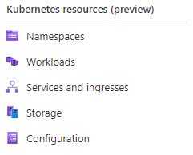

# Connect your AKS Edge Essentials cluster to Arc

This article describes how to connect your AKS Edge Essentials cluster to [Azure Arc](/azure/azure-arc/kubernetes/overview) so that you can monitor the health of your cluster on the Azure portal.

## Prerequisites

* You need an Azure subscription with either the `Owner` role or a combination of `Contributor` and `User Access Administrator` roles. You can check your access level by navigating to your subscription, select **Access control (IAM)** on the left-hand side of the Azure portal, and then select **View my access**. Read the [Azure documentation](/azure/azure-resource-manager/management/manage-resource-groups-portal) for more information about managing resource groups.
* Download the [Azure/AKS-Edge GitHub repo](https://github.com/Azure/AKS-Edge/tree/main), if you have not done earlier.Navigate to the **Code** tab and click the **Download Zip** button to download the repository as a **.zip** file. Extract the GitHub **.zip** file to a working folder.

There are two approaches to connect your cluster to Arc:

- Use Azure CLI with the commands from the [AKSEdgeDeploy](https://github.com/Azure/AKS-Edge/tree/main/tools/modules/AksEdgeDeploy/README.md) module. This approach is described in this article.
- Use PowerShell 7 with the commands from the AKSEdge module. This approach is described in [Connect to Arc using PowerShell 7](aks-edge-howto-more-configs.md).

## 1. Configure your Azure environment

To successfully connect to Azure using Azure Arc-enabled servers and Azure Arc-enabled kubernetes, the following configurations are required.

* Enable all required Resource Providers in the Azure Subscription such as `Microsoft.HybridCompute`, `Microsoft.GuestConfiguration`, `Microsoft.HybridConnectivity`,
  `Microsoft.Kubernetes`, `Microsoft.KubernetesConfiguration`
* Create and verify a resource group for AKS Edge Essentials Azure resources
* Create and verify a service principal with access rights to the resource group

>[!Note]
> This is required to be done only once per Azure subscription and need not be repeated for each kubernetes cluster.

If you already have configured Azure and have the service principal id and password, you can update all the fields in the **aide-userconfig.json** and skip to next step.

To configure Azure,

1. Specify the required names for the resource group and service principal in the **aide-userconfig.json** file along with your subscription/tenant information.

    In your working folder, open the **aide-userconfig.json** file from the **tools** folder to enter these information.

    ```shell
    notepad.exe aide-userconfig.json
    ```

    There, provide the parameters under **Azure** section, with the appropriate information.

    | Attribute | Value type      |  Description |
    | :------------ |:-----------|:--------|
    |`SubscriptionName` | string | The name of your Azure subscription. You can find this on the Azure portal.|
    | `SubscriptionId` | string | Your subscription ID. In the Azure portal, click on the subscription you're using and copy/paste the subscription ID string into the JSON. |
    | `TenantId` | string | Your tenant ID. In the Azure portal, search Azure Active Directory, which should take you to the Default Directory page. From here, you can copy/paste the tenant ID string into the JSON. |
    |`ResourceGroupName` | string | The name of the Azure resource group to host your Azure resources for AKS edge. You can use an existing resource group or if you put a new name, we will create one for you. |
    |`ServicePrincipalName` | string | The name of the Azure Service Principal to use as credentials. AKS uses this Service Principal to connect your cluster to Arc. You can use an existing service principal or if you put a new name, we will create one for you in the next step. |
    |`Location` | string | The location in which to create your resource group. Choose the location closest to your deployment. |
    |`Auth` | object | Leave this **blank**, as it will be automatically filled in the next step. |
2. Run or Double click on **AksEdgePrompt.cmd** file to open an elevated PowerShell window with the required modules loaded. You will see an overview of the PC information and the installed software versions.
3. Run the **AksEdgeAzureSetup.ps1** script present in the `tools\scripts\AksEdgeAzureSetup` folder. This script will prompt you to log in with your credentials for setting up your Azure subscription.

    ```powershell
    # prompts for interactive login for serviceprincipal creation with Contributor role at resource group level
    ..\tools\scripts\AksEdgeAzureSetup\AksEdgeAzureSetup.ps1 .\aide-userconfig.json -spContributorRole
    ```

    >[!Note]
    > You will require ContributorRole to be able to delete the resources within the resource group. Disconnect-AideArc functions will fail without this role assignment.

    ```powershell
    # prompts for interactive login for serviceprincipal creation with minimal privileges
    ..\tools\scripts\AksEdgeAzureSetup\AksEdgeAzureSetup.ps1 .\aide-userconfig.json
    
    ```

4. Validate that the credentials are ok, using **AksEdgeAzureSetup-Test.ps1**. This script logs into Azure using the new service principal credentials and checks the status of Azure resources.

    ```powershell
    # test the credentials
    ..\tools\scripts\AksEdgeAzureSetup\AksEdgeAzureSetup-Test.ps1 .\aide-userconfig.json
    ```

## 2. Connect your cluster to Arc

1. Load the json configuration into the AksEdgeShell using `Read-AideUserConfig` and verify that the values are updated using `Get-AideUserConfig`. Alternatively, you can reopen **AksEdgePrompt.cmd** to use the updated JSON configuration.

    ```powershell
    Read-AideUserConfig
    Get-AideUserConfig
    ```

    > [!IMPORTANT]
    > Any time you modify **aide-userconfig.json** (or **aksedge-userconfig.json**), run `Read-AideUserConfig` to reload, or close and re-open **AksEdgePrompt.cmd**.

2. Run `Initialize-AideArc`. This installs Azure CLI (if not already installed), signs in to Azure with the given credentials, and validates the Azure configuration (resource providers and resource group status).

   ```powershell
   Initialize-AideArc
   ```

3. Run `Connect-AideArc` to install and connect the host machine to Arc-enabled server and connect the existing cluster to Arc-enabled kubernetes.

   ```powershell
   # Connect Arc-enabled server and Arc-enabled kubernetes
   Connect-AideArc
   ```

    Alternatively, you can connect them individually using `Connect-AideArcServer` for Arc-enabled server and `Connect-AideArcKubernetes` for Arc-enabled kubernetes.

   ```powershell
   # Connect Arc-enabled server
   Connect-AideArcServer
   # Connect Arc-enabled Kubernetes
   Connect-AideArcKubernetes
   ```

    > [!NOTE]
    > This step can take up to 10 minutes and PowerShell may be stuck on "Establishing Azure Connected Kubernetes for `your cluster name`". The PowerShell will output `True` and return to the prompt when the process is completed. A bearer token will be saved in **servicetoken.txt** in the **tools** folder.

    

## 3. View AKS Edge resources in Azure

1. Once the process is complete, you can view your cluster in your Azure portal if you navigate to your resource group.

   

2. On the left panel, select the **Namespaces** blade under **Kubernetes resources (preview)**.

   

3. To view your Kubernetes resources, you need a bearer token.

   

4. Go to your **../tools/servicetoken.txt** file, copy the full string, and paste it into the Azure portal. You can also run `Get-AideArcKubernetesServiceToken` to retrieve your service token.

   

5. Now you can look at resources on your cluster. This is the **Workloads** blade, showing the same as

    ```powershell
    kubectl get pods --all-namespaces
    ```

    

## Disconnect from Arc

Run `Disconnect-AideArc` to disconnect from Arc-enabled server and Arc-enabled kubernetes.

   ```powershell
   # Disconnect Arc-enabled server and Arc-enabled kubernetes
   Disconnect-AideArc
   ```

Alternatively, you can disconnect them individually using `Connect-AideArcServer` for Arc-enabled server and `Connect-AideArcKubernetes` for Arc-enabled kubernetes.

   ```powershell
   # Disconnect Arc-enabled server
   Disconnect-AideArcServer
   # Disconnect Arc-enabled Kubernetes
   Disconnect-AideArcKubernetes
   ```

For a complete clean-up, through the Azure portal, delete the service principal and resource group you created for this example.

## Next steps

* [Overview](aks-edge-overview.md)
* [Uninstall AKS cluster](aks-edge-howto-uninstall.md)
