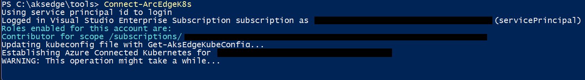

# Connect your AKS Edge Essentials cluster to Arc

This section shows how to connect your AKS Edge Essentials cluster to [Azure Arc](/azure/azure-arc/kubernetes/overview) so that you can monitor the health of your cluster on the Azure portal.

> [!IMPORTANT]
> If you do not have a cluster installed, create a [single node cluster](aks-edge-howto-single-node-deployment.md) and follow the steps to deploy.

## Prerequisites

You need an Azure subscription with either the `Owner` role or a combination of `Contributor` and `User Access Administrator` roles. You can check your access level by navigating to your subscription, clicking on **Access control (IAM)** on the left-hand side of the Azure portal, and then clicking on **View my access**. Read the [official Azure documentation](/azure/azure-resource-manager/management/manage-resource-groups-portal) for more information about managing resource groups.

Execute the following steps on your primary machine.

There are two approaches to connect your cluster to Arc:

1. Use the helper modules in the [GitHub repo](https://github.com/Azure/aks-edge-utils/tree/main/tools/modules/AksEdgeAzureSetup) to simplify Arc connectivity. The steps for using the helper modules as described on this page.
2. Use PowerShell 7 with the commands from the AKSEdge module, to connect to Arc, [see this article](./aks-edge-howto-more-configs.md) for the instructions.

## 1. Download the helper modules

You should have already downloaded the helper modules from this [GitHub repo](https://github.com/Azure/aks-edge-utils), but if not, do so now. Navigate to the **Code** tab and click the **Download Zip** button to download the repository as a **.zip** file. Extract the GitHub **.zip** file to a working folder.

Read more about all the helper functions [here](https://github.com/Azure/aks-edge-utils/blob/main/tools/modules/AksEdgeDeploy/AksEdge-Arc.md).

## 2. Configure your Azure environment

In your GitHub repo, open the **aide-userconfig.json** file from the **tools** folder.

```shell
notepad.exe aide-userconfig.json
```

There, provide the parameters under **Azure** section, with the appropriate information.

| Attribute | Value type      |  Description |
| :------------ |:-----------|:--------|
|`SubscriptionName` | string | The name of your Azure subscription. You can find this on the Azure portal.|
| `SubscriptionId` | string | Your subscription ID. In the Azure portal, click on the subscription you're using and copy/paste the subscription ID string into the JSON. |
| `TenantId` | string | Your tenant ID. In the Azure portal, search Azure Active Directory, which should take you to the Default Directory page. From here, you can copy/paste the tenant ID string into the JSON. |
|`ResourceGroupName` | string | The name of the Azure resource group to host your Azure resources for AKS edge. You can use an existing resource group or if you put a new name, we will create one for you. |
|`ServicePrincipalName` | string | The name of the Azure Service Principal to use as credentials. AKS uses this Service Principal to connect your cluster to Arc. You can use an existing service principal or if you put a new name, we will create one for you in the next step. |
|`Location` | string | The location in which to create your resource group. Choose the location closest to your deployment. |
|`Auth` | object | The credentials for your service principal login. If you are using an existing service principal, fill in the credentials here with the ID and password of your service principal. If you are creating a new one, it is important that you leave this **blank**, as it will be automatically filled in the next step. |


To set up your Azure subscription and create the necessary resource group and service principal, use the **AksEdgeAzureSetup.ps1** script from the GitHub repo. This script will prompt you to log in with your credentials for setting up your Azure subscription.

```powershell
# creates service principal with Contributor role at resource group level
..\tools\scripts\AksEdgeAzureSetup\AksEdgeAzureSetup.ps1 .\aide-userconfig.json -spContributorRole
```

```powershell
# prompts for interactive login for serviceprincipal creation with minimal privileges
..\tools\scripts\AksEdgeAzureSetup\AksEdgeAzureSetup.ps1 .\aide-userconfig.json
```

To reset an already existing service principal, use `-spCredReset`. You should use reset carefully.

```powershell
# resets the existing service principal
..\tools\scripts\AksEdgeAzureSetup\AksEdgeAzureSetup.ps1 .\aide-userconfig.json -spCredReset
```
You can also test your credentials to make sure they are valid.

```powershell
# test the credentials
..\tools\scripts\AksEdgeAzureSetup\AksEdgeAzureSetup-Test.ps1 .\aide-userconfig.json
```

## 3. Validate your configuration file

Once the JSON has been updated, run `Read-AideUserConfig` to read the updated JSON configuration. You can verify the values using `Get-AideUserConfig`. Alternatively, you can reopen **AksEdgePrompt.cmd** to use the updated JSON configuration.

```powershell
Read-AideUserConfig
Get-AideUserConfig
```

> [!IMPORTANT]
> Any time you modify **aide-userconfig.json** (or **aksedge-userconfig.json**), run `Read-AideUserConfig` to reload, or close and re-open **AksEdgePrompt.cmd**.


## 4. Connect your cluster to Arc

> [!NOTE]
> If you are utilizing Azure CLI, you can run `az upgrade` to ensure your **azure-cli** and extensions are up-to-date. 


1. Run `Initialize-ArcEdge`. This installs Azure CLI (if not already installed), signs in to Azure with the given credentials, and validates the Azure configuration (resource providers and resource group status).

   ```powershell
   Initialize-ArcEdge
   ```

2. Run `Connect-ArcEdgeK8s` to connect the cluster to Arc. This signs in using your service principal, enables the cluster-connect features to view your cluster's Kubernetes resources in Arc, and generates a bearer token named **servicetoken.txt** in the **tools** folder.

   ```powershell
   Connect-ArcEdgeK8s
   ```
> [!NOTE]
> This step can take up to 10 minutes and PowerShell may be stuck on "Establishing Azure Connected Kubernetes for `your cluster name`". The PowerShell will output `True` and return to the prompt when the process is completed. 
 
 

   Once the process is complete, you can view your cluster in your Azure portal if you navigate to your resource group.


   

## 5. View cluster resources

1. On the left panel, select the **Namespaces** blade under **Kubernetes resources (preview)**.

   

2. To view your Kubernetes resources, you need a bearer token.

   

3. Go to your **../tools/servicetoken.txt** file, copy the full string, and paste it into the Azure portal. You can also run `Get-ArcEdgeK8sServiceToken` to retrieve your service token.

   

4. Now you can look at resources on your cluster. This is the **Workloads** blade, showing the same as

```powershell
kubectl get pods --all-namespaces
```


## Optional: Connect to Arc for Servers

If you would like to connect your machine to Arc for Servers, follows these steps in the `AKSEdgePrompt` after ensuring that your `aide-userconfig.json` is properly filled in.

1. Install the required software (Azure CLI) and validate the setup.
   ```powershell
   Initialize-ArcEdge
   ```
2. Connect your machine to Arc for Servers.
   ```powershell
   Connect-ArcEdgeCmAgent
   ``` 


## Disconnect from Arc

Run `Disconnect-ArcEdgeK8s` to disconnect your cluster from Azure Arc. For a complete clean-up, delete the service principal and resource group you created for this example.

```powershell
Disconnect-ArcEdgeK8s
```

Run `Disconnect-ArcEdgeCmAgent` to disconnect your machine from Arc for Servers.
```powershell
Disconnect-ArcEdgeCmAgent
```

## Next steps

- [Overview](aks-edge-overview.md)
- [Uninstall AKS cluster](aks-edge-howto-uninstall.md)
