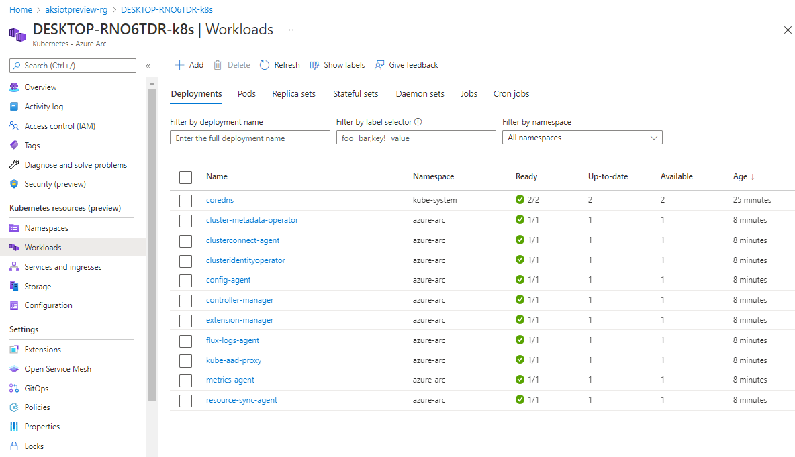

# Connect your AKS Edge Essentials cluster to Arc

This article describes how to connect your AKS Edge Essentials cluster to [Azure Arc](/azure/azure-arc/kubernetes/overview) so that you can monitor the health of your cluster on the Azure portal.

> [!IMPORTANT]
> If you do not have a cluster installed, create a [single node cluster](aks-edge-howto-single-node-deployment.md) and follow the steps to deploy.

## Prerequisites

You need an Azure subscription with either the `Owner` role or a combination of `Contributor` and `User Access Administrator` roles. You can check your access level by navigating to your subscription, select **Access control (IAM)** on the left-hand side of the Azure portal, and then select **View my access**. Read the [Azure documentation](/azure/azure-resource-manager/management/manage-resource-groups-portal) for more information about managing resource groups.

There are two approaches to connect your cluster to Arc:

1. Use the helper modules in the [GitHub repo](https://github.com/Azure/aks-edge-utils/tree/main/tools/modules/AksEdgeAzureSetup) to simplify Arc connectivity. The steps for using the helper modules are described in this article.
2. Use PowerShell 7 with the commands from the AKSEdge module, to connect to Arc. [See this article](aks-edge-howto-more-configs.md) for instructions.

## 1. Download the helper modules

If you did not download the [AKS Edge Utils GitHub repo](https://github.com/Azure/aks-edge-utils) during the [Set up machine](aks-edge-howto-setup-machine.md) step, you can do so now. Navigate to the **Code** tab and click the **Download Zip** button to download the repository as a **.zip** file. Extract the GitHub **.zip** file to a working folder.

## 2. Configure your Azure environment

In your GitHub repo, open the **aide-userconfig.json** file from the **tools** folder.

```shell
notepad.exe aide-userconfig.json
```

There, provide the parameters under **Azure** section, with the appropriate information.

```json
"Azure": {
        "SubscriptionName":"Visual Studio Enterprise Subscription",
        "ServicePrincipalName" : "aksedge-sp",
        "ClusterName": "",
        "Connect": true,
        "Location" : "EastUS",
        "ResourceGroupName": "aksedgepreview-rg",
        "SubscriptionId": "",
        "TenantId": ""
    },

```

>[!NOTE]
> For the `Location` field above, choose the location closest to your deployment.

>[!NOTE]
> If you want to use an existing service principal instead of creating a new one, specify your service principal ID and password under `Auth`. Read more about configuring the JSON parameters in the README file from the GitHub repo.

To set up your Azure subscription and create the necessary resource group and service principal, use the **AksEdgeAzureSetup.ps1** script from the GitHub repo. This script will prompt you to log in with your credentials for setting up your Azure subscription.

```powershell
# Prompts for interactive login for service principal creation with minimal privileges
..\tools\AksEdgeAzureSetup\AksEdgeAzureSetup.ps1 .\aide-userconfig.json
```

If you need to create the service principal with the **Contributor** role at the resource group level, you can add the `-spContributorRole` switch.

```powershell
# Creates service principal with Contributor role at resource group level
..\tools\AksEdgeAzureSetup\AksEdgeAzureSetup.ps1 .\aide-userconfig.json -spContributorRole
```

To reset an already existing service principal, use `-spCredReset`. You should use reset carefully.

```powershell
# Resets the existing service principal
..\tools\AksEdgeAzureSetup\AksEdgeAzureSetup.ps1 .\aide-userconfig.json -spCredReset
```

## 3. Validate your configuration file

Once the JSON has been updated, run `Read-AideUserConfig` to read the updated JSON configuration. You can verify the values using `Get-AideUserConfig`. Alternatively, you can reopen **AksEdgePrompt.cmd** to use the updated JSON configuration.

```powershell
Read-AideUserConfig
Get-AideUserConfig
```

> [!IMPORTANT]
> Any time you modify **aide-userconfig.json** (or **aksedge-userconfig.json**), run `Read-AideUserConfig` to reload, or close and re-open **AksEdgePrompt.cmd**.

| Attribute | Value type      |  Description |
| :------------ |:-----------|:--------|
|`SubscriptionName` | string | The name of your Azure subscription. You can find this on the Azure portal.|
|`ResourceGroupName` | string | The name of the Azure resource group to host your Azure resources for AKS edge.|
|`ServicePrincipalName` | string | The name of the Azure Service Principal to use as credentials. AKS uses this Service Principal to connect your cluster to Arc.|
|`Location` | string | The location in which to create your resource group. Leave this as `EastUS`. |
|`ClusterName` | string | The name of the cluster for the Arc Connection. The default is `hostname-distribution` (`abc-k8s` or `abc-k3s`). |

## 4. Connect your cluster to Arc

> [!IMPORTANT]
> If you already have Azure CLI installed, run `az upgrade` to ensure your **azure-cli** and extensions are up-to-date.

```cmd
az upgrade
```

```json
{
  "azure-cli": "2.39.0",
  "azure-cli-core": "2.39.0",
  "extensions": {
    "connectedk8s": "1.3.1",
    "connectedmachine": "0.5.1",
    "customlocation": "0.1.3",
    "k8s-extension": "1.3.3"
  }
}
```

1. Run `Initialize-ArcIot`. This installs Azure CLI (if not already installed), signs in to Azure with the given credentials, and validates the Azure configuration (resource providers and resource group status).

   ```powershell
   Initialize-ArcIot
   ```

2. Run `Connect-ArcIotK8s` to connect the cluster to Arc. This signs in using your service principal, enables the cluster-connect features to view your cluster's Kubernetes resources in Arc, and generates a bearer token named **servicetoken.txt** in the **tools** folder.

   ```powershell
   Connect-ArcIotK8s
   ```

   This step can take a while and PowerShell may be stuck on "Establishing Azure Connected Kubernetes for `your cluster name`", but if you navigate to your resource group on the Azure portal, you should see your cluster as a resource. When the PowerShell command is finished running, click on your cluster.

   

## 5. View cluster resources

1. On the left panel, select the **Namespaces** blade under **Kubernetes resources (preview)**.

   

2. To view your Kubernetes resources, you need a bearer token.

   

3. Go to your **../tools/servicetoken.txt** file, copy the full string, and paste it into the Azure portal.

   

4. Now you can look at resources on your cluster. This is the **Workloads** blade, showing the same as

```powershell
kubectl get pods --all-namespaces
```



## Disconnect from Arc

Run `Disconnect-ArcIotK8s` to disconnect your cluster from Azure Arc. For a complete cleanup, delete the service principal and resource group you created for this example.

```powershell
Disconnect-ArcIotK8s
```

## Next steps

- [Overview](aks-edge-overview.md)
- [Uninstall AKS cluster](aks-edge-howto-uninstall.md)
