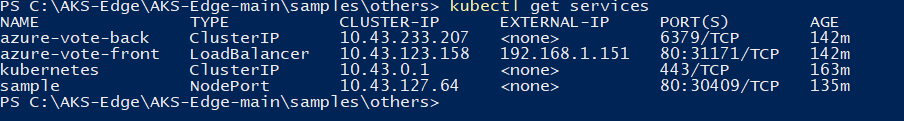
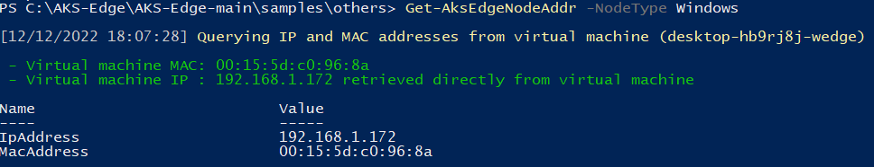
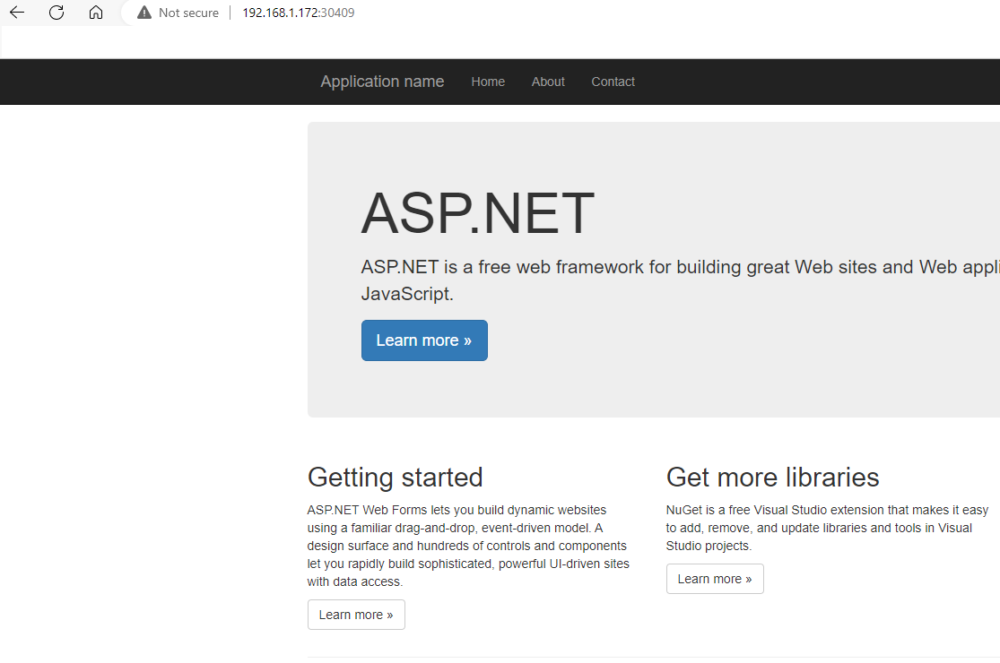

# Deploy an application

This article describes how to deploy a containerized application on your Kubernetes cluster.

## Prerequisites

- Set up your [single machine Kubernetes](aks-edge-howto-single-node-deployment.md) or [full Kubernetes](aks-edge-howto-multi-node-deployment.md) cluster.
- Package your application into a container image, and then upload the image to the Azure Container Registry. Review these steps to [create container image of your application](tutorial-kubernetes-prepare-application.md).
- AKS Edge Essentials enables mixed-OS clusters, ensure your pods get scheduled on nodes with the corresponding OS. Add `nodeSelector` to your deployment files. This will tell Kubernetes to run your pods on nodes of a particular operating system (OS).

If your cluster is single-OS, then you can skip this step; but for best practice, label each deployment file with node selectors.

```yaml
nodeSelector:
    "kubernetes.io/os": linux
```

```yaml
nodeSelector:
    "kubernetes.io/os": windows
```

## Deploy a sample Linux application

### 1. Update the manifest file

In this guide we use a sample application that is a basic voting app consisting of a front and backend which is based on Microsoft's azure-vote-front image. The container image for this application  is hosted on Azure Container Registry (ACR). Once you have the container image of your application, you can choose to store your container image in a container registry of your choice.  Refer to `\samples\others\linux-sample.yaml` in the [GitHub repo](https://github.com/Azure/aks-edge-utils) package for the deployment manifest (located in \samples\others). Note that in the YAML we specified a nodeSelector tagged for Linux. 
### 2. Deploy the application

To deploy your application, use the [kubectl apply][kubectl-apply] command. This command parses the manifest file and creates the defined Kubernetes objects. Specify the YAML manifest file, as shown in the following example:

```console
kubectl apply -f linux-sample.yaml
```

### 3. Verify the pods

Wait a few minutes for the pods to be in the **running** state.

```bash
kubectl get pods -o wide
```


### 3. Verify the services

To monitor progress, use the [kubectl get service][kubectl-get] command with the `--watch` argument.

```console
kubectl get services
```

Initially, the `EXTERNAL-IP` for the `azure-vote-front` service is shown as `pending`. When the `EXTERNAL-IP` address changes from `pending` to an actual public IP address, you can use the IP address assigned to the service. 

> [!IMPORTANT]
> On single machine clusters, if you deployed your Kubernetes cluster without specifying a `-ServiceIPRangeSize`, you will not have allocated IPs for your workload services and you won't have an external IP address. In this case, find the IP address of your Linux VM (`Get-AksEdgeNodeAddr`), then append the external port (for example, **192.168.1.12:31458**).

### 5. Test your application

To see the application in action, open a web browser to the external IP address of your service:


If the application didn't load, it might be due to an authorization problem with your image registry. To view the status of your containers, use the `kubectl get pods` command. If the container images can't be pulled, see [Authenticate with Azure Container Registry from Azure Kubernetes Service](/azure/aks/cluster-container-registry-integration?bc=/azure/container-registry/breadcrumb/toc.json&toc=/azure/container-registry/toc.json).

### 6. Remove application

To clean up, delete all resources using the following command:

```bash
kubectl delete -f linux-sample.yaml
```

## Deploy a sample Windows application to your cluster

This example runs a sample ASP.NET application based on [Microsoft’s sample image](https://hub.docker.com/_/microsoft-dotnet-samples/). See **win-sample.yaml** in the public preview package for the deployment manifest (located in **\samples\others**). Note that the YAML specifies a `nodeSelector` tagged for Windows. All sample code and deployment manifests can be found under the **/Samples** folder in the [GitHub repo](https://github.com/Azure/aks-edge-utils).

### 1. Deploy the application by specifying the name of your YAML manifest

Make sure you are in the directory of the YAML in a PowerShell window, and then run the following command:

```powershell
kubectl apply -f win-sample.yaml
```

### 2. Verify that the sample pod is running

It might take a while for the pod to reach the running status, depending on your internet connection. The ASP.NET image is quite large.

```powershell
kubectl get pods -o wide
```


### 3. Verify that the **sample** service is up

```powershell
kubectl get services
```



Since this sample is deployed as a service of type **NodePort**, we can get the IP of the Kubernetes node that the application is running on, then append the port of the NodePort. Get the IP of the Kubernetes node using the following `Get-AksEdgeNodeAddr`command

```powershell
Get-AksEdgeNodeAddr -NodeType Windows
```



### 4. Check out your running Windows sample

Open a web browser and locate the NodePort to access your service:



### 5. Clean up

To clean up, delete all resources using:

```powershell
kubectl delete -f win-sample.yaml
```

## Next steps

- [Connect your cluster to Arc](aks-edge-howto-connect-to-arc.md)
- [Overview](aks-edge-overview.md)
- [Uninstall AKS cluster](aks-edge-howto-uninstall.md)


[kubectl-apply]: https://kubernetes.io/docs/reference/generated/kubectl/kubectl-commands#apply
[kubectl-get]: https://kubernetes.io/docs/reference/generated/kubectl/kubectl-commands#get
