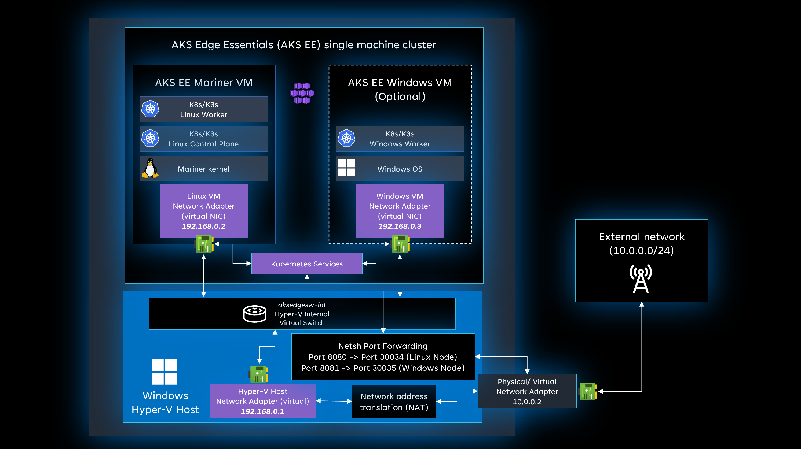

# Exposing Kubernetes services to external devices

If you're working with Kubernetes applications, you might need to make Kubernetes services accessible to external devices so they can interact with the workloads you've deployed. This article explains how to expose Kubernetes services running on an AKS Edge Essentials cluster to external devices. Depending on the networking configuration you used to set up the Kubernetes cluster, there are two different ways to expose the services:

1. Single machine cluster with port forwarding
2. Scalable cluster with external virtual switch

> [!NOTE]
> If you are using Kubernetes services, make sure to set up the `Init.ServiceIPRangeSize` and `Init.ServiceIPRangeStart` parameters during deployment. For more infomration, see [Deployment configuration JSON parameters](./aks-edge-deployment-config-json.md).

## Option 1: Single machine cluster with port forwarding

AKS Edge Essentials Single machine cluster configuration uses an internal virtual switch to manage networking. This ensures that all communications between the Windows host OS and the Linux/Windows node are done using an internal network that isn't accessible by external devices. For more information on AKS Edge Essentials networking, please refer to [AKS Edge Essentials networking](./aks-edge-concept-networking.md).

If you need to access a Kubernetes service from external devices, you need to set up port forwarding from the Windows host OS to the Linux or Windows node. If you're using a Kubernetes service of type **LoadBalancer**, make sure to obtain the correct **ServiceIp** by using the `kubectl get services` command. If you're using a Kubernetes service of type **ClusterIp** or **NodePort**, use the IP address of the Linux/Windows Kubernetes node.

To set up port forwarding, you can use the `netsh` cmdlet. For more information on Netsh Command Syntax, Contexts, and Formatting, please refer to [Netsh Command Syntax, Contexts, and Formatting](/windows-server/networking/technologies/netsh/netsh-contexts). Follow these steps to set up port forwarding:

1. Open an elevated PowerShell session
1. Enable a firewall rule port for the Windows host OS external port. For more information, see [New-NetFirewallRule](/powershell/module/netsecurity/new-netfirewallrule).
    ```powershell
    New-NetFirewallRule -DisplayName "<name-for-rule>" -Direction Inbound -LocalPort <Windows-host-OS-external-port> -Action Allow
    ```
1. Get the IP address of the targeted service in your namespace
    ```powershell
    kubectl get service -n <nammespace>
    ```
1. Set up the port forwarding from your Windows host OS port to the Kubernetes service IP address and port.

    | Parameter | Description |
    | --------- | ----------- |
    | listen-port | Windows host OS IPv4 port that will be used by external devices to communicate with the Kubernetes service. | 
    | listen-address | Specifies the IPv4 address for which to listen on the Windows host OS. If an address isn't specified, the default is the local computer. |
    | connect-port | Specifies the IPv4 port to which to redirect the traffic. This port should be the Kubernetes service port. | 
    | connect-address | Specifies the IPv4 address to which to  to redirect the traffic. This port should be the Kubernetes service IP address. |

     ```powershell
    netsh interface portproxy add v4tov4 listenport=<listen-port> listenaddress=<listen-address> connectport=<connect-port> connectaddress=<connect-address>
    ```

In the example figure below, there are two Kubernetes services running on a Windows device with the **10.0.0.2** IPv4 address. 

- **Linux-Svc** running a **NodePort** service with IP address of the Linux node `192.168.0.2` and port `30034`. This service should be reachable by port **8080** in the Windows host OS. 
- **Win-Svc** running as a **LoadBalancer** service with IP address `192.168.0.5` and port `30035`. This service should be reachable by port **8081** in the Windows host OS. 

To enable external devices accessing these services, you need to set up the port forwarding for both services. For this scenario, you need to run the following commands:

```powershell
netsh interface portproxy add v4tov4 listenport=8080 listenaddress=10.0.0.2 connectport=30034 connectaddress=192.168.0.2
netsh interface portproxy add v4tov4 listenport=8081 listenaddress=10.0.0.2 connectport=30035 connectaddress=192.168.0.5
```



> [!WARNING]
> Please note that if you don't use a static networking configuration, the IPv4 address of the Windows host OS may change. This could affect your port forwarding configurations and the target IPv4 address used by external devices. To minimize the impact of an IPv4 address change, you may want to use a more generic `listenaddress`.

## Option 2: Scalable cluster with external virtual switch

AKS Edge Essentials Scalable cluster configuration uses an external virtual switch to manage networking. Because nodes run inside different devices, all nodes must be connected to the same network to communicate with each other. For more information on AKS Edge Essentials networking, please refer to [AKS Edge Essentials networking](./aks-edge-concept-networking.md).

In this configuration, the Kubernetes nodes are connected to the external network, so Kubernetes services are reachable by external devices without the need for port forwarding. Following guidance for [Option 1](#option-1-single-machine-cluster-with-port-forwarding), if you're using a Kubernetes service of type **LoadBalancer**, make sure to obtain the correct **ServiceIp** by using the `kubectl get services` command. If you're using a Kubernetes service of type **ClusterIp** or **NodePort**, use the IP address of the Linux/Windows Kubernetes node.

> [!NOTE]
>It is possible to keep the Scalable cluster to one device, and leverage the external virutal switch configuration to expose Kubernetes services directly to external devices on the external network without the need for port forwarding.

## Next steps

- [Overview](aks-edge-overview.md)
- [AKS Edge Essentials networking](aks-edge-concept-networking.md).
