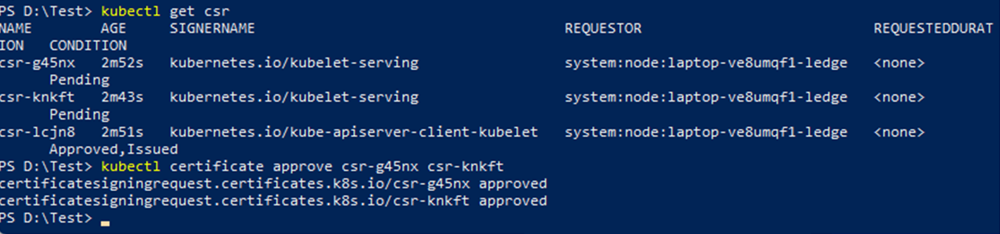
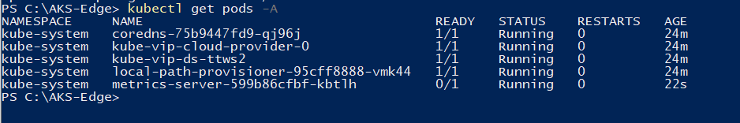
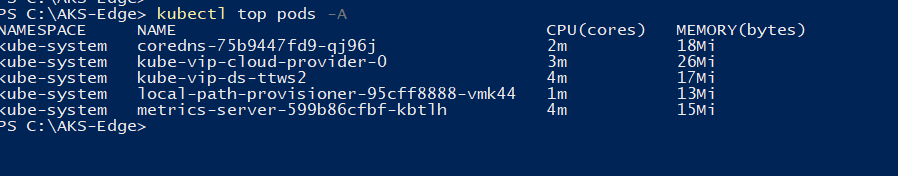

# Metrics server on an AKS Edge Essentials cluster

The [metrics server](https://github.com/kubernetes-sigs/metrics-server) is a tool that inspects your containers' resource consumption. You can find the YAML file for the metrics server in the /Samples/Other folder in the [GitHub repo](https://github.com/Azure/AKS-Edge/).

## Prerequisites on K8S clusters

- On a K8S cluster, before you create your deployment, set the parameter `ServerTLSBootstrap` to `true` in your `aksedge-config.json` file. If you've already created your cluster, follow the instructions as described [here](https://kubernetes.io/docs/tasks/administer-cluster/kubeadm/kubeadm-certs/#kubelet-serving-certs).

- On a K8S cluster, the CSRs (Certificate Signing Requests) for the kubelet serving certificates can't be automatically approved by the default signer in the kube-controller-manager - kubernetes.io/kubelet-serving. This will require action from the user or a third party controller. The CSRs can be viewed using:

    ```bash
        kubectl get csr
    ```

    You can approve the `kubelet-serving` certificates as shown:

    ```bash
        kubectl certificate approve <csr-name>
    ```

    

## Deploy metrics server

### Step 1: Deploy the metrics server manifest

```powershell
kubectl apply -f https://github.com/kubernetes-sigs/metrics-server/releases/latest/download/components.yaml
```

Wait for the metrics server pods to reach **running** status. It might take a few minutes.

```powershell
kubectl get pods -A
```



#### Step 2: View your resource consumption

```powershell
kubectl top nodes
```

```powershell
kubectl top pods -A
```



If your metrics server fails to display, you may have run into an MTU issue in which the Linux VM's MTU doesn't match that of your network. This can happen on Azure VMs. You may need to set your MTU parameter to 1300 in your AksEdgeConfig file.

 ```json
       "LinuxVm": {
           "CpuCount": 4,
           "MemoryInMB": 4096,
           "Mtu": 1300
       }
   ```

## Next steps

- [Overview](aks-edge-overview.md)
- [Uninstall AKS cluster](aks-edge-howto-uninstall.md)
