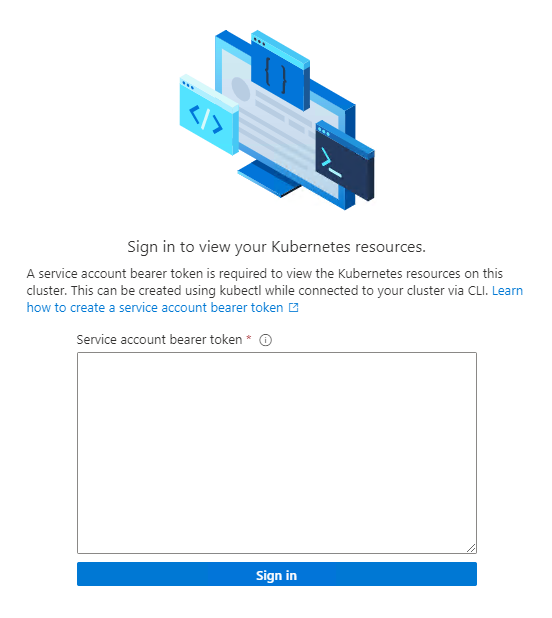

# Additional configuration for AKS Edge Essentials

This article provides an alternate way of connecting to Azure Arc using Az Powershell and Powershell 7.

## Connect to Arc using PowerShell 7

### Step 1: Install dependencies

First, install [PowerShell 7.2.7](https://github.com/PowerShell/PowerShell/releases/download/v7.2.7/PowerShell-7.2.7-win-x64.msi).

Then run the following commands in an elevated PowerShell window to install the dependencies in PowerShell:

```powershell
Install-Module Az.Resources -Repository PSGallery -Force -AllowClobber -ErrorAction Stop  
Install-Module Az.Accounts -Repository PSGallery -Force -AllowClobber -ErrorAction Stop 
Install-Module Az.ConnectedKubernetes -Repository PSGallery -Force -AllowClobber -ErrorAction Stop  
```

> [!NOTE]
> For connecting to Arc, you must install a helm version that is greater than v3.0 but less than v3.7. We recommend installing version 3.6.3.

```powershell
#download helm from web
Invoke-WebRequest -Uri "https://get.helm.sh/helm-v3.6.3-windows-amd64.zip" -OutFile ".\helm-v3.6.3-windows-amd64.zip"
```

```powershell
#Unzip to a local directory
Expand-Archive "helm-v3.6.3-windows-amd64.zip" C:\helm
#set helm in the env Path
$env:Path = "C:\helm\windows-amd64;$env:Path"
```

### Step 2: Configure your Azure environment

Follow [Configure your Azure environment](aks-edge-howto-connect-to-arc.md#1-configure-your-azure-environment) steps and note down all the azure parameters including the service principal id and password.

#### Create a PSCredential object with service principal

Now create a **PSCredential** object to make it easier for you to connect to Arc:

```powershell
$username = "<appId of service principal>"
$password ="<password of service principal>"
$password = ConvertTo-SecureString $password -AsPlainText -Force
$credential = New-Object System.Management.Automation.PSCredential($username, $password)
```

### Step 3: Connect your cluster to Arc

Connect your cluster to Azure Arc-enabled kubernetes using `Set-AksEdgeArcConnection` function.

```powershell
#populate your parameters and $credential from the earlier step.
$parameters = @{
    ClusterName = "optional cluster name"
    TenantId = "your tenant ID"
    SubscriptionId = "subscription id"
    ResourceGroupName = "resourcegroupname"
    Location = "fill location"
    Credential = $credential
    Connect = $true
}
Set-AksEdgeArcConnection @parameters
```

This step may take a while. When the powershell command is finished running, navigate to your resource group in the Azure portal and select your cluster. You should see its status as **Connected**.


### Step 4: View cluster resources

1. On the left panel, select the **Namespaces** blade under **Kubernetes resources (preview)**.

    

2. To view your Kubernetes resources, you need a bearer token.

    

3. In your PowerShell window, run `Get-AksEdgeManagedServiceToken`, copy the full string, and paste it into the Azure portal.

    

4. Now you can view resources on your cluster. The following image shows the **Workloads** blade, showing the same as `kubectl get pods --all-namespaces`:

    

### Disconnect from Arc

Run the following command to disconnect your cluster from Azure Arc:

```powershell
Set-AksEdgeArcConnection -connect $false -credential $credential
```

For a complete clean-up, delete the service principal and resource group you created for this evaluation.

## Next steps

- Deploy your application (./aks-edge-howto-deploy-app.md)
- [Overview](aks-edge-overview.md)
- [Uninstall AKS cluster](aks-edge-howto-uninstall.md)
