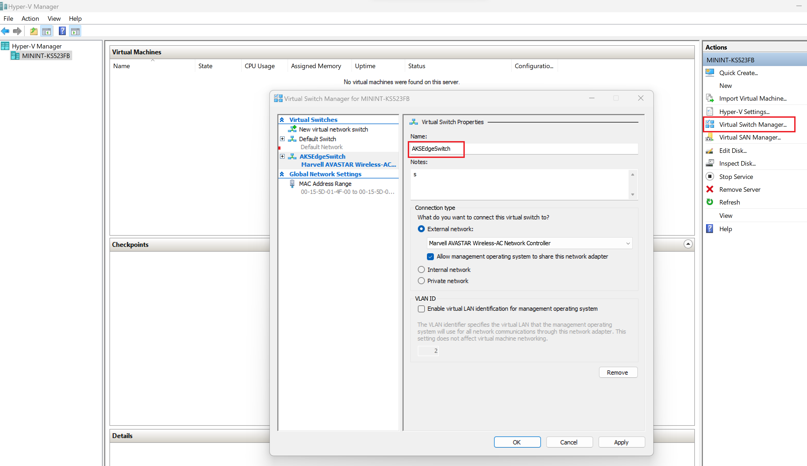

# Full Kubernetes deployments in AKS Edge Essentials

The AKS cluster can be configured to run on multiple machines to support a distributed microservices architecture. Unlike other AKS products, such as AKS in the cloud or AKS on HCI on-premises that have multiple VMs, AKS Edge Essentials is intended for static configurations and does not enable dynamic VM creation/deletion or cluster lifecycle management. AKS Edge Essentials has only one Linux VM per each machine, along with a Windows VM if needed, each with a static allocation of RAM, storage, and physical CPU cores assigned at install time. In a multi-node deployment, one of the machines is the primary machine with Kubernetes control node, and the other machines will be secondary machines with the worker nodes. In this deployment scenario, we will configure the K8S cluster using an external switch. With this configuration you can run `kubectl` from another machine on your network, evaluate your workload performance on an external switch, etc.  

## Prerequisites

Set up your machine as described in the [Set up machine](aks-edge-howto-setup-machine.md) article.

## 1. Full Kubernetes deployment configuration parameters

The parameters needed to create a full Kubernetes are defined in the **aksedge-config.json** file in the downloaded GitHub folder. A detailed description of the configuration parameters is available [here](aks-edge-deployment-config-json.md). The key parameters to note for a full Kubernetes deployment are:

- **DeployOptions.SingleMachineCluster** - The parameter that identifies a full deployment cluster is the `singlemachinecluster` flag, which must be set to `false`.
- **External switch information** - A full deployment uses an external switch to enable communication across the nodes. You must specify the `Network.VSwitch.AdapterName` as either `Ethernet` or `Wi-Fi`.

    ```powershell
    # get the list of available adapters in the machine
    Get-NetAdapter -Physical | Where-Object { $_.Status -eq 'Up' }
    ```

    If you've created an external switch on your Hyper-V, you can choose to specify the vswitch details in your **aksedge-config.json** file. If you do not create an external switch in Hyper-V manager and run the deployment command below, AKS edge automatically creates an external switch named `aksedgesw-ext` and uses that for your deployment.

    > [!NOTE]
    > In this release, there is a known issue with automatic creation of an external switch with the `New-AksEdgeDeployment` command if you are using a **Wi-Fi** adapter for the switch. In this case, first create the external switch using the Hyper-V manager - Virtual Switch Manager, map the switch to the Wi-fi adapter, and then provide the switch details in your configuration JSON as described below.

    

- **IP addresses**:  You must allocate free IP addresses from your network for the **Control Plane**, **Kubernetes services**, and **Nodes (VMs)**. Read the [AKS Edge Essentials Networking](aks-edge-concept.md#networking) overview for more details. For example, in local networks with the 192.168.1.0/24 IP address range, 1.151 and above are outside of the DHCP scope, and therefore are guaranteed to be free. AKS Edge Essentials currently supports IPv4 addresses only. You can use the [AksEdge-ListUsedIPv4s](https://github.com/Azure/AKS-Edge/blob/main/tools/scripts/network/AksEdge-ListUsedIPv4s.ps1) script that is included in the [GitHub repo](https://github.com/Azure/AKS-Edge) to view IPs that are currently in use, so you can avoid using those IP addresses in your configuration. The following parameters will need to be provided in the `Network` section of the configuration file -  `ControlPlaneEndpointIp`, `Ip4GatewayAddress`, `Ip4PrefixLength`, `ServiceIPRangeSize`, `ServiceIPRangeStart`, `ServiceIPRangeEnd` and `DnsServers`.
- In addition to the above, the following parameters can be set according to your deployment configuration as described [here](aks-edge-deployment-config-json.md)  - `DeployOptions.NodeType`,  `DeployOptions.NetworkPlugin`, `LinuxVm.CpuCount`, `LinuxVm.MemoryInMB`, `LinuxVm.DataSizeInGB`,  `LinuxVm.Ip4Address`, `WindowsVm.CpuCount`, `WindowsVm.MemoryInMB`, `WindowsVm.Ip4Address`, `Network.ServiceIPRangeSize`,  `Network.InternetDisabled`.
- In case of K8S clusters, set the `DeployOptions.ServerTLSBootstrap` as 'true' to enable the metrics server.

## 2. Validate the configuration file

After you update the **aksedge-config.json** file, open the [AksEdgePrompt](https://github.com/Azure/AKS-Edge/blob/main/tools/AksEdgePrompt.cmd). This tool opens an elevated PowerShell window with the modules loaded. Now run the following command to validate your network parameters using the `Test-AksEdgeNetworkParameters` cmdlet:

```powershell
Test-AksEdgeNetworkParameters -JsonConfigFilePath .\aksedge-config.json
```

## 3. Create a full deployment cluster

If `Test-AksEdgeNetworkParameters` returns true, you are ready to create your deployment. You can create your deployment using the `New-AksEdgeDeployment` cmdlet:

```powershell
New-AksEdgeDeployment -JsonConfigFilePath .\aksedge-config.json
```

The `New-AksEdgeDeployment` cmdlet automatically gets the kubeconfig file.

## 4. Validate your deployment

```powershell
kubectl get nodes -o wide
kubectl get pods --all-namespaces -o wide
```

A screenshot of a Kubernetes cluster is shown below:


## 5. Add a Windows worker node (optional)

If you want to add Windows workloads to an existing Linux only cluster, you can run:

```powershell
Add-AksEdgeNode -NodeType Windows
```

You can also specify parameters such as `CpuCount` and/or `MemoryInMB` for your Windows VM here.

## Example configurations for different deployment options

### Create your own configuration file

You can create your own configuration file using the `New-AksEdgeConfig` command:

```powershell
$jsonString = New-AksEdgeConfig .\mydeployconfig.json
```

You can now update your configuration file **mydeployconfig.json** with the right set of values. Some of the sample values are as follows:

```json
"DeployOptions": {
    "NetworkPlugin": "flannel",
    "SingleMachineCluster": false,
    "TimeoutSeconds": 900,
    "NodeType": "Linux"
},
"EndUser": {
    "AcceptEula": false,
    "AcceptOptionalTelemetry": false
},
"LinuxVm": {
    "CpuCount": 4,
    "MemoryInMB": 4096,
    "DataSizeinGB": 20,
    "Ip4Address": "192.168.1.171"
},
"Network": {
    "VSwitch":{
        "Name": "aksedgeswitch",
        "Type":"External",
        "AdapterName" : "Ethernet"
    },
    "ControlPlaneEndpointIp": "192.168.1.191",
    "Ip4GatewayAddress": "192.168.1.1",
    "Ip4PrefixLength": 24,
    "ServiceIPRangeStart": "192.168.1.151",
    "ServiceIPRangeEnd": "192.168.1.170",
    "DnsServers": ["192.168.1.1"]
}
```

### Allocate resources to your nodes

To connect to Arc and deploy your apps with GitOps, allocate four CPUs or more for the `LinuxVm.CpuCount` (processing power), 4 GB or more for `LinuxVm.MemoryinMB` (RAM), and assign a number greater than 0 to `ServiceIpRangeSize`. Here, we allocate 10 IP addresses for your Kubernetes services:

```json
 "LinuxVm": {
        "CpuCount": 4,
        "MemoryInMB": 4096,
        "DataSizeinGB": 20,
        "Ip4Address": "192.168.1.171"
    },
    "WindowsVm": {
        "CpuCount": 2,
        "MemoryInMB": 4096,
        "DataSizeinGB": 20,
        "Ip4Address": "192.168.1.172"
    },
"Network": {
    "VSwitch":{
        "Name": "aksedgeswitch",
        "Type":"External",
        "AdapterName" : "Ethernet"
    },
    "ControlPlaneEndpointIp": "192.168.1.191",
    "Ip4GatewayAddress": "192.168.1.1",
    "Ip4PrefixLength": 24,
    "ServiceIpRangeSize":10,
    "ServiceIPRangeStart": "192.168.1.151",
    "ServiceIPRangeEnd": "192.168.1.160",
    "DnsServers": ["192.168.1.1"]
}
```

### Create Linux and Windows node

To run both the Linux control plane and the Windows worker node on a machine:

```json
"DeployOptions": {
    "ControlPlane": false,
    "Headless": false,
    "JoinCluster": false,
    "NetworkPlugin": "flannel",
    "SingleMachineCluster": false,
    "TimeoutSeconds": 300,
    "NodeType": "LinuxAndWindows",
    "ServerTLSBootstrap": false
  },
  "EndUser": {
    "AcceptEula": false,
    "AcceptOptionalTelemetry": false
  },
  "LinuxVm": {
    "CpuCount": 2,
    "MemoryInMB": 2048,
    "DataSizeInGB": 10,
    "Ip4Address": "192.168.1.171",
    "MacAddress": null,
    "Mtu": 0
  },
  "WindowsVm": {
    "CpuCount": 2,
    "MemoryInMB": 2048,
    "Ip4Address": "192.168.1.172",
    "MacAddress": null,
    "Mtu": 0
  },
```

## Next steps

- [Deploy your application](aks-edge-howto-deploy-app.md).
- [Overview](aks-edge-overview.md)
- [Uninstall AKS cluster](aks-edge-howto-uninstall.md)
