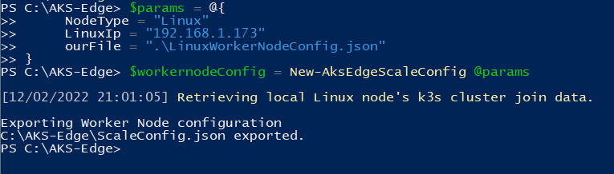
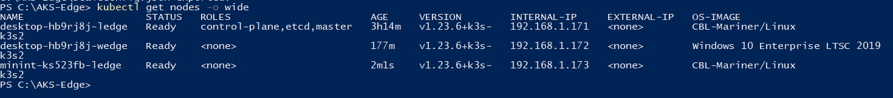

# Scaling out on multiple nodes

Now that AKS Edge Essentials is installed on your primary machine, this article describes how you can scale out your cluster to additional machines to create a multi-node deployment. Note that scaling to additional nodes is an experimental feature.

## Prerequisites

- Set up your [full Kubernetes](aks-edge-howto-multi-node-deployment.md) cluster.
- Set up your additional machines as described in the [Set up machine](aks-edge-howto-setup-machine.md) article. You cannot mix different Kubernetes distributions in your cluster. If the cluster on your primary machine is running **k8s**, you must install the **k8s** msi on the secondary machines as well.

## 1. Get cluster configuration from your primary machine

- On your primary machine on which you created your full deployment, run the following steps in an elevated PowerShell window. To scale by adding a Linux-only worker node, specify the `NodeType` as "Linux", and provide a unique and free IP address for the Linux node:

   ```powershell
   $params = @{
       NodeType = "Linux"
       LinuxIp = "192.168.1.173"
       outFile = ".\LinuxWorkerNodeConfig.json"
   }
   $workernodeConfig = New-AksEdgeScaleConfig @params
   ```

    

- To scale by adding more Linux control plane node, specify the `NodeType` as "Linux", set the `ControlPlane` flag as true, and provide a unique IP address for the Linux node:

   ```powershell
   $params = @{
       NodeType = "Linux"
       ControlPlane = $true
       LinuxIp = "192.168.1.173"
       outFile = ".\LinuxWorkerNodeConfig.json"
   }
   $workernodeConfig = New-AksEdgeScaleConfig @params
   ```

- To scale by adding a Windows-only worker node, specify the `NodeType` as "Windows" and provide a unique IP address for the Windows node:

   ```powershell
   $params = @{
       NodeType = "Windows"
       WindowsIp = "192.168.1.174"
       outFile = ".\WindowsWorkerNodeConfig.json"
   }
   $workernodeConfig = New-AksEdgeScaleConfig @params
   ```

- To add a Linux and Windows worker node, specify the `NodeType` as "LinuxAndWindows" and provide a unique IP address for both the Linux and Windows nodes as follows:

   ```powershell
   $params = @{
       NodeType = "LinuxAndWindows"
       LinuxIp = "192.168.1.173"
       WindowsIp = "192.168.1.174"
       outFile = ".\LinuxAndWindowsWorkerNodeConfig.json"
   }
   $workernodeConfig = New-AksEdgeScaleConfig @params
   ```

- To add a Linux control plane node and Windows worker node, specify the `NodeType` as "LinuxAndWindows", set the `ControlPlane` flag as `true`, and provide a unique IP address for both the Linux and Windows nodes:

   ```powershell
   $params = @{
       NodeType = "LinuxAndWindows"
       LinuxIp = "192.168.1.173"
       ControlPlane = $true
       WindowsIp = "192.168.1.174"
       outFile = ".\LinuxAndWindowsWorkerNodeConfig.json"
   }
   $workernodeConfig = New-AksEdgeScaleConfig @params
   ```

This command returns a JSON string and also stores the JSON content in the **.\ScaleConfig.json** file. This command also exports the necessary data to join a cluster in the JSON format.

## 2. Validate the configuration parameters

 The **.\ScaleConfig.json** configuration file includes the configurations from the primary machine. Review and update necessary sections providing details relevant to the machine you are scaling to.

- Verify the `Network.VSwitch.AdapterName` with reference to the secondary machine. If you've created an external switch on your Hyper-V on your secondary machine, you can choose to specify the vswitch details in your **ScaleConfig.json** file. If you do not create an external switch in Hyper-V manager and run the `New-AksEdgeDeployment` command, AKS edge automatically creates an external switch named `aksedgesw-ext` and uses that for your deployment.
    > [!NOTE]
    > In this release, there is a known issue in automatic creation of external switches with the `New-AksEdgeDeployment` command if you are using a Wi-fi adapter for the switch. In this case, first create the external switch using the Hyper-V manager - Virtual Switch Manager and map the switch to the Wi-fi adapter. Then provide the switch details in your configuration JSON as described below.

- Verify the resource configurations for the additional nodes. You can modify these parameters as needed. Ensure to [reserve enough memory for each node](./aks-edge-concept.md#aks-edge-essentials-key-concepts). If you specified `MacAddress` on your primary machine, verify and provide the right MAC address relevant to the secondary machine.

- The only supported setting is to have an odd number of control plane nodes. Therefore, if you want to scale up/down your control plane, make sure you have one, three, or five control plane nodes.

## 3. Bring up a node on your secondary machine

Now you're ready to bring up nodes on your secondary machines and add them to the cluster.

To deploy the corresponding node on the secondary machine, you can now use the **ScaleConfig.json** file created in the previous step:

```powershell
New-AksEdgeDeployment -JsonConfigFilePath .\ScaleConfig.json
```

## 4. Validate your cluster setup

On any node in the cluster, run the following cmdlet:

```powershell
kubectl get nodes -o wide
```

You should be able to see all the nodes of the cluster.



## 5. Add more nodes

You can generate a new `ScaleConfig` file based on the nodeType required by repeating steps 1-4. Ensure that you provide IP addresses that are available in your network each time you add a node.

## 6. Add a Windows worker node (optional)

If you want to add a Windows node to an existing Linux-only machine, you can run:

```powershell
Add-AksEdgeNode -NodeType Windows
```

You can also specify parameters such as `CpuCount` and/or `MemoryInMB` for your Windows VM here.

## Next steps

- [Deploy your application](aks-edge-howto-deploy-app.md) or [connect to Arc](aks-edge-howto-connect-to-arc.md)
- [Overview](aks-edge-overview.md)
- [Uninstall AKS cluster](aks-edge-howto-uninstall.md)
