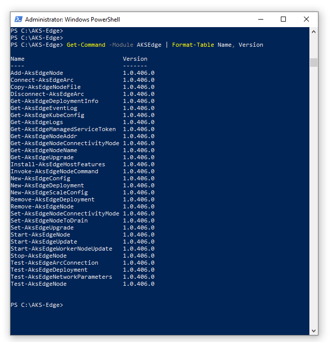
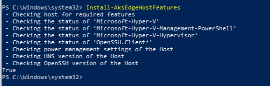

# Prepare your machines for AKS Edge Essentials

This article describes how to set up an Azure Kubernetes Service (AKS) Edge Essentials node machine.

## Prerequisites

- See the [system requirements](aks-edge-system-requirements.md).
- OS requirements: install Windows 10/11 IoT Enterprise/Enterprise/Pro on your machine and activate Windows. We recommend using the latest [client version 22H2 (OS build 19045)](/windows/release-health/release-information) or [Server 2022 (OS build 20348)](/windows/release-health/windows-server-release-info). You can [download a version of Windows 10 here](https://www.microsoft.com/software-download/windows10) or [Windows 11 here](https://www.microsoft.com/software-download/windows11).

> [!NOTE]
> If you are doing an offline installation, or your machine is running on a corporate environment with security policies in place that may limit internet connection, make sure to check [AKS Edge Essentials offline installation](aks-edge-howto-offline-install.md).

## Download AKS Edge Essentials

You can deploy an AKS Edge Essentials cluster on either a single machine or on multiple machines. In a multi-machine deployment, one of the machines is the primary machine with a Kubernetes control node, and the other machines are secondary machines that are either control nodes or worker nodes. You must install AKS Edge Essentials on both the primary and secondary machines as follows. Once AKS Edge Essentials is installed, when you create your Kubernetes cluster, you identify one machine as the primary and the rest as secondary machines.

1. On your machine, download the **AksEdge-k3s.msi** or **AksEdge-k8s.msi** file, depending on which Kubernetes distribution you want to use. Also, if you're creating a Windows worker node, you'll need the Windows node files.

    | File | Link |
    | ---- | ---- |
    | K8s installer (1.26.6) | [aka.ms/aks-edge/k8s-msi](https://aka.ms/aks-edge/k8s-msi)  |
    | K3s installer (1.26.6) | [aka.ms/aks-edge/k3s-msi](https://aka.ms/aks-edge/k3s-msi) |
    | K8s installer (1.25.11) | [aka.ms/aks-edge/k8s-msi-1.25](https://aka.ms/aks-edge/k8s-msi-1.25)  |
    | K3s installer (1.25.11) | [aka.ms/aks-edge/k3s-msi-1.25](https://aka.ms/aks-edge/k3s-msi-1.25) |
    | Windows node files | [aka.ms/aks-edge/windows-node-zip](https://aka.ms/aks-edge/windows-node-zip) |

1. In addition to the MSI, Microsoft provides samples and tools that you can download from the [AKS Edge GitHub repo](https://github.com/Azure/AKS-Edge). Navigate to the **Code** tab and click the **Download Zip** button to download the repository as a **.zip** file. Extract the GitHub **.zip** file to a local folder.
1. Before you install, make sure you uninstall any private preview installations and reboot your system before proceeding.

In this release, both K8s and K3s are supported. We've provided two separate MSI installers for each Kubernetes distribution. Do not install both K8s and K3s at the same time. If you want to install a different Kubernetes distribution, uninstall the existing one first, then reboot.

> [!NOTE]
> You must extract the Windows node files from the zip archive into the same folder as the installer MSIs if you want to use the Windows node capability.
Before you install the MSI, you can review the [feature support matrix](aks-edge-system-requirements.md#ga-feature-support-matrix) to understand the different options available.  

## Install AKS Edge Essentials

1. Open PowerShell as an administrator (an elevated PowerShell), and navigate to the folder directory with the installer files.
1. Issue the following command, and replace `kXs-x.x.xxx.x` with the Kubernetes distribution/version you downloaded and ran:

    ```powershell
    msiexec.exe /i AksEdge-kXs-x.x.xxx.x.msi
    ```

    Optionally, you can specify the install directory and the vhdx directory (directory where the vhdx files for the virtual machines are stored) using `INSTALLDIR` and `VHDXDIR`. By default, these are in `C:\Program Files\AksEdge`:

    ```powershell
    msiexec.exe /i AksEdge-kXs-x.x.xxx.x.msi INSTALLDIR=C:\Programs\AksEdge VHDXDIR=C:\vhdx
    ```

    Alternatively, you can double-click the **AksEdge-k8s-x.x.xxx.x.msi** or **AksEdge-k3s-x.x.xxx.x.msi** file to install the latest version.

1. To include Windows nodes, make sure you have the MSI installer with your Kubernetes distribution of choice and the unzipped **AksEdgeWindows-v1** files in the same folder. In the following command, replace `kXs-x.x.xxx.x` with the Kubernetes distribution/version you downloaded and ran:

    ```powershell
    msiexec.exe /i AksEdge-kXs-x.x.xxx.x.msi ADDLOCAL=CoreFeature,WindowsNodeFeature
    ```

    OR

    ```powershell
    msiexec.exe /i AksEdge-kXs-x.x.xxx.x.msi ADDLOCAL=CoreFeature,WindowsNodeFeature INSTALLDIR=C:\Programs\AksEdge VHDXDIR=C:\vhdx
    ```

    Now you're ready to do mixed deployment.

1. Open another elevated PowerShell window and continue with the next step.

## Check the AKS Edge Essentials modules

Once installation is complete, make sure it was successful by running the following command in an elevated PowerShell:

```powershell
Set-ExecutionPolicy RemoteSigned -Scope Process -Force
Import-Module AksEdge
Get-Command -Module AKSEdge | Format-Table Name, Version
```

This command displays output similar to the following list:



See the [AKS Edge Essentials PowerShell cmdlets reference](./reference/aks-edge-ps/index.md) for a full list of supported commands.

## Check device settings

You can run the `Install-AksEdgeHostFeatures` command to validate the Hyper-V, SSH and Power settings on the machine. This might require a system reboot:

```powershell
Install-AksEdgeHostFeatures
```

This command displays output similar to the following list:



## Next steps

- Create a [simple deployment](aks-edge-howto-single-node-deployment.md)
- Create a [full deployment](aks-edge-howto-multi-node-deployment.md)

