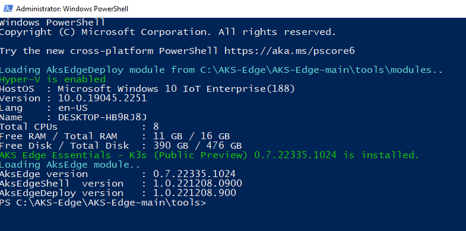

# Prepare your machines for AKS Edge Essentials

This article describes how to set up an Azure Kubernetes Service (AKS) Edge node machine.

## Prerequisites

- Refer to the [system requirements](aks-edge-system-requirements.md)
- OS requirements: Install Windows 10/11 IoT Enterprise/Enterprise/Pro on your machine and activate Windows. We recommend using the latest [client version 22H2 (OS build 19045)](/windows/release-health/release-information) or [Server 2022 (OS build 20348)](/windows/release-health/windows-server-release-info). You can [download a version of Windows 10 here](https://www.microsoft.com/software-download/windows10) or [Windows 11 here](https://www.microsoft.com/software-download/windows11).

## Download the installer

You can deploy an AKS Edge Essentials cluster on either a single machine or on multiple machines. In a multi-machine deployment, one of the machines is the primary machine with a Kubernetes control node, and the other machines are secondary machines that are either control nodes or worker nodes. You must install AKS on both the primary and secondary machines as follows. Once AKS is installed, when you create your Kubernetes cluster, you identify one machine as the primary and the rest as secondary machines.

1. On your machine, download the **AksEdge-k3s.msi** or **AksEdge-k8s.msi** file, depending on which Kubernetes distribution you want to use. Also, if you're creating a Windows worker node, you'll need the Windows node files.

    | File | Link |
    | ---- | ---- |
    | K8s installer | [aka.ms/aks-edge/k8s-msi](https://aka.ms/aks-edge/k8s-msi)  |
    | K3s installer | [aka.ms/aks-edge/k3s-msi](https://aka.ms/aks-edge/k3s-msi) |
    | Windows node files | [aka.ms/aks-edge/windows-node-zip](https://aka.ms/aks-edge/windows-node-zip) |

1. In addition to the MSI, Microsoft provides a few samples and tools which you can download from the [AKS Edge GitHub repo](https://github.com/Azure/AKS-Edge). Navigate to the **Code** tab and click the **Download Zip** button to download the repository as a **.zip** file. Extract the GitHub **.zip** file to a working folder.

1. Before you install, make sure you uninstall any private preview installations and reboot your system before proceeding.

In this release, both K8s and K3s are supported. We've provided two separate MSI installers for each Kubernetes distribution. Do not install both K8s and K3s at the same time. If you want to install a different Kubernetes distribution, uninstall the existing one first and reboot.

Before you install the MSI, you can review the [feature support](aks-edge-system-requirements.md#feature-support-matrix) to understand the different options available.  

## Set up your machine as a Linux node

1. Open PowerShell as an admin, and navigate to the folder directory with the installer files.

2. In the following command, replace `kXs-x.xx.x` with the Kubernetes distribution/version you have downloaded and run:

    ```powershell
    msiexec.exe /i AksEdge-kXs-x.xx.x.msi
    ```

    Optionally, you can specify the install directory and the vhdx directory (directory where the vhdx files for the virtual machines are stored) using `INSTALLDIR` and `VHDXDIR`. By default, these will be in `C:\Program Files\AksEdge`.

    ```powershell
    msiexec.exe /i AksEdge-kXs-x.xx.x.msi INSTALLDIR=C:\Programs\AksEdge VHDXDIR=C:\vhdx
    ```

Alternatively, you can double-click the **AksEdge-k8s-x.xx.x.msi** or **AksEdge-k3s-x.xx.x.msi** file to install the latest version.

## Set up your machine as a Linux and Windows node

In order to configure your MSI installer to include Windows nodes, make sure you have the MSI installer with Kubernetes distribution of choice and the provided **AksEdgeWindows-v1** files in the same folder.

1. Open PowerShell as an admin, and navigate to the folder directory with the installer and **AksEdgeWindows-v1** files.

2. In the following command, replace `kXs-x.xx.x` with the Kubernetes distribution/version you have downloaded and run:

    ```powershell
    msiexec.exe /i AksEdge-kXs-x.xx.x.msi ADDLOCAL=CoreFeature,WindowsNodeFeature
    ```

    (or)

    ```powershell
    msiexec.exe /i AksEdge-kXs-x.xx.x.msi ADDLOCAL=CoreFeature,WindowsNodeFeature INSTALLDIR=C:\Programs\AksEdge VHDXDIR=C:\vhdx
    ```

3. Now you're ready to do mixed deployment.

## Load AKS Edge modules

You can load AKS Edge modules by running the **AksEdgePrompt** file from the **tools** folder in the downloaded [GitHub repo](https://github.com/Azure/AKS-Edge/blob/main/tools/AksEdgePrompt.cmd). This PowerShell script checks for prerequisites such as Hyper-V, system CPU and memory resources, and the AKS Edge Essentials program, and loads the corresponding PowerShell modules. It's recommended that you use the **AksEdgePrompt** tool.



Alternatively, you can access the AKSEdge PowerShell modules from an elevated PowerShell instance as shown:

```powershell
Import-Module AksEdge
```

Open another elevated PowerShell window and continue with the next step.

## Check the AKS Edge modules

Once installation is complete, make sure it was successful by running the following command:

```powershell
Get-Command -Module AKSEdge | Format-Table Name, Version
```


See the [AKS Edge Essentials PowerShell cmdlets reference](./reference/aks-edge-ps/index.md) for a full list of supported commands.

## Check AKS Edge Essentials related settings on the device

You can run the `Install-AksEdgeHostFeatures` command to validate the Hyper-V, SSH and Power settings on the machine. This might require a system reboot.

```powershell
Install-AksEdgeHostFeatures
```


## Next steps

- Create a [simple deployment](aks-edge-howto-single-node-deployment.md)
- Create a [full deployment](aks-edge-howto-multi-node-deployment.md)
