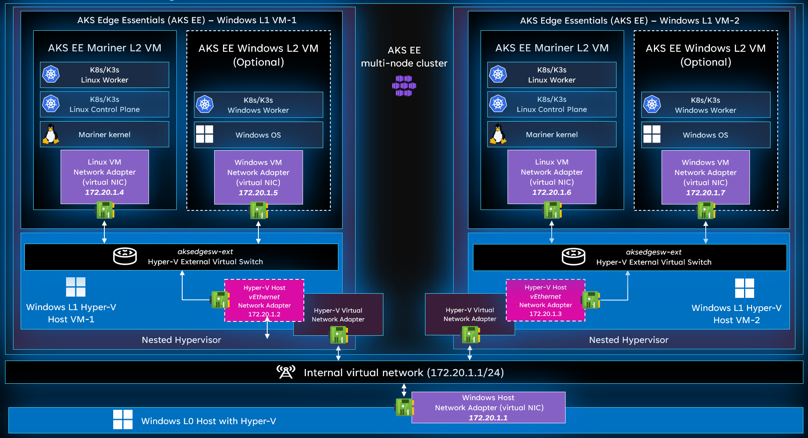

# Prepare your nested virtualization environment for AKS Edge Essentials

This article describes how to set up a nested virtualization environment to deploy an Azure Kubernetes Service (AKS) Edge cluster. 

>[!NOTE]
> Deploying AKS Edge Essentials on top of a nested virtualization environment is not supported for production scenarios and it's only limited to developer purposes. This guide asumes you're using Hyper-V hypervisor. We do not support using non-Microsoft hypervisor, suck as KVM or vSpere. 

## Prerequisites

- Refer to the [system requirements](aks-edge-system-requirements.md)
- OS requirements: Install Windows 10/11 IoT Enterprise/Enterprise/Pro on your machine and activate Windows. We recommend using the latest [client version 22H2 (OS build 19045)](/windows/release-health/release-information) or [Server 2022 (OS build 20348)](/windows/release-health/windows-server-release-info). You can [download a version of Windows 10 here](https://www.microsoft.com/software-download/windows10) or [Windows 11 here](https://www.microsoft.com/software-download/windows11).

## Azure virtual machines

If you're running AKS Edge Essentials on top of an Azure VM, ensure to use an Azure Compute Unit (ACU) that supports nested virtualization. For more information, see [Azure Compute Unit (ACU)](/azure/virtual-machines/acu). Also, Azure VMs don't support using an *External virtual switch*, so AKS Edge Essentials deployments on top of the VM host OS are limited to *Single Machine Cluster*. 
 
## Deployment environment

The following section describes the nested architecture, highlighting the main components and configurations needed. The levels of virtualization described later in the guide are:

- **L0 Host OS**: Windows host operating system - This OS could be running bare-metal or as a virtual machine, but in this guide, the *L0 Host OS* is the one that creates the nested Windows L1 VMs. 
- **L1 Virtual Machine**: Windows VM running on top of L0 Windows host OS - This VM has the AKS Edge Essentials installation. 
- **L2 Virtual Machine**: AKS Edge Essentials nested VM (Linux or Windows) running on top of the L1 Windows virtual machine. 

Nested environment can be setup using *Internal* or *External* virtual switch. However, this guide assumes you're using an *Internal* virtual switch. IP addresses of the L0 Windows machine and L1/L2 virtual machines can change depending on the networking scenario. This guide assumes that you're using the *172.20.1.0/24* IP address family. Also, deploying AKS EE windows nodes is optional, and will impact your assigned memory requirements. This guide goes through a Linux only deployment, but you can add your Windows nodes just by adding the appropriate configuration to the deployment JSON files. 

>[!TIP]
> If you're using *External* virutal switches for the deployment, ensure to use the correct *Network Adapters* and IP addresses allocations. 



The diagram shows the different virtual machines and components of this nested architecture. 

| **Device/VM** | **OS** | **Level** | **Parent** | **Memory** | **IP Address** | 
| --------- |--| ----- | ------ | ------ | ---------- | 
| Windows host OS | Windows | L0  | - | 32/64 GB | 172.20.1.1 | 
| Windows-VM-1 | Windows | L1 | Windows host OS |  8/16 GB | 172.20.1.2 | 
| Windows-VM-2 | Windows | L1 | Windows host OS | 8/16 GB | 172.20.1.3 |
| AKS-Edge-Linux-VM-1 | CBL-Mariner | L2 | Windows-VM-1 | 4 GB | 172.20.1.4 | 
| AKS-Edge-Windows-VM-1 **(optional)** | Windows | L2 | Windows-VM-1 | 4 GB | 172.20.1.5 | 
| AKS-Edge-Linux-VM-2 | CBL-Mariner | L2 | Windows-VM-2 | 4 GB | 172.20.1.6 | 
| AKS-Edge-Windows-VM-2 **(optional)** | Windows | L2 | Windows-VM-2 | 4 GB | 172.20.1.7 | 

## Setup Nested virtual machines

>[!NOTE] 
> The following guide is an example of IP address allocation - You can use your own allocation based on your network environment and requirements. Naming of virtual machines and virutal hardware assignations are also suggested, but you can use your own configurations. 

1. Open an elevated PowerShell session

1. Create an Internal Virtual Switch
   ```powershell
   New-VMSwitch -Name "AKS-Int" -SwitchType Internal
   ```
   If correctly created, you should see something similar to the following output

   ```output
   Name    SwitchType NetAdapterInterfaceDescription
   ----    ---------- ------------------------------
   AKS-Int Internal
   ```

1. Assing IP address to *AKS-Int* virtual switch - We use the 172.20.1.1/24 network
   ```powershell
   $ifIndex = (Get-NetAdapter -Name "vEthernet (AKS-Int)").ifIndex
   New-NetIPAddress -IPAddress 172.20.1.1 -PrefixLength 24 -InterfaceIndex $ifIndex
   ```

1. Using Hyper-V Manager, create the first Windows virtual machine and name it *Windows-VM-1*. For more information about virtual machine creation, see [windows-server/virtualization/hyper-v/get-started/create-a-virtual-machine-in-hyper-v?tabs=hyper-v-manager](/windows-server/virtualization/hyper-v/get-started/create-a-virtual-machine-in-hyper-v?tabs=hyper-v-manager). During the configuration of the VM, ensure to set up correctly the following:
   - Processors -> Number of virtual processors: **4**
   - Memory -> RAM: **8192 MB**
   - Network adapter -> Virtual switch: **AKS-Int**

1. Once Windows setup and configuration are finished, turn *Off* your *Windows-VM-1* virtual machine.  

1. Enable nested virtualization for *Windows-VM-1*. For more information about nested virtualization, see [Run Hyper-V in a Virtual Machine with Nested Virtualization](/virtualization/hyper-v-on-windows/user-guide/nested-virtualization).
   ```powershell
   Set-VMProcessor -VMName <windows-vm-name> -ExposeVirtualizationExtensions $true
   ```

1. Enable mac spoofing for *Windows-VM-1* 
   ```powershell
   Get-VMNetworkAdapter -VMName <windows-vm-name> | Set-VMNetworkAdapter -MacAddressSpoofing On
   ```

1. Turn *On* the *Windows-VM-1* virtual machine and connect using Hyper-V *Connect* option. 

1. Inside the *Windows-VM-1* virtual machine, open an elevated PowerShell session. 

1. Check the adapters connected to the virtual machine - Look for the \<name\> of the connected *Ethernet adapter \<name\>*. For example, *Ethernet 2*.

   ```powershell
   ipconfig
   ```
   You should see something similar to the following output

   ```
   PS C:\Windows\system32> ipconfig

   Windows IP Configuration

   Ethernet adapter Ethernet 2:

      Connection-specific DNS Suffix  . : mshome.net
      Link-local IPv6 Address . . . . . : fe80::f4b3:63b3:20d0:2e60%12
      Autoconfiguration IPv4 Address. . : 169.254.233.233
      Subnet Mask . . . . . . . . . . . : 255.255.0.0
      Default Gateway . . . . . . . . . :

   Ethernet adapter vEthernet (Default Switch):

      Connection-specific DNS Suffix  . :
      Link-local IPv6 Address . . . . . : fe80::545e:7d5:812b:c17b%18
      IPv4 Address. . . . . . . . . . . : 172.21.144.1
      Subnet Mask . . . . . . . . . . . : 255.255.240.0
      Default Gateway . . . . . . . . . :
   ```

1. Get the *ifIndex* of the *Ethernet adapter* with the name from previous step.
   ```powershell
   $ifIndex = (Get-NetAdapter -Name "<name>").ifIndex
   ```

1. Configure static IP **172.20.1.2** and gateway IP **172.20.1.1** and DNS Server **172.20.1.1**.
   ```powershell
   New-NetIPAddress –IPAddress "172.20.1.2" -DefaultGateway "172.20.1.1" -PrefixLength $ifIndex
   Set-DNSClientServerAddress –InterfaceIndex $ifIndex –ServerAddresses "172.20.1.1"
   ```

1. Set up the *Windows-VM-1* virtual machine following [Prepare your machines for AKS Edge Essentials](./aks-edge-howto-setup-machine).

1. Install all AKS Edge Essentials prerequisites for *Windows-VM-1* virtual machine. For more information about prerequisites, see [AKS Edge Essentials requirements and support matrix](aks-edge-system-requirements.md).
   ```powershell
   Install-AksEdgeHostFeatures
   ```

1. Create the AKS Edge full-scale deployment configuration file - Once JSON is created, input the required parameters.  Make sure to change the network adapter for external virtual switch creation, DNS server, assigned memory and correct static IP addresses. For more information, see [Full Kubernetes deployments in AKS Edge Essentials](aks-edge-howto-multi-node-deployment.md).
   ```powershell
   New-AksEdgeConfig -NodeType Linux -DeploymentType ScalableCluster
   ```

1. Deploy the AKS-Edge full-scale deployment using the configuration JSON file created in previous step. 
   ```powershell
   New-AksEdgeDeployment -JsonConfigFilePath .\AksEdgeDeployConfigTemplate.json
   ```

1. Enable ping ICMP traffic on the *AKS-Edge-VM-1*
   ```powershell
   Invoke-AksEdgeNodeCommand -NodeType "Linux" -command "sudo iptables -A INPUT -p ICMP -j ACCEPT"
   ```

1. Ping *AKS-Edge-VM-1* from *Windows-VM-1* virtual machine
   ```powershell
   ping 172.20.1.4
   ```

1. Ping *AKS-Edge-VM-1* from *Windows host OS*
   ```powershell
   ping 172.20.1.4
   ```

   >[!WARNING]
   >If the ping requests to the *AKS-Edge-VM-1* fail, review the IP configurations and ensure troubleshoot the network connections. 

1. Inside the *Windows-VM-1* Get the scaleConfig JSON file to be used in *Windows-VM-2*. 
   ```powershell
    New-AksEdgeScaleConfig -NodeType Linux -ScaleType AddMachine -LinuxNodeIp <VM2-Linux-Node-IP>
   ```

1. Create *Windows-VM-2* virtual machine - Repeat steps *4* to *14* with the new *Windows-VM-2* parameters:
   - Virtual machine name: **Windows-VM-2**
   - IP Address: **172.20.1.3**
   - Processors -> Number of virtual processors: **4**
   - Memory -> RAM: **8192 MB**
   - Network adapter -> Virtual switch: **AKS-Int**
   - IP Gateway address: **172.20.1.1**
   - DNS Server address: **172.20.1.1**

1. Test ping from *Windows-VM-2* to *AKS-Edge-VM-1*
   ```
   ping 172.20.1.4
   ```
   >[!WARNING]
   >If the ping requests to the *AKS-Edge-VM-1* fail, review the IP configurations and ensure troubleshoot the network connections. 

1. Set up the *Windows-VM-2* virtual machine following [Prepare your machines for AKS Edge Essentials](aks-edge-howto-setup-machine.md).

1. Install all AKS Edge Essentials prerequisites for *Windows-VM-2* virtual machine. For more information about prerequisites, see [AKS Edge Essentials requirements and support matrix](aks-edge-system-requirements.md).
   ```powershell
   Install-AksEdgeHostFeatures
   ```

1. Connect to the *Windows-VM-1* virtual machine, and using an elevated PowerShell session, get the AKS Edge cluster join configuration.
   ```powershell
   New-AksEdgeScaleConfig -NodeType Linux -ScaleType AddMachine -LinuxNodeIp <AKS-Edge-Linux-VM-2>
   ```   

1. Copy the AKS Edge scale configuration file from *Windows-VM-1* and modify it with the appropriate parameters. For more information, [Scaling out on multiple machines](aks-edge-howto-scale-out.md).

1. Deploy *AKS-Edge-VM-2* on *Window-VM-2* using the scale configuration JSON file from the previous step.
 ```powershell
   New-AksEdgeDeployment -JsonConfigFilePath <scale-config-json>
   ``` 

1. Validate that the node was added to the cluster. On any node in the cluster, run the following cmdlet:
   ```powershell
   kubectl get nodes
   ``` 
   
   If everything was correctly set up, you should see both Linux nodes running in your cluster
   ```output
   PS C:\> kubectl get nodes
   NAME                     STATUS   ROLES                       AGE     VERSION
   windows-vm1-ledge        Ready    control-plane,etcd,master   3m45s   v1.24.3+k3s-
   windows-vm2-ledge        Ready    control-plane,etcd,master  10m25s   v1.24.3+k3s-
   ```

## Next steps

- Add workloads by [deploying applications](aks-edge-howto-deploy-app.md)
- [Troubleshoot](aks-edge-troubleshoot-overview.md) your deployment