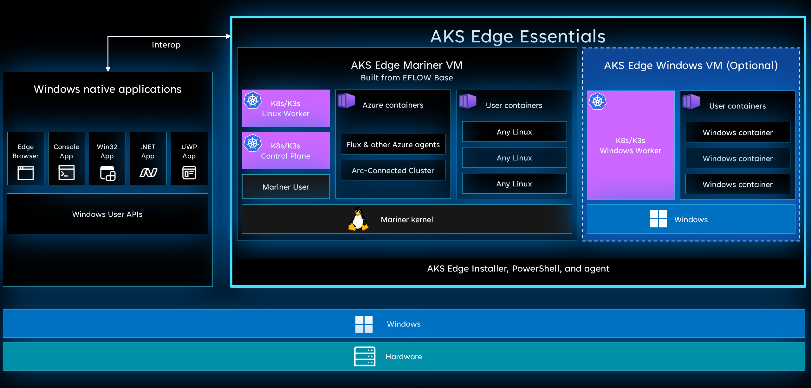

# AKS Edge Essentials

> [!NOTE]
> AKS Edge Essentials is now generally available. Note that some of the [features](./aks-edge-system-requirements.md#ga-feature-support-matrix) from the public preview are not yet supported.

Azure Kubernetes Service Edge Essentials is an on-premises Kubernetes implementation of Azure Kubernetes Service (AKS) that automates running containerized applications at scale. AKS Edge Essentials includes a Microsoft-supported Kubernetes platform that includes a lightweight Kubernetes distribution with a small footprint and simple installation experience, making it easy for you to deploy Kubernetes on PC-class or "light" edge hardware. AKS Edge Essentials makes it easier to get started with your containerized application, bringing cloud-native best practices to your edge application.

## Key features

The following sections describe some of the key features of AKS Edge Essentials.

### Simplified Kubernetes experience

Unlike other Microsoft-supported platforms such as an Azure-hosted service (AKS) and on server-class hardware (AKS-HCI), AKS Edge Essentials is intended for static, pre-defined configurations and doesn't enable dynamic VM creation/deletion or cluster lifecycle management. Each machine in an AKS Edge Essentials cluster can only have one Linux and/or Windows VM. The Linux VM acts as the control node and worker node for Linux workloads in the Kubernetes cluster. Each machine with AKS Edge Essentials has a VM with restricted RAM, storage, and physical CPU cores according to a static allocation assigned at install time. This app-like configuration enables traditional Windows apps to run side-by-side; that is, interoperable alongside the AKS Edge Essentials VMs.

While Kubernetes is an open-source orchestrator for automating container management at scale, AKS Edge Essentials simplifies on-premises Kubernetes deployment by making it easy to install, configure clusters, and manage application deployment across all clusters using a cloud-based management plane.

:::image type="content" source="media/aks-edge/aks-edge-Windows.png" alt-text="Diagram of AKS Edge Essentials architecture." lightbox="media/aks-edge/aks-edge-Windows.png":::

### Microsoft-managed Kubernetes platform

AKS Edge Essentials includes the following features, managed by Microsoft:

- A lightweight, CNCF-conformant K8S and K3S distribution that is supported and managed by Microsoft. The key difference between AKS on HCI and AKS on Windows is that AKS on Windows has minimal compute and memory requirements (4 GB RAM and 2 vCPUs).
- Each Kubernetes node runs in its own Hyper-V isolated virtual machine and includes many features to help secure your container infrastructure.
- Microsoft-maintained Linux and Windows worker nodes virtual machine images adhere to security best practices. Microsoft also refreshes these images monthly with the latest security updates.
- Simplified installation experience with PowerShell cmdlets and agents to enable provisioning and control of VMs and infrastructure. Microsoft provides automatic updates for your Kubernetes deployment, so you stay up-to-date with the latest available Kubernetes versions.

### Locally install nodes on single or multiple machines

AKS Edge Essentials simplifies the process of Kubernetes setup by providing PowerShell scripts and cmdlets to set up Kubernetes and create single or multi node Kubernetes clusters.

### Run Linux and Windows containers

AKS Edge Essentials fully supports both Linux-based and Windows-based containers. When you create a Kubernetes cluster on AKS, you can choose to run Linux containers, Windows containers, or both.

### Azure Arc for management

Once you have set up on-premises Kubernetes using AKS Edge Essentials and created a Kubernetes cluster, you can manage your Kubernetes infrastructure using the Azure portal, which provides a centralized management console for Kubernetes clusters running anywhere. In addition, various Azure Arc-enabled services like Azure Policy, Azure Monitor, and Azure ML services enable you to ensure compliance, monitor your clusters, and run cloud services on your edge clusters. It helps to ensure that applications and clusters are consistently deployed and configured at scale from source control.

## Why use AKS Edge Essentials?

### Interoperable with native Windows applications

Windows provides a rich app ecosystem, user experience and robust security, and powers much of the infrastructure for industrial solutions today from HMIs, robots, PLCs, medical devices, etc. That said, many of the cloud-native workloads are built on Linux, and you're faced with the challenge of having to introduce Linux systems to take advantage of cloud-native solutions. These solutions require additional infrastructure management tools and skills to manage Linux systems in your environment. With AKS Edge Essentials, you get the best of both worlds. You can continue to use your Windows application investments and use existing hardware. In addition, you can also run cloud-native Linux workloads on Windows without the need to have new skills or a new control plane to manage the Linux devices. This enables you to use a broad set of AI capabilities to innovate quickly and drive your edge innovation forward with the least disruption. In addition, AKS Edge Essentials offers interoperability between native Windows applications and containerized Linux workloads.

### Kernel to cloud support  

With AKS Edge Essentials, you get the benefit of having a fully supported stack from kernel to cloud. Microsoft provides a 10-year LTSC for the host OS. The Linux VM is fully managed and is based on a curated CBL-Mariner image, which is a lightweight image that helps reduce attack surface, ensures better performance, and provides less overhead for patching vulnerabilities. In addition, Microsoft has a robust testing matrix for individual Mariner packages and extensive regression tests prior to an image release, reducing the likelihood of downtime for the service. VM policies ensure A/B updates of the VM image and the Kubernetes distribution ensures your Kubernetes stack is the latest and greatest. You can manage all your containers and Kubernetes configs across cloud and on-premises with Arc-enabled Kubernetes. This multi-layered approach ensures that the entire software stack is secure and updated so that your business applications can run reliably.

### Cloud services enabled at the edge

Once your AKS Edge Essentials cluster is connected to Azure Arc, it extends the Azure platform to the edge with core services such as governance, monitoring, application, ML, and data services. It also helps bring DevOps practices anywhere and build iteratively using GitOps and Flux to seamlessly manage application deployments.

## Next steps

- Read about [deployment options](./aks-edge-concept-clusters-nodes.md)
