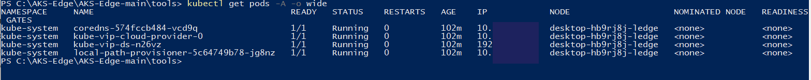
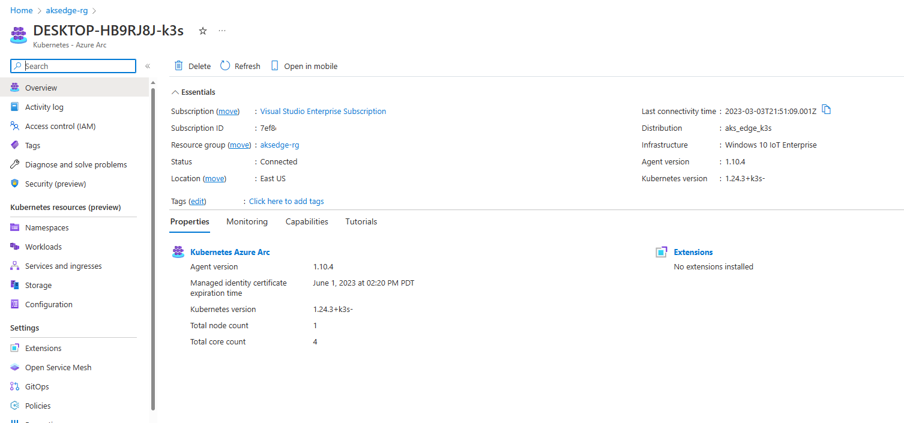
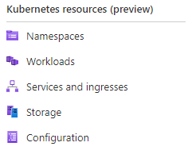
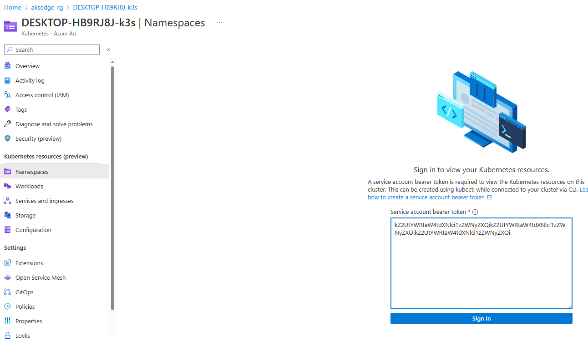
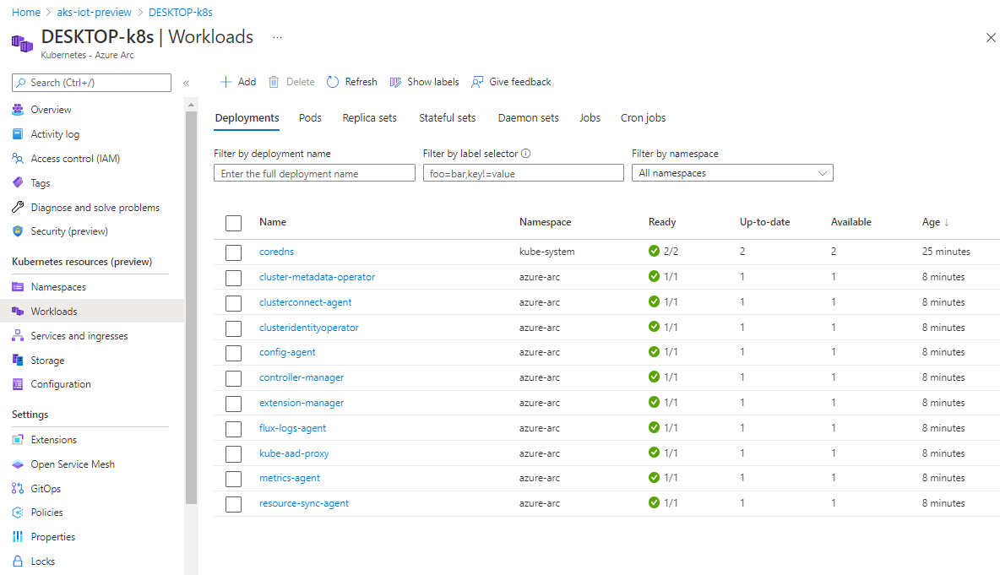

# AKS Edge Essentials quickstart guide

This quickstart describes how to set up an Azure Kubernetes Service (AKS) Edge Essentials single-machine K3S Linux-only cluster.

## Prerequisites

- See the [system requirements](aks-edge-system-requirements.md). For this quickstart, ensure that you have a minimum of 4.5 GB RAM free, 4 vCPUs and 20 GB free disk space.
- OS requirements: install Windows 10/11 IoT Enterprise/Enterprise/Pro on your machine and activate Windows. We recommend using the latest [client version 22H2 (OS build 19045)](/windows/release-health/release-information) or [Server 2022 (OS build 20348)](/windows/release-health/windows-server-release-info). You can [download a version of Windows 10 here](https://www.microsoft.com/software-download/windows10) or [Windows 11 here](https://www.microsoft.com/software-download/windows11).
- See the [Microsoft Software License Terms](aks-edge-software-license-terms.md) as they apply to your use of the software. By using the `AksEdgeQuickStart` script, you accept the Microsoft Software License Terms and the `AcceptEULA` flag is set to `true` indicating acceptance of the license terms.
- Get your Azure subscription parameters: for connecting your cluster to Azure Arc, you must provide these parameters. If you skip these parameters, the Arc connection is skipped, but the cluster is still deployed.
  - Your **login credentials**: Required for interactive login into Azure using Azure CLI. Your account should have one of these roles `Owner` or `Contributor` or `Administrator`.
  - Your **Subscription ID** `<subscription-id>`: In the Azure portal, select the subscription you're using and look for the subscription ID (GUID).
  - Your **Tenant ID** `<tenant-id>`: In the Azure portal, search Microsoft Entra ID, which should take you to the **Default Directory** page. Look for the tenant ID (GUID).
  - The **Location (Azure region)** `<location>`: Where you want your resources to be created. See [Azure Arc by Region](https://azure.microsoft.com/explore/global-infrastructure/products-by-region/?products=azure-arc) for the locations supported by `Azure Arc enabled servers` and `Azure Arc enabled Kubernetes` services. Choose a region in which both are supported.

## Step 1: Download script for easy deployment

Download the `AksEdgeQuickStart.ps1` script to a working folder. Depending on the policy setup on your machine, you may have to unblock the file before running and run `Set-ExecutionPolicy` to allow the script execution.

Open an elevated PowerShell window, and change directory to a working folder:

```powershell
$url = "https://raw.githubusercontent.com/Azure/AKS-Edge/main/tools/scripts/AksEdgeQuickStart/AksEdgeQuickStart.ps1"
Invoke-WebRequest -Uri $url -OutFile .\AksEdgeQuickStart.ps1
Unblock-File .\AksEdgeQuickStart.ps1
Set-ExecutionPolicy -ExecutionPolicy Bypass -Scope Process -Force
```

This script automates the following steps:

- In the working folder, the script downloads the GitHub archive of [Azure/AKS-Edge](https://github.com/Azure/AKS-Edge) and unzips to a folder **AKS-Edge-main** (or **AKS-Edge-\<tag\>**). By default, this downloads the current main branch.
- Uses the [AksEdgeAzureSetup script](https://github.com/Azure/AKS-Edge/blob/main/tools/scripts/AksEdgeAzureSetup/AksEdgeAzureSetup.ps1) to prompt the user to sign in to the Azure portal using their Azure credentials and performs the following tasks:
  - Installs [Azure CLI](/cli/azure/).
  - Creates a resource group **aksedge-rp**.
  - Creates a service principal **aksedge-sp** with **Contributor** role restricted to the **aksedge-rp** resource group scope. If the service principal already exists, it resets its password. This service principal is used to connect to Azure Arc.
  - Registers the resource providers **Microsoft.HybridCompute**, **Microsoft.GuestConfiguration**, **Microsoft.HybridConnectivity**,
    **Microsoft.Kubernetes**, **Microsoft.KubernetesConfiguration**, and **Microsoft.ExtendedLocation**.
- Invokes the `Start-AideWorkflow` function that performs the following tasks:
  - Downloads and installs the AKS Edge Essentials MSI.
  - Installs required host OS features (`Install-AksEdgeHostFeatures`). The machine might reboot when Hyper-V is enabled, and you must restart the script again.
  - Deploys a single machine cluster with internal switch (Linux node only).
- Invokes the `Connect-AideArc` function if the Azure parameters are provided. This function performs the following tasks:
  - Installs the Azure Connected Machine Agent and connects the host machine to Arc for Servers.
  - Connects the deployed cluster to Arc for connected Kubernetes.

## Step 2: Deploy AKS Edge Essentials

In an elevated PowerShell prompt, run the `AksEdgeQuickStart.ps1` script. This brings up a K3s cluster:

```powershell
.\AksEdgeQuickStart.ps1 -SubscriptionId "<subscription-id>" -TenantId "<tenant-id>" -Location "<location>"
```

For installing the K8s version, specify the `-UseK8s` flag:

```powershell
.\AksEdgeQuickStart.ps1 -SubscriptionId "<subscription-id>" -TenantId "<tenant-id>" -Location "<location>" -UseK8s
```

The script installs AKS Edge Essentials and connects your cluster to Azure using Azure Arc.

> [!TIP]
> If Hyper-V was not enabled on your machine, the quickstart script enables Hyper-V and restarts your machine. Run the `AksEdgeQuickStart` script again after the reboot.

## Step 3: Verify deployment

1. Confirm that the deployment was successful by running:

    ```powershell
    kubectl get nodes -o wide
    kubectl get pods -A -o wide
    ```

    The following image shows pods on a K3S cluster:

    

2. You can view your cluster in the Azure portal if you navigate to your resource group:

   

3. On the left panel, select the **Namespaces** under **Kubernetes resources (preview)**:

   

4. To view your Kubernetes resources, you need a bearer token:

   

5. You can run `Get-AksEdgeManagedServiceToken` to retrieve your service token:

   

6. Now you can view resources on your cluster. The **Workloads** shows the pods running on your cluster.

    ```powershell
    kubectl get pods --all-namespaces
    ```

    

You now have an Arc-connected AKS Edge Essentials K3S cluster with a Linux node. You can explore deploying a sample Linux application on this cluster.

> [!TIP]
> If you did not provide your Azure subscription details while running the `AksEdgeQuickStart.ps1` script, you can still connect to Azure Arc by [following the steps in this article](aks-edge-howto-connect-to-arc.md).

## Next steps

- [Understand deployment options](aks-edge-concept-clusters-nodes.md).
- [Deploy a Linux application](aks-edge-howto-deploy-app.md).
- [Add a Windows node](aks-edge-howto-single-node-deployment.md#step-4-add-a-windows-worker-node-optional).
- [Overview](aks-edge-overview.md)
- [Uninstall AKS cluster](aks-edge-howto-uninstall.md)
