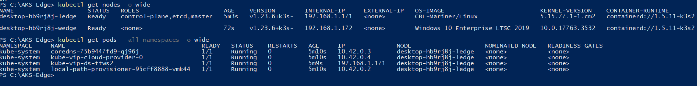
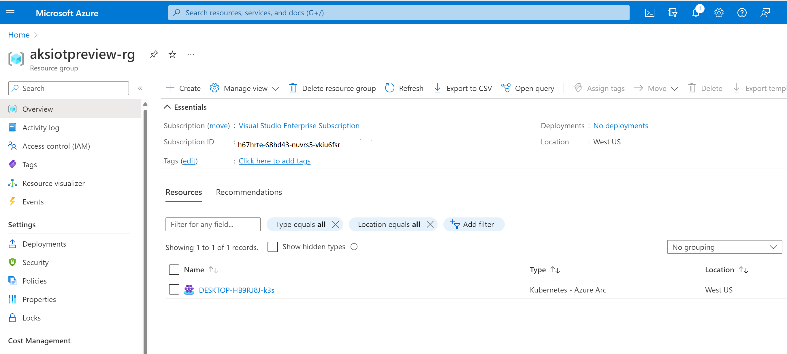
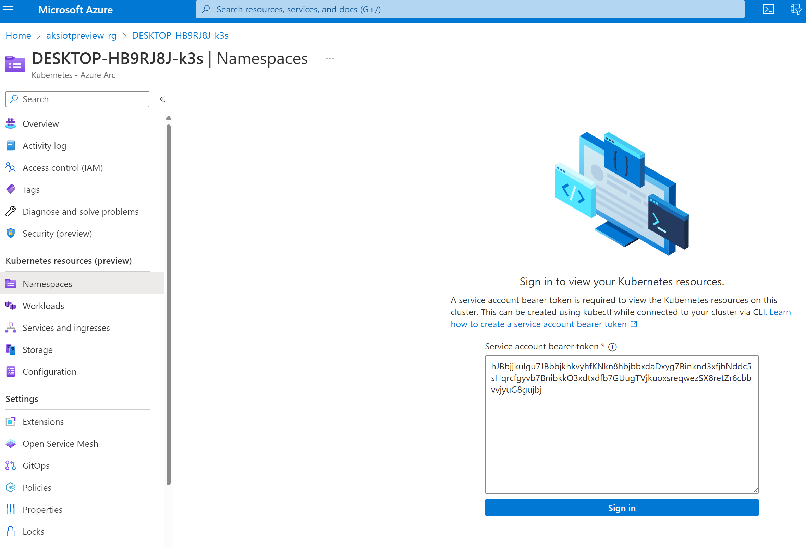

# AKS Edge Essentials quickstart guide

This article describes how to set up an Azure Kubernetes Service (AKS) Edge Essentials single-node K3S cluster.

## Prerequisites

- Refer to the [system requirements](aks-edge-system-requirements.md)
- OS requirements: Install Windows 10/11 IoT Enterprise/Enterprise/Pro on your machine and activate Windows. We recommend using the latest [client version 22H2 (OS build 19045)](/windows/release-health/release-information) or [Server 2022 (OS build 20348)](/windows/release-health/windows-server-release-info). You can [download a version of Windows 10 here](https://www.microsoft.com/software-download/windows10) or [Windows 11 here](https://www.microsoft.com/software-download/windows11).

## 1. Download the installer

In this quickstart we will deploy an AKS Edge Essentials K3S cluster on a single machine. On your machine, download the [**AksEdge-k3s.msi**](https://aka.ms/aks-edge/k3s-msi) file.

## 2. Install the MSI

1. Open PowerShell as an admin, and navigate to the folder directory with the installer file.

2. In the following command, replace `k3s-x.xx.x` with the Kubernetes distribution/version you have downloaded and run:

    ```powershell
    msiexec.exe /i AksEdge-k3s-x.xx.x.msi
    ```

    By default, AKS EE will be installed in `C:\Program Files\AksEdge`.

## 2. Download scripts for easy deployment

In addition to the MSI, Microsoft provides a few samples and tools which you can download from the [AKS Edge GitHub repo](https://github.com/Azure/AKS-Edge). Navigate to the **Code** tab and click the **Download Zip** button to download the repository as a **.zip** file. Extract the GitHub **.zip** file to a working folder.

## 3. Load AKS Edge PowerShell modules

You can load AKS Edge modules by running the **AksEdgePrompt** file from the **tools** folder in the downloaded [GitHub repo](https://github.com/Azure/AKS-Edge/blob/main/tools/AksEdgePrompt.cmd). This PowerShell script checks for prerequisites such as Hyper-V, system CPU and memory resources, and the AKS Edge Essentials program, and loads the corresponding PowerShell modules.


You can see the full list of supported commands by running the following:

```powershell
Get-Command -Module AKSEdge | Format-Table Name, Version
```


## 4. Check AKS Edge Essentials related device settings

You can run the `Install-AksEdgeHostFeatures` command to validate the Hyper-V, SSH and Power settings on the machine. This might require a system reboot.

```powershell
Install-AksEdgeHostFeatures
```


## 5. Configure Azure Arc related settings

1. On your Azure subscription, enable the following resource providers - Microsoft.HybridCompute, Microsoft.GuestConfiguration, Microsoft.HybridConnectivity, Microsoft.Kubernetes, and Microsoft.KubernetesConfiguration.
2. In your working folder, open the [aide-userconfig.json](https://github.com/Azure/AKS-Edge/blob/main/tools/aide-userconfig.json) file and provide the following information
    | Attribute | Value type      |  Description |
    | :------------ |:-----------|:--------|
    |`SubscriptionName` | string | The name of your Azure subscription. You can find this on the Azure portal.|
    | `SubscriptionId` | string | Your subscription ID. In the Azure portal, click on the subscription you're using and copy/paste the subscription ID string into the JSON. |
    | `TenantId` | string | Your tenant ID. In the Azure portal, search Azure Active Directory, which should take you to the Default Directory page. From here, you can copy/paste the tenant ID string into the JSON. |
    |`ResourceGroupName` | string | The name of the Azure resource group to host your Azure resources for AKS Edge. You can use an existing resource group, or if you add a new name, the system creates one for you. |
    |`ServicePrincipalName` | string | The name of the Azure Service Principal to use as credentials. AKS Edge essentials uses this service principal to connect your cluster to Arc. You can use an existing service principal or if you add a new name, the system creates one for you in the next step. |
    |`Location` | string | The location in which to create your resource group. Choose the location closest to your deployment. |
    |`Auth` | object | Leave this blank, as it will be automatically filled in the next step. |

3. In the **AksEdgePrompt**, run the **AksEdgeAzureSetup.ps1** script from the **tools\scripts\AksEdgeAzureSetup** folder. This script prompts you to log in with your credentials for setting up your Azure subscription.

    ```powershell
    # prompts for interactive login for service principal creation with Contributor role at resource group level
    ..\tools\scripts\AksEdgeAzureSetup\AksEdgeAzureSetup.ps1 .\aide-userconfig.json -spContributorRole
    ```

4. Once the script completes, you will have the Service Principal Auth details in the `aide-userconfig.json` file

## 6. Create a single-machine deployment

1. The parameters needed to create a single machine cluster can be generated using the following command:

```powershell
New-AksEdgeConfig -DeploymentType SingleMachineCluster -outFile ./aksedge-config.json
```

This creates a configuration file called `aksedge-config.json` which includes the configurations needed to create a single-machine cluster with a Linux node. The file is created in your current working directory.

2. You can now run the `New-AksEdgeDeployment` cmdlet to deploy a single-machine AKS Edge cluster with a single Linux control-plane node:

```PowerShell
New-AksEdgeDeployment -JsonConfigFilePath ./aksedge-config.json
```

3. Confirm that the deployment was successful by running:

```powershell
kubectl get nodes -o wide
kubectl get pods -A -o wide
```

The following image shows pods on a K3S cluster:



## 7. Connect your cluster to Azure using Arc

1. Copy the configurations needed for Azure connectivity from the `aide-userconfig.json` file to the Azure section in the `aksedge-config.json`. The `ServicePrincipalID` maps to the `ClientID` and the `Password` field maps to the `ClientSecret` parameters in the `aksedge-config.json` file.
2. You can now run the following command to connect your cluster to Azure

    ```powershell
   # Connect Arc-enabled server and Arc-enabled kubernetes
   Connect-AksEdgeArc -JsonConfigFilePath aksedge-config.json
   ```

    > [!NOTE]
    > This step can take up to 10 minutes and PowerShell may be stuck on "Establishing Azure Connected Kubernetes for `your cluster name`". The PowerShell will output `True` and return to the prompt when the process is completed.

## 8. View AKS Edge cluster in Azure

1. Once the process is complete, you can view your cluster in your Azure portal if you navigate to your resource group.

   

2. On the left panel, select the **Namespaces** blade under **Kubernetes resources (preview)**.

   

3. To view your Kubernetes resources, you need a bearer token.

   

4. You can run `Get-AksEdgeManagedServiceToken` to retrieve your service token.

   

5. Now you can view resources on your cluster. This is the **Workloads** blade, showing the same as:

    ```powershell
    kubectl get pods --all-namespaces
    ```

    

You now have an Arc-connected AKS Edge K3S cluster with a Linux node. You can now explore deploying a sample application on this cluster.

## Next steps

- [Deploy your application](aks-edge-howto-deploy-app.md).
- [Overview](aks-edge-overview.md)
- [Uninstall AKS cluster](aks-edge-howto-uninstall.md)
