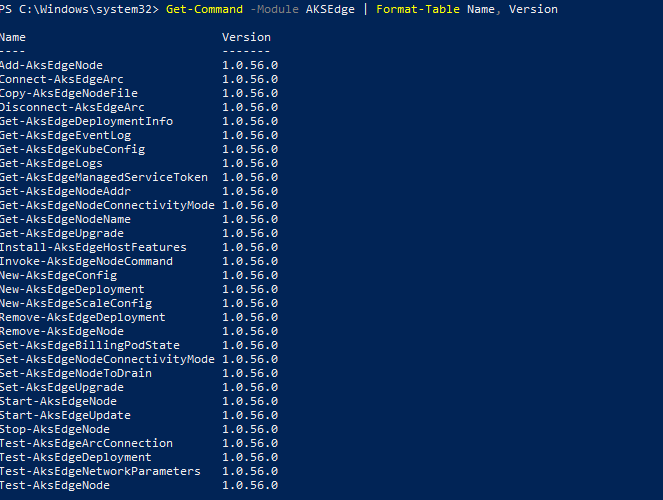
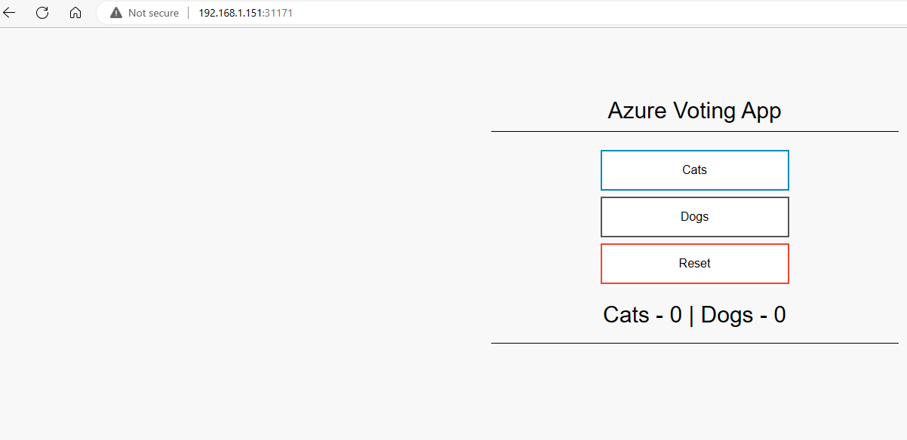

# Quickstart: deploy a sample AKS on Windows application

In this quickstart, you'll learn how to set up an Azure Kubernetes Service (AKS) host. You create an AKS single node cluster on a single machine, and deploy a sample containerized Linux application on this single-node cluster.

## Prerequisites

- **Hardware requirements**:

    > [!IMPORTANT]
    > The minimum setup required to run the latest version of AKS is a single machine with the following specs:

    | Specs | Requirement |
    | ---------- | --------- |
    | Memory | 4 GB at least 2 GB free (cluster-only), 8 GB (Arc and GitOps) |
    | CPU | 2 logical processors, clock speed at least 1.8 GHz |
    | Disk Space | At least 14 GB free |
    | Host OS | Windows 10/11 IoT Enterprise/Enterprise/Pro and Windows Server 2019 and 2022 |

    This machine is your primary machine.

- **OS requirements**: Install Windows 10/11 IoT Enterprise/Enterprise/Pro/Server on your machine and activate Windows. We recommend using the latest [version 21H2 (OS build 19044)](/windows/release-health/release-information). You can [download a version of Windows 10 here](https://www.microsoft.com/software-download/windows10) or Windows 11 [here](https://www.microsoft.com/software-download/windows11).

## Set up your primary machine

1. On your primary machine, navigate to the [GitHub releases](https://github.com/Azure/aks-edge-utils/releases) to download the **AksEdge-k3s(.msi)** or **AksEdge-k8s(.msi)** file, depending on which Kubernetes distribution you want to use.

 

2. In this quickstart, we'll use a sample Linux application that can be downloaded from [here](https://github.com/aks-edge-utils/tree/aksedge). In the upper right-hand corner of the main repo page, navigate to the "Code" tab and click on the green Code button to download the repository as a .zip

3. Extract the GitHub .zip file and move the MSI and all the other files into the extracted folder for convenience. This will be your working directory.

4. Before you install, make sure you've removed any existing AKS Edge clusters and have uninstalled any previous versions of AKS Edge. If you have uninstalled a previous version of AKS Edge, reboot your system before proceeding.

    

> [!NOTE]
> This release supports both k8s and k3s. We have provided two separate MSI installers for each Kubernetes distribution. Do not install both k8s and k3s at the same time. If you want to install a different Kubernetes distribution, uninstall the existing one first (i.e. if you have k3s installed, uninstall before installing k8s, and vice-versa).

5. Double-click the **AksEdge-<k8s** or **k3s>.msi** files to install the latest version.

6. Once installation is complete, go to your working directory and in the **bootstrap** folder, you'll find **AKSEdgePrompt.cmd**. Open this command window to make sure you have downloaded the proper modules for AKS Edge.

7. Make sure your install was successful by running the following command:

    ```powershell
    Get-Command -Module AksEdge
    ```

    You should see the output below with version showing v0.4.222.

    

    See the [AKS Edge PowerShell cmdlets](./reference/aks-edge-ps/index.md) for a full list of supported commands.

## Create a single-node Kubernetes cluster

Create a Kubernetes node(s) on your machine on a private network, making it easy to get a single machine cluster up and running.

1. Open an elevated PowerShell window or open AksEdgePrompt.cmd from your tools folder.

2. This quickstart uses the `New-AksEdgeDeployment` cmdlet, with the default set of parameters

   ```powershell
   #create a JSON file with default configuration
   $jsonString = New-AksEdgeDeploymentConfig -outFile .\mydeployconfig.json
   New-AksEdgeDeployment -JsonConfigFilePath .\mydeployconfig.json
   ```

   To get a full list of the parameters and their default values, run `Get-Help New-AksEdgeDeployment -full` in your PowerShell window.

3. Confirm that the installation was successful by running:

   ```powershell
   kubectl get nodes -o wide
   kubectl get pods -A -o wide
   ```

   

## Deploy a sample application

This example runs a sample Linux application based on [Microsoft's azure-vote-front image](https://github.com/microsoft/containerregistry). See the **linux-sample.yaml** file in the downloaded package for the deployment manifest. The YAML specifies a `nodeSelector` tagged for Linux. All sample code and the deployment manifest can be found under the **Samples** folder.

1. Deploy the application using the YAML manifest:

   ```bash
   kubectl apply -f linux-sample.yaml
   ```

2. Verify that sample pods are running. Wait a few minutes for the pods to be in the **running** state:

   ```bash
   kubectl get pods -o wide
   ```

   

3. Verify that your service is up

   > [!IMPORTANT]
   > This example deployed the Kubernetes cluster without specifying a `-ServiceIPRangeSize` parameter, so we have not allocated IPs for our workload services and you won't have an external IP address. In this case, find the IP address of your Linux VM (using the `Get-AksEdgeNodeAddr` cmdlet), then append the external port (for example, **192.168.1.12:31458**).

   ```bash
   kubectl get services
   ```

   

4. View your running Linux sample. To do so, open a web browser and navigate to the external IP of your application.

   

## Clean up resources

1. Delete the sample application:

   ```bash
   kubectl delete -f linux-sample.yaml
   ```

2. To remove your single machine cluster, run:

   ```powershell
   Remove-AksEdgeDeployment
   ```

> [!NOTE]
> If your single machine cluster doesn't clean up properly, run `hnsdiag list networks`, then delete any existing AKS Edge network objects using `hnsdiag delete networks <ID>`.
