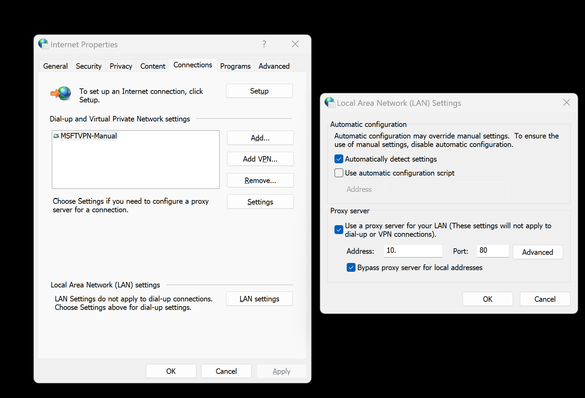

# AKS Edge Essentials troubleshoot common issues

This article describes how to find solutions for issues you encounter when using AKS Edge Essentials. Known issues and errors are organized by functional area. You can use the links provided in this article to find solutions and workarounds to resolve them.

## Deployment issues

1. Untrusted publisher issue:

Error: you see the message "Do you want to run software from this untrusted publisher? ....."

Workaround: Update your PowerShell execution policy to **RemoteSigned**:

```powershell
# Get the execution policy on the system
Get-ExecutionPolicy
# Set the execution policy for this process only
if ((Get-ExecutionPolicy) -ne "RemoteSigned") { Set-ExecutionPolicy -ExecutionPolicy RemoteSigned -Scope Process -Force }
```

## Azure Arc connectivity

1. Issues with `Disconnect-AksEdgeArc`:
    Issue: `Disconnect-AksEdgeArc` doesn't remove the pods from the cluster.

    Workaround: If the pods aren't cleaned up, run the following commands to manually clean up the existing Azure Arc related resources before trying to reconnect again.

    ```powershell
        kubectl delete ns azure-arc
        kubectl delete clusterrolebinding azure-arc-operator
        kubectl delete secret sh.helm.release.v1.azure-arc.v1
    ```
2. Azure Arc connectivity with a proxy setup:
    Issue: Azure Arc connectivity doesn't work in a proxy environment.
    Workaround: You can enable system-wide proxy settings by following **Internet options > Connections > LAN Settings**. 
    
    
