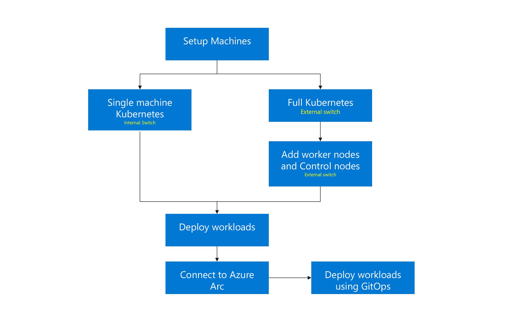

# Deployment options

After you set up your machines, AKS lite can be deployed in the following options:

- **Simple Deployment**: Runs Kubernetes nodes on a single machine to create a single machine cluster.
- **Full Deployment**: Lets you create a multi-node Kubernetes cluster and also enables you to scale out to more nodes as needed.

  
  
Once you've created your cluster, you can deploy your applications and connect your cluster to Arc to enable Arc extensions such as Azure Monitor and Azure Policy. You can also choose to use GitOps to manage your deployments.

## Next steps

- Try out the [Quickstart](aks-lite-quickstart.md)
- [Set up your machine](./aks-lite-howto-setup-machine.md)
