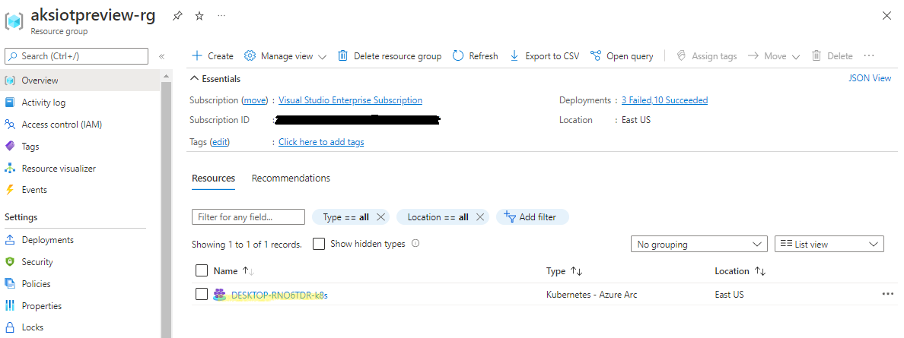
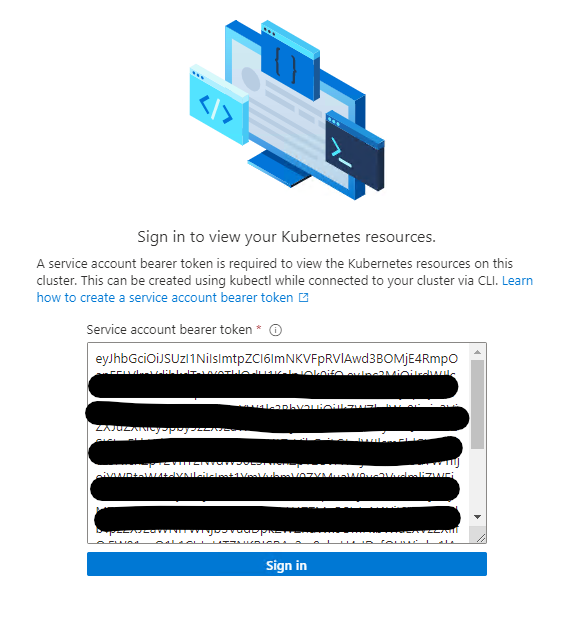

# Connect your AKS on Windows cluster to Arc

This section shows how to connect your AKS-IoT cluster to [Azure Arc](/azure/azure-arc/kubernetes/overview) so that you can monitor the health of your cluster on the Azure portal.

> [!IMPORTANT]
> If you do not have a cluster installed, create a [single node cluster](aks-lite-howto-single-node-deployment.md) and follow the steps to deploy.

You will need an Azure subscription and have either the "Owner" role or a combination of "Contributor" and "User Access Administrator" roles. You can check your access level by navigating to your subscription, selecting **Access control (IAM)** on the left-hand side of the Azure portal, and then selecting **View my access**. Read the [official Azure documentation](/azure/azure-resource-manager/management/manage-resource-groups-portal) for more information about managing resource groups.

Make sure to perform these steps on your primary machine.

> [!NOTE]
> If you want to use an existing service principal or you want to use PowerShell 7 with the new API to connect to Arc, [see the instructions here](/aks-lite-howto-more-configs.md).

## Step 1: Configure your Azure environment

In your **Bootstrap** folder (inside the Github respository folder downloaded as .zip and extracted), open **aide-userconfig.json** or **aksiot-userconfig.json** (in earlier released versions).

```cmd
notepad.exe aide-userconfig.json
```

or (in earlier released versions)

```cmd
notepad.exe aksiot-userconfig.json
```

In the parameters under `"Azure"`, enter the appropriate information:

```powershell
    "Azure": {
        "SubscriptionName":"Visual Studio Enterprise Subscription",
        "SubscriptionId": "",
        "TenantId":"",
        "ResourceGroupName": "aksiotpreview-rg",
        "ServicePrincipalName" : "aksiot-sp",
        "Location" : "EastUS",
        "ClusterName": "",
        "Auth": {
            "spId" : "",
            "password" : ""
        }
    }
```

> [!NOTE]
> If you want to use an existing service principal instead of creating a new one, specify your service principal ID and password under `"Auth"`. [Read more about configuring the JSON parameters here](/bootstrap/Modules/ArcForWinIoT/README.md).

Once the JSON has been edited and saved, run `Read-ArcIotUserConfig` to read the updated JSON configuration. You can verify the values using the `Get-ArcIotUserConfig` cmdlet. Alternatively, you can reopen **LaunchPrompt.cmd** to use the updated JSON configuration.

```powershell
Read-ArcIotUserConfig
Get-ArcIotUserConfig
```

> [!IMPORTANT]
> When you modify **aide-userconfig.json** (or **aksiot-userconfig.json**), run `Read-ArcIotUserConfig` to reload, or close and re-open **LaunchPrompt.cmd**.

| Attribute | Value type      |  Description |
| :------------ |:-----------|:--------|
|SubscriptionName | string | The name of your Azure subscription. You can find this on the Azure portal. The default is **Visual Studio Enterprise Subscription**. |
|ResourceGroupName | string | The name of the Azure resource group to host your Azure resources for AKS-IoT. AKS creates a new resource group with this name under your subscription. The default value is **aksiotpreview-rg**.|
|ServicePrincipalName | string | The name of the Azure service principal to use as credentials. AKS creates a new service principal with this name under your subscription. We will use this service principal to connect your cluster to Arc. The default value is **aksiot-sp**.|
|Location | string | The location in which to create your resource group. Leave this as **EastUS**. |
|ClusterName | string | The name of the cluster for the Arc connection. The default is **hostname-distribution** (abc-k8s or abc-k3s) |

## Step 2: Connect your cluster to Arc

> [!IMPORTANT]
> If you already have Azure CLI installed, run `az upgrade` to ensure your `azure-cli` and `extensions` are up-to-date.

```cmd
az upgrade
```

```json
{
  "azure-cli": "2.39.0",
  "azure-cli-core": "2.39.0",
  "extensions": {
    "connectedk8s": "1.3.1",
    "connectedmachine": "0.5.1",
    "customlocation": "0.1.3",
    "k8s-extension": "1.3.3"
  }
}
```

> [!NOTE]
> If you have already set up your subscription and have service principal credentials defined in the JSON file (**Azure.Auth.Spid** and **AzureAuth.password**), you can skip to step 3.

1. In your browser, sign in to the Azure portal.

2. Run `Initialize-ArcIot` and sign in to Azure if prompted. This installs Azure CLI (if not already installed), enables the required resource providers for your subscription, creates a resource group based on the name you specified to host the Azure resources, and creates a service principal based on the name you specified to use as credentials. The credentials are stored as **.xml** in the **$env:USERPROFILE\.arciot** directory.

    ```powershell
    Initialize-ArcIot
    ```

    > [!NOTE]
    > AKS uses your Azure credentials to create the resource group and service principal. The service principal is scoped to your resource group and AKS uses the service principal credentials to connect your cluster to Arc.

3. Run `Connect-ArcIotK8s` to connect the cluster to Arc. This command signs in using your service principal, enables the cluster-connect features to view your cluster's Kubernetes resources in Arc, and generates a bearer token **servicetoken.txt** in the **bootstrap** folder.

    ```powershell
    Connect-ArcIotK8s
    ```

    This step may take a while to complete, and PowerShell may be stuck on "Establishing Azure Connected Kubernetes for `your cluster name`," but if you navigate to your resource group on the Azure portal, you should see your cluster as a resource. When the PowerShell command is finished running, click on your cluster.

   

## Step 3: View cluster resources

1. On the left panel, click on the **Namespaces** blade under **Kubernetes resources (preview)**

    

2. To view your Kubernetes resources, you need a bearer token:

    

3. Go to your **servicetoken.txt** file, copy the full string, and paste it into Azure portal:

    

4. Now you can see resources on your cluster. The following image shows the **Workloads** blade, with the same name as `kubectl get pods --all-namespaces`

    

## Use GitOps with Arc-enabled Kubernetes

You can [explore how to use GitOps for remote deployment and continuous integration here](/docs/gitops.md).

## Arc extensions

You can [explore how to use Arc extensions such as Azure Monitor and Azure Policy here](/docs/arc-extensions.md).

## Disconnect from Arc

Run `Disconnect-ArcIotK8s` to disconnect your cluster from Azure Arc. For a complete clean-up, delete the service principal and resource group you created for this evaluation.

```powershell
Disconnect-ArcIotK8s
```

## Next steps

- Try other Arc-enabled services as described [here](aks-lite-howto-enable-arc-services.md)
- [Overview](aks-lite-overview.md)
- [Uninstall AKS cluster](aks-lite-howto-uninstall.md)
