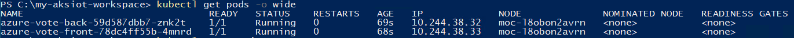

# Deploy an application

This article describes how to deploy a containerized application on your Kubernetes cluster.

## Prerequisites

- Set up your [single machine](aks-lite-howto-single-node-deployment.md) or [multi-machine](aks-lite-howto-multi-node-deployment.md) Kubernetes cluster.
- Package your application into a container image, and then upload the image to the Azure Container Registry. Review these steps to [create container image of your application](tutorial-kubernetes-prepare-application.md).
- Since AKS on Windows enables mixed-OS clusters, ensure your pods get scheduled on nodes with the corresponding OS. Add `nodeSelector` to your deployment files. This will tell Kubernetes to run your pods on nodes of a particular operating system (OS).

If your cluster is single-OS, then you can skip this step; but for best practice, label each deployment file with node selectors.

```yaml
nodeSelector:
    "kubernetes.io/os": linux
```

```yaml
nodeSelector:
    "kubernetes.io/os": windows
```

## Update the manifest file

Once you have the container image of your application, you can choose to store your container image in a container registry of your choice. In this guide, we use an Azure Container Registry (ACR) instance to store the container image for the [sample application][sample-application] as described [in this tutorial](tutorial-kubernetes-prepare-application.md). The sample application is a basic voting app consisting of a front-end web component and a back-end Redis instance. To deploy the application, you must update the image name in the Kubernetes manifest file to include the ACR login server name.

Get the ACR login server name using the [az acr list][az-acr-list] command as follows:

```azurecli
az acr list --resource-group myResourceGroup --query "[].{acrLoginServer:loginServer}" --output table
```

Provide your own ACR login server name so that your manifest file looks like the following example:

```yaml
containers:
- name: azure-vote-front
  image: <acrName>.azurecr.io/azure-vote-front:v1
```

Save and close the file.

## Deploy the application

To deploy your application, use the [kubectl apply][kubectl-apply] command. This command parses the manifest file and creates the defined Kubernetes objects. Specify the YAML manifest file, as shown in the following example:

```console
kubectl apply -f azure-vote-all-in-one-redis.yaml
```

Wait a few minutes for the pods to be in the **running** state.

```bash
kubectl get pods -o wide
```



## Test your application

To monitor progress, use the [kubectl get service][kubectl-get] command with the `--watch` argument.

```console
kubectl get service azure-vote-front --watch
```

Initially, the **EXTERNAL-IP** for the **azure-vote-front** service is shown as **pending**:

```output
azure-vote-front   LoadBalancer   10.0.34.242   <pending>     80:30676/TCP   5s
```

When the **EXTERNAL-IP** address changes from **pending** to an actual public IP address, use **CTRL-C** to stop the `kubectl` watch process. The following example output shows a valid public IP address assigned to the service:

```output
azure-vote-front   LoadBalancer   10.0.34.242   52.179.23.131   80:30676/TCP   67s
```

> [!IMPORTANT]
> If you deployed your Kubernetes cluster without specifying a `-ServiceIPRangeSize`, you will not have allocated IPs for your workload services and you won't have an external IP address. In this case, find the IP address of your Linux VM (`Get-AksIotLinuxNodeAddr`), then append the external port (for example, **192.168.1.12:31458**).

To see the application in action, open a web browser to the external IP address of your service:

:::image type="content" source="./media/azure-vote.png" alt-text="Screenshot showing the container image Azure Voting App running in an AKS cluster opened in a local web browser" lightbox="./media/azure-vote.png":::

If the application didn't load, it might be due to an authorization problem with your image registry. To view the status of your containers, use the `kubectl get pods` command. If the container images can't be pulled, see [Authenticate with Azure Container Registry from Azure Kubernetes Service](/azure/aks/cluster-container-registry-integration?bc=/azure/container-registry/breadcrumb/toc.json&toc=/azure/container-registry/toc.json).

## Next steps

- [Connect your cluster to Arc](aks-lite-howto-connect-to-arc.md)
- [Overview](aks-lite-overview.md)
- [Uninstall AKS cluster](aks-lite-howto-uninstall.md)

[sample-application]: https://github.com/Azure-Samples/azure-voting-app-redis
[kubectl-apply]: https://kubernetes.io/docs/reference/generated/kubectl/kubectl-commands#apply
[kubectl-get]: https://kubernetes.io/docs/reference/generated/kubectl/kubectl-commands#get
[az-acr-list]: /cli/azure/acr
