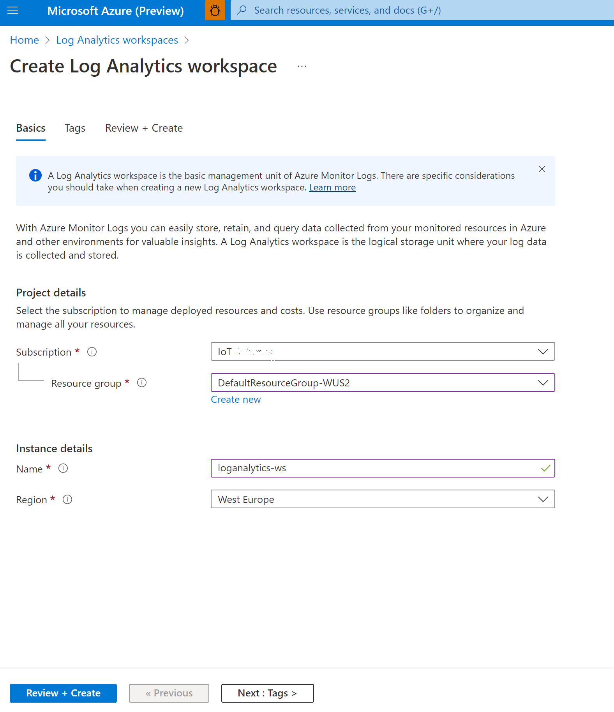

# Arc-enabled services on an AKS on Windows cluster

Now that you have an Arc-enabled with AKS cluster you can attach and configure Kubernetes clusters running anywhere. Through Azure Arc, you can access Azure services for on-premise Kubernetes deployments just like you would with AKS on Azure.

## Using Azure Monitor with Arc enabled AKS on Windows cluster

You can use [Azure Monitor Container Insights](/azure/azure-monitor/containers/container-insights-overview) to monitor the performance of your container workloads deployed on your AKS-IoT clusters. Container Insights provides you with insights into the performance of the controller, nodes, and containers using the Metrics API. For more information about Container Insights, see the [Container insights overview](/azure/azure-monitor/containers/container-insights-overview).

### Configure Azure Monitor

#### Step 1

Install Azure CLI extensions: connectedk8s (version >= 1.2.0) and k8s-extension (version >= 1.0.0). Install these Azure CLI extensions by running the following commands:

```azurecli
az extension add --name connectedk8s
az extension add --name k8s-extension
```

If the connectedk8s and k8s-extension extensions are already installed, you can update them to the latest version using the following command:

```azurecli
az extension update --name connectedk8s
az extension update --name k8s-extension
```

#### Step 2

Log Analytics workspace: Azure Monitor Container Insights supports a Log Analytics workspace in the regions listed under Azure [products by region](https://azure.microsoft.com/global-infrastructure/services/?regions=all&products=monitor) page. You can create your own workspace using [Azure Resource Manager](/azure/azure-monitor/logs/resource-manager-workspace), [PowerShell](/azure/azure-monitor/logs/powershell-workspace-configuration), or [the Azure portal](/azure/azure-monitor/logs/quick-create-workspace).

From the Azure portal, search for Log Analytics Workspaces and select **Create**. Provide your subscription details, resource group name, and Log Analytics workspace name.



#### Step 3

[Contributor](/azure/role-based-access-control/built-in-roles#contributor) role assignment on the Azure subscription containing the Azure Arc-enabled Kubernetes resource. If the Log Analytics workspace is in a different subscription, then [Log Analytics Contributor](/azure/azure-monitor/logs/manage-access#azure-rbac) role assignment is needed on the Log Analytics workspace.

To view the monitoring data, you must have [Log Analytics Reader](/azure/azure-monitor/logs/manage-access#azure-rbac) role assignment on the Log Analytics workspace.

The following endpoints need to be enabled for outbound access in addition to the ones mentioned under [connecting a Kubernetes cluster to Azure Arc](/azure/azure-arc/kubernetes/quickstart-connect-cluster#meet-network-requirements):

| Endpoint                     | Port |
| :--------------------------- | :--- |
| *.ods.opinsights.azure.com   | 443  |
| *.oms.opinsights.azure.com   | 443  |
| dc.services.visualstudio.com | 443  |
| *.monitoring.azure.com       | 443  |
| login.microsoftonline.com    | 443  |

If your Azure Arc-enabled Kubernetes resource is in Azure US Government environment, following endpoints need to be enabled for outbound access:

| Endpoint                     | Port |
| :--------------------------- | :--- |
| *.ods.opinsights.azure.us    | 443  |
| *.oms.opinsights.azure.us    | 443  |
| dc.services.visualstudio.com | 443  |

If you're using an Arc-enabled cluster on AKS, and previously installed [monitoring for AKS](/azure/azure-monitor/containers/container-insights-enable-existing-clusters), ensure that you have [disabled monitoring](/azure/azure-monitor/containers/container-insights-optout) before proceeding to avoid issues during the extension install.

If you had previously deployed Azure Monitor Container Insights on this cluster using script without cluster extensions, [follow the instructions here](/azure/azure-monitor/containers/container-insights-optout-hybrid) to delete this Helm chart. You can then continue to creating a cluster extension instance for Azure Monitor Container Insights.

#### Step 4

Create an extension instance using the portal:

1. In the Azure portal, select the Azure Arc-enabled AKS-IoT cluster that you want to monitor.
2. Select the **Insights** item under the **Monitoring** section of the resource blade.
3. On the onboarding page, select **Configure Azure Monitor**.
4. You can now choose the [Log Analytics workspace](/azure/azure-monitor/logs/quick-create-workspace) you previously created, to send your metrics and logs data to.
5. Select **Configure** to deploy the Azure Monitor Container Insights cluster extension.


#### Step 5

You can check the status of installation using the Azure portal or CLI. Successful installations should show the status as **Installed**. If your status is showing **Failed** or remains in the **Pending** state for a long time, proceed to the [Troubleshooting section](/azure/azure-monitor/containers/container-insights-enable-arc-enabled-clusters?toc=%2Fazure%2Fazure-arc%2Fkubernetes%2Ftoc.json&bc=%2Fazure%2Fazure-arc%2Fkubernetes%2Fbreadcrumb%2Ftoc.json#troubleshooting).

#### Using the Azure portal

1. In the Azure portal, select the AKS-IoT cluster on which the extension was installed.
2. Select the **Extensions** item under the **Settings** section of the resource blade.
3. You should see an extension with the name **azuremonitor-containers** listed, with the listed status in the **Install status** column.


#### Using Azure CLI

Run the following command to show the latest status of the **Microsoft.AzureMonitor.Containers** extension:

```bash
az k8s-extension show --name azuremonitor-containers --cluster-name <cluster-name> --resource-group <resource-group> --cluster-type connectedClusters -n azuremonitor-containers
```

### View Azure Monitor

Once the extension is installed, Container insights delivers a comprehensive monitoring experience to understand the performance and health of your Kubernetes cluster and container workloads.

You can now view the resource usage of your AKS-IoT cluster under **Monitoring  --> Insights.**


You can [read more about Container Insights features and troubleshooting here](/azure/azure-monitor/containers/container-insights-overview).

### Configure Prometheus metrics scraping

You can configure your Kubernetes cluster to allow Prometheus metrics scraping, which you can then view and query through Azure Monitor.

To configure Prometheus metrics scraping, open PowerShell and navigate to the samples folder by entering `cd <path to samples folder>\others`. From there, run the following command:

```powershell
kubectl apply -f containers-azm-ms-agentconfig.yaml
```

Once the config map is applied, you are can view Prometheus metrics in Azure Monitor. These are some resources that show you how to query Prometheus data in Azure Monitor:

- [Query Prometheus metrics data](/azure/azure-monitor/containers/container-insights-log-query#query-prometheus-metrics-data)
- [Query configuration or scraping errors](/azure/azure-monitor/containers/container-insights-log-query#query-prometheus-metrics-data)
- [Review Prometheus data usage](/azure/azure-monitor/containers/container-insights-log-query#query-prometheus-metrics-data)

### Delete Azure Monitor extension

The following command only deletes the extension instance, but doesn't delete the Log Analytics workspace. The data within the Log Analytics resource is left intact:

```azurecli
az k8s-extension delete --name azuremonitor-containers --cluster-type connectedClusters --cluster-name <cluster-name> --resource-group <resource-group>
```

## Using Azure Policy with AKS-IoT

[Azure Policy for Kubernetes](/azure/governance/policy/concepts/policy-for-kubernetes) makes it possible to manage and report on the compliance state of your Kubernetes clusters from one place.

The following steps show how to enable Azure Policy on an AKS-IoT cluster, apply a sample policy, and review its compliance status with respect to the cluster.

### Configure Azure Policy

#### Step 1: Check open ports

Open ports for the Azure Policy extension. The Azure Policy extension uses these domains and ports to fetch policy definitions and assignments, and to report compliance of the cluster back to Azure Policy:

| Domain                        | Port |
| :---------------------------- | :--- |
| data.policy.core.windows.net  | 443  |
| store.policy.core.windows.net | 443  |
| login.windows.net             | 443  |
| dc.services.visualstudio.com  | 443  |

#### Step 2: Enable PolicyInsights resource provider

Before installing the Azure Policy extension or enabling any of the service features, your subscription must enable the **Microsoft.PolicyInsights** resource providers. To enable the resource provider, follow the steps in [Resource providers and types](/azure/azure-resource-manager/management/resource-providers-and-types#azure-portal) or run either the Azure CLI or Azure PowerShell command:

```azurecli
# Log in first with az login if you're not using Cloud Shell
# Provider register: Register the Azure Policy provider
az provider register --namespace 'Microsoft.PolicyInsights'
```

```powershell
# Log in first with Connect-AzAccount if you're not using Cloud Shell

# Provider register: Register the Azure Policy provider
Register-AzResourceProvider -ProviderNamespace 'Microsoft.PolicyInsights'
```

#### Step3: Create an extension

To create an extension instance, for your Arc-enabled cluster, run the following command. Substitute the placeholders with your values:

```azurecli
az k8s-extension create --cluster-type connectedClusters --cluster-name <CLUSTER_NAME> --resource-group <RESOURCE_GROUP> --extension-type Microsoft.PolicyInsights --name <EXTENSION_INSTANCE_NAME>
```

Sample output:

```json
{
  "aksAssignedIdentity": null,
  "autoUpgradeMinorVersion": true,
  "configurationProtectedSettings": {},
  "configurationSettings": {},
  "customLocationSettings": null,
  "errorInfo": null,
  "extensionType": "microsoft.policyinsights",
  "id": "/subscriptions/10ed8b/resourceGroups/aksiotpreview-rg/providers/Microsoft.Kubernetes/connectedClusters/KS523FB-k8s/providers/Microsoft.KubernetesConfiguration/extensions/azurepolicy",
  "identity": {
    "principalId": "4****-*****-*****7",
    "tenantId": null,
    "type": "SystemAssigned"
  },
  "name": "azurepolicy",
  "packageUri": null,
  "provisioningState": "Succeeded",
  "releaseTrain": "Stable",
  "resourceGroup": "r-aksiotpreview-rg",
  "scope": {
    "cluster": {
      "releaseNamespace": "kube-system"
    },
    "namespace": null
  },
  "statuses": [],
  "systemData": {
    "createdAt": "2022-07-19T19:00:41.912109+00:00",
    "createdBy": null,
    "createdByType": null,
    "lastModifiedAt": "2022-07-19T19:00:41.912109+00:00",
    "lastModifiedBy": null,
    "lastModifiedByType": null
  },
  "type": "Microsoft.KubernetesConfiguration/extensions",
  "version": "1.1.0"
}
```

#### Step 4: Check the extension

To check that the extension instance creation was successful, and to inspect extension metadata, run the following command. Substitute the placeholders with your values:

```azurecli
az k8s-extension show --cluster-type connectedClusters --cluster-name <CLUSTER_NAME> --resource-group <RESOURCE_GROUP> --name <EXTENSION_INSTANCE_NAME>
```

To validate that the extension installation was successful and that the azure-policy and gatekeeper pods are running, run the following command:

```powershell
# azure-policy pod is installed in kube-system namespace
kubectl get pods -n kube-system

# gatekeeper pod is installed in gatekeeper-system namespace
kubectl get pods -n gatekeeper-system
```

### Assign a policy definition

To assign a policy definition to your Kubernetes cluster, you must be assigned the appropriate Azure role-based access control (Azure RBAC) policy assignment operations. The Azure built-in roles **Resource Policy Contributor** and **Owner** have these operations. To learn more, see [Azure RBAC permissions in Azure Policy](/azure/governance/policy/overview#azure-rbac-permissions-in-azure-policy).

Find the built-in policy definitions for managing your cluster using the Azure portal with the following steps. If using a custom policy definition, search for it by name or the category that you created it with:

1. Start the Azure Policy service in the Azure portal. Select **All services** in the left pane, and then search for and select **Policy**.

2. In the left pane of the Azure Policy page, select **Definitions**.

3. From the **Category** drop-down, use **Select all** to clear the filter and then select **Kubernetes**.

4. Select the policy definition, then select **Assign**:

   
   
5. Set the **Scope** to the management group, subscription, or resource group of the Kubernetes cluster where the policy assignment applies. When assigning Azure Policy for the Kubernetes definition, the **Scope** must include the cluster resource.

6. Give the policy assignment a name and description that you can use to identify it.

7. Set the policy enforcement to one of the following values:

   - Enabled: Enforce the policy on the cluster. Kubernetes admission requests with violations are denied.
   - Disabled: Don't enforce the policy on the cluster. Kubernetes admission requests with violations aren't denied. Compliance assessment results are still available. When rolling out new policy definitions to running clusters, the **Disabled** option is helpful for testing the policy definition as admission requests with violations aren't denied.

8. Select **Next**.

9. Set parameter values:

   - To exclude Kubernetes namespaces from policy evaluation, specify the list of namespaces in parameter namespace exclusions. It's recommended to exclude: `kube-system`, `gatekeeper-system`, and `azure-arc`.

10. Select **Review + create**.

   

### Policy evaluation

The add-on checks in with the Azure Policy service for changes in policy assignments every 15 minutes. These changes trigger creates, updates, or deletes of the constraint templates and constraints.

You can view the compliance state of your policy on the Azure portal. Select your AKS-IoT cluster, then select **Settings > Policies** and select **Go to Azure Policy**. Here you can filter by scope to view the status of the policy assigned to your cluster.

You can [read more about using Azure Policy on Arc-enabled Kubernetes here](/azure/governance/policy/concepts/policy-for-kubernetes?toc=/azure/azure-arc/kubernetes/toc.json&bc=/azure/azure-arc/kubernetes/breadcrumb/toc.json#install-azure-policy-extension-for-azure-arc-enabled-kubernetes).


### Delete Azure Policy

To delete the extension instance, run the following command. Substitute the placeholders with your values:

```azurecli
az k8s-extension delete --cluster-type connectedClusters --cluster-name <CLUSTER_NAME> --resource-group <RESOURCE_GROUP> --name <EXTENSION_INSTANCE_NAME>
```

## Next steps

- [Overview](aks-lite-overview.md)
- [Uninstall AKS cluster](aks-lite-howto-uninstall.md)
