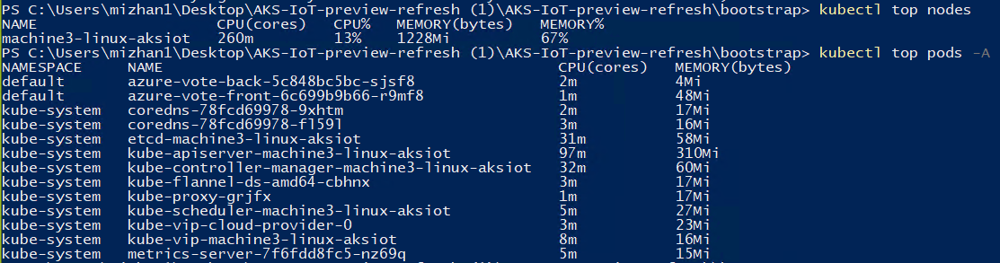

# Metrics server on an AKS on Windows cluster

The [metrics server](https://github.com/kubernetes-sigs/metrics-server) is a popular tool to inspect your containers' resource consumption.

## Deploy metrics server

### Step 1: Deploy the metrics server manifest

```bash
kubectl apply -f metrics-server.yaml
```

Wait for the metrics server pods to reach `running` status. It could take a few minutes.

```bash
kubectl get pods -A
```


#### Step 2: Check out your resource consumption

```powershell
kubectl top nodes
```

```powershell
kubectl top pods -A
```



If your metrics server fails to come up, you may have run into an MTU issue in which the Linux VM's MTU doesn't match that of your network. We see this frequently on Azure VMs. Run `Invoke-AksIotLinuxVmCommand "sudo ip link set dev eth0 mtu 1300"`.

## Next steps
- [Overview](aks-lite-overview.md)
- [Uninstall AKS cluster](aks-lite-howto-uninstall.md)
