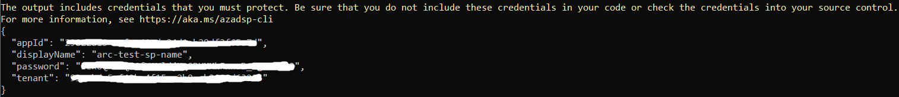
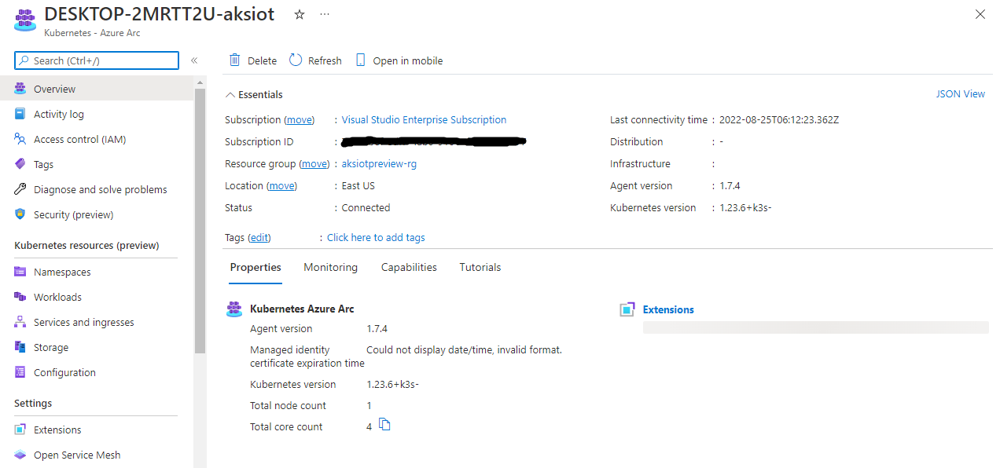

# Additional configuration For AKS lite

This article contains instructions to:

1. [Install a default **StorageClass** in AKS-IoT](#install-a-default-storageclass-in-aks-lite).
2. [Configure a proxy using a temporary workaround](#configuring-a-proxy).
3. [Connect to Arc using PowerShell 7 and the new API](#connect-to-arc-using-powershell-7-and-new-api).

## Install a default **StorageClass** in AKS lite

1. Find the local-storage **StorageClass** using the default YAML from the [Kubernetes documentation](https://kubernetes.io/docs/concepts/storage/storage-classes/#local). Edit the YAML file to [mark the **StorageClass** as the default](https://kubernetes.io/docs/tasks/administer-cluster/change-default-storage-class/):

    ```yaml
    apiVersion: storage.k8s.io/v1
    kind: StorageClass
    metadata:
    name: local-storage
    annotations:
        storageclass.kubernetes.io/is-default-class: "true"
    provisioner: kubernetes.io/no-provisioner
    volumeBindingMode: WaitForFirstConsumer
    ```

2. Check that this **StorageClass** was created: `kubectl get sc`. It should say **local-storage (default)**.

3. Make sure your PVs reference the local-storage **StorageClass**. For example, `spec.storageClassName: local-storage`.

## Configuring a proxy

The following series of steps is a temporary workaround. We are working on exposing proxy settings as a feature of AKS-IoT.

In short, the environment variables `HTTP_PROXY`, `HTTPS_PROXY`, `NO_PROXY` are used to drive proxy settings. This article covers places to make modifications to ensure the environment variables are set consistently.

> [!NOTE]
> Make sure to include the pod network in the list of addresses in `NO_PROXY` to ensure pods can properly communicate with one another over the private pod network.

Use `LaunchPrompt.cmd` to open an elevated PS window and run `mars` to get an interactive console into the Linux VM.

### Add HTTP_PROXY, HTTPS_PROXY, NO_PROXY values to environment

Since this configuration is set in environment variables, it's important to make sure this is consistent on the machine. Add the following settings to `/etc/environment` and `/etc/profile`:

```bash
# /etc/environment sample
# No spaces, parsed by pam_env.so not a shell.
HTTP_PROXY="http://127.0.0.1:8080"
```

```bash
# /etc/profile sample
export HTTP_PROXY=http://127.0.0.1:8080
```

### Add HTTP_PROXY and other values to container service

Make sure that these environment variables are also set for the container service configuration. The last private preview shipped with docker and containerd inbox, so both services need to be updated. This can be done via a systemd drop-in.

1. Add the following directory: **/etc/systemd/system/containerd.service.d**. Ensure you have the **chmod 0755** mode of access.
2. In the directory, create a file named **override.conf** with the proxy environment variables set:

    ```bash
    [Service]
    Environment="HTTP_PROXY=http://127.0.0.1:8080"
    ...
    ```

    Consider having the override.conf files use **chmod 0644**.

3. After patching the files, reload the services:

    ```bash
    systemctl daemon-reload
    systemctl restart containerd
    ```

    `systemctl status containerd` indicates whether the drop-ins were imported correctly.

### Re-initialize the cluster

Now that the environment variables for the HTTP proxy are set consistently, run the following commands to tear down and reinitialize the cluster.

1. Reset the node using:

   ```bash
   /var/.eflow/config/kXs/lifecycle-mgmt.sh -r -d k8s -c 192.168.0.2
   ```

   `192.168.0.2` is the control plane endpoint, which should match the `-ControlPlaneEndpoint` parameter passed into `New-AksIotSingleNodeCluster` or `New-AksIotCluster` (defaults to the IP address assigned to the VM's eth0).

2. Re-initialize the node using:

   ```bash
   /var/.eflow/config/kXs/lifecycle-mgmt.sh -i -d k8s -c 192.168.0.2 -n flannel
   ```

    `192.168.0.2` is the control plane endpoint which should match the control plane endpoint passed into the AKS-Iot PowerShell frontend. `flannel` is the default CNI selected and should match the `-NetworkPlugin` parameter passed into `New-AksIotSingleNodeCluster` or `New-AksIotCluster`.

## Connect to Arc Using Powershell 7 and New API

### Step 1: Install dependencies

First, install [PowerShell 7+](/powershell/scripting/install/installing-powershell-on-windows).

If you do not have chocolatey installed, open PowerShell as administrator and run:

```powershell
Set-ExecutionPolicy Bypass -Scope Process -Force; [System.Net.ServicePointManager]::SecurityProtocol = [System.Net.ServicePointManager]::SecurityProtocol -bor 3072; iex ((New-Object System.Net.WebClient).DownloadString('https://community.chocolatey.org/install.ps1'))
```

Next, run the following commands as admin to install the dependencies in PowerShell:

```powershell
Install-Module Az.Resources -Repository PSGallery -Force -AllowClobber -ErrorAction Stop  
Install-Module Az.Accounts -Repository PSGallery -Force -AllowClobber -ErrorAction Stop 
Install-Module Az.connectedKubernetes -Repository PSGallery -Force -AllowClobber -ErrorAction Stop  
```

> [!NOTE]
> For connecting to Arc, you must install a helm version that is greater than v3.0 but less than v3.7. This example uses v3.6.3.

```powershell
choco install kubernetes-helm --version=3.6.3  
```

### Step 2: Configure your Azure environment

Open the **aksiot-userconfig.json** file (default location is **C:\Program Files\AksIot**). Enter the information for the following parameters in order to connect to Arc. You must have created a resource group and service principal. Once the information is filled out, save the JSON and close the file.

| Attribute | Value type      |  Description |
| :------------ |:-----------|:--------|
|Connect | bool | When set to **true**, AKS connects your cluster to Arc, and if set to **false**, disconnects your cluster from Arc. |
|Location | string | The location in which to create your resource group. It's recommended that you use `EastUS`. |
|ResourceGroupName | string | Name of the Azure resource group to host your Azure resources for AKS-IoT. Create a resource group and enter the name here. |
|SubscriptionId | string | The ID of your Azure subscription. You can find this value on the Azure portal when you select your subscription. |
|TenantId | string | Your tenant ID. You can find this value on the Azure portal when you go to **Azure Active Directory**. |

#### Create a service principal

A service principal is a prerequisite to connecting your cluster to Arc. If you already have a service principal, skip to [Create a PSCredential Object with Service Principal](#create-a-pscredential-object-with-service-principal).

In order to create a service principal, run the following command in PowerShell, replacing the subscription ID and resource group name with your own:

```powershell
az ad sp create-for-RBAC --name "arc-test-sp-name" --scope /subscriptions/<YOUR SUBSCRIPTION ID>/resourceGroups/<YOUR RESOURCE GROUP NAME> --role owner
```

When completed, it will give you the appId and password of the service principal.



#### Create a PSCredential object with service principal

Now create a **PSCredential** object to make it easier for you to connect to Arc:

```powershell
$username = "<appId of service principal>"
$password ="<password of service principal>"
$password = ConvertTo-SecureString $password -AsPlainText -Force
$credential = New-Object System.Management.Automation.PSCredential($username, $password)
```

### Step 3: Connect your cluster to Arc

> [!IMPORTANT]
> If you already have Azure CLI installed, run `az upgrade` to ensure your `azure-cli` and `extensions` are up-to-date.


1. In your browser, sign in to the Azure portal with your credentials.
2. Run the following command to use your JSON configuration and the credential for the service principal you created earlier to connect your cluster to Arc:

    ```powershell
    Set-AksIotArcConnection -credential $credential
    ```

3. This step may take a while. When the powershell command is finished running, navigate to your resource group in the Azure portal and select your cluster. You should see its status as **Connected**.

    

### Step 4: View cluster resources

1. On the left panel, select the **Namespaces** blade under **Kubernetes resources (preview)**.

    

2. To view your Kubernetes resources, you need a bearer token.

    

3. In your PowerShell window, run `Get-AksIotManagedServiceToken`, copy the full string, and paste it into the Azure portal.

    

4. Now you can view resources on your cluster. The following image shows the **Workloads** blade, showing the same as `kubectl get pods --all-namespaces`:

    

### Disconnect from Arc

Run the following command to disconnect your cluster from Azure Arc:

```powershell
Set-AksIotArcConnection -connect $false -credential $credential
```

For a complete clean-up, delete the service principal and resource group you created for this evaluation.

## Next steps

- Deploy your application (./aks-lite-howto-deploy-app.md)
- [Overview](aks-lite-overview.md)
- [Uninstall AKS cluster](aks-lite-howto-uninstall.md)
