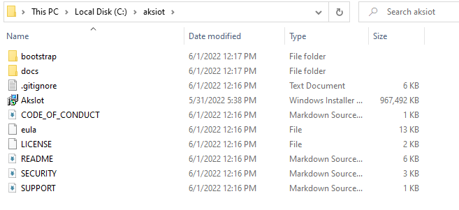

# Multi-machine deployments

The AKS cluster can be configured to run on multiple machines to support a distributed microservices architecture. Unlike other AKS products, such as AKS in the cloud or AKS on HCI on prem that have multi VM, AKS for light edge is intended for static configurations and does not enable dynamic VM creation/deletion or cluster lifecycle management. AKS for light edge has only one Linux VM per each machine, along with a Windows VM if needed, each with a static allocation of RAM, storage, and physical CPU cores assigned at install time. In a multi-node deployment, one of the machines is the primary machine with Kubernetes control node, and the other machines will be secondary machines with the worker nodes. In this deployment option, we will configure the K8S cluster using an external switch. With this you can run `kubectl` from another machine on your network, evaluate your workload performance on an external switch, etc.  

## Prerequisites

- Set up your primary and secondary machines as described in the [Setup page](aks-lite-howto-setup-machine.md).

## Understand your network configuration

Refer to the following network chart to configure your environment. You will need to allocate free IP addresses from your network for the `Control Plane`, `Kubernetes services`, and `Nodes (VMs)`. Read the [AKS-IoT Networking](/aks-lite-concept.md) section for more details.

| Attribute | Value type      |  Description |
| :------------ |:-----------|:--------|
| WorkloadType | `Linux` | `Linux` creates the Linux VM to host the control plane components and act as a worker. Read more about [AKS-IoT workload types](/aks-lite-concept.md) |
| VswitchName | `string` | Name of the external switch used for AKS-IoT. You can create one using Hyper-V manager yourself. If you specify a switch name that does not exist, AKS-IoT will create one for you |
| NetworkPlugin | `calico` or `flannel` | Name of the Kubernetes network plugin. Defaults to  `flannel`. |
| ControlPlaneEndpointIp | `A.B.C.x` | This needs to be a free IP address on your subnet `A.B.C`. The control plane (API server) will get this address |
| ServiceIPRangeStart | `A.B.C.x` | Reserved IP start address for your Kubernetes services. This IP range needs to be free on your subnet `A.B.C` |
| ServiceIPRangeEnd | `A.B.C.x` | Reserved IP start address for your Kubernetes services. This IP range needs to be free on your subnet `A.B.C`  |
| Ip4PrefixLength | `number` | The IP address subnet `A.B.C` prefix length. For example, use `24` if your network is `192.168.1.0/24` |
| Ip4GatewayAddress | `A.B.C.1` | Gateway address - typically the router address|
| DnsServers | `A.B.C.1` | IP address of your DNS (typically the router address). See what DNS your machine uses: `ipconfig /all \| findstr /R "DNS\ Servers"` |
| LinuxVmIp4Address | `A.B.C.x` | Specify the IP address your Linux VM will take|

## Deploy the control plane on the primary machine with an external switch

For example: local network is 192.168.1.0/24. 1.151 and above are outside of the DHCP scope, and therefore are guaranteed to be free.

Create an external switch named `aksiotswitch` in Hyper-V manager. Then run:

```powershell
New-AksIotDeployment `
  -WorkloadType Linux `
  -NetworkPlugin flannel `
  -VswitchName aksiotswitch `
  -Ip4PrefixLength 24 `
  -Ip4GatewayAddress 192.168.1.1 `
  -DnsServers 192.168.1.1 `
  -ControlPlaneEndpointIp 192.168.1.151 `
  -ServiceIPRangeStart 192.168.1.152 `
  -ServiceIPRangeEnd 192.168.1.160 `
  -LinuxVmIp4Address 192.168.1.161
```

> [!NOTE]
> In this release, `New-AksIotDeployment` will automatically get the kube config file and override the old one.

Alternatively, specify all your networking configuration in `aksiot-userconfig.json`, then run `New-AksIotDeployment -JsonConfigFilePath <PATH TO YOUR JSON>`.

The default `aksiot-userconfig.json` is in `C:\Program Files\AksIot`.

```json
"DeployOptions": {
        "ClusterJoinToken": "",
        "ControlPlane": false,
        "DiscoveryTokenHash": "",
        "Headless": false,
        "JoinCluster": false,
        "NetworkPlugin": "flannel",
        "SingleMachineCluster": false,
        "TimeoutSeconds": 300,
        "WorkloadType": "Linux"
    },
    "EndUser": {
        "AcceptEula": "query"
    },
    "LinuxVm": {
        "CpuCount": "",
        "MemoryInMB": "",
        "DataSizeInGB": "",
        "Ip4Address": "192.168.1.161"
    },
    "WindowsVm": {
        "CpuCount": "",
        "MemoryInMB": "",
        "Ip4Address": ""
    },
    "Network": {
        "VSwitchName": "lightedgeexternalswitch",
        "ControlPlaneEndpointIp": "192.168.1.151",
        "ControlPlaneEndpointPort": "",
        "DnsServers": ["192.168.1.1"],
        "Ip4GatewayAddress": "192.168.1.1",
        "Ip4PrefixLength": "24",
        "ServiceIPRangeSize": "",
        "ServiceIPRangeStart": "192.168.1.152",
        "ServiceIPRangeEnd": "192.168.1.160",
        "SkipAddressFreeCheck": true
    }
```

## Confirm that the installation was successful

```powershell
kubectl get nodes -o wide
kubectl get pods --all-namespaces -o wide
```


## Deploy secondary machines

Prep the secondary machines (these are machines that you will scale to). Connect them to the same network, then execute these steps on each of your secondary machines.

> [!TIP]
> In step 4, make sure to add the `-Node` flag to set up secondary machines.

1. On your secondary machine, download the **Source code (zip)** from the [GitHub releases page](https://github.com/Azure/AKS-IoT-preview/releases). Navigate to **bootstrap** and you should see the bootstrap scripts.
2. Retrieve the latest preview build from the releases page. It should look like `aks-lite-ps-*.zip`
3. Move the bootstrap and the preview build zip into a workspace folder for easy access. Your workspace folder should look like this:

4. Double click on **LaunchPrompt.cmd** to start the LaunchPrompt. This will bring up an admin PowerShell window. The first time you run the `LaunchPrompt.cmd` you will be missing items and see a lot of red.
5. Run `New-AksIoTPC -Node`. This will enable Hyper-V, set up policy and remote access settings. 
6. Restart your PC to install Hyper-V. Then run `New-AksIoTPC -Node` again to continue the bootstrap.
7. Open `LaunchPrompt.cmd` again and it should all be green except for `AksIot Module`. You do not need `AksIot Module` for secondary machines.


## Next steps

- You can now [deploy your application](aks-lite-howto-deploy-app.md).
- [Overview](aks-lite-overview.md)
- [Uninstall AKS cluster](aks-lite-howto-uninstall.md)
