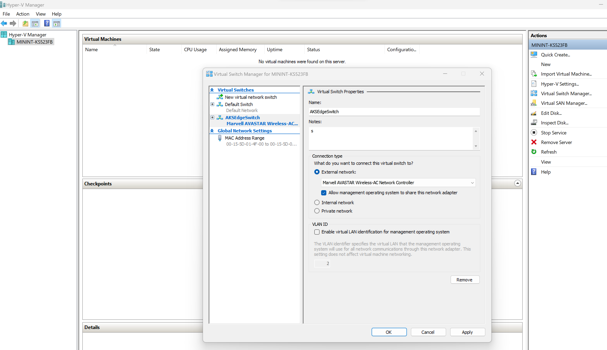
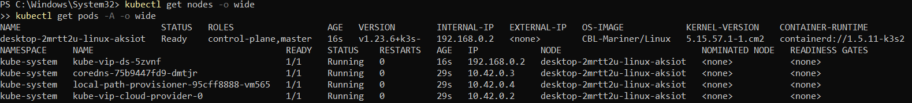

# Full Kubernetes deployments in AKS Edge Essentials

The AKS cluster can be configured to run on multiple machines to support a distributed microservices architecture. Unlike other AKS products, such as AKS in the cloud or AKS on HCI on premises that have multiple VMs, AKS Edge Essentials is intended for static configurations and does not enable dynamic VM creation/deletion or cluster lifecycle management. AKS Edge Essentials has only one Linux VM per each machine, along with a Windows VM if needed, each with a static allocation of RAM, storage, and physical CPU cores assigned at install time. In a multi-node deployment, one of the machines is the primary machine with Kubernetes control node, and the other machines will be secondary machines with the worker nodes. In this deployment scenario, we will configure the K8S cluster using an external switch. With this configuration you can run `kubectl` from another machine on your network, evaluate your workload performance on an external switch, etc.  

## Prerequisites

Set up your primary and secondary machines as described in the [setup article](aks-lite-howto-setup-machine.md).

## Understand your network configuration

Refer to the following network chart to configure your environment. You must allocate free IP addresses from your network for the **Control Plane**, **Kubernetes services**, and **Nodes (VMs)**. Read the [AKS Edge Essentials Networking](/aks-lite-concept.md) overview for more details.

| Attribute | Value type      |  Description |
| :------------ |:-----------|:--------|
| NodeType | Linux | Creates the Linux VM to host the control plane components and act as a worker. Read more about [AKS Edge Essentials node types](/aks-lite-concept.md). |
| VswitchName | string | Name of the external switch used for AKS Edge Essentials. You can create one yourself using Hyper-V manager. If you specify a switch name that does not exist, AKS Edge Essentials creates one for you. |
| NetworkPlugin | calico or flannel | Name of the Kubernetes network plugin. Defaults to **flannel**. |
| ControlPlaneEndpointIp | A.B.C.x | A free IP address on your subnet **A.B.C**. The control plane (API server) will get this address. |
| ServiceIPRangeStart | A.B.C.x | Reserved IP start address for your Kubernetes services. This IP range must be free on your subnet **A.B.C**. |
| ServiceIPRangeEnd | A.B.C.x | Reserved IP start address for your Kubernetes services. This IP range must be free on your subnet **A.B.C**.  |
| Ip4PrefixLength | number | The IP address subnet **A.B.C** prefix length. For example, use **24** if your network is **192.168.1.0/24**. |
| Ip4GatewayAddress | A.B.C.1 | Gateway address; typically the router address. |
| DnsServers | A.B.C.1 | IP address of your DNS (typically the router address). To view what DNS your machine uses: **ipconfig /all \| findstr /R "DNS\ Servers"** |
| LinuxVmIp4Address | A.B.C.x | Specify the IP address your Linux VM will take. |

For example: local network is 192.168.1.0/24. 1.151 and above are outside of the DHCP scope, and therefore are guaranteed to be free.

You can use the **TestFreeIps.ps1** that is included in the [GitHub repo](https://github.com/Azure/aks-edge-utils/tree/main/tools) to view IPs that are currently in use and you can avoid using those IP addresses in your configuration.
## Deploy the control plane on the primary machine with an external switch

A full deployment uses an external switch to enable communication across the nodes. You can choose to specify the vswitch details in your configs JSON, if you've already created one on your Hyper-V. If you do not create an external switch in Hyper-V manager and run the deployment command below, AKS edge will automatically create an external switch named `aksiotsw-ext` and use that for your deployment.
> [**!NOTE**]
> In this release, there is a known issue with automatic creation of external switch with the `New-AksEdgeDeployment` command if you are using a Wi-fi adapter for the switch. In this case, first create the external switch using the Hyper-V manager - Virtual Switch Manager and map the switch to the Wi-fi adapter and then provide the switch details in your configuration JSON as described below.


Before you create your deployment, you need to create a JSON file with all the configuration parameters. You can create a sampled configuration file using the `New-AksEdgeConfig` command.

```powershell
$jsonString = New-AksEdgeConfig .\mydeployconfig.json
```
You can now update your configuration file `mydeployconfig.json` with the right set of values. Some of the sample values are as shown below:

```json
"DeployOptions": {
    "NetworkPlugin": "flannel",
    "SingleMachineCluster": false,
    "TimeoutSeconds": 300,
    "NodeType": "Linux"
},
"EndUser": {
    "AcceptEula": false,
    "AcceptOptionalTelemetry": false
},
"LinuxVm": {
    "CpuCount": 4,
    "MemoryInMB": 4096,
    "DataSizeinGB": 20,
    "Ip4Address": "192.168.1.171"
},
"Network": {
    "VSwitch":{
        "Name": "aksiotsw-ext",
        "Type":"External",
        "AdapterName" : "Ethernet"
    },
    "ControlPlaneEndpointIp": "192.168.1.191",
    "Ip4GatewayAddress": "192.168.1.1",
    "Ip4PrefixLength": 24,
    "ServiceIPRangeStart": "192.168.1.151",
    "ServiceIPRangeEnd": "192.168.1.170",
    "DnsServers": ["192.168.1.1"]
}
```
Please note to provide the right values for the IP address related configuration parameters. After you update the config json and run the following command to validate your network parameters using the `Test-AksEdgeNetworkParameters` cmdlet.

```powershell
Test-AksEdgeNetworkParameters -JsonConfigFilePath .\mydeployconfig.json
```

If `Test-AksEdgeNetworkParameters` returns true, you are ready to create your deployment. You can create your deployment using the `New-AksEdgeDeployment` cmdlet:

```powershell
New-AksEdgeDeployment -JsonConfigFilePath .\mydeployconfig.json
```

> [!NOTE]
> In this release, `New-AksEdgeDeployment` automatically gets the kube config file and overrides the old one.

## Validate your deployment

```powershell
kubectl get nodes -o wide
kubectl get pods --all-namespaces -o wide
```

> [!NOTE]
> This screenshot is for a k3s cluster, so the pods will look different for k8s.



## Next steps

- [Deploy your application](aks-lite-howto-deploy-app.md).
- [Overview](aks-lite-overview.md)
- [Uninstall AKS cluster](aks-lite-howto-uninstall.md)
