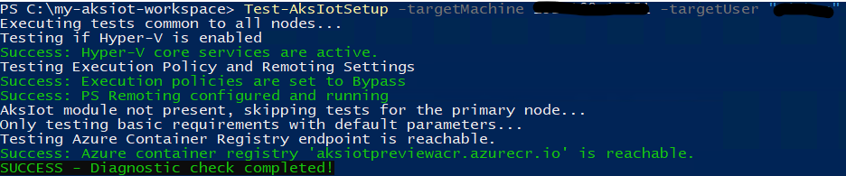

# Scaling out on multiple nodes

This article describes how to scale out your AKS lite application to multiple nodes.

## Scaling workload nodes

> [!IMPORTANT]
> Make sure you execute the following commands on your primary machine.

Now that AKS on Windows IoT is installed on your primary machine, you can scale out your cluster to secondary machines. Remember to specify [workload type](./aks-lite-concept.md) and [reserve enough memory for the Windows host](./aks-lite-concept.md).

The secondary machine added in this example has an IP of **192.168.1.11** and a hostname of **machine-b**.

> [!TIP]
> Run diagnostic before scaling. To ensure your other machines are prepped and that your networking configurations are valid, we recommend you run a diagnostic check.

### Step 1: Diagnostic check

```powershell
Test-AksIotSetup -targetMachine 192.168.1.11 -targetUser "aksiot"
```



### Step 2: Scaling to a secondary machine

Run the following commands to scale out to a secondary machine:

```powershell
New-AksIotNode `
  -Fqdns 192.168.1.11 `
  -WorkloadType Windows `
  -ReservedMemoryMb (6Gb/1MB) `
  -Verbose
```

- `-Fqdns`: Specifies the IP address or hostname of your secondary machine that you want to scale out to. You must include the same information when removing the machine.
- `-WorkloadType`: `Linux`, `Windows`, or `LinuxAndWindows`
- `-ReserveMemoryMb`: The memory reserved for the Windows host using **(XGb/1MB)**.

### Step 3: Verify scaling

Confirm that your additional nodes are showing up.

```powershell
# Using PS cmdlets
Get-AksIotNode

# Or

# Using kubectl
kubectl get nodes -o wide
```

### Step 4: Remove a machine

To remove a machine, run the following cmdlet:

```powershell
Remove-AksIotNode -Fqdn 192.168.1.11
```

## Scaling control plane nodes

These are the supported control plane scaling scenarios.

The control plane VMs must have the same memory and logical processors, so if all physical machines have the same memory and logical processors, then these will work. If your physical machines have different memory or logical processors, adjust the `-ReservedMemoryMb` and `-ReservedCpu` parameters to create the same control plane VM size across your machines.

> [!IMPORTANT]
> Control plane scaling is only supported for `-WorkloadType Linux`.

The control plane can only be comprised of 1, 3, or 5 nodes. This can be accomplished in two ways:

**Option A:** Create 1 node (no high availability) then scale out to 3 or 5:

```powershell
# Create one control plane
New-AksIotNode -Fqdns 'node1' -WorkloadType Linux -ControlPlane

# Scale control plane to 3
New-AksIotNode -Fqdns 'node2','node3' -WorkloadType Linux -ControlPlane

# Scale control plane to 5
New-AksIotNode -Fqdns 'node4','node5' -WorkloadType Linux -ControlPlane
```

**Option B:** Initially create 3 nodes or 5 nodes.

```powershell
# Three-node control plane
New-AksIotNode -Fqdns 'node1','node2','node3' -WorkloadType Linux -ControlPlane

# Five-node control plane
New-AksIotNode -Fqdns 'node1','node2','node3','node4','node5' -WorkloadType Linux -ControlPlane
```

> [!NOTE]
> You must modify `AksIoT-SetupNodes.ps1` with these commands for control plane scaling.

## Next steps

- [Deploy your application](/docs/deploying-workloads.md) or [connect to Arc](/docs/connect-to-arc.md)
- [Overview](aks-lite-overview.md)
- [Uninstall AKS cluster](aks-lite-howto-uninstall.md)
