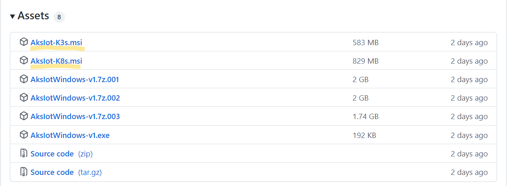
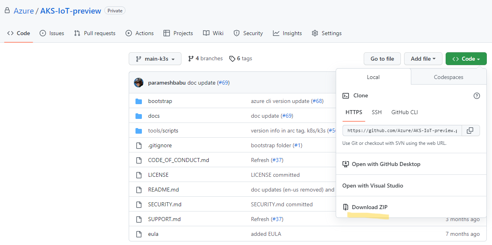
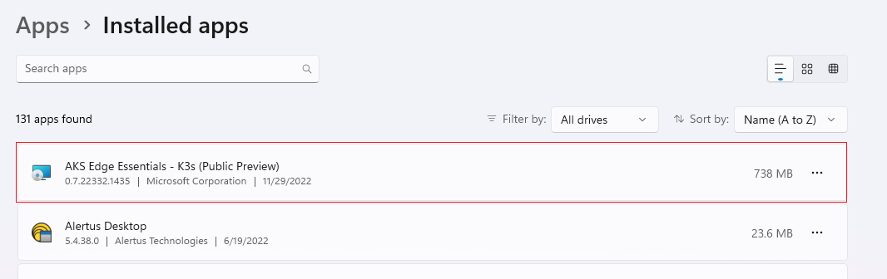
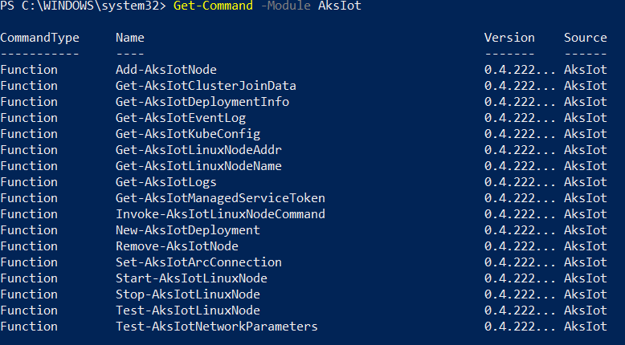

# Setup your machines

In this article, you'll learn to setup an Azure Kubernetes Service (AKS) host. You will create an AKS single node cluster on a single machine and deploy a sample containerized Linux application on this cluster.

## Prerequisites

- **Hardware requirements**

> [!IMPORTANT]
> The minimum setup required to run the latest version of AKS is a **single machine** with the following specs:

| Specs | Requirement |
| ---------- | --------- |
| Memory | 4GB at least 2GB free (cluster-only), 8GB (Arc and GitOps) |
| CPU | 2 logical processors, clock speed at least 1.8 GHz |
| Disk Space | At least 14 GB free |
| Host OS | Windows 10/11 IoT Enterprise / Enterprise / Pro / Server |

- **OS requirements** : Install Windows 10/11 IoT Enterprise / Enterprise / Pro / Server on your machine and activate Windows. We recommend using the latest [version 21H2 (OS build 19044)](/windows/release-health/release-information). You may download a version of Windows 10 [here](https://www.microsoft.com/software-download/windows10) or Windows 11 [here](https://www.microsoft.com/software-download/windows11).

## Set up your machines

AKS for the light edge can be deployed either on a single machine or on multiple machines. In a multi-machine deployment, one of the machines is the primary machine with Kubernetes control node and the other machines will be secondary machines with the worker nodes. You will need to install AKS on both the primary and secondary machines as show below. Once AKS is installed, when you create your Kubernetes cluster you will identify one machine as the primary and the rest as secondary machines.

1. On your machine, navigate to the [Github releases page](https://github.com/Azure/AKS-IoT-preview/releases) to download the `AksIot-k3s(.msi)` or `AksIot-k8s(.msi)`, depending on which Kubernetes distribution you would like to use.
 

2. In the upper left hand corner of the releases page, navigate to the "Code" tab and click on the green Code button to download the repository as a `.zip`.  

    

3. Extract the GitHub `.zip` file and move the MSI and all the other files in to the extracted folder for convenience. This will be your working directory.

4. Before you install, make sure you have removed any existing AKS-IoT clusters and uninstall any previous versions of AKS-IoT. If you have uninstalled a previous version of AKS-IoT, please **reboot** your system before proceeding.

    

> [!NOTE]
> In this release, we are supporting both k8s and k3s! We have provided two separate MSI installers for each Kubernetes distribution. Do not install both k8s and k3s at the same time. If you would like to install a different Kubernetes distribution, please uninstall the existing one first (i.e. if you have k3s installed, uninstall before installing k8s, and vice versa)

5. Double click on the `AksIot-<k8s or k3s>.msi` to install the latest version.

6. Once installation is complete, go to your working directory and in the `bootstrap` folder, you will find `LaunchPrompt.cmd`. Open this command window to make sure you have the proper modules for AKS-IoT downloaded.

7. Make sure your install was successful by running the following command:

    ```powershell
    Get-Command -Module AksIot
    ```

    You should see the output below with version showing v0.4.222.

    

    a. See [AKS-IoT Powershell Cmdlets](./reference/aks-lite-ps/index.md) for full list of supported commands.

## Setup your machine for Linux and Windows workloads

In order to configure your MSI installer to include Windows nodes, make sure you have the MSI installer with Kubernetes distribution of choice and the provided `AksIotWindows-v1` files in the same folder.

1. Open PowerShell as admin, navigate to the folder directory with the installer and files with `cd`.

2. In the command below, replace `kXs` with the Kubernetes distribution you have installed and run:

    ```powershell
    msiexec.exe /i AksIot-kXs.msi ADDLOCAL=CoreFeature,WindowsNodeFeature
    ```

3. Now you are ready to do mixed deployment.

## Next steps
<!-- Add a context sentence for the following links -->
- Scaling out is not supported for this release. Please proceed to [deploy your application](/docs/deploying-workloads.md).
