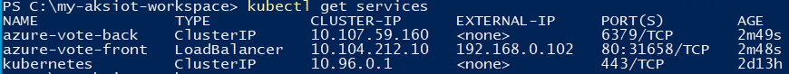

<!--
Remove all the comments in this template before you sign-off or merge to the 
main branch.
-->

<!--
This template provides the basic structure of a quickstart article.
See the [quickstart guidance](contribute-how-to-mvc-quickstart.md) in the contributor guide.

To provide feedback on this template contact 
[the templates workgroup](mailto:templateswg@microsoft.com).
-->

<!-- 1. H1
Required. Starts with "Quickstart: " Make the first word following "Quickstart:" a 
verb. Identify both the technology/service and the language or framework, if applicable.
-->

# Quickstart

In this quickstart, you'll learn to setup an Azure Kubernetes Service (AKS) host. You will create an AKS single node cluster on a single machine and deploy a sample containerized Linux application on this cluster.
<!-- 2. Introductory paragraph 
Required. Lead with a light intro that describes what the article covers. Answer the 
fundamental “why would I want to know this?” question. Keep it short.
-->

<!-- 3. Create a free trial account 
Required if a free trial account exists. Include a link to a free trial before the 
first H2, if one exists. You can find listed examples in [Write quickstart]
(contribute-how-to-mvc-quickstart.md)
-->

<!-- 4. Prerequisites 
Required. First prerequisite is a link to a free trial account if one exists. If there 
are no prerequisites, state that no prerequisites are needed for this quickstart.
-->

## Prerequisites

- **Hardware requirements**

> [!IMPORTANT]
> The minimum setup required to run the latest version of AKS is a **single machine** with the following specs:

| Specs | Requirement |
| ---------- | --------- |
| Memory | 4GB at least 2GB free (cluster-only), 8GB (Arc and GitOps) |
| CPU | 2 logical processors, clock speed at least 1.8 GHz |
| Disk Space | At least 14 GB free |
| Host OS | Windows 10/11 IoT Enterprise / Enterprise / Pro / Server |

This is your **primary** machine.

- **OS requirements** : Install Windows 10/11 IoT Enterprise / Enterprise / Pro / Server on your machine and activate Windows. We recommend using the latest [version 21H2 (OS build 19044)](/windows/release-health/release-information). You may download a version of Windows 10 [here](https://www.microsoft.com/software-download/windows10) or Windows 11 [here](https://www.microsoft.com/software-download/windows11).

## Set up your primary machine

1. On your **primary machine**, navigate to the [Github releases](https://github.com/Azure/AKS-IoT-preview/releases) to download the `AksIot-k3s(.msi)` or `AksIot-k8s(.msi)`, depending on which Kubernetes distribution you would like to use.
 

2. In the upper left hand corner of the releases page, navigate to the "Code" tab and click on the green Code button to download the repository as a `.zip`.  

    

3. Extract the GitHub `.zip` file and move the MSI and all the other files in to the extracted folder for convenience. This will be your working directory.

4. Before you install, make sure you have removed any existing AKS-IoT clusters and uninstall any previous versions of AKS-IoT. If you have uninstalled a previous version of AKS-IoT, please **reboot** your system before proceeding.

    

> [!NOTE]
> In this release, we are supporting both k8s and k3s! We have provided two separate MSI installers for each Kubernetes distribution. Do not install both k8s and k3s at the same time. If you would like to install a different Kubernetes distribution, please uninstall the existing one first (i.e. if you have k3s installed, uninstall before installing k8s, and vice versa)

5. Double click on the `AksIot-<k8s or k3s>.msi` to install the latest version.

6. Once installation is complete, go to your working directory and in the `bootstrap` folder, you will find `LaunchPrompt.cmd`. Open this command window to make sure you have the proper modules for AKS-IoT downloaded.

7. Make sure your install was successful by running the following command:

    ```powershell
    Get-Command -Module AksIot
    ```

    You should see the output below with version showing v0.4.222.

    

    a. See [AKS-IoT Powershell cmdlets](./reference/aks-lite-ps/index.md) for full list of supported commands.

## Create a single-node Kubernetes cluster

In this step we will create a Kubernetes node(s) on your machine on a private network, making it extremely easy to get a single machine cluster up and running.

1. Open an elevated PowerShell window or open `LaunchPrompt.cmd` from your `bootstrap` folder

2. In this quickstart, we will use `New-AksIotDeployment` with default parameters.

```powershell
    New-AksIotDeployment -SingleMachineCluster
```

To get a full list of the parameters and their default values, run `Get-Help New-AksIotDeployment -full` in your LaunchPrompt.

> [!NOTE]
> In this release, `New-AksIotDeployment` will **automatically get the kube config file and override the old one**.

3. Confirm that the installation was successful by running:

```powershell
kubectl get nodes -o wide
kubectl get pods -A -o wide
```


## Deploy a sample application

We will be running a sample Linux application based on [Microsoft's azure-vote-front image](https://github.com/microsoft/containerregistry). Refer to `linux-sample.yaml` in the downloaded package for the deployment manifest. Note that in the YAML we specified a `nodeSelector` tagged for Linux. All sample codes and deployment manifest can be found under Samples folder.

1. Deploy the application using the YAML manifest

```bash
kubectl apply -f linux-sample.yaml
```

 2. Verify that sample pods are running

Wait a few minutes for the pods to be in the `running` state.

```bash
kubectl get pods -o wide
```


3. Verify that your service is up

> [!IMPORTANT]
> We deployed our Kubernetes cluster without specifying a `-ServiceIPRangeSize`, so we have not allocated IPs for our workload services and you won't have an external IP address. In this case, find the IP address of your Linux VM (`Get-AksIotLinuxNodeAddr`), then append the external port (ex. 192.168.1.12:31458)

```bash
kubectl get services
```



4. Check out your running Linux sample

Open a web browser to the external IP of your application.


## Clean up resources

1. Delete the sample application

```bash
kubectl delete -f linux-sample.yaml
```

2. To remove your single machine cluster, simply run:

```powershell
Remove-AksIotNode
```

>**NOTE**:
>If your single machine cluster doesn't clean up properly, run `hnsdiag list networks`, then delete any existing AKS-IoT network objects using `hnsdiag delete networks <ID>`.

## Next steps

<!--
Remove all the comments in this template before you sign-off or merge to the 
main branch.
-->
