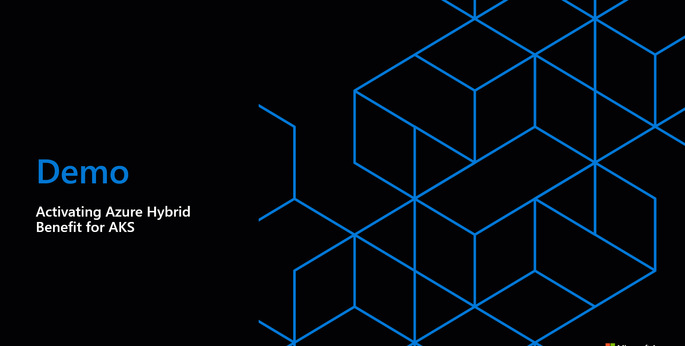

# Azure Hybrid Benefit for Azure Kubernetes Service (AKS) 
Azure Hybrid Benefit is a program that enables you to significantly reduce the costs of running workloads in the cloud. With Azure Hybrid Benefit for Azure Kubernetes Service, you can maximize the value of your on-premises licenses and modernize your applications at no additional cost.

## What is Azure Hybrid Benefit for AKS?

Azure Hybrid Benefit for Azure Kubernetes Service (AKS) is a new benefit that can now help you significantly reduce the cost of running Kubernetes on-premises or on the edge. It works by letting you apply your on-premises Windows Server Datacenter or Standard licenses with Software Assurance (SA) to pay for AKS. Each Windows Server core license entitles use on 1 virtual core of AKS. There are a few important details to note regarding activation of the benefit for AKS:

1.	Azure Hybrid Benefit for AKS is enabled at the management cluster (or AKS host) level. You don't need to enable the benefit for workload clusters.
2.	If you have multiple AKS on Azure Stack HCI or Windows Server deployments, you need to enable the Azure Hybrid Benefit individually for each deployment.
3.	Enabling Azure Hybrid Benefit on an AKS deployment during the trial period will not nullify your trial period. The benefit will be activated immediately but will be applied at the end of the trial period.
4.	Reinstalling AKS will not automatically reinstate the benefit. You will need to reactivate this benefit again for this new deployment.

To learn more about Software Assurance and with which agreements it is available, see [Benefits of Software Assurance] (https://www.microsoft.com/licensing/licensing-programs/software-assurance-by-benefits).

This rest of article will walk you through how to activate this benefit for AKS on Azure Stack HCI or Windows Server. 

Tip: You can maximize cost savings by also using Azure Hybrid Benefit for Azure Stack HCI. For more information see [Azure Hybrid Benefit for Azure Stack HCI](/azure-stack/hci/concepts/azure-hybrid-benefit.md). 


## Activate Azure Hybrid Benefit for AKS

### Prerequisites
1.	Make sure you have installed AKS on Azure Stack HCI or Windows Server host. 
2.	Make sure you have the latest version of [Az CLI installed](/cli/azure/install-azure-cli) on your local machine. You can also choose to upgrade your Az CLI version using `az upgrade`.

### Retrieve your management cluster name

You can verify if the AKS host management cluster by running the following command on any one node in your physical cluster to retrieve the (`kvaName`) name:

```PowerShell
Get-AksHciConfig | ConvertTo-Json
```

Sample Output
```json

{
    "Moc":  {
                ...
            },
    "AksHci":  {
                ...    
               },
    "Kva":  {
                ...
                "kvaName":  "<manangement cluster name>"
            }
}

```

### Verify that Azure Hybrid Benefit for AKS is not already enabled

Check that the benefit has not already enabled on your management cluster. If the benefit has already been enabled, you should see the property `AzureHybridBenefit` set to `true`.

```shell
az login --use-device-code

az account set -s <subscription ID>

az connectedk8s show -n <management cluster name> -g <resource group> 
```

Sample Output
```json
{
  "agentVersion": "1.8.14",
  "azureHybridBenefit": "NotApplicable",
  "connectivityStatus": "Connected",
  "distribution": "AKS_Management",
  "distributionVersion": null,
  "id": "/subscriptions/<subscription>/resourceGroups/<resource group>/providers/Microsoft.Kubernetes/connectedClusters/<cluster name>",
  "identity": {

  },
  "infrastructure": "azure_stack_hci",
  "kubernetesVersion": "1.23.12",
  "lastConnectivityTime": "2022-11-04T14:59:59.050000+00:00",
  "location": "eastus",
  "miscellaneousProperties": null,
  "name": "<management cluster name>",
  "offering": "AzureStackHCI_AKS_Management",
  "provisioningState": "Succeeded",
  "resourceGroup": "<resource group>",
  "systemData": {},
  "tags": {},
  "totalCoreCount": 4,
  "totalNodeCount": 1,
  "type": "microsoft.kubernetes/connectedclusters"
}
```

Warning: If you have an empty value for the JSON property `distribution`, you need to follow this link to patch your cluster before proceeding with activating Azure Hybrid Benefit for AKS.


### Activate Azure Hybrid Benefit 
To activate the benefit for an AKS cluster, run the following command in PowerShell and set `azure-hybrid-benefit` property `true`. You will be prompted to confirm compliance with Azure Hybrid Benefit terms before proceeding. 

```shell
az connectedk8s update -n <name> -g <resource group name> --azure-hybrid-benefit true 
```

Sample Output
```json
I confirm I have an eligible Windows Server license with Azure Hybrid Benefit to apply this benefit to AKS on HCI or Windows Server. Visit https://aka.ms/ahb-aks for details (y/n)
```
Important: If you are using Azure CLI to activate, ignore the timeout error displayed when you activate the benefit, it is a known issue that occurs when the service attempts to communicate with the cluster. For more details, see the [known issues section.](known-issues-arc.yml)

### Verify that the benefit is enabled

Run the following command and check that JSON property `AzureHybridBenefit` is set to  `True`.

```shell
az connectedk8s show -n <management cluster name> -g <resource group> 
```



## Maintain compliance for Azure Hybrid Benefit

After activating Azure Hybrid Benefit for AKS, you must regularly check and maintain compliance for Azure Hybrid Benefit. You can perform an inventory of how many units you are running, and check this against the Software Assurance licenses you have. To determine how many clusters with Azure Hybrid Benefit for AKS you are running, you can look at your Microsoft Azure bill. 

To qualify for the Azure Hybrid Benefit for AKS, you need to be running AKS on 1st party Microsoft infrastructure such as Azure Stack HCI or Windows Server 2019/2022 and have the appropriate license to cover the underlying infrastructure. You can only use Azure Hybrid Benefit for AKS during the Software Assurance term. When the Software Assurance term is nearing expiry, you need to either renew your agreement with Software Assurance, deactivate the Azure Hybrid Benefit functionality.

### Verify that Azure Hybrid Benefit for AKS is applied to my Microsoft Azure Bill
Visit Cost Management and Billing in the Azure Portal to verify that the Azure Hybrid Benefit for AKS has been applied to your Microsoft Azure Bill. Please note that billing does not apply in real time. There will be a delay of several hours from the time you've activated Azure Hybrid Benefit before it shows on your bill.

### Deactivate Azure Hybrid Benefit for AKS
Run the following command to deactivate the benefit.

```shell
az connectedk8s update -n <name> -g <group> --azure-hybrid-benefit false 
```


If you want to learn more, including pricing, visit our pricing page..
