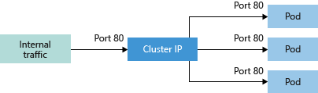
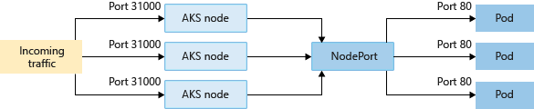

# Container networking concepts in Azure Kubernetes Service (AKS) on Azure Stack HCI

[!INCLUDE [applies-to-azure stack-hci-and-windows-server-skus](includes/aks-hci-applies-to-skus/aks-hybrid-applies-to-azure-stack-hci-windows-server-sku.md)]

Application components must work together to process their tasks in a container-based microservices approach. Kubernetes provides resources that enable application communications and allow you to connect to and expose applications internally or externally. You can load balance your applications to build highly available applications.

More complex applications may require configuration of ingress traffic for SSL/TLS termination or routing of multiple components. You may also need to restrict the flow of network traffic into or between pods and nodes for security.

This article introduces the core concepts that provide networking to your applications in AKS hybrid:

- Kubernetes Services
- Ingress controller
- Network policies

## Kubernetes Services

To simplify the network configuration for application workloads, Kubernetes uses services to logically group together a set of pods and to provide network connectivity. The following service types are available:

**Cluster IP** - Creates an internal IP address for use within the AKS cluster. Use Cluster IP for internal-only applications that support other workloads within the cluster.



**NodePort** - Creates a port mapping on the underlying node that allows the application to be directly accessed with the node IP address and port.



**LoadBalancer** - Creates an Azure load balancer resource, configures an external IP address, and connects the requested pods to the load balancer backend pool. To allow customers' traffic to reach the application, load balancing rules are created on the desired ports.


For other control and routing of the inbound traffic, you may instead use an Ingress controller.

> [!NOTE]  
> When deploying a target cluster that shares a network with another target cluster, there is the possibility of a load balancer IP address conflict.
> This can happen if you deploy two workloads that use different ports in target clusters sharing the same `AksHciClusterNetwork` object. Because of the way the IP addresses and port mappings are allocated inside HA Proxy, this can lead to a duplicate IP address assignment. If this occurs, one or both workloads will encounter random network connectivity issues until you re-deploy your workloads. When you re-deploy your workloads, you can either use the same port that will cause each workload to receive a separate service IP address, or you can re-deploy your workloads on target clusters that use different `AksHciClusterNetwork` objects.

**ExternalName** - Creates a specific DNS entry for easier application access.

The IP addresses for load balancers and services can be internal or external addresses depending on your overall network setup and can be dynamically assigned. Or, you can specify an existing static IP address to use. An existing static IP address is often tied to a DNS entry.
Internal load balancers are only assigned a private IP address, so they can't be accessed from the Internet.

## Kubernetes networking basics on Azure Stack HCI

To allow access to your applications, or for application components to communicate with each other, Kubernetes provides an abstraction layer to virtual networking. Kubernetes nodes are connected to the virtual network and can provide inbound and outbound connectivity for pods. The *kube-proxy* component running on each node provides these network features.

In Kubernetes, *Services* logically group pods to allow:

- Direct access via a single IP address or DNS name and a specific port.
- Distribute traffic using a *load balancer* between multiple pods hosting the same service or application.

The Azure Stack HCI platform also helps to simplify virtual networking for AKS on Azure Stack HCI clusters by providing the "underlay" network in a highly available manner.
When you create an AKS cluster, we also create and configure an underlying `HAProxy` load balancer resource. As you deploy applications in a Kubernetes cluster, IP addresses are configured for your pods and Kubernetes services as endpoints in this load balancer.

## IP address resources 

To simplify the network configuration for application workloads, AKS hybrid assigns IP addresses to the following objects in a deployment:

- **Kubernetes cluster API server** - The API server is a component of the Kubernetes control plane that exposes the Kubernetes API. The API server is the front end for the Kubernetes control plane. Static IP addresses are always allocated to API servers irrespective of the underlying networking model.

- **Kubernetes nodes (virtual machines)** - A Kubernetes cluster consists of a set of worker machines, called nodes, and the nodes host containerized applications. In addition to the control plane nodes, every cluster has at least one worker node. For an AKS cluster, Kubernetes nodes are configured as virtual machines. These virtual machines are created as highly available virtual machines in Azure Stack HCI, for more information, see [Node networking concepts](concepts-node-networking.md).

- **Kubernetes services** - In Kubernetes, *Services* logically group pod IP addresses to allow for direct access via a single IP address or DNS name on a specific port. Services can also distribute traffic using a *load balancer*. Static IP addresses are always allocated to Kubernetes services irrespective of the underlying networking model.

- **HAProxy load balancers** - [HAProxy](https://www.haproxy.org/#desc) is a TCP/HTTP load balancer and proxy server that spreads incoming requests across multiple endpoints. Every workload cluster in an AKS on Azure Stack HCI deployment has a HAProxy load balancer deployed and configured as a specialized virtual machine.

- **Microsoft On-premises Cloud Service** - This is the Azure Stack HCI cloud provider that enables the creation and management of the virtualized environment hosting Kubernetes on an on-premises Azure Stack HCI cluster or Windows Server cluster. The networking model followed by your Azure Stack HCI or Windows Server cluster determines the IP address allocation method used by the Microsoft On-Premises Cloud Service. To learn more about the networking concepts implemented by the Microsoft On-Premises Cloud Service, see [Node networking concepts](concepts-node-networking.md).

## Kubernetes networks

In AKS on Azure Stack HCI, you can deploy a cluster that uses one of the following network models:

- Flannel Overlay networking - The network resources are typically created and configured as the cluster is deployed.
- Project Calico networking - This model offers additional networking features, such as network policies and flow control.

Both networking implementations use an overlay network configuration model, which provides an IP address assignment that's disconnected from the rest of the data center networking.

To learn more about overlay networking, see [Introducing: Kubernetes Overlay Networking for Windows](https://techcommunity.microsoft.com/t5/networking-blog/introducing-kubernetes-overlay-networking-for-windows/ba-p/363082).

For more information about the Calico Network plug-in and policies, check out [getting started with Calico network policy](https://docs.projectcalico.org/security/calico-network-policy).

### Comparing networking models

#### Flannel

Flannel is a virtual networking layer designed specifically for containers. Flannel creates a flat network that overlays the host network. All containers/pods are assigned one IP address in this overlay network, and communicate directly by connecting to each other's IP address.

#### Calico

Calico is an open-source networking and network security solution for containers, virtual machines, and native host-based workloads.
Calico supports multiple data planes including: a Linux eBPF data plane, a Linux networking data plane, and a Windows HNS data plane.

#### Capabilities

|Capability|Flannel|Calico|
|-------|-------:|------:|
|Network Policies|No|Yes|
|IPv6|No|Yes|
|Layers used|L2 (VxLAN)|L2 (VxLAN)|
|Deploy cluster in existing or new virtual network|Yes|Yes|
|Windows Support|Yes|Yes|
|Pod-Pod connection|Yes|Yes|
|Pod-VM connection, VM in same network|No|Yes|
|Pod-VM connection, VM in different network|Yes|Yes|
|Kubernetes Services|Yes|Yes|
|Expose via Load balancer|Yes|Yes|
|Networks|Many networks on same cluster with multi daemon|Many networks on same cluster|
|Deployment|Linux: DaemonSet|Linux: DaemonSet|
|     |Windows: Service|Windows: Service|
|Command line|none|calicoctl|

> [!Important]
> Currently, the default selection is to use Calico in an overlay networking mode. To enable Flannel, use the **-primaryNetworkPlugin** parameter of the [`New-AksHciCluster`](./reference/ps/new-akshcicluster.md) PowerShell command and specify `flannel` as the value. **This cannot be changed after the cluster has been deployed and will apply to both Windows and Linux cluster nodes.**

Here's an example:

```powershell
New-AksHciCluster -name MyCluster -primaryNetworkPlugin 'flannel'
```

## Next steps
This article covers networking concepts for containers in AKS nodes on Azure Stack HCI. For more information on AKS on Azure Stack HCI concepts, see the following articles:

- [Network concepts for AKS nodes](./concepts-node-networking.md)
- [Cluster and workloads](./kubernetes-concepts.md)
- [Secure traffic between pods using network policies](./calico-networking-policy.md).
