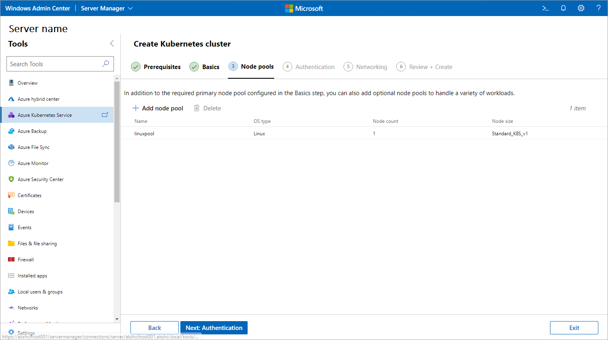
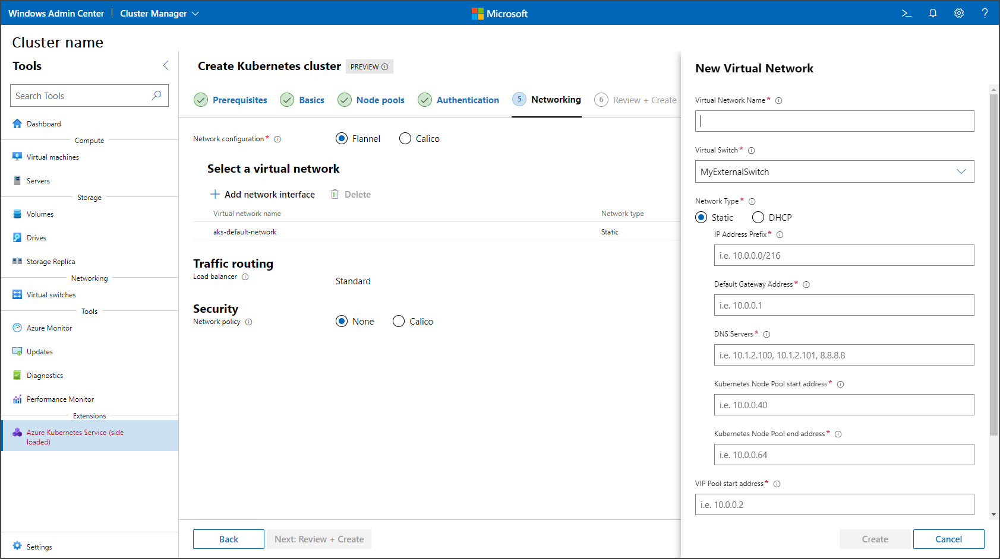
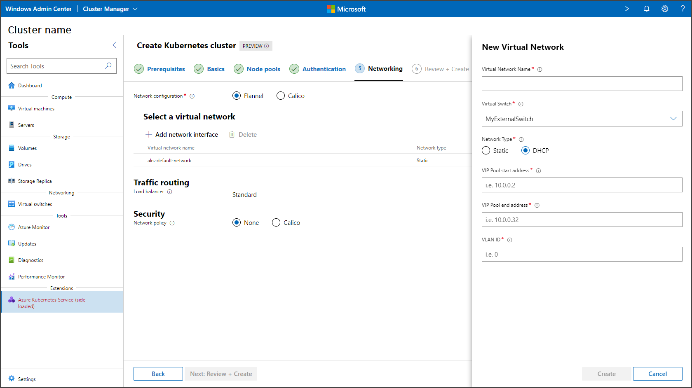
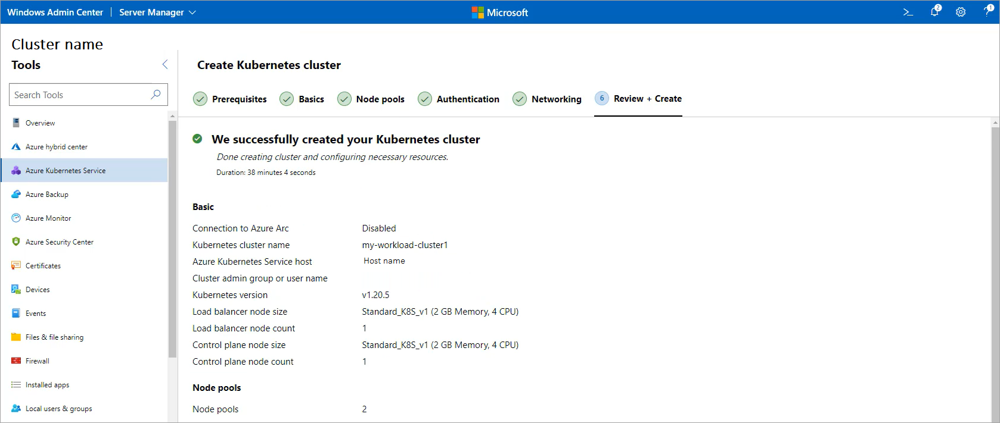

# Quickstart: Create a local Kubernetes cluster on AKS enabled by Azure Arc using Windows Admin Center

[!INCLUDE [aks-hybrid-applies-to-azure-stack-hci-windows-server-sku](includes/aks-hci-applies-to-skus/aks-hybrid-applies-to-azure-stack-hci-windows-server-sku.md)]

After you set up your Azure Kubernetes Service (AKS) host, you can use Windows Admin Center to create a local Kubernetes cluster. To use PowerShell instead, see [Create a Kubernetes cluster with PowerShell](kubernetes-walkthrough-powershell.md).

Before you proceed to the **Create Kubernetes cluster** wizard, make sure you [set up Azure Kubernetes Service](setup.md) and check the [system requirements](system-requirements.md). You can access the wizard through the Azure Kubernetes Service host dashboard, as described in the next section.

## Create a local Kubernetes cluster in the AKS host dashboard

You can create a local Kubernetes cluster through the AKS host dashboard. You can find this dashboard in the AKS tool if you're connected to the system that has an AKS host deployed on it. Follow these steps and then proceed to the [Use the Create Kubernetes cluster wizard](#use-the-create-kubernetes-cluster-wizard) section:

1. Connect to the system on which you want to create your Kubernetes cluster, and then navigate to the **Azure Kubernetes Service** tool. This system should already have an AKS host set up.
1. Select **Add cluster** under the **Kubernetes cluster** heading as shown in the following image:

   :::image type="content" source="media/create-kubernetes-cluster/dashboard-kubernetes-wizard.png" alt-text="Screenshot showing the Azure Kubernetes Service tool dashboard.":::

## Use the Create Kubernetes cluster wizard

This section describes how to use the Create Kubernetes cluster wizard through the Azure Kubernetes Service tool.  

1. Review the prerequisites for the system that hosts the Kubernetes cluster and Windows Admin Center. When you're finished, select **Next**.
1. On the **Basics** page, configure information about your Kubernetes cluster. The Azure Kubernetes Service host field requires the fully qualified domain name of the Kubernetes cluster that you used during the [setup process](setup.md). You must complete the host setup for this system using the Azure Kubernetes Service tool. When you're finished, select **Next**.

    :::image type="content" source="media/create-kubernetes-cluster/basics.png" alt-text="Screenshot showing Basics cluster creation pane." lightbox="media/create-kubernetes-cluster/basics.png":::

1. This step is mandatory. Configure node pools to run your workloads on the **Node pools** page. You can add any number of Windows node pools and Linux node pools. If you enabled Azure Arc integration earlier in this wizard, configure a Linux node pool with at least one Linux worker node. However, if you disabled Azure Arc integration earlier, then any node pool addition allows you to proceed to the next step. You can also set maximum pod counts and node taints when configuring node pools. Both of these settings are optional. For more information about the available taint settings, see [New-AksHciCluster](./reference/ps/new-akshcicluster.md#new-aks-hci-cluster-with-a-linux-node-pool-and-taints).

   

   When you're finished, select **Next**.

1. In the **Authentication** step, select whether you'd like to enable Microsoft Entra authentication. If you choose to enable this feature, you must provide information such as your API server service principal name, a Keytab file, and a cluster admin group or user name. When you're finished, select **Next**.

1. Specify your network configuration on the **Networking** page. You can either select an existing virtual network or create a new one by selecting **Add network interface**. If you select the **Flannel** container network interface (CNI), only Windows or hybrid clusters are supported. Once **Flannel** is set, it can't be changed, and the cluster won't support any network policy. If the **Calico** CNI is selected, it isn't needed to support Calico network policy, and Calico becomes the default option for your network policy under **Security**. When complete, select **Next: Review + Create**.

   The following image shows the static IP configuration settings:

   

   The following image shows the DHCP configuration settings:

   

1. Review your selections on the **Review + create** page. When you're satisfied, select **Create** to begin deployment. Your deployment progress is shown at the top of this page.

1. When your deployment is complete, the **Next steps** page details how to manage your cluster. If you chose to disable the Azure Arc integration in the previous step, some of the information and instructions on this page might not be available or functional.

   

## Next steps

In this quickstart, you deployed a Kubernetes cluster. For more information about AKS enabled by Azure Arc, and to learn how to deploy and manage Linux applications on AKS enabled by Arc, continue to the following tutorial:

- [Tutorial: Deploy Linux applications](deploy-linux-application.md)
- [Set up multiple administrators](./set-multiple-administrators.md)
