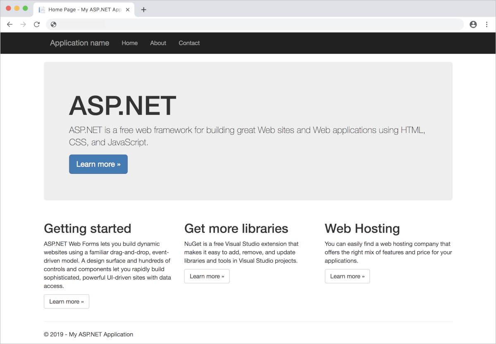

# Deploy Windows applications in AKS hybrid

[!INCLUDE [applies-to-azure stack-hci-and-windows-server-skus](includes/aks-hci-applies-to-skus/aks-hybrid-applies-to-azure-stack-hci-windows-server-sku.md)]

In this tutorial, you will learn how to deploy an ASP.NET sample application in a Windows Server container to the Azure Kubernetes Service (AKS)cluster in AKS hybrid, and then test and scale your application. You will also learn how to join a Windows node to an Active Directory domain.

[!INCLUDE [aks-hybrid-description](includes/aks-hybrid-description.md)]

This tutorial assumes a basic understanding of Kubernetes concepts. For more information, see [Kubernetes core concepts for AKS hybrid](kubernetes-concepts.md).

## Before you begin

Make sure you've met the following requirements:

* An [Azure Kubernetes Service cluster](./kubernetes-walkthrough-powershell.md) with at least one Windows worker node is up and running. 
* You have a kubeconfig file to access the cluster.
* The [AksHci PowerShell module](./kubernetes-walkthrough-powershell.md#install-the-akshci-powershell-module) is installed.

When you do the procedures:
* Run the commands in a PowerShell administrative window.
* Ensure that OS-specific workloads land on the appropriate container host. If your Kubernetes cluster has a mixture of Linux and Windows worker nodes, you can use either node selectors or taints and tolerations. For more information, see [using node selectors and taints and tolerations](adapt-apps-mixed-os-clusters.md).

## Deploy the application

A Kubernetes manifest file defines a desired state for the cluster, such as which container images to run. In these procedures, a manifest is used to create all objects needed to run the ASP.NET sample application in a Windows Server container. This manifest includes a Kubernetes deployment for the ASP.NET sample application and an external Kubernetes service to access the application from the internet.

The ASP.NET sample application is provided as part of the .NET Framework Samples and runs in a Windows Server container. AKS hybrid requires that Windows Server containers be based on images of *Windows Server 2019*.

The Kubernetes manifest file must also define a node selector to tell your AKS cluster to run your ASP.NET sample application's pod on a node that can run Windows Server containers.

Create a file named `sample.yaml`, and copy in the following YAML definition. 

```yaml
apiVersion: apps/v1
kind: Deployment
metadata:
  name: sample
  labels:
    app: sample
spec:
  replicas: 1
  template:
    metadata:
      name: sample
      labels:
        app: sample
    spec:
      nodeSelector:
        "beta.kubernetes.io/os": windows
      containers:
      - name: sample
        image: mcr.microsoft.com/dotnet/framework/samples:aspnetapp
        resources:
          limits:
            cpu: 1
            memory: 800M
          requests:
            cpu: .1
            memory: 300M
        ports:
          - containerPort: 80
  selector:
    matchLabels:
      app: sample
---
apiVersion: v1
kind: Service
metadata:
  name: sample
spec:
  type: LoadBalancer
  ports:
  - protocol: TCP
    port: 80
  selector:
    app: sample
```

Deploy the application using the `kubectl apply` command, and specify the name of your YAML manifest:

```console
kubectl apply -f sample.yaml
```

The following example output shows the deployment and service were created successfully:

```output
deployment.apps/sample created
service/sample created
```

## Test the application

When the application runs, a Kubernetes service exposes the application front end to the internet. This process can take a few minutes to complete. Occasionally, the service can take longer than a few minutes to provision. Allow up to 10 minutes in these cases.

To monitor progress, use the `kubectl get service` command with the `--watch` argument.

```PowerShell
kubectl get service sample --watch
```

Initially, the *EXTERNAL-IP* for the *sample* service is shown as *pending*.

```output
NAME    TYPE           CLUSTER-IP   EXTERNAL-IP   PORT(S)        AGE
sample  LoadBalancer   10.0.37.27   <pending>     80:30572/TCP   6s
```

When the *EXTERNAL-IP* address changes from *pending* to an actual public IP address, use `CTRL-C` to stop the `kubectl` watch process. The following example output shows a valid public IP address assigned to the service:

```output
NAME    TYPE           CLUSTER-IP   EXTERNAL-IP     PORT(S)        AGE
sample  LoadBalancer   10.0.37.27   52.179.23.131   80:30572/TCP   2m
```

To see the sample app in action, open a web browser to the external IP address of your service.



If the connection times out when you try to load the page, verify whether the sample app is ready by running the `kubectl get pods --watch` command. Sometimes, the external IP address is available before the Windows container starts.

## Scale application pods

We have created a single replica of the application front end. To see the number and state of pods in your cluster, use the `kubectl get` command as follows:

```console
kubectl get pods -n default
```

To change the number of pods in the *sample* deployment, use the `kubectl scale` command. The following example increases the number of front-end pods to 3:

```console
kubectl scale --replicas=3 deployment/sample
```

Run `kubectl get pods` again to verify that additional pods were created. After a minute or so, the additional pods are available in your cluster.

```console
kubectl get pods -n default
```

## Next steps

* [Use Azure Monitor to monitor your cluster and application](/azure/azure-monitor/insights/container-insights-enable-arc-enabled-clusters).
* [Use persistent volumes on a Kubernetes cluster](persistent-volume.md).
