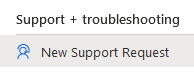

# Get support for AKS hybrid and AKS Edge Essentials

If you encounter an issue with AKS hybrid or AKS Edge Essentials, this article describes how to open a support request.

## Go to Support + troubleshooting in the Azure portal

Select the product you're using to see the relevant instructions on opening a support request.

# [AKS on Azure Stack HCI](#tab/akshci)
1. Sign in to the [Azure portal](https://portal.azure.com).
1. Browse to the subscription you're using for Azure Kubernetes Services on Azure Stack HCI. Select the subscription to open its dashboard.
1. From the **Support + troubleshooting** category in the navigation menu in the left-hand pane, select **New Support Request**:

    

1. From the dropdown, select the **Technical** issue type:

    :::image type="content" source="media/support/select-type.png" alt-text="Screenshot of issue type selection." lightbox="media/support/select-type.png":::

1. Your subscription name should auto-populate in the **Subscription** field. If it doesn't, select it from the dropdown.

1. Select the **All services** button, then select the **Service type** dropdown. Begin typing **Azure Kubernetes Service** in the search box to locate the **Azure Kubernetes Service on Azure Stack HCI (AKS-HCI)** service in the **Compute** category.

    :::image type="content" source="media/support/service-type.png" alt-text="Screenshot showing service selection.":::

1. Add a short description of your issue in the **Summary** field.

1. Select the appropriate **Problem type** from the dropdown menu for your issue (for example, **Kubernetes**):

    :::image type="content" source="media/support/problem-type.png" alt-text="Screenshot of completed problem type form." lightbox="media/support/problem-type.png":::

1. Select **Next**.

1. Review the proposed **Solutions** to determine if they address your issue:

    :::image type="content" source="media/support/solutions-page.png" alt-text="Screenshot of proposed solutions." lightbox="media/support/solutions-page.png":::

1. If the solutions are not applicable, select **Return to support request** at the top of the page.

1. Select **Next**.

1. Fill in the problem details and description in the appropriate fields: 

    :::image type="content" source="media/support/service-request-details.png" alt-text="Screenshot showing details of service request.":::

1. Scroll down and fill in your preferred support method of contact:

    :::image type="content" source="media/support/service-request-support-method.png" alt-text="Screenshot showing support method preferences.":::

1. Select **Next**. Review the information you submitted. If anything is incorrect, select **Previous** and correct it. When all looks correct, select **Create**.

    :::image type="content" source="media/support/review-create.png" alt-text="Screenshot of confirmation screen to create support request.":::

# [AKS Edge Essentials](#tab/aksee)
1. Sign in to the [Azure portal](https://portal.azure.com).
1. Browse to the subscription you're using for AKS Edge Essentials. Select the subscription to open its dashboard.
1. From the **Support + troubleshooting** category in the navigation menu in the left-hand pane, select **New Support Request**:

    

1. From the dropdown, select the **Technical** issue type:

    :::image type="content" source="media/support/select-type.png" alt-text="Screenshot of issue type selection." lightbox="media/support/select-type.png":::

1. Your subscription name should auto-populate in the **Subscription** field. If it doesn't, select it from the dropdown.

1. Select the **All services** button, then select the **Service type** dropdown. Begin typing **Edge** in the search box to locate the **AKS Edge Essentials** service in the **Compute** category.

    :::image type="content" source="media/support/service-type-edge.png" alt-text="Screenshot showing service selection.":::

1. Add a short description of your issue in the **Summary** field.

1. Select the appropriate **Problem type** from the dropdown menu for your issue (for example, **Setup and configuration**). Also, select a **Problem subtype** (for example, **Deployment**):

    :::image type="content" source="media/support/problem-type-edge.png" alt-text="Screenshot of completed problem type form." lightbox="media/support/problem-type-edge.png":::

1. Select **Next**.

1. Review the proposed **Solutions** to determine if they address your issue.

1. If the solutions are not applicable, select **Return to support request** at the top of the page.

1. Select **Next**.

1. Fill in the problem details and description in the appropriate fields: 

    :::image type="content" source="media/support/service-request-details.png" alt-text="Screenshot showing details of service request.":::

1. Scroll down and fill in your preferred support method of contact:

    :::image type="content" source="media/support/service-request-support-method.png" alt-text="Screenshot showing support method preferences.":::

1. Select **Next**. Review the information you submitted. If anything is incorrect, select **Previous** and correct it. When all looks correct, select **Create**.

    :::image type="content" source="media/support/review-create-edge.png" alt-text="Screenshot of confirmation screen to create support request.":::

## Next steps

- [Review support policies for AKS hybrid](./support-policies.md).