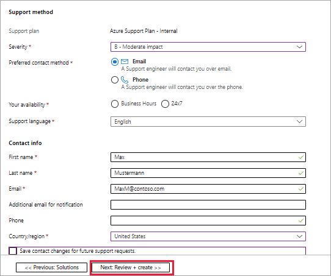

# Get support for AKS hybrid

[!INCLUDE [applies-to-azure stack-hci-and-windows-server-skus](includes/aks-hci-applies-to-skus/aks-hybrid-applies-to-azure-stack-hci-windows-server-sku.md)]

If you encounter an issue with AKS hybrid, this article describes how to open a support request.

[!INCLUDE [aks-hybrid-description](includes/aks-hybrid-description.md)]

## Go to Help + support in the Azure portal

1. Log into the [Azure portal](https://portal.azure.com).
2. Browse to the subscription you are using for Azure Kubernetes Services on Azure Stack HCI.
3. Under Azure services section, select the **Help + support** icon:

    

   Or, you can go to **Support + troubleshooting** from a resource menu in the left-hand pane:

    

4. Select the **New Support Request** option.
 
5. Add a short description of your issue in the **Summary** field, and under **Issue** type, select **Technical**:

    
 
6. Select the appropriate subscription from the dropdown menu, and then change the **Service** type to **All services**. Begin typing _Azure Kubernetes Service_ in the search box to locate the **Azure Kubernetes Service on Azure Stack HCI service**<!--Will this option label change for AKS hybrid?--> under **Compute**:

    
 
7. Select the appropriate **Problem** type from the dropdown menu for your issue (for example, Kubernetes), and then select the **Next: Solutions** button at the bottom left of the screen:

    

8. Review the provided **Recommended Article(s)** to determine if they address your issue. If not, select the **Next: Details** button at the bottom left of the screen. 

    

9. If the solutions are not applicable, complete the remainder of the information on the **Details** page.

    

    Then, select **Review + create** at the bottom of the support request to review and create the request for support:

    

## Next steps

- [Review support policies for AKS hybrid](./support-policies.md).