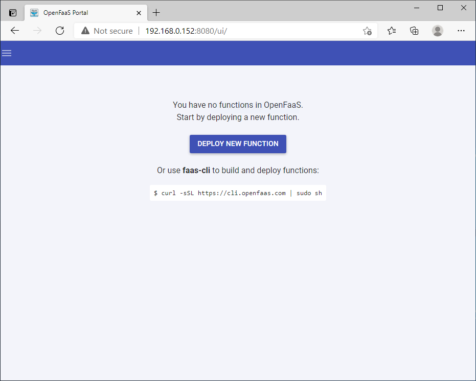
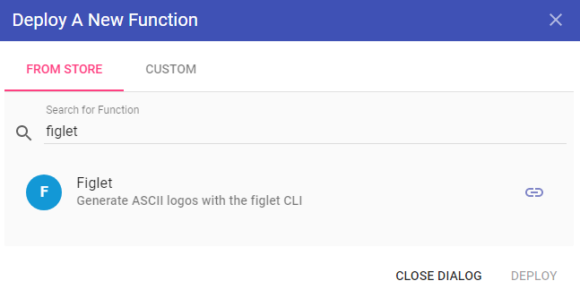

# Use OpenFaaS with AKS enabled by Azure Arc

[!INCLUDE [applies-to-azure stack-hci-and-windows-server-skus](includes/aks-hci-applies-to-skus/aks-hybrid-applies-to-azure-stack-hci-windows-server-sku.md)]

[OpenFaaS][open-faas] is a framework for building serverless functions by using containers. As an open source project, it gained large-scale adoption within the community. This article describes installing and using OpenFaas on a Kubernetes cluster running on AKS enabled by Azure Arc.

## Prerequisites

In order to complete the steps in this article, make sure you have the following requirements:

* A basic understanding of [Kubernetes](kubernetes-concepts.md).
* A [Kubernetes cluster](setup.md) with at least one Linux worker node that's up and running.
* Your local `kubectl` environment is configured to point to your cluster. You can use the [Get-AksHciCredential](./reference/ps/get-akshcicredential.md) PowerShell command to access your cluster using `kubectl`.
* [Helm v3](https://helm.sh/docs/intro/install/) command line and prerequisites are installed.
* You can use [Azure CLI](/cli/azure/install-azure-cli) to run commands if you prefer Azure CLI to PowerShell.
* Git command-line tools are installed on your system.
* The `OpenFaaS` CLI is installed. For installation options, see the [OpenFaaS CLI documentation][open-faas-cli].

> [!IMPORTANT]
> [!INCLUDE [helm-charts-in-mixed-linux-windows-clusters](includes/helm-charts-in-mixed-linux-windows-clusters.md)]

## Add the OpenFaaS Helm chart repo

With your **kubeconfig** file available, open your console to start the deployment process. If you're running on Windows, downloading and running Git Bash is the easiest way to follow along. From there, OpenFaaS maintains its own Helm charts to keep up to date with all the latest changes:

```console
helm repo add openfaas https://openfaas.github.io/faas-netes/
helm repo update
```

## Deploy OpenFaaS

As a best practice, OpenFaaS and OpenFaaS functions should be stored in their own Kubernetes namespace.

Create a namespace for the OpenFaaS system and functions:

```console
kubectl apply -f https://raw.githubusercontent.com/openfaas/faas-netes/master/namespaces.yml
```

Generate a password for the OpenFaaS UI Portal and REST API:

```console
# generate a random password
PASSWORD=$(head -c 12 /dev/urandom | shasum| cut -d' ' -f1)

kubectl -n openfaas create secret generic basic-auth \
--from-literal=basic-auth-user=admin \
--from-literal=basic-auth-password="$PASSWORD"
```

You can get the value of the secret with `echo $PASSWORD`.

The Helm chart uses the password you create here to enable basic authentication on the OpenFaaS Gateway, which is exposed externally through a load balancer.

A Helm chart for OpenFaaS is included in the cloned repository. Use this chart to deploy OpenFaaS on your Kubernetes cluster:

```console
helm upgrade openfaas --install openfaas/openfaas \
    --namespace openfaas  \
    --set basic_auth=true \
    --set functionNamespace=openfaas-fn \
    --set serviceType=LoadBalancer
```

Output:

```output
NAME:   openfaas
LAST DEPLOYED: Fri May 14 18:35:47 2021
NAMESPACE: openfaas
STATUS: deployed
REVISION: 1
TEST SUITE: None
```

To verify that OpenFaas started, run the following command:

```console
kubectl --namespace=openfaas get deployments -l "release=openfaas, app=openfaas"
```

A public IP address is created for accessing the OpenFaaS gateway. To retrieve this IP address, use the [kubectl get service][kubectl-get] command. It can take a minute for the IP address to be assigned to the service:

```console
kubectl get service -l component=gateway --namespace openfaas
```

Output:

```output
NAME               TYPE           CLUSTER-IP     EXTERNAL-IP    PORT(S)          AGE
gateway            ClusterIP      10.110.205.41  <none>         8080/TCP         7m
gateway-external   LoadBalancer   10.107.51.110  192.168.0.152  8080:32029/TCP   7m
```

To test the OpenFaaS system, browse to the external IP address on port 8080 - `http://192.168.0.152:8080` in this example. You are prompted to sign in. To retrieve your password, enter `echo $PASSWORD`.



Set `$OPENFAAS_URL` to the External-IP found in this example.

Sign in with your console. If you run commands in GitBash on Windows, you might need to use `faas-cli` instead of `./faas-cli` in the following command:

```console
export OPENFAAS_URL=http://192.168.0.152:8080
echo -n $PASSWORD | ./faas-cli login -g $OPENFAAS_URL -u admin --password-stdin
```

## Create first function

Now that OpenFaaS is operational, create a function using the OpenFaaS portal.

Select **Deploy New Function**, and search for **Figlet**. Select the Figlet function, and then click **Deploy**.



Use `curl` to invoke the function. Replace the IP address in the following example with the address of your OpenFaaS gateway.

```console
curl -X POST http://192.168.0.152:8080/function/figlet -d "Hello Azure"
```

Output:

```output
 _   _      _ _            _
| | | | ___| | | ___      / \    _____   _ _ __ ___
| |_| |/ _ \ | |/ _ \    / _ \  |_  / | | | '__/ _ \
|  _  |  __/ | | (_) |  / ___ \  / /| |_| | | |  __/
|_| |_|\___|_|_|\___/  /_/   \_\/___|\__,_|_|  \___|

```

### Clean up resources

When you deploy a Helm chart, many Kubernetes resources are created. These resources include pods, deployments, and services. To clean up these resources, use the `helm uninstall` command, and specify your release name, as found in the previous `helm list` command:

```console
helm uninstall openfaas
```

The following example shows that the release named **openfaas** was uninstalled:

```output
release "openfaas" uninstalled
```

## Next steps

You can continue to learn with the OpenFaaS workshop through a set of hands-on labs that cover topics such as how to create your own GitHub bot, consuming secrets, viewing metrics, and auto-scaling.

[kubectl-get]: https://kubernetes.io/docs/reference/generated/kubectl/kubectl-commands#get
[open-faas]: https://www.openfaas.com/
[open-faas-cli]: https://github.com/openfaas/faas-cli 
