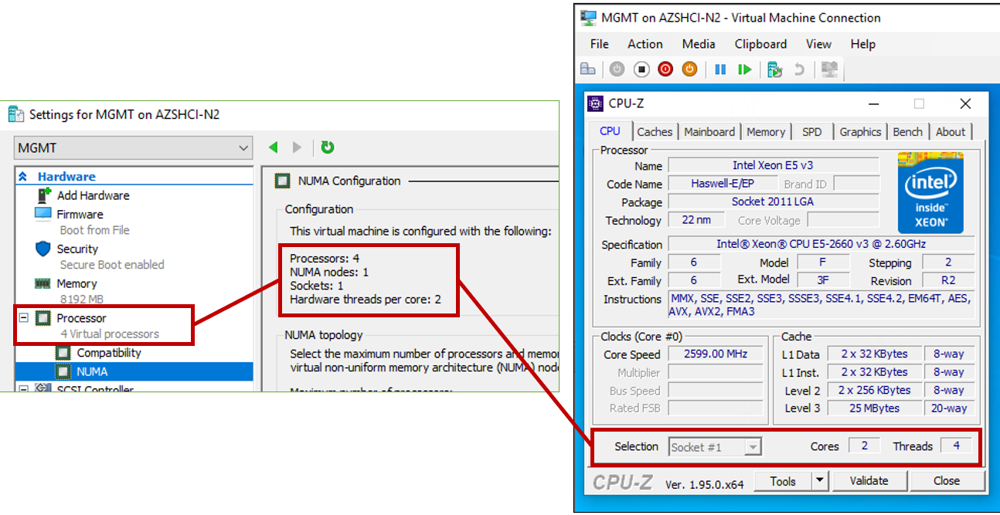

---

title: Azure Kubernetes Service (AKS) hybrid pricing details
description: Detailed pricing information for AKS hybrid 
ms.topic: conceptual
author: baziwane
ms.author: rbaziwane 
ms.lastreviewed: 10/28/2022
ms.reviewer: sethm
ms.date: 10/04/2022

# Intent: As a Subscription Owner, I want to understand how the AKS service is priced and what I am paying for.
# Keyword: pricing

---

# Azure Kubernetes Service (AKS) hybrid pricing details

Azure Kubernetes Service (AKS) is a subscription-based Kubernetes offering that can be run on Azure Stack HCI or Windows Server Hyper-V clusters. You can download and install AKS on your existing hardware whether in your own on-premises data center or on the edge. The pricing is based on usage and requires an Azure subscription, which you can obtain for free. The billing unit is a virtual core or vCPU. All initial AKS deployments include a free 60-day evaluation period, at the end of which a pay-as-you-go rate per vCPU (of running worker nodes) per day will be applied.

## Pricing details

Azure pricing for running workloads on AKS is based on US currency list pricing with:

- Pay-as-you-go pricing
- D-series general purpose VM sizes (D2s v4, D4s V4, and D8s V4)
- Standard HDD
- No uptime SLA (included in the support level)

In addition, AKS pricing is based on the US currency list pricing with no discounts applied. The monthly price estimates are based on 730 hours of usage.

For detailed pricing information, see the [AKS hybrid pricing details](https://azure.microsoft.com/pricing/details/azure-stack/aks-hci/#overview) page. The list price for AKS hybrid includes the following:

- Includes Kubernetes control plane and load balancer nodes:
  - The Arc-enabled AKS management cluster usage is *not* charged
  - The workload cluster control plane and load balancer nodes are *not* charged

- Includes Linux (CBL-Mariner) Container Hosts:
  - Pricing does not include Windows container hosts as they are licensed separately through regular licensing channels
  - Windows Server Standard: Unlimited Windows containers and two Hyper-V containers
  - Windows Server Datacenter: Unlimited Windows and Hyper-V containers

- Includes Azure Arc-enabled Kubernetes at no extra charge and the following items:
  - **Inventory, grouping, and tagging** in Azure
  - **Deployment of apps and configurations with GitOps**: Included at no extra charge (normally, the initial six vCPUs are free, and then afterwards, the charged per vCPU per month)
  - **Azure Policy for Kubernetes**: Included at no extra charge (normally, the charge per vCPU per cluster for each month)

- If you enable hyper-threading on the physical computer, this will reduce the measured vCPU count by 50 percent.

Note: Running Windows Server containers on AKS requires a Windows Server license. The license can be acquired separately through regular licensing channels, or it can be added to the cost of running a Windows virtual machine on Azure. For users with Windows Server Software Assurance, Azure Hybrid benefits may apply, hence reducing or eliminating the Windows Server license fees.

## Impact of hyper-threading on pricing for AKS

If you enable hyper-threading on your physical computer, AKS will also enable hyper-threading on the worker nodes. If you enable hyper-threading, it will effectively halve the number of virtual cores needed in each worker node.

