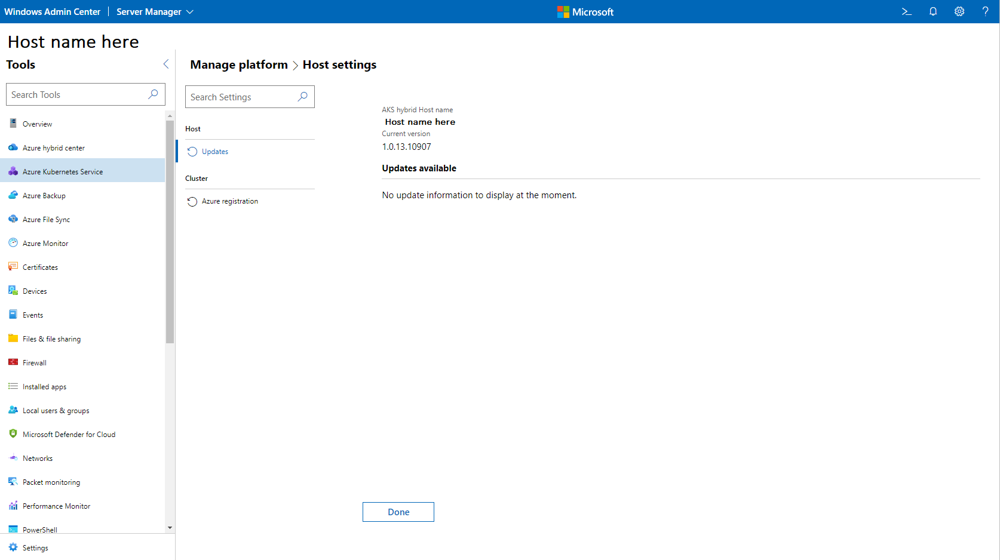

# Upgrade the Azure Kubernetes Service host in AKS hybrid using Windows Admin Center

[!INCLUDE [applies-to-azure stack-hci-and-windows-server-skus](includes/aks-hci-applies-to-skus/aks-hybrid-applies-to-azure-stack-hci-windows-server-sku.md)]

This article describes how to upgrade the Azure Kubernetes Service (AKS) host core system to the latest version in AKS hybrid. 

[!INCLUDE [aks-hybrid-description](includes/aks-hybrid-description.md)]

## Overview of AKS host updates

<!--Conceptual overview is substantially different from the overview of the same task performed in PowerShell (update-akshci-host-powershell.md). Info in both looks fine - just different. Should they match?-->

Several types of updates can be made independently or in certain supported combinations:<!--This list looks to be an overview of the set of "updates" articles. Not sure it fits here.-->

- Update the AKS hybrid core system to the latest version.
- Update an AKS workload cluster to a new Kubernetes version.
- Update the container hosts of AKS workload clusters to a newer version of the operating system.
- Combined update of the operating system and Kubernetes version of AKS workload clusters.

To avoid outages and loss of AKS availability, rolling updates are performed.

When you bring a _new_ node with a newer build into the cluster, resources move from the _old_ node to the _new_ node, and when the resources are successfully moved, the _old_ node is decommissioned and removed from the cluster.<!--Placement seems awkward.-->

We recommend that you update workload clusters immediately after updating the AKS host to prevent running unsupported container host OS versions or Kubernetes versions in your workload clusters. If your workload clusters are on an old Kubernetes version, they are still supported, but you will not be able to scale your cluster.

> [!Note]  
> Microsoft recommends upgrading your AKS hybrid clusters within 30 days of a new release. If you do not update within this window, you have up to 90 days from your last upgrade before internal certificates and tokens expire. Once the certificates and tokens expired the cluster is still functional; however, you must call Microsoft Support to upgrade. When you reboot the cluster after the 90-day period, it remains in a non-functional state. For more information about internal certificates and tokens, see [Certificates and tokens](/azure-stack/aks-hci/certificates-update-after-sixty-days).

## Update the AKS host

To update the AKS host byusing Windows Admin Center, follow these steps:

1. Update your Azure Kubernetes Service extension by navigating to **Settings** > **Extensions** > **Installed Extensions**, and then click **Update**. The latest available Azure Kubernetes Service extension version is 1.82.0. You do not need to complete this step if you have enabled auto-update for your extensions. However, make sure that you have version 1.82.0 of the AKS extension installed before proceeding to the next step.

2. On the **Host settings** page, select **Update AksHci PowerShell module to version x.x.x** under **Updates available**, and then click **Update now**.
   
   
   
4. You can now go back to the Windows Admin Center **Connections** page and connect to your AKS cluster.
5. Select the **Azure Kubernetes Service** tool from the **Tools** list. When the tool loads, you will see with the **Overview** page.<!--Meaning of this sentence unclear.-->
6. Select **Updates** from the page list on the left side of the tool, and then select **Update now** to upgrade your AKS host.

> [!NOTE]
> - The update might stall if you navigate away from the update window while it's in progress.
> - During the update process, if you receive an error that says _Could not install updates_, the current deployment cannot be updated to the latest version. To work around this error, run `Get-AksHciUpdates` in PowerShell and review the recommendations provided in the output.

## Next steps
- [Update the Kubernetes version of your workload clusters](./upgrade-kubernetes.md)