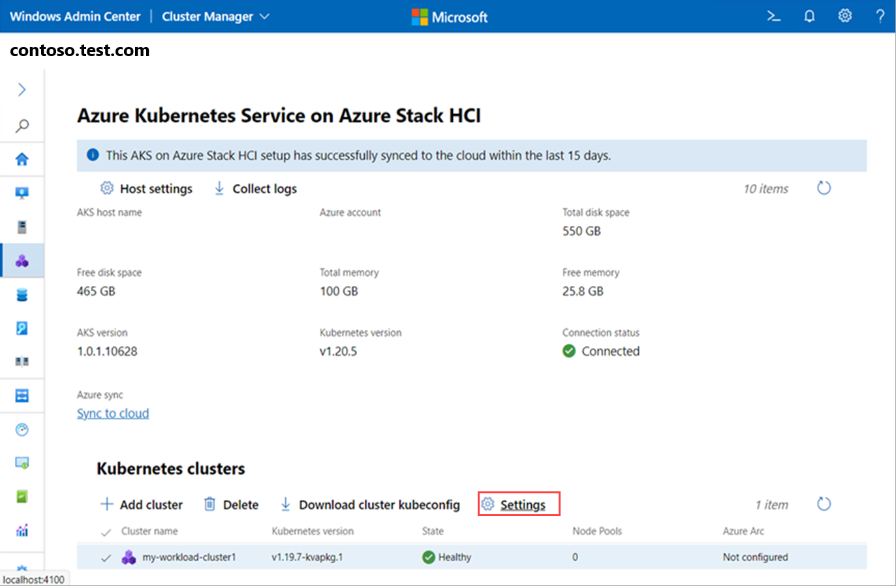
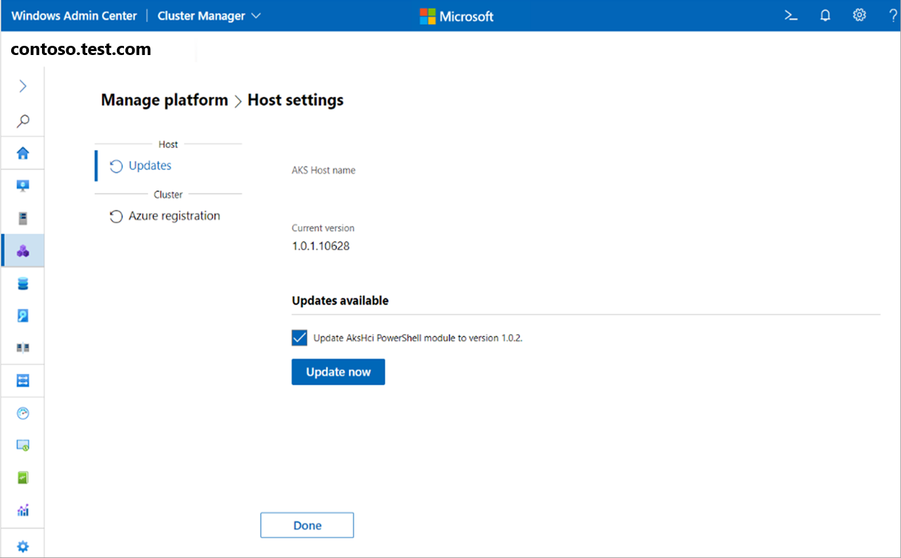

# Upgrade the Kubernetes version of an AKS workload cluster using Windows Admin Center

[!INCLUDE [applies-to-azure stack-hci-and-windows-server-skus](includes/aks-hci-applies-to-skus/aks-hybrid-applies-to-azure-stack-hci-windows-server-sku.md)]

This article describes how to upgrade an Azure Kubernetes Service (AKS) workload cluster to a new Kubernetes version in AKS enabled by Azure Arc. You should [update the AKS hosts](update-akshci-host-windows-admin-center.md) to a new version of the operating system before updating the Kubernetes version.

> [!NOTE]
> You can also use PowerShell to [upgrade AKS workload clusters](upgrade.md).

We recommend updating an AKS workload cluster in AKS Arc at least once every 60 days. New updates are available every 30 days. To avoid outages in workload availability, rolling updates are performed.

When you bring a new node with a newer build into the cluster, resources move from the old node to the new node, and when the resources are successfully moved, the old node is decommissioned and removed from the cluster.

## Upgrade the Kubernetes version

To upgrade the Kubernetes version of an AKS workload cluster with Windows Admin Center, follow these steps:

1. On the Windows Admin Center **Connections** page, connect to your management cluster.
1. Select **Azure Kubernetes Service** from the **Tools** list. When the tool loads, the **Overview** page is displayed.
1. Select the workload cluster you want to upgrade.
1. Select **Settings** under Kubernetes clusters to navigate to the **Settings** page.

   

1. Select **Update now** to upgrade your workload cluster's Kubernetes version.

   

The following update scenarios are not supported in Windows Admin Center, but you can [use PowerShell](upgrade.md) to perform them:

- Windows Admin Center doesn't support skipping a patch update. You can only update a workload cluster to the next available patch version, even when a minor update is available.
- Windows Admin Center doesn't support upgrading the OS image of the Kubernetes cluster without updating the Kubernetes version.

## Next steps

In this article, you learned how to upgrade AKS workload clusters in AKS enabled by Azure Arc. Next, you can:

- [Deploy a Linux application on a Kubernetes cluster](./deploy-linux-application.md)
- [Deploy a Windows Server application on a Kubernetes cluster](./deploy-windows-application.md)
