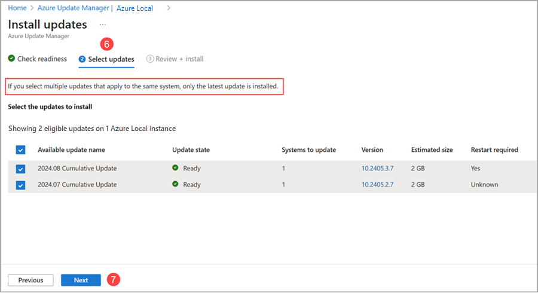
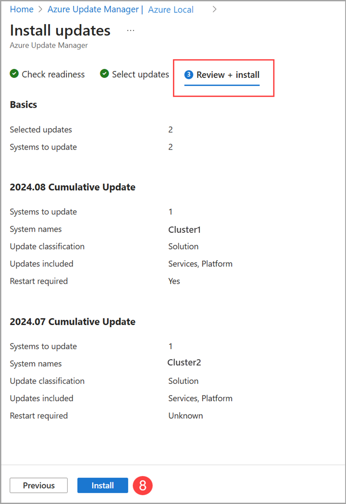

5. Select **Next**.

6. On the **Select updates** page, specify the updates you want to include in the deployment.
    1. View and select the available updates to install on your Azure Local machines.
    2. Select the **Version** link to view the update components, versions, and update release notes.
    3. Select the Details, **View details** link, to view the update release notes.

7. Select **Next**.

    

8. On the **Review + install** page, verify your update deployment options, and then select **Install**.

    

   You should see a notification that confirms the installation of updates. If you don’t see the notification, select the **notification icon** in the top right taskbar.

    
