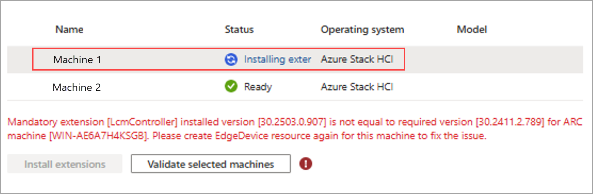
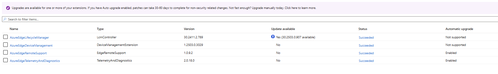

# Known issues in Azure Local

This article identifies critical known issues and their workarounds in Azure Local.

These release notes are continuously updated, and as critical issues requiring a workaround are discovered, they're added. Before you deploy your Azure Local instance, carefully review the information contained here.

> [!IMPORTANT]
> For information about supported update paths for this release, see [Release information](./release-information-23h2.md#about-azure-local-releases).

For more information about new features in this release, see [What's new for Azure Local](whats-new.md).

::: moniker range="=azloc-2507"

## Known issues for version 2507

For the 2507 release of Azure Local, Microsoft released two security updates, each aligned with a specific OS build. The following table provides the specific versions and their OS builds:

| Solution version  | OS build  |
|---------|---------|---------|
| 11.2507.1001.5          | 25398.1732        |
| 12.2507.1001.6         | 26100.4652       |

> [!IMPORTANT]
> The new deployments of this software use the **12.2507.1001.6** build. You can also update an existing deployment from 2505 by using **11.2507.1001.5**.

Release notes for this version include the issues fixed in this release, known issues in this release, and release note issues carried over from previous versions.

> [!NOTE]
> For detailed remediation for common known issues, see the [Azure Local Supportability](https://github.com/Azure/AzureStackHCI-Supportability) GitHub repository.

## Fixed issues

The following table lists the fixed issues in this release:

|Feature  |Issue  |Comments  |
|---------|---------|---------|
| Update <!--33470082--> |  Solution update fails with the error: `Unable to install solution update "11.2506.1001.24" - Type 'UpdateFOD' of Role 'ComposedImageUpdate' raised an exception.` |  |


## Known issues

Microsoft isn't aware of any known issues in this release.

## Known issues from previous releases

The following table lists the known issues from previous releases:

|Feature  |Issue  |Workaround  |
|---------|---------|---------|
| Add server <br> Repair server <!--32447442--> | The `Add-server` and `Repair-server` cmdlets fail with the error: <br> `Cluster Build ID matches node to add's Build ID`. | Use the OS image of the same solution version as that running on the existing cluster. To get the OS image, identify and download the image version from this [Release table](https://github.com/Azure-Samples/AzureLocal/blob/main/os-image/os-image-tracking-table.md). |
| Deployment <!--33008717--> | In this release and previous releases, registration fails with the following error when you try to register Azure Local machines with Azure Arc: <br>`AZCMAgent command failed with error: >> exitcode: 42. Additional Info: See https://aka.ms/arc/azcmerror`. | For detailed steps on how to resolve this issue, see the [Troubleshooting guide](https://github.com/Azure/AzureLocal-Supportability/blob/users/kagoyal/tsg-error42/TSG/ArcRegistration/TSG%20%7C%20Arc%20registration%20failing%20with%20error%2042.md). |
| Azure Local VM management | The Mochostagent service might appear to be running but can get stuck without updating logs for over a month. You can identify this issue by checking the service logs in `C:\programdata\mochostagent\logs` to see if logs are being updated. | Run the following command to restart the mochostagent service: `restart-service mochostagent`. |
| Update | When viewing the readiness check results for an Azure Local instance via the Azure Update Manager, there might be multiple readiness checks with the same name.  |There's no known workaround in this release. Select **View details** to view specific information about the readiness check. |
| Update | There's an intermittent issue in this release when the Azure portal incorrectly reports the update status as **Failed to update** or **In progress** though the update is complete.  |[Connect to your Azure Local instance](./update/update-via-powershell-23h2.md#connect-to-your-azure-local) via a remote PowerShell session. To confirm the update status, run the following PowerShell cmdlets: <br><br> `$Update = get-solutionupdate`\| `? version -eq "<version string>"`<br><br>Replace the version string with the version you're running. For example, "10.2405.0.23". <br><br>`$Update.state`<br><br>If the update status is **Installed**, no further action is required on your part. The Azure portal refreshes the status correctly within 24 hours. <br> To refresh the status sooner, follow these steps on one of the nodes. <br>Restart the Cloud Management cluster group.<br>`Stop-ClusterGroup "Cloud Management"`<br>`Start-ClusterGroup "Cloud Management"`|
| Add server <!--26852600--> |In this release and previous releases, when adding a machine to the system, isn't possible to update the proxy bypass list string to include the new machine. Updating environment variables proxy bypass list on the hosts won't update the proxy bypass list on Azure resource bridge or AKS. |There's no workaround in this release. If you encounter this issue, contact Microsoft Support to determine next steps.|
| Azure Local VM management |Arc Extensions on Azure Local VMs stay in "Creating" state indefinitely. | Sign in to the VM, open a command prompt, and type the following: <br> **Windows**: <br> `notepad C:\ProgramData\AzureConnectedMachineAgent\Config\agentconfig.json` <br> **Linux**: <br> `sudo vi /var/opt/azcmagent/agentconfig.json` <br>  Next, find the `resourcename` property. Delete the GUID that is appended to the end of the resource name, so this property matches the name of the VM. Then restart the VM.|
| Azure Local VM management |Restart of Azure Local VM operation completes after approximately 20 minutes although the VM itself restarts in about a minute.| There's no known workaround in this release.  |
| Azure portal <!--25741164--> |In some instances, the Azure portal might take a while to update and the view might not be current.| You might need to wait for 30 minutes or more to see the updated view. |
| Azure Local VM management |Deleting a network interface on an Azure Local VM from Azure portal doesn't work in this release.| Use the Azure CLI to first remove the network interface and then delete it. For more information, see [Remove the network interface](/cli/azure/stack-hci-vm/nic#az-stack-hci-vm-nic-remove) and see [Delete the network interface](/cli/azure/stack-hci-vm/network/nic#az-stack-hci-vm-network-nic-delete).|
| Update | When updating the Azure Local instance via the Azure Update Manager, the update progress and results may not be visible in the Azure portal.| To work around this issue, on each node, add the following registry key (no value needed):<br><br>`New-Item -Path "HKLM:\SYSTEM\CurrentControlSet\Services\HciCloudManagementSvc\Parameters" -force`</br><br> Then on one of the nodes, restart the Cloud Management cluster group. </br><br>`Stop-ClusterGroup "Cloud Management"`</br><br>`Start-ClusterGroup "Cloud Management"`</br><br> This won't fully remediate the issue as the progress details may still not be displayed for a duration of the update process. To get the latest update details, you can [Retrieve the update progress with PowerShell](./update/update-via-powershell-23h2.md#step-6-track-update-progress). |
| Security <!-- 56969147 --> | When fixing the compliance for the minimum password length rule, even after you've changed the minimum password length on the Azure Local host to 14, you continue to see it as non-compliant in Azure policy.  | You can verify the length of the password using the `net accounts` cmdlet. In the output, find **Minimum password length** to see the value. |
| Upgrade <!--33417006-->| The upgrade banner is currently available for users using the Azure Government cloud. However, the environment checker fails, suggesting that Azure Government clouds are not supported. | There's no workaround in this release. If you encounter this issue, contact Microsoft Support to determine next steps. |
| Security <!--30348397--> |  Azure Local might face an issue during normal operations (for example, Update, Repair) while using Defender for Endpoint and when the **Restrict App Execution** setting is enabled for one or more servers in the deployment.  | Disable the **Restrict App Execution** setting in the Defender portal and reboot. If the issue persists, [open a support case](/azure/azure-portal/supportability/how-to-create-azure-support-request). |
| Deployment <!--33471589--> |  After Azure portal deployment, SConfig network settings shows the error: `Set-SCfNetworksetting : Cannot bind argument to parameter 'Value' because it is null.` | There's no known workaround in this release. |
| Update <!--33448368--> |  Cluster-Aware Updating runs might fail with the error:<br>`Type 'SBEPartnerConfirmCauDone' of Role 'SBE' raised an exception:<br>SBE_MsftCIOnlyCommon_CommonForTesting_4.2.2504.16: ErrorID: SBE-CAU-RUNNING-AFTER-DONE -- CAU run is still in progress when it should be done. See https://aka.ms/AzureLocal/SBE/CauHelp for help. Review full Get-CauRun output it identify if it is progressing or stuck. Wait for it to complete if progressing.` | For detailed steps on how to resolve this issue, see the [Troubleshooting guide](https://github.com/Azure/AzureLocal-Supportability/blob/main/TSG/SolutionExtension/SBE-CAU-RUNNING-AFTER-DONE-Single-node-fail-SBE-Update.md).|
| Deployment <!--33390832--> | In rare instances, deployment fails with errors during validation that state that the mandatory Arc extensions are not yet installed. | If you face this issue, retry the deployment. |

## Known and expected behaviors

The following table lists the known and expected system behaviors that shouldn't be considered as bugs or limitations.

| Feature  | Behavior  |  Workaround |
|---------|---------|---------|
| Operating system  | Restoring the registry using *RegBack* isn't supported on Azure Local. This operation can remove the Lifecycle Manager (LCM) and Microsoft On-premises Cloud (MOC) settings on your Azure Local instance, which can corrupt the solution.  | |
| Azure Local VM management| Using an exported Azure VM OS disk as a VHD to create a gallery image for provisioning an Azure Local VM is unsupported. | Run the command `restart-service mochostagent` to restart the mochostagent service. |

::: moniker-end

::: moniker range="=azloc-2506"

## Known issues for version 2506

For the 2506 release of Azure Local, Microsoft released two security updates, each aligned with a specific OS build. The following table provides the specific versions and their OS builds:

| Solution version  | OS build  |
|---------|---------|---------|
| 11.2506.1001.28          | 25398.1665         |
| 12.2506.1001.29         | 26100.4349        |

> [!IMPORTANT]
> The new deployments of this software use the **12.2506.1001.29** build. You can also update an existing deployment from 2505 using **11.2506.1001.28**.

Release notes for this version include the issues fixed in this release, known issues in this release, and release note issues carried over from previous versions.

> [!NOTE]
> For detailed remediation for common known issues, see the [Azure Local Supportability](https://github.com/Azure/AzureStackHCI-Supportability) GitHub repository.

## Fixed issues

The following table lists the fixed issues in this release:

|Feature|Issue|Workaround/Comments|
|------|------|----------|
| Azure Local VMs <!--30035765-->| When creating a VM, there is no option to prompt for password. | Password is prompted when `--password` is not explicitly passed. This provides customers a more secure way to input password.  |
| Azure Local VMs <!--32130105--> | When creating a VM, `--admin-username` and `--password` are required for guest management enablement. | Unbound requirement for guest management enablement. Now, when creating a VM, `--admin-username` and `--password` are required unless the OS disk is provided or the `--authentication-type` is `ssh`. |
| Azure Local VMs <!--32417179--> | In some cases, VM update operations were incorrectly shown as successful on the Azure portal even though they had failed in the underlying infrastructure.  | Improved error reporting to ensure the Azure portal accurately reflects the true status of VM update operations. |
| Azure Local VMs <!--32503885--> | Deleting a logical network with an attached AKS cluster would leave behind orphaned on-premises resources.  | Properly detects and handles AKS cluster dependencies during logical network deletion to prevent resource leaks. |
| Azure Local VMs <!--32698064--> | Unable to create VHDs using  `--download-url` | Correctly initializes VHD property before assigning the download URL, ensuring successful disk creation. |
| Azure Local VMs <!--32195527--> | In some cases, deleting a VM from multiple platforms (Azure portal, Windows Admin Center, Failover Cluster Manager) could cause its high availability (HA) status to remain stuck in a pending state. | Correctly updates the HA status when the VM is removed from the cluster, preventing it from getting stuck. |
| Azure Local VMs <!--32255591--> | After creating a VM, a temporary ISO file used for guest agent setup was sometimes left attached. | ISO file is automatically removed after VM creation. |
| Azure Local VMs <!--30846971--> | In some cases, VM deletions did not properly clean up associated network interfaces or disks, leaving behind orphaned resources that blocked reuse of IP addresses and storage. | All dependent resources are correctly detached and deleted when a VM is deleted, preventing resource leaks. |
| Azure Local VMs <!--30651739--> | Improved validation for the IP address of the infrastructure range.  |  |
| Azure Local VMs <!--32078730--> | Improved behavior for loading PowerShell modules.  |  |
| Azure Local VMs <!--32311676--> | Added flag to enable decryption of volumes when re-attaching them.  |  |

## Known issues in this release

The following table lists the known issues in this release:

|Feature  |Issue  |Workaround  |
|---------|---------|---------|
| Security <!--30348397--> |  Azure Local might face an issue during normal operations (for example, Update, Repair) while using Defender for Endpoint and when the **Restrict App Execution** setting is enabled for one or more servers in the deployment.  | Disable the **Restrict App Execution** setting in the Defender portal and reboot. If the issue persists, [open a support case](/azure/azure-portal/supportability/how-to-create-azure-support-request). |
| Deployment <!--33390832--> | In rare instances, deployment fails with errors during validation that state that the mandatory Arc extensions are not yet installed. | If you face this issue, retry the deployment. |
| Update <!--33470082--> |  Solution update fails with the error: `Unable to install solution update "11.2506.1001.24" - Type 'UpdateFOD' of Role 'ComposedImageUpdate' raised an exception.` | For detailed steps on how to resolve this issue, see the [Troubleshooting guide](https://github.com/Azure/AzureLocal-Supportability/blob/main/TSG/Update/SolutionUpdate-UpdateFOD.md). |
| Deployment <!--33471589--> |  After Azure portal deployment, SConfig network settings shows the error: `Set-SCfNetworksetting : Cannot bind argument to parameter 'Value' because it is null.` | There's no known workaround in this release. |
| Update <!--33448368--> |  Cluster-Aware Updating runs might fail with the error:<br>`Type 'SBEPartnerConfirmCauDone' of Role 'SBE' raised an exception:<br>SBE_MsftCIOnlyCommon_CommonForTesting_4.2.2504.16: ErrorID: SBE-CAU-RUNNING-AFTER-DONE -- CAU run is still in progress when it should be done. See https://aka.ms/AzureLocal/SBE/CauHelp for help. Review full Get-CauRun output it identify if it is progressing or stuck. Wait for it to complete if progressing.` | Wait for CAU run to complete (wait for `Get-CauRun` to report `RunNotInProgress`) and resume the update. |

## Known issues from previous releases

The following table lists the known issues from previous releases:

|Feature  |Issue  |Workaround  |
|---------|---------|---------|
| Add server <br> Repair server <!--32447442--> | The `Add-server` and `Repair-server` cmdlets fail with the error: <br> `Cluster Build ID matches node to add's Build ID`. | Use the OS image of the same solution version as that running on the existing cluster. To get the OS image, identify and download the image version from this [Release table](https://github.com/Azure-Samples/AzureLocal/blob/main/os-image/os-image-tracking-table.md). |
| Deployment <!--33008717--> | In this release and previous releases, registration fails with the following error when you try to register Azure Local machines with Azure Arc: <br>`AZCMAgent command failed with error: >> exitcode: 42. Additional Info: See https://aka.ms/arc/azcmerror`. | For detailed steps on how to resolve this issue, see the [Troubleshooting guide](https://github.com/Azure/AzureLocal-Supportability/blob/users/kagoyal/tsg-error42/TSG/ArcRegistration/TSG%20%7C%20Arc%20registration%20failing%20with%20error%2042.md). |
| Azure Local VM management | The Mochostagent service might appear to be running but can get stuck without updating logs for over a month. You can identify this issue by checking the service logs in `C:\programdata\mochostagent\logs` to see if logs are being updated. | Run the following command to restart the mochostagent service: `restart-service mochostagent`. |
| Update | When viewing the readiness check results for an Azure Local instance via the Azure Update Manager, there might be multiple readiness checks with the same name.  |There's no known workaround in this release. Select **View details** to view specific information about the readiness check. |
| Update | There's an intermittent issue in this release when the Azure portal incorrectly reports the update status as **Failed to update** or **In progress** though the update is complete.  |[Connect to your Azure Local instance](./update/update-via-powershell-23h2.md#connect-to-your-azure-local) via a remote PowerShell session. To confirm the update status, run the following PowerShell cmdlets: <br><br> `$Update = get-solutionupdate`\| `? version -eq "<version string>"`<br><br>Replace the version string with the version you're running. For example, "10.2405.0.23". <br><br>`$Update.state`<br><br>If the update status is **Installed**, no further action is required on your part. The Azure portal refreshes the status correctly within 24 hours. <br> To refresh the status sooner, follow these steps on one of the nodes. <br>Restart the Cloud Management cluster group.<br>`Stop-ClusterGroup "Cloud Management"`<br>`Start-ClusterGroup "Cloud Management"`|
| Add server <!--26852600--> |In this release and previous releases, when adding a machine to the system, isn't possible to update the proxy bypass list string to include the new machine. Updating environment variables proxy bypass list on the hosts won't update the proxy bypass list on Azure resource bridge or AKS. |There's no workaround in this release. If you encounter this issue, contact Microsoft Support to determine next steps.|
| Azure Local VM management |Arc Extensions on Azure Local VMs stay in "Creating" state indefinitely. | Sign in to the VM, open a command prompt, and type the following: <br> **Windows**: <br> `notepad C:\ProgramData\AzureConnectedMachineAgent\Config\agentconfig.json` <br> **Linux**: <br> `sudo vi /var/opt/azcmagent/agentconfig.json` <br>  Next, find the `resourcename` property. Delete the GUID that is appended to the end of the resource name, so this property matches the name of the VM. Then restart the VM.|
| Azure Local VM management |Restart of Azure Local VM operation completes after approximately 20 minutes although the VM itself restarts in about a minute.| There's no known workaround in this release.  |
| Azure portal <!--25741164--> |In some instances, the Azure portal might take a while to update and the view might not be current.| You might need to wait for 30 minutes or more to see the updated view. |
| Azure Local VM management |Deleting a network interface on an Azure Local VM from Azure portal doesn't work in this release.| Use the Azure CLI to first remove the network interface and then delete it. For more information, see [Remove the network interface](/cli/azure/stack-hci-vm/nic#az-stack-hci-vm-nic-remove) and see [Delete the network interface](/cli/azure/stack-hci-vm/network/nic#az-stack-hci-vm-network-nic-delete).|
| Update | When updating the Azure Local instance via the Azure Update Manager, the update progress and results may not be visible in the Azure portal.| To work around this issue, on each node, add the following registry key (no value needed):<br><br>`New-Item -Path "HKLM:\SYSTEM\CurrentControlSet\Services\HciCloudManagementSvc\Parameters" -force`</br><br> Then on one of the nodes, restart the Cloud Management cluster group. </br><br>`Stop-ClusterGroup "Cloud Management"`</br><br>`Start-ClusterGroup "Cloud Management"`</br><br> This won't fully remediate the issue as the progress details may still not be displayed for a duration of the update process. To get the latest update details, you can [Retrieve the update progress with PowerShell](./update/update-via-powershell-23h2.md#step-6-track-update-progress). |
| Security <!-- 56969147 --> | When fixing the compliance for the minimum password length rule, even after you've changed the minimum password length on the Azure Local host to 14, you continue to see it as non-compliant in Azure policy.  | You can verify the length of the password using the `net accounts` cmdlet. In the output, find **Minimum password length** to see the value. |
| Upgrade <!--33417006-->| The upgrade banner is currently available for users using the Azure Government cloud. However, the environment checker fails, suggesting that Azure Government clouds are not supported. | There's no workaround in this release. If you encounter this issue, contact Microsoft Support to determine next steps. |

## Known and expected behaviors

The following table lists the known and expected system behaviors that shouldn't be considered as bugs or limitations.

| Feature  | Behavior  |  Workaround |
|---------|---------|---------|
| Operating system  | Restoring the registry using *RegBack* isn't supported on Azure Local. This operation can remove the Lifecycle Manager (LCM) and Microsoft On-premises Cloud (MOC) settings on your Azure Local instance, which can corrupt the solution.  | |
| Azure Local VM management| Using an exported Azure VM OS disk as a VHD to create a gallery image for provisioning an Azure Local VM is unsupported. | Run the command `restart-service mochostagent` to restart the mochostagent service. |

::: moniker-end

::: moniker range="=azloc-2505"

This article identifies critical known issues and their workarounds in Azure Local.

These release notes are continuously updated, and as critical issues requiring a workaround are discovered, they're added. Before you deploy your Azure Local instance, carefully review the information contained here.

> [!IMPORTANT]
> For information about supported update paths for this release, see [Release information](./release-information-23h2.md#about-azure-local-releases).

For more information about new features in this release, see [What's new for Azure Local](whats-new.md).

## Known issues for version 2505

For the 2505 release of Azure Local, Microsoft released two security updates: one for existing deployments and another for new deployments. The following table provides information about different deployment types, their corresponding security updates, and OS builds:

| Deployment type  | Solution version  | OS build  |
|---------|---------|---------|
| Existing deployments    | 11.2505.1001.22          | 25398.1611         |
| New deployments    | 12.2505.1001.23         | 26100.4061        |

> [!IMPORTANT]
> The new deployments of this software use the **12.2505.1001.23** build. You can also update an existing deployment from 2504 using **11.2505.1001.22**.

Release notes for this version include the issues fixed in this release, known issues in this release, and release note issues carried over from previous versions.

> [!NOTE]
> For detailed remediation for common known issues, see the [Azure Local Supportability](https://github.com/Azure/AzureStackHCI-Supportability) GitHub repository.

## Fixed issues

The following table lists the fixed issues in this release:

|Feature|Issue|Workaround/Comments|
|------|------|----------|
| Azure Local VMs <!--31710217-->| Timeout errors occur when creating a disk and gallery image. | Extended the timeout period to support larger disk and image size.  |
| Azure Local VMs <!--31388717--> | Mocguestagent gets stuck in a start/stop loop and can't connect to the host agent. | Improved Mocguestagent connectivity. |
| Azure Local VMs <!--31628331--> | Cannot delete a VM in the Azure portal or CLI after deleting it in Hyper-V. | If you delete the VM in Hyper-V instead of the Azure portal or CLI, delete the resource it in the Azure portal or CLI to clean it up. |
| Azure Local VMs <!--32258078--> | Unable to delete a data disk that failed to attach during VM creation.  | Fixed the attachment state of data disk to be accurate. You can now delete a data disk if it fails to attach during VM creation.  |
| Azure Local VMs <!--32475268--> | OS updates can automatically install on the third Tuesday of the month (for example, May 20, June 17, or July 15). This can cause unexpected outages or future issues because of mismatched OS versions for Azure Local.  | Removed logic that set up a scheduled CAU as part of some SBE updates.  |
| Deployment | Deployment via Azure Resource Manager (ARM) template fails with the following error during validation:<br> `Type 'DeployArb' of Role 'MocArb' raised an exception: [DeployArb:Fetching SP in CloudDeployment Scenario] Exception calling 'GetCredential' with '1' argument(s): 'Exception of type 'CloudEngine.Configurations.SecretNotFoundException' was thrown.' at at Get-CloudDeploymentServicePrincipal`. <br> The error is because of a missing SPN during deployment. | For detailed steps on how to resolve this issue, see the [Troubleshooting guide](https://github.com/Azure/AzureLocal-Supportability/blob/main/TSG/Deployment/TSG-Azure-LOCAL-HCI-missing-spn.md). |
| Solution extension <!--32616426--> | Changed the severity level for the health check that validates the plugin's presence. | |
| Azure portal <!--32131565--> | Added a fix to fetch Storage account properties during redeployment. | |
| Azure portal <!--32105125--> | Added an error message about subscription access rights during Azure Local download. | |
| Azure portal <!--32379635--> | Added a warning message if the subscription is not registered during the Azure Local download. | |
| Azure portal <!--32694573--> | Improved logic to show Azure Arc-enabled machines for selection during deployment. | |
| Azure portal <!--32756322--> | Enhanced the setting of machines' state during deployment. | |
| Azure portal <!--30482549--> | Improved error handling and data processing. | |
| Azure portal <!--31931881--> | Added a fix to disable the validation button until extension installations are complete during deployment. | |
| Deployment <!--31617326--> | Added validation to check for required permissions to change access control lists (ACL). | |
| Deployment <!--32199814--> | Added a server-side filter to the WMI call to improve performance and reduce call time. | |
| Deployment <!--31911046--> | Added fix to dispose of the PowerShell objects after use to improve performance when creating new PowerShell instances. | |
| Deployment <!--642400448--> | Fixed the time zone issue when running the **Install Azure Stack HCI** wizard and selecting a time zone. The **Install Azure Stack HCI** wizard now correctly applies the selected time zone during deployment. | |
| Security management <!--57340784--> | Fixed **Security defaults**, **Application control**, and **Data protections** pages showing as *Unknown* in the security compliance report. | |
| Add server <br> Repair server <!--32483959--> | Fixed running `Add-server` and `Repair-server` cmdlets with a customized storage adapter IP in Azure Local which resulted in the error: `Type 'ConfigureAzureStackHostStorageAdpaterIPAddressesInAddRepairNode' of Role 'HostNetwork' raised an exception: Connecting to remote server <MACHINE> failed with the following error message: Access is denied.`. | |

## Known issues in this release

The following table lists the known issues in this release:

|Feature  |Issue  |Workaround  |
|---------|---------|---------|
| Update <!--54889342--> |  A critical VM operational status not OK alert is shown in the Azure portal under **Update readiness** and in the **Alerts** pane after the update has completed successfully. Additionally, the alert appears when running the `Get-HealthFault` cmdlet. | No action is required on your part. This alert will resolve automatically in a few days. |
| Deployment <!--33153622-->| Updating Azure Arc extensions manually from the Azure Local Machine page via the Azure portal will result in issues during deployment. The extensions that shouldn't be updated manually are: `AzureEdgeDeviceManagement`, `AzureEdgeLifecycleManager`, and `AzureEdgeAKVBackupForWindows`. | Installing extensions manually from the Azure Local machine page is not supported. |
| Upgrade <!--33417006-->| The upgrade banner is currently available for users using the Azure Government cloud. However, the environment checker fails, suggesting that Azure Government clouds are not supported. | There's no workaround in this release. If you encounter this issue, contact Microsoft Support to determine next steps. |


## Known issues from previous releases

The following table lists the known issues from previous releases:

|Feature  |Issue  |Workaround  |
|---------|---------|---------|
| Add server <br> Repair server <!--32447442--> | The `Add-server` and `Repair-server` cmdlets fail with the error: <br> `Cluster Build ID matches node to add's Build ID`. | Use the OS image of the same solution version as that running on the existing cluster. To get the OS image, identify and download the image version from this [Release table](https://github.com/Azure-Samples/AzureLocal/blob/main/os-image/os-image-tracking-table.md). |
| Deployment <!--33008717--> | In this release and previous releases, registration fails with the following error when you try to register Azure Local machines with Azure Arc: <br>`AZCMAgent command failed with error: >> exitcode: 42. Additional Info: See https://aka.ms/arc/azcmerror`. | For detailed steps on how to resolve this issue, see the [Troubleshooting guide](https://github.com/Azure/AzureLocal-Supportability/blob/users/kagoyal/tsg-error42/TSG/ArcRegistration/TSG%20%7C%20Arc%20registration%20failing%20with%20error%2042.md). |
| Update | When viewing the readiness check results for an Azure Local instance via the Azure Update Manager, there might be multiple readiness checks with the same name.  |There's no known workaround in this release. Select **View details** to view specific information about the readiness check. |
| Update | There is an intermittent issue in this release where the Azure portal may incorrectly display the update status as **Failed to update** or **In progress**, even though the update has actually completed successfully. This behavior is particularly observed when updating Azure Local instances via Azure Update Manager, where the update progress and results may not be visible in the portal.  | You might need to wait up to 30 minutes or more to see the updated status. If the status still isn't refreshed after that time, follow these steps: [Connect to your Azure Local instance](./update/update-via-powershell-23h2.md#connect-to-your-azure-local) via a remote PowerShell session. To confirm the update status, run the following PowerShell cmdlets: <br><br> `$Update = get-solutionupdate`\| `? version -eq "<version string>"`<br><br>Replace the version string with the version you're running. For example, "10.2405.0.23". <br><br>`$Update.state`<br><br>If the update status is **Installed**, no further action is required on your part. Azure portal refreshes the status correctly within 24 hours. <br> To refresh the status sooner, follow these steps on one of the nodes. <br>Restart the Cloud Management cluster group.<br>`Stop-ClusterGroup "Cloud Management"`<br>`Start-ClusterGroup "Cloud Management"`|
| Add server <!--26852600--> |In this release and previous releases, when adding a machine to the system, isn't possible to update the proxy bypass list string to include the new machine. Updating environment variables proxy bypass list on the hosts won't update the proxy bypass list on Azure resource bridge or AKS. |There's no workaround in this release. If you encounter this issue, contact Microsoft Support to determine next steps.|
| Azure portal <!--25741164--> |In some instances, the Azure portal might take a while to update and the view might not be current.| You might need to wait for 30 minutes or more to see the updated view. |
| Azure Local VM management |In rare instances, deleting a network interface on an Azure Local VM from Azure portal doesn't work in this release.| Use the Azure CLI to first remove the network interface and then delete it. For more information, see [Remove the network interface](/cli/azure/stack-hci-vm/nic#az-stack-hci-vm-nic-remove) and see [Delete the network interface](/cli/azure/stack-hci-vm/network/nic#az-stack-hci-vm-network-nic-delete).|
| Security <!-- 56969147 --> | When fixing the compliance for the minimum password length rule, even after you've changed the minimum password length on the Azure Local host to 14, you continue to see it as non-compliant in Azure policy.  | You can verify the length of the password using the `net accounts` cmdlet. In the output, find **Minimum password length** to see the value. |
| Azure Arc registration <!-- 32995193 --> | When registering a new machine with Azure Arc, registration fails during `ImageRecipeValidationTests` with the following error:<br>` "Responses": [ { "Name": "ImageRecipeValidation", "Status": "Failed", "Errors": [ { "ErrorMessage": "Diagnostics failed for the test category: ImageRecipeValidation.", "StackTrace": null, "ExceptionType": "DiagnosticsTestFailedException", "RecommendedActions": [ "Please contact Microsoft support." ] } ] } ` | For detailed steps on how to resolve this issue, see the [Troubleshooting guide](https://github.com/Azure/AzureLocal-Supportability/blob/users/kagoyal/tsg-error42/TSG/ArcRegistration/TSG%20%7c%20Arc%20registration%20failing%20with%20error%2042.md). |
| Upgrade <!--32812323--> | Failed to upgrade cluster with `Get-AzureStackHCI ConnectionStatus` in `RepairRegistration` due to the Virtualization-Based Security (VBS) master key lost during Secure Boot certificate installation. | For detailed steps on how to resolve this issue, see the [Troubleshooting guide](https://github.com/Azure/AzureLocal-Supportability/blob/main/TSG/Update/BreakFix-Update-Resolve-subscription-status-precheck-failure.md). |
| Registration <!--32812323-->  | After installing certain updates (including BIOS), clusters may report `RepairRegistrationRequired` and show a stale connection state.  | For detailed steps on how to resolve this issue, see the [Troubleshooting guide](https://github.com/Azure/AzureLocal-Supportability/blob/main/TSG/ClusterRegistration/BreakFix-Registration-How-to-resolve-a-repairregistrationrequired-connection-status-after-service-or-bios-updates.md).  |

## Known and expected behaviors

The following table lists the known and expected system behaviors that shouldn't be considered as bugs or limitations.

| Feature  | Behavior  |  Workaround |
|---------|---------|---------|
| Operating system  | Restoring the registry using *RegBack* isn't supported on Azure Local. This operation can remove the Lifecycle Manager (LCM) and Microsoft On-premises Cloud (MOC) settings on your Azure Local instance, which can corrupt the solution.  | |
| Azure Local VM management| Using an exported Azure VM OS disk as a VHD to create a gallery image for provisioning an Azure Local VM is unsupported. | Run the command `restart-service mochostagent` to restart the mochostagent service. |

::: moniker-end

::: moniker range="=azloc-2504"

## Known issues for version 2504

For the 2504 release of Azure Local, Microsoft released two security updates: one for existing deployments and another for new deployments. The following table provides information about different deployment types, their corresponding security updates, and OS builds:


| Deployment type  | Solution version  | OS build  |
|---------|---------|---------|
| Existing deployments    | 11.2504.1001.19          | 25398.1551         |
| New deployments    | 12.2504.1001.20         | 26100.3775         |

> [!IMPORTANT]
> The new deployments of this software use the **12.2504.1001.20** build. You can also update an existing deployment from 2503 using **11.2504.1001.19**.

Release notes for this version include the issues fixed in this release, known issues in this release, and release note issues carried over from previous versions.

> [!NOTE]
> For detailed remediation for common known issues, see the [Azure Local Supportability](https://github.com/Azure/AzureStackHCI-Supportability) GitHub repository.

## Fixed issues

The following table lists the fixed issues in this release:

|Feature|Issue|Workaround/Comments|
|------|------|----------|
| Azure Local VMs <!--31912537-->| Subsequent deployments or operations on source image fail if a VM is created with OS disk and source image located on the same CSV and an error occurred during a previous copy of the source image. |  |
| Azure Local VMs <!--31925164--> | Multiple Hyper-V VMs for a single Azure Local VM that failed to be created are left running on Azure Local. | |
| Azure Local VMs <!--30299461--> | Storage path deletion times out if AKS node disks are present. | No timeout and will error out with proper error message listing the resources on the storage path. |
| Azure Local VMs <!--31569686--> | Issues with deleting resources that are in use by other resources that no longer exist on the cluster.  | Enhanced validation to check if resources are present on the cluster before attempting to delete.  |
| Azure Local VMs <!--30353875--> | Issues with deleting and resizing an Azure Local VM that has checkpoint(s).  | You can checkpoint an Azure Local VM with on-premises tools. The VM will remain manageable from the Azure portal.  |
| Solution extension <!--31050791--> | Improved error message to fix firewall blocking access to solution extension manifest endpoints. | |
| Solution extension <!--31630939--> | Improved reliability of copying solution extension content locally to each machine. | |
| Solution extension <!--31632765--> | Added specification of plug-in name in the solution extension. | |
| Solution extension <!--32105125--> | Fixed issue where system was unable to get available solution extension updates. | |
| Update <!--26952715--> | Simplified the Azure portal experience for viewing the progress and history of update runs. | |
| Update  | When monitoring update progress in the Azure Update Management portal, the progress might appear to not have updated for several hours. | Run `Get-SolutionUpdate` on one of the cluster nodes. If an update object is returned, the update might be taking longer than expected but it is progressing. If an update object is not returned, the update may be stalled. For detailed steps on how to resolve this issue, see the [Troubleshooting guide](https://github.com/Azure/AzureLocal-Supportability/blob/main/TSG/Update/Get-SolutionUpdate-GatewayTimeout.md).|

## Known issues in this release

The following table lists the known issues in this release:

|Feature  |Issue  |Workaround  |
|---------|---------|---------|
| Add server <br> Repair server <!--32447442--> | The `Add-server` and `Repair-server` cmdlets fail with the error: <br> `Cluster Build ID matches node to add's Build ID`. | Use the OS image of the same solution version as that running on the existing cluster. To get the OS image, identify and download the image version from this [Release table](https://github.com/Azure-Samples/AzureLocal/blob/main/os-image/os-image-tracking-table.md). |
| Add server <br> Repair server <!--32483959--> | If running `Add-server` and `Repair-server` cmdlets with customized storage adapter IP configured in your Azure Local instance, the operation might fail with the error: <br> `Type 'ConfigureAzureStackHostStorageAdpaterIPAddressesInAddRepairNode' of Role 'HostNetwork' raised an exception: Connecting to remote server <MACHINE> failed with the following error message : Access is denied.`. | Contact Microsoft Support if you experience this issue. |
| Security management <!--57340784--> | The **Security defaults**, **Application control**, and **Data protections** pages show *Unknown* for all security settings. | This issue is only in the security compliance report. The states of the security settings are unaffected. Use PowerShell to verify the compliance status of the security settings. <br><br>For more information, see [Manage secure baseline via PowerShell cmdlets](./manage/manage-secure-baseline.md#powershell-cmdlet-properties) |
| Deployment <!--33008717--> | In this release and previous releases, registration fails with the following error when you try to register Azure Local machines with Azure Arc: <br>`AZCMAgent command failed with error: >> exitcode: 42. Additional Info: See https://aka.ms/arc/azcmerror`. | For detailed steps on how to resolve this issue, see the [Troubleshooting guide](https://github.com/Azure/AzureLocal-Supportability/blob/users/kagoyal/tsg-error42/TSG/ArcRegistration/TSG%20%7C%20Arc%20registration%20failing%20with%20error%2042.md). |
| Azure Arc registration <!-- 32995193 --> | When registering a new machine with Azure Arc, registration fails during `ImageRecipeValidationTests` with the following error:<br>` "Responses": [ { "Name": "ImageRecipeValidation", "Status": "Failed", "Errors": [ { "ErrorMessage": "Diagnostics failed for the test category: ImageRecipeValidation.", "StackTrace": null, "ExceptionType": "DiagnosticsTestFailedException", "RecommendedActions": [ "Please contact Microsoft support." ] } ] } ` | For detailed steps on how to resolve this issue, see the [Troubleshooting guide](https://github.com/Azure/AzureLocal-Supportability/blob/users/kagoyal/tsg-error42/TSG/ArcRegistration/TSG%20%7c%20Arc%20registration%20failing%20with%20error%2042.md). |
| Deployment <!--642400448--> | In the 2504 release, when you run the **Install Azure Stack HCI** wizard and select a time zone, the system continues to use Pacific Standard Time (PST), regardless of your selection. | This is not a blocking issue, and deployment will still complete successfully. |

## Known issues from previous releases

The following table lists the known issues from previous releases:

|Feature  |Issue  |Workaround  |
|---------|---------|---------|
| Update | When viewing the readiness check results for an Azure Local instance via the Azure Update Manager, there might be multiple readiness checks with the same name.  |There's no known workaround in this release. Select **View details** to view specific information about the readiness check. |
| Update | There is an intermittent issue in this release where the Azure portal may incorrectly display the update status as **Failed to update** or **In progress**, even though the update has actually completed successfully. This behavior is particularly observed when updating Azure Local instances via Azure Update Manager, where the update progress and results may not be visible in the portal.  | You might need to wait up to 30 minutes or more to see the updated status. If the status still isn't refreshed after that time, follow these steps: [Connect to your Azure Local instance](./update/update-via-powershell-23h2.md#connect-to-your-azure-local) via a remote PowerShell session. To confirm the update status, run the following PowerShell cmdlets: <br><br> `$Update = get-solutionupdate`\| `? version -eq "<version string>"`<br><br>Replace the version string with the version you're running. For example, "10.2405.0.23". <br><br>`$Update.state`<br><br>If the update status is **Installed**, no further action is required on your part. Azure portal refreshes the status correctly within 24 hours. <br> To refresh the status sooner, follow these steps on one of the nodes. <br>Restart the Cloud Management cluster group.<br>`Stop-ClusterGroup "Cloud Management"`<br>`Start-ClusterGroup "Cloud Management"`|
| Add server <!--26852600--> |In this release and previous releases, when adding a machine to the system, isn't possible to update the proxy bypass list string to include the new machine. Updating environment variables proxy bypass list on the hosts won't update the proxy bypass list on Azure resource bridge or AKS. |There's no workaround in this release. If you encounter this issue, contact Microsoft Support to determine next steps.|
| Azure portal <!--25741164--> |In some instances, the Azure portal might take a while to update and the view might not be current.| You might need to wait for 30 minutes or more to see the updated view. |
| Azure Local VM management |In rare instances, deleting a network interface on an Azure Local VM from Azure portal doesn't work in this release.| Use the Azure CLI to first remove the network interface and then delete it. For more information, see [Remove the network interface](/cli/azure/stack-hci-vm/nic#az-stack-hci-vm-nic-remove) and see [Delete the network interface](/cli/azure/stack-hci-vm/network/nic#az-stack-hci-vm-network-nic-delete).|
| Security <!-- 56969147 --> | When fixing the compliance for the minimum password length rule, even after you've changed the minimum password length on the Azure Local host to 14, you continue to see it as non-compliant in Azure policy.  | You can verify the length of the password using the `net accounts` cmdlet. In the output, find **Minimum password length** to see the value. |
| Upgrade <!--32812323--> | Failed to upgrade cluster with `Get-AzureStackHCI ConnectionStatus` in `RepairRegistration` due to the Virtualization-Based Security (VBS) master key lost during Secure Boot certificate installation. | For detailed steps on how to resolve this issue, see the [Troubleshooting guide](https://github.com/Azure/AzureLocal-Supportability/blob/main/TSG/Update/BreakFix-Update-Resolve-subscription-status-precheck-failure.md). |
| Registration <!--32812323-->  | After installing certain updates (including BIOS), clusters may report `RepairRegistrationRequired` and show a stale connection state.  | For detailed steps on how to resolve this issue, see the [Troubleshooting guide](https://github.com/Azure/AzureLocal-Supportability/blob/main/TSG/ClusterRegistration/BreakFix-Registration-How-to-resolve-a-repairregistrationrequired-connection-status-after-service-or-bios-updates.md).  |

## Known and expected behaviors

The following table lists the known and expected system behaviors that shouldn't be considered as bugs or limitations.

| Feature  | Behavior  |  Workaround |
|---------|---------|---------|
| Operating system  | Restoring the registry using *RegBack* isn't supported on Azure Local. This operation can remove the Lifecycle Manager (LCM) and Microsoft On-premises Cloud (MOC) settings on your Azure Local instance, which can corrupt the solution.  | |
| Azure Local VM management| Using an exported Azure VM OS disk as a VHD to create a gallery image for provisioning an Azure Local VM is unsupported. | Run the command `restart-service mochostagent` to restart the mochostagent service. |

::: moniker-end

::: moniker range="=azloc-2503"

## Known issues for version 2503

This software release maps to software version number **2503.0.13**.

> [!IMPORTANT]
> The new deployments of this software use the **2503.0.13** build. You can also update from 2411.3.

Release notes for this version include the issues fixed in this release, known issues in this release, and release note issues carried over from previous versions.

> [!NOTE]
> For detailed remediation for common known issues, see the [Azure Local Supportability](https://github.com/Azure/AzureStackHCI-Supportability) GitHub repository.

## Fixed issues

The following table lists the fixed issues in this release:

|Feature|Issue|Workaround/Comments|
|------|------|----------|
| Azure Local VMs | Intermittent failures or timeouts when creating or deleting Azure Local VMs due to internal service entering a deadlocked state. | You can now deploy Azure Local VMs without facing timeout issues. |
| Azure Local VMs <!--ADO--> | Unable to delete a gallery image if the source Azure Local VM gallery image was created from, was deleted.| You can now delete a gallery image even if the source Azure Local VM the gallery image was created from, was deleted.|
| Azure Local VMs <!--ADO--> | After Azure Arc resource bridge disaster recovery, some Azure Local VMs may lose network connectivity. | Updated Azure Arc resource bridge disaster recovery logic to ensure network configurations of Azure Local VMs persists. |
| Azure Local VMs <!--ADO--> | Inaccurate power state reporting on Azure for Azure Local VMs when the source image for the VM is deleted from the cluster.  | Power operations shows consistent and accurate power state representation on Azure for Azure Local VMs with deleted source images.  |
| Azure Local VMs <!--ADO--> | Inaccurate power state reporting on Azure for Azure Local VMs when attempting power operations.  | Improved the accuracy of power state reconciliation by reducing latency and fixing a bug that impacted power operations visibility to Azure.  |
| Azure Local VMs <!--ADO--> | Unable to create a gallery image with specified storage path.  | You can now create a gallery image with specified storage path.  |
| Azure Local VMs <!--ADO--> | Running `azcmagent disconnect` deletes the Azure Local VM.  | Don't use `azcmagent disconnect` on Azure Local VMs. Use only `azcmagent disconnect -f` or `azcmagent disconnect --force-local-only`. This command disconnects the connected machine agent and keeps the VM running (no longer deletes). |
| Azure Local VM management | The Mochostagent service might appear to be running but can get stuck without updating logs for over a month. You can identify this issue by checking the service logs in `C:\programdata\mochostagent\logs` to see if logs are being updated. | Run the following command to restart the mochostagent service: `restart-service mochostagent`. |
| Azure Local VMs/Azure Migrate | Migration of Gen 1 (non-sysprep) VMs using Azure Migrate fails with the error: *Failed to clean up seed ISO disk from the file system for VM*. | Migration of Gen 1 (non-sysprep) VMs using Azure Migrate will no longer fail with this error.  |
| Azure Local VMs/Azure Migrate | VM creation from OS disk fails due to incorrect storage precheck. | VM creation succeeds regardless if the source is gallery image or OS disk.  |
| Deployment | When trying to deploy via the Azure portal, Azure Local machine nodes aren't visible in the Azure portal. | Azure Local deployments via the Azure portal are only supported for 2503 and later. For previous versions, [deploy via Azure Resource Manager (ARM) template](./deploy/deployment-azure-resource-manager-template.md). |
| Deployment | During the Azure Local deployment, `DeviceManagementExtension` fails to install when a proxy is configured. | Install previous `DeviceManangementExtension` version 1.2502.0.3012 when using a proxy. |
| Update <!--30345067--> | When updating from version 2408.2.7 to 2411.0.24, the update process could fail with the following error message: `Type 'CauPreRequisites' of Role 'CAU' raised an exception: Could not finish cau prerequisites due to error 'Cannot remove item C:\UpdateDistribution\<any_file_name>: Access to the path is denied.'` | This issue is now fixed. |
| Update <!--30232441--> | Ensure that Solution Builder Extension updates of type *Notify* that have been imported get copied correctly before validation.  |   |
| Update <!--30324217--> | Improved the Solution Extension Secret Location cmdlet help to provide better examples.  |   |
| Update <!--29409214--> | Added retry logic to Cluster-Aware Updating runs and health checks for cluster nodes.   |   |
| Update <!--31104115--> | Increased system stability during the .NET 8 updates.   |   |
| Update <!--ADO--> | With the 2411 release, solution and Solution Builder Extension update aren't combined in a single update run.  |To apply a Solution Builder Extension package, you need a separate update run.|
| Upgrade <!--29558170--> | Disable the Carbon PowerShell module if detected and load the known modules.   | |
| Upgrade <!--30353283--> | Optimized the current Carbon PowerShell module solution.   |  |
| Upgrade <!--30251075--> | Added a check to validate enough free memory to start an Azure Arc resource bridge VM.    |   |
| Security <!--XXXX--> | Mitigation for security vulnerability CVE-2024-21302 was implemented. See the [Guidance for blocking rollback of Virtualization-based Security (VBS) related security updates](https://support.microsoft.com/topic/guidance-for-blocking-rollback-of-virtualization-based-security-vbs-related-security-updates-b2e7ebf4-f64d-4884-a390-38d63171b8d3)   |   |
| Deployment  | During Azure Local deployment via portal, **Validate selected machines** fails with this error message: `Mandatory extension [Lcm controller] installed version [30.2503.0.907] is not equal to the required version [30.2411.2.789] for Arc machine [Name of the machine]. Please create EdgeDevice resource again for this machine to fix the issue.`   | Reinstall the correct version of `AzureEdgeLifecycleManager` extension. Follow these steps: <br> 1. Select the machine and then select **Install extensions**. <br> <br><br> <br> 2. Repeat this step for each machine you intend to cluster. It takes roughly 15 minutes for the installation to complete. <br> 3. Verify that the `AzureEdgeLifecycleManager` extension version is 30.2411.2.789. <br><br>  <br><br> 4. After the extensions are installed on all the machines in the list, select **Add machines** to refresh the list. <br> 5. Select **Validate selected machines**. The validation should succeed. |

## Known issues in this release

The following table lists the known issues in this release:

|Feature|Issue|Workaround/Comments|
|------|------|----------|
| Azure Local VMs <!--ADO--> | Unable to delete an Azure Local VM enabled by Arc when one of the nodes is down.| Contact Microsoft Support if this issue occurs.|
| Azure Local VMs <!--ADO--> | Checkpoints on Azure Local VMs cause sync issues between Azure Local VMs and Portal. | Remove any checkpoints on the VM. |
| Updates <!--32073115--> | Updating to 2503.0.13 failed `Update PreRequisites` for Role 'MocArb' with exception: `SyntaxWarning: invalid escape sequence '\W' at CheckAndInstall-CliExtensions`. | For detailed steps on how to resolve this issue, see the [Troubleshooting guide](https://github.com/Azure/AzureLocal-Supportability/blob/main/TSG/Update/).  |
| Security vulnerability <!--32074481--> | There is a known security vulnerability in this release that may affect security scans for the updates. For more information, see [Azure Arc Installer vulnerability CVE-2025-26627 - Host](https://msrc.microsoft.com/update-guide/vulnerability/CVE-2025-26627) |  |
| Azure Local VMs <!--32074457O--> | There is a known security vulnerability in this release that may affect security scans for the updates. For more information, see [Azure Arc Installer vulnerability CVE-2025-26627 - Guest](https://msrc.microsoft.com/update-guide/vulnerability/CVE-2025-26627)  |  |
| Microsoft Defender for Cloud <br><br> Azure Government <!--32555179-->| In the Azure Government cloud, Microsoft Defender for Cloud recommendations for Azure Local do not show up in the Microsoft Defender for Cloud portal.|  |
| Metrics <br><br> Azure Government <!--IcM-620345316-->| Metrics from Azure Local clusters in the Azure Government cloud fail to reach Azure. As a result, metrics don't show up in the Monitoring, Metrics, or workbook graphs. Metrics based alerts aren't triggered and new alerts can't be set up.|  |
| Upgrade <!--32812323--> | Failed to upgrade cluster with `Get-AzureStackHCI ConnectionStatus` in `RepairRegistration` due to the Virtualization-Based Security (VBS) master key lost during Secure Boot certificate installation. | For detailed steps on how to resolve this issue, see the [Troubleshooting guide](https://github.com/Azure/AzureLocal-Supportability/blob/main/TSG/Update/BreakFix-Update-Resolve-subscription-status-precheck-failure.md). |
| Registration <!--32812323-->  | After installing certain updates (including BIOS), clusters may report `RepairRegistrationRequired` and show a stale connection state.  | For detailed steps on how to resolve this issue, see the [Troubleshooting guide](https://github.com/Azure/AzureLocal-Supportability/blob/main/TSG/ClusterRegistration/BreakFix-Registration-How-to-resolve-a-repairregistrationrequired-connection-status-after-service-or-bios-updates.md).  |

## Known issues from previous releases

The following table lists the known issues from previous releases:

|Feature  |Issue  |Workaround  |
|---------|---------|---------|
| Update | When viewing the readiness check results for an Azure Local instance via the Azure Update Manager, there might be multiple readiness checks with the same name.  |There's no known workaround in this release. Select **View details** to view specific information about the readiness check. |
| Update | There is an intermittent issue in this release where the Azure portal may incorrectly display the update status as **Failed to update** or **In progress**, even though the update has actually completed successfully. This behavior is particularly observed when updating Azure Local instances via Azure Update Manager, where the update progress and results may not be visible in the portal.  | You might need to wait up to 30 minutes or more to see the updated status. If the status still isn't refreshed after that time, follow these steps: [Connect to your Azure Local instance](./update/update-via-powershell-23h2.md#connect-to-your-azure-local) via a remote PowerShell session. To confirm the update status, run the following PowerShell cmdlets: <br><br> `$Update = get-solutionupdate`\| `? version -eq "<version string>"`<br><br>Replace the version string with the version you're running. For example, "10.2405.0.23". <br><br>`$Update.state`<br><br>If the update status is **Installed**, no further action is required on your part. Azure portal refreshes the status correctly within 24 hours. <br> To refresh the status sooner, follow these steps on one of the nodes. <br>Restart the Cloud Management cluster group.<br>`Stop-ClusterGroup "Cloud Management"`<br>`Start-ClusterGroup "Cloud Management"`|
| Add server <!--26852600--> |In this release and previous releases, when adding a machine to the system, isn't possible to update the proxy bypass list string to include the new machine. Updating environment variables proxy bypass list on the hosts won't update the proxy bypass list on Azure resource bridge or AKS. |There's no workaround in this release. If you encounter this issue, contact Microsoft Support to determine next steps.|
| Azure portal <!--25741164--> |In some instances, the Azure portal might take a while to update and the view might not be current.| You might need to wait for 30 minutes or more to see the updated view. |
| Azure Local VM management |In rare instances, deleting a network interface on an Azure Local VM from Azure portal doesn't work in this release.| Use the Azure CLI to first remove the network interface and then delete it. For more information, see [Remove the network interface](/cli/azure/stack-hci-vm/nic#az-stack-hci-vm-nic-remove) and see [Delete the network interface](/cli/azure/stack-hci-vm/network/nic#az-stack-hci-vm-network-nic-delete).|
| Security <!-- 56969147 --> | When fixing the compliance for the minimum password length rule, even after you've changed the minimum password length on the Azure Local host to 14, you continue to see it as non-compliant in Azure policy.  | You can verify the length of the password using the `net accounts` cmdlet. In the output, find **Minimum password length** to see the value. |

::: moniker-end

::: moniker range="=azloc-24113"

## Known issues for version 2411.3

This software release maps to software version number **2411.3.2**.

> [!IMPORTANT]
> The new deployments of this software use the 2411.3.2 build. You can also update from 2411.2.

Release notes for this version include the issues fixed in this release, known issues in this release, and release note issues carried over from previous versions.

> [!NOTE]
> For detailed remediation for common known issues, see the [Azure Local Supportability](https://github.com/Azure/AzureStackHCI-Supportability) GitHub repository.

## Fixed issues

There are no fixed issues in this release.

## Known issues in this release

The following table lists the known issues in this release:

|Feature  |Issue  |Workaround  |
|---------|---------|---------|
| Deployment  | During Azure Local deployment via portal, **Validate selected machines** fails with this error message: `Mandatory extension [Lcm controller] installed version [30.2503.0.907] is not equal to the required version [30.2411.2.789] for Arc machine [Name of the machine]. Please create EdgeDevice resource again for this machine to fix the issue.`   | Reinstall the correct version of `AzureEdgeLifecycleManager` extension. Follow these steps: <br> 1. Select the machine and then select **Install extensions**. <br> <br><br> <br> 2. Repeat this step for each machine you intend to cluster. It takes roughly 15 minutes for the installation to complete. <br> 3. Verify that the `AzureEdgeLifecycleManager` extension version is 30.2411.2.789. <br><br>  <br><br> 4. After the extensions are installed on all the machines in the list, select **Add machines** to refresh the list. <br> 5. Select **Validate selected machines**. The validation should succeed. |

## Known issues from previous releases

The following table lists the known issues from previous releases:

|Feature  |Issue  |Workaround  |
|---------|---------|---------|
| Update | When viewing the readiness check results for an Azure Local instance via the Azure Update Manager, there might be multiple readiness checks with the same name.  |There's no known workaround in this release. Select **View details** to view specific information about the readiness check. |
| Update | There is an intermittent issue in this release where the Azure portal may incorrectly display the update status as **Failed to update** or **In progress**, even though the update has actually completed successfully. This behavior is particularly observed when updating Azure Local instances via Azure Update Manager, where the update progress and results may not be visible in the portal.  | You might need to wait up to 30 minutes or more to see the updated status. If the status still isn't refreshed after that time, follow these steps: [Connect to your Azure Local instance](./update/update-via-powershell-23h2.md#connect-to-your-azure-local) via a remote PowerShell session. To confirm the update status, run the following PowerShell cmdlets: <br><br> `$Update = get-solutionupdate`\| `? version -eq "<version string>"`<br><br>Replace the version string with the version you're running. For example, "10.2405.0.23". <br><br>`$Update.state`<br><br>If the update status is **Installed**, no further action is required on your part. Azure portal refreshes the status correctly within 24 hours. <br> To refresh the status sooner, follow these steps on one of the nodes. <br>Restart the Cloud Management cluster group.<br>`Stop-ClusterGroup "Cloud Management"`<br>`Start-ClusterGroup "Cloud Management"`|
| Add server <!--26852600--> |In this release and previous releases, when adding a machine to the system, isn't possible to update the proxy bypass list string to include the new machine. Updating environment variables proxy bypass list on the hosts won't update the proxy bypass list on Azure resource bridge or AKS. |There's no workaround in this release. If you encounter this issue, contact Microsoft Support to determine next steps.|
| Azure portal <!--25741164--> |In some instances, the Azure portal might take a while to update and the view might not be current.| You might need to wait for 30 minutes or more to see the updated view. |
| Azure Local VM management |In rare instances, deleting a network interface on an Azure Local VM from Azure portal doesn't work in this release.| Use the Azure CLI to first remove the network interface and then delete it. For more information, see [Remove the network interface](/cli/azure/stack-hci-vm/nic#az-stack-hci-vm-nic-remove) and see [Delete the network interface](/cli/azure/stack-hci-vm/network/nic#az-stack-hci-vm-network-nic-delete).|
| Security <!-- 56969147 --> | When fixing the compliance for the minimum password length rule, even after you've changed the minimum password length on the Azure Local host to 14, you continue to see it as non-compliant in Azure policy.  | You can verify the length of the password using the `net accounts` cmdlet. In the output, find **Minimum password length** to see the value. |

::: moniker-end

::: moniker range="=azloc-24112"

## Known issues for version 2411.2

This software release maps to software version number **2411.2.12**.

> [!IMPORTANT]
> The new deployments of this software use the 2411.2.12 build. You can also update from 2411.0 and 2411.1.

Release notes for this version include the issues fixed in this release, known issues in this release, and release note issues carried over from previous versions.

> [!NOTE]
> For detailed remediation for common known issues, see the [Azure Local Supportability](https://github.com/Azure/AzureStackHCI-Supportability) GitHub repository.

## Fixed issues

The following issues are fixed in this release:

|Feature|Issue|Workaround/Comments|
|------|------|----------|
| Azure Local VM Management <!--ADO--> | The storage path couldn't be deleted with a pre-downloaded AKS required image.||
| Azure Local VM Management <!--ADO--> | Image deletion retry fails after the node restarts. | When the node goes down and if you try deleting an image, the deletion times out. When the node restarts and  retries deletion, the deletion fails again. |
| Deployment | Validation times out due to timestamp deserialization. | When deploying the operating system, select **English (United States)** as the installation language, as well as the time and currency format. <br> For detailed remediation steps, see the troubleshooting guide in the [Azure Local Supportability](https://github.com/Azure/AzureLocal-Supportability/blob/main/TSG/Deployment/Triggering-deployment-settings-validation-call-results-in-OperationTimeout-2411-1-and-LCM-Extension-2411-1.md) GitHub repository.|
| Update <!--304749733--> |A solution extension package was unintentionally applied into a solution update. ||


## Known issues in this release

There's no known issue in this release. Any previously known issues have been fixed in subsequent releases.

<!--The following table lists the known issues in this release:

|Feature  |Issue  |Workaround  |
|---------|---------|---------|
| Deployment <!--31699269--| This issue affects deployment and update on OEM-licensed devices. During deployment, you might see this error at **Apply security settings on servers**: <br></br>`Type 'ConfigureSecurityBaseline' of Role 'AzureStackOSConfig' raised an exception: [ConfigureSecurityBaseline] ConfigureSecurityBaseline failed on <server name> with exception: -> Failed to apply OSConfiguration enforcement for ASHCIApplianceSecurityBaselineConfig on <server name>`. | If you haven’t started the update, see [Azure Local OEM license devices](https://github.com/Azure/AzureLocal-Supportability/blob/main/TSG/Security/TSG-Azure-Local-HCI-OEM-license-devices.md) to apply the preventive steps before updating to Azure Local 2411.3. <br></br> If you’ve encountered the issue, use the same insructions to validate and apply the mitigation. |-->


## Known issues from previous releases

The following table lists the known issues from previous releases:

|Feature  |Issue  |Workaround  |
|---------|---------|---------|
| Update | When viewing the readiness check results for an Azure Local instance via the Azure Update Manager, there might be multiple readiness checks with the same name.  |There's no known workaround in this release. Select **View details** to view specific information about the readiness check. |
| Update | There is an intermittent issue in this release where the Azure portal may incorrectly display the update status as **Failed to update** or **In progress**, even though the update has actually completed successfully. This behavior is particularly observed when updating Azure Local instances via Azure Update Manager, where the update progress and results may not be visible in the portal.  | You might need to wait up to 30 minutes or more to see the updated status. If the status still isn't refreshed after that time, follow these steps: [Connect to your Azure Local instance](./update/update-via-powershell-23h2.md#connect-to-your-azure-local) via a remote PowerShell session. To confirm the update status, run the following PowerShell cmdlets: <br><br> `$Update = get-solutionupdate`\| `? version -eq "<version string>"`<br><br>Replace the version string with the version you're running. For example, "10.2405.0.23". <br><br>`$Update.state`<br><br>If the update status is **Installed**, no further action is required on your part. Azure portal refreshes the status correctly within 24 hours. <br> To refresh the status sooner, follow these steps on one of the nodes. <br>Restart the Cloud Management cluster group.<br>`Stop-ClusterGroup "Cloud Management"`<br>`Start-ClusterGroup "Cloud Management"`|
| Add server <!--26852600--> |In this release and previous releases, when adding a machine to the system, isn't possible to update the proxy bypass list string to include the new machine. Updating environment variables proxy bypass list on the hosts won't update the proxy bypass list on Azure Arc resource bridge or AKS. |There's no workaround in this release. If you encounter this issue, contact Microsoft Support to determine next steps.|
| Azure portal <!--25741164--> |In some instances, the Azure portal might take a while to update and the view might not be current.| You might need to wait for 30 minutes or more to see the updated view. |
| Azure Local VM management |In rare instances, deleting a network interface on an Azure Local VM from Azure portal doesn't work in this release.| Use the Azure CLI to first remove the network interface and then delete it. For more information, see [Remove the network interface](/cli/azure/stack-hci-vm/nic#az-stack-hci-vm-nic-remove) and see [Delete the network interface](/cli/azure/stack-hci-vm/network/nic#az-stack-hci-vm-network-nic-delete).|
| Security <!-- 56969147 --> | When fixing the compliance for the minimum password length rule, even after you've changed the minimum password length on the Azure Local host to 14, you continue to see it as non-compliant in Azure policy.  | You can verify the length of the password using the `net accounts` cmdlet. In the output, find **Minimum password length** to see the value. |

::: moniker-end

::: moniker range="=azloc-previous"

## Known issues for version 2411.1

This software release maps to software version number **2411.1.10**.

> [!IMPORTANT]
> The new deployments of this software use the 2411.1.10 build. If you updated from 2408.2, you've received either the 2411.0.22 or 2411.0.24 build. Both builds can be updated to 2411.1.10.

Release notes for this version include the issues fixed in this release, known issues in this release, and release note issues carried over from previous versions.

> [!NOTE]
> For detailed remediation for common known issues, see the [Azure Local Supportability](https://github.com/Azure/AzureStackHCI-Supportability) GitHub repository.

### Fixed issues

The following issues are fixed in this release:

|Feature|Issue|Workaround/Comments|
|------|------|----------|
| Azure Local VM Management <!--29763603--> | Redeploying an Azure Local VM causes connection issues with that Azure Local VM and the agent disconnects. ||
| Upgrade <!--29558170--> | Resolved conflict with third party PowerShell modules. ||
| Upgrade <!--30024981--> | Stopped indefinite logging of negligible error events. ||
| Upgrade <!--30197462--> | Added validation to check for free memory. ||
| Update <!--30217441-->  | Added check to ensure that solution extension content has been copied correctly.||
| Update <!--30221399--> | When applying solution update in this release, the update can fail. This will occur only if the update was started prior to November 26. The issue that causes the failure can result in one of the following error messages: <br><br>**Error 1** - The step "update ARB and extension" error "Clear-AzContext failed with 0 and Exception calling "Initialize" with "1" argument(s): "Object reference not set to an instance of an object." at "Clear-AzPowerShellCache". <br><br>**Error 2** - The step "EvalTVMFlow" error "CloudEngine.Actions.InterfaceInvocationFailedException: Type 'EvalTVMFlow' of Role 'ArcIntegration' raised an exception: This module requires `Az.Accounts` version 3.0.5. An earlier version of `Az.Accounts` is imported in the current PowerShell session. Please open a new session before importing this module. This error could indicate that multiple incompatible versions of the Azure PowerShell cmdlets are installed on your system. Please see https://aka.ms/azps-version-error for troubleshooting information." <br><br> Depending on the version of PowerShell modules, the above error could be reported for both versions 3.0.4 and 3.0.5.|For detailed steps on how to mitigate this issue, go to: [https://aka.ms/azloc-update-30221399](https://aka.ms/azloc-update-30221399).     |
| Deployment <!--30273426--> <br> Upgrade | If the timezone isn't set to UTC before you deploy Azure Local, an *ArcOperationTimeOut* error occurs during validation. The following error message is displayed: *OperationTimeOut, No updates received from device for operation. ||
| Security vulnerability <!--ADO--> | Microsoft identified a security vulnerability that could expose the local admin credentials used during the creation of Azure Local VMs on Azure Local to non-admin users on the VM and on the hosts. <br> Azure Local VMs running on releases prior to Azure Local 2411 release are vulnerable. ||
| Repair server <!--29281897--> | After you repair a node and run the command `Set-AzureStackLCMUserPassword`, you may encounter the following error: </br><br>`CloudEngine.Actions.InterfaceInvocationFailedException: Type 'ValidateCredentials' of Role 'SecretRotation' raised an exception: Cannot load encryption certificate. The certificate setting 'CN=DscEncryptionCert' does not represent a valid base-64 encoded certificate, nor does it represent a valid certificate by file, directory, thumbprint, or subject name. at Validate-Credentials` | This issue is now fixed. |

### Known issues in this release

<!--The following table lists the known issues in this release:

|Feature  |Issue  |Workaround  |
|---------|---------|---------| -->

Microsoft isn't aware of any known issues in this release.

### Known issues from previous releases

The following table lists the known issues from previous releases:

|Feature  |Issue  |Workaround  |
|---------|---------|---------|
| Update | When viewing the readiness check results for an Azure Local instance via the Azure Update Manager, there might be multiple readiness checks with the same name.  |There's no known workaround in this release. Select **View details** to view specific information about the readiness check. |
| Update | There is an intermittent issue in this release where the Azure portal may incorrectly display the update status as **Failed to update** or **In progress**, even though the update has actually completed successfully. This behavior is particularly observed when updating Azure Local instances via Azure Update Manager, where the update progress and results may not be visible in the portal.  | You might need to wait up to 30 minutes or more to see the updated status. If the status still isn't refreshed after that time, follow these steps: [Connect to your Azure Local instance](./update/update-via-powershell-23h2.md#connect-to-your-azure-local) via a remote PowerShell session. To confirm the update status, run the following PowerShell cmdlets: <br><br> `$Update = get-solutionupdate`\| `? version -eq "<version string>"`<br><br>Replace the version string with the version you're running. For example, "10.2405.0.23". <br><br>`$Update.state`<br><br>If the update status is **Installed**, no further action is required on your part. Azure portal refreshes the status correctly within 24 hours. <br> To refresh the status sooner, follow these steps on one of the nodes. <br>Restart the Cloud Management cluster group.<br>`Stop-ClusterGroup "Cloud Management"`<br>`Start-ClusterGroup "Cloud Management"`|
| Add server <!--26852600--> |In this release and previous releases, when adding a machine to the system, isn't possible to update the proxy bypass list string to include the new machine. Updating environment variables proxy bypass list on the hosts won't update the proxy bypass list on Azure Arc resource bridge or AKS. |There's no workaround in this release. If you encounter this issue, contact Microsoft Support to determine next steps.|
| Azure portal <!--25741164--> |In some instances, the Azure portal might take a while to update and the view might not be current.| You might need to wait for 30 minutes or more to see the updated view. |
| Azure Local VM management |In rare instances, deleting a network interface on an Azure Local VM from Azure portal doesn't work in this release.| Use the Azure CLI to first remove the network interface and then delete it. For more information, see [Remove the network interface](/cli/azure/stack-hci-vm/nic#az-stack-hci-vm-nic-remove) and see [Delete the network interface](/cli/azure/stack-hci-vm/network/nic#az-stack-hci-vm-network-nic-delete).|
| Security <!-- 56969147 --> | When fixing the compliance for the minimum password length rule, even after you've changed the minimum password length on the Azure Local host to 14, you continue to see it as non-compliant in Azure policy.  | You can verify the length of the password using the `net accounts` cmdlet. In the output, find **Minimum password length** to see the value. |

## Known issues for version 2411

This software release maps to software version number **2411.0.24**.

> [!IMPORTANT]
> The new deployments of this software will use the 2411.0.22 build whereas if you update from 2408.2, you'll get the 2411.0.24 build. No action is required if you have already updated from 2408.2 to 2411.0.22.

Release notes for this version include the issues fixed in this release, known issues in this release, and release note issues carried over from previous versions.

> [!NOTE]
> For detailed remediation for common known issues, see the [Azure Local Supportability](https://github.com/Azure/AzureStackHCI-Supportability) GitHub repository.

### Fixed issues

The following issues are fixed in this release:

|Feature|Issue|Workaround/Comments|
|------|------|----------|
| Azure Local VM management <!--ADO--> | If you try to enable guest management on a migrated VM, the operation fails with the following error: *(InternalError) admission webhook "createupdatevalidationwebhook.infrastructure.azstackhci.microsoft.com" denied the request: OsProfile cannot be changed after resource creation*||
| Deployment |Providing the OU name in an incorrect syntax isn't detected in the Azure portal. The incorrect syntax includes unsupported characters such as `&,",',<,>`. The incorrect syntax is detected at a later step during system validation.|Make sure that the OU path syntax is correct and doesn't include unsupported characters. |
| Networking <!--29180461--> | When a node is configured with a proxy server that has capital letters in its address, such as **HTTPS://10.100.000.00:8080**, Arc extensions fail to install or update on the node in existing builds, including version 2408.1. However, the node remains Arc connected. | Follow these steps to mitigate the issue: </br><br> 1. Set the environment values in lowercase. `[System.Environment]::SetEnvironmentVariable("HTTPS_PROXY", "https://10.100.000.00:8080", "Machine")`. </br><br> 2. Validate that the values were set. `[System.Environment]::GetEnvironmentVariable("HTTPS_PROXY", "Machine").` </br><br> 3. Restart Arc services. </br><br> `Restart-Service himds` </br><br> `Restart-Service ExtensionService` </br><br> `Restart-Service GCArcService` </br><br> 4. Signal the AzcmaAgent with the lowercase proxy information. </br><br> `& 'C:\Program Files\AzureConnectedMachineAgent\azcmagent.exe' config set proxy.url https://10.100.000.00:8080` </br><br>`& 'C:\Program Files\AzureConnectedMachineAgent\azcmagent.exe' config list` |
| Upgrade <!--29319539-->| When upgrading the stamp from 2311 or prior builds to 2408 or later, add node and repair node operations may fail. For example, you could see an error: `Type 'AddAsZHostToDomain' of Role 'BareMetal' raised an exception`. | |
| Update <!--26659432--> |In some cases, `SolutionUpdate` commands could fail if run after the `Send-DiagnosticData` command.  | Make sure to close the PowerShell session used for `Send-DiagnosticData`. Open a new PowerShell session and use it for `SolutionUpdate` commands.|

### Known issues in this release

The following table lists the known issues in this release:

|Feature  |Issue  |Workaround  |
|---------|---------|---------|
| Azure Migrate | Migration of Gen 1 (non-sysprep) VMs using Azure Migrate fails with the error: *Failed to clean up seed ISO disk from the file system for VM*. |Contact Microsoft Support to apply a patch that resolves the VM failures associated with this issue.  |
| Security vulnerability <!--ADO--> |Microsoft has identified a security vulnerability that could expose the local admin credentials used during the creation of Azure Local VMs to non-admin users on the VM and on the hosts. <br> Azure Local VMs running on releases prior to Azure Local 2411 release are vulnerable.  |To identify the Azure Local VMs that require this change and to change the account passwords, see detailed instructions in: [Security vulnerability for VMs on Azure Local](https://aka.ms/CVE-2024-49060).|
| Deployment <!--30273426--><br>Upgrade |If the timezone is not set to UTC before you deploy Azure Local, an *ArcOperationTimeOut* error occurs during validation. The following error message is displayed: *OperationTimeOut, No updates received from device for operation.*   |Depending on your scenario, choose one of the following workarounds for this issue: <br><br> **Scenario 1.** Before you start the deployment, make sure that the timezone is set to UTC. <br><br>Connect to each of the Azure Local nodes and change the timezone to UTC. <br><br> Run the following command: `Set-TimeZone -Id "UTC"`. <br><br> **Scenario 2.** If you started the deployment without setting the UTC timezone and received the error mentioned in the validation phase, follow these steps:<br><br> 1. Connect to each Azure Local node. Change the time zone to UTC with `Set-TimeZone -Id "UTC"`. Reboot the nodes.<br><br> 2. After the nodes have restarted, go to the Azure Local resource in Azure portal. Start the validation again to resolve the issue and continue with the deployment or upgrade.<br><br> For detailed remediation steps, see the troubleshooting guide in the [Azure Local Supportability](https://github.com/Azure/AzureLocal-Supportability/blob/main/TSG/Deployment/Triggering-deployment-settings-validation-call-results-in-OperationTimeout-2411-0.md) GitHub repository.|

### Known issues from previous releases

The following table lists the known issues from previous releases:

|Feature  |Issue  |Workaround  |
|---------|---------|---------|
| Update | When viewing the readiness check results for an Azure Local instance via the Azure Update Manager, there might be multiple readiness checks with the same name.  |There's no known workaround in this release. Select **View details** to view specific information about the readiness check. |
| Update | There is an intermittent issue in this release where the Azure portal may incorrectly display the update status as **Failed to update** or **In progress**, even though the update has actually completed successfully. This behavior is particularly observed when updating Azure Local instances via Azure Update Manager, where the update progress and results may not be visible in the portal.  | You might need to wait up to 30 minutes or more to see the updated status. If the status still isn't refreshed after that time, follow these steps: [Connect to your Azure Local instance](./update/update-via-powershell-23h2.md#connect-to-your-azure-local) via a remote PowerShell session. To confirm the update status, run the following PowerShell cmdlets: <br><br> `$Update = get-solutionupdate`\| `? version -eq "<version string>"`<br><br>Replace the version string with the version you're running. For example, "10.2405.0.23". <br><br>`$Update.state`<br><br>If the update status is **Installed**, no further action is required on your part. Azure portal refreshes the status correctly within 24 hours. <br> To refresh the status sooner, follow these steps on one of the nodes. <br>Restart the Cloud Management cluster group.<br>`Stop-ClusterGroup "Cloud Management"`<br>`Start-ClusterGroup "Cloud Management"`|
| Add server <!--26852600--> |In this release and previous releases, when adding a machine to the system, is not possible to update the proxy bypass list string to include the new machine. Updating environment variables proxy bypass list on the hosts will not update the proxy bypass list on Azure Arc resource bridge or AKS. |There's no workaround in this release. If you encounter this issue, contact Microsoft Support to determine next steps.|
| Azure portal <!--25741164--> |In some instances, the Azure portal might take a while to update and the view might not be current.| You might need to wait for 30 minutes or more to see the updated view. |
| Azure Local VM management |In rare instances, deleting a network interface on an Azure Local VM from Azure portal doesn't work in this release.| Use the Azure CLI to first remove the network interface and then delete it. For more information, see [Remove the network interface](/cli/azure/stack-hci-vm/nic#az-stack-hci-vm-nic-remove) and see [Delete the network interface](/cli/azure/stack-hci-vm/network/nic#az-stack-hci-vm-network-nic-delete).|
| Security <!-- 56969147 --> | When fixing the compliance for the minimum password length rule, even after you've changed the minimum password length on the Azure Local host to 14, you continue to see it as non-compliant in Azure policy.  | You can verify the length of the password using the `net accounts` cmdlet. In the output, find **Minimum password length** to see the value. |


## Known issues for version 2408.2

This software release maps to software version number **2408.2.7**.

Release notes for this version include the issues fixed in this release, known issues in this release, and release note issues carried over from previous versions.

> [!NOTE]
> For detailed remediation for common known issues, see the [Azure Local Supportability](https://github.com/Azure/AzureStackHCI-Supportability) GitHub repository.

### Fixed issues

The following issues are fixed in this release:

|Feature|Issue|Workaround/Comments|
|------|------|----------|
| Security | SideChannelMitigation is reporting properly in both local cmdlets and Windows Admin Center. ||
| Update <!--29100330--> | An update would unnecessarily download Solution Builder Extension content that was already added. ||
| Upgrade <!--29426262--> | Cluster resources weren't in the same group. ||
| Upgrade <!--29444056--> | Fixed IP pool validation in the Azure portal. ||
| Upgrade <!--29498611--> | Added validation to ensure the package is the latest version ||
| Upgrade <!--29546100--> | Validation would fail due to group policies. ||

### Known issues in this release

The following table lists the known issues in this release:

|Feature  |Issue  |Workaround  |
|---------|---------|---------|
| Security <!-- 56969147 -->| When fixing the compliance for the minimum password length rule, even after you've changed the minimum password length on the Azure Local host to 14, you continue to see it as non-compliant in Azure policy.  | You can verify the length of the password using the `net accounts` cmdlet. In the output, find **Minimum password length** to see the value. |

### Known issues from previous releases

The following table lists the known issues from previous releases:

|Feature  |Issue  |Workaround  |
|---------|---------|---------|
| Azure Local VM management <!--ADO--> | If you try to enable guest management on a migrated VM, the operation fails with the following error: *(InternalError) admission webhook "createupdatevalidationwebhook.infrastructure.azstackhci.microsoft.com" denied the request: OsProfile can't be changed after resource creation*||
| Security <!--29333930--> | The SideChannelMitigation security feature may not show an enabled state even if it's enabled. | There's no workaround in this release. If you encounter this issue, contact Microsoft Support to determine next steps. |
| Update | When viewing the readiness check results for an Azure Local instance via the Azure Update Manager, there might be multiple readiness checks with the same name.  |There's no known workaround in this release. Select **View details** to view specific information about the readiness check. |
| Update | There is an intermittent issue in this release where the Azure portal may incorrectly display the update status as **Failed to update** or **In progress**, even though the update has actually completed successfully. This behavior is particularly observed when updating Azure Local instances via Azure Update Manager, where the update progress and results may not be visible in the portal.  | You might need to wait up to 30 minutes or more to see the updated status. If the status still isn't refreshed after that time, follow these steps: [Connect to your Azure Local instance](./update/update-via-powershell-23h2.md#connect-to-your-azure-local) via a remote PowerShell session. To confirm the update status, run the following PowerShell cmdlets: <br><br> `$Update = get-solutionupdate`\| `? version -eq "<version string>"`<br><br>Replace the version string with the version you're running. For example, "10.2405.0.23". <br><br>`$Update.state`<br><br>If the update status is **Installed**, no further action is required on your part. Azure portal refreshes the status correctly within 24 hours. <br> To refresh the status sooner, follow these steps on one of the nodes. <br>Restart the Cloud Management cluster group.<br>`Stop-ClusterGroup "Cloud Management"`<br>`Start-ClusterGroup "Cloud Management"`|
| AKS on HCI |AKS cluster creation fails with the `Error: Invalid AKS network resource id`. This issue can occur when the associated logical network name has an underscore. |Underscores aren't supported in logical network names. Make sure to not use underscore in the names for logical networks deployed on your Azure Local. |
| Add node <!--26852600--> |In this release and previous releases, when adding a node to the cluster, isn't possible to update the proxy bypass list string to include the new node. Updating environment variables proxy bypass list on the hosts won't update the proxy bypass list on Azure Arc resource bridge or AKS. |There's no workaround in this release. If you encounter this issue, contact Microsoft Support to determine next steps.|
| Azure portal <!--25741164--> |In some instances, the Azure portal might take a while to update and the view might not be current.| You might need to wait for 30 minutes or more to see the updated view. |
| Azure Local VM management |In rare instances, deleting a network interface on an Azure Local VM from Azure portal doesn't work in this release.| Use the Azure CLI to first remove the network interface and then delete it. For more information, see [Remove the network interface](/cli/azure/stack-hci-vm/nic#az-stack-hci-vm-nic-remove) and see [Delete the network interface](/cli/azure/stack-hci-vm/network/nic#az-stack-hci-vm-network-nic-delete).|

## Known issues for version 2408.1

This software release maps to software version number **2408.1.9**.

Release notes for this version include the issues fixed in this release, known issues in this release, and release note issues carried over from previous versions.

> [!NOTE]
> For detailed remediation for common known issues, see the [Azure Local Supportability](https://github.com/Azure/AzureStackHCI-Supportability) GitHub repository.

### Fixed issues

The following issues are fixed in this release:

|Feature|Issue|Workaround/Comments|
|------|------|----------|
| Azure Local VM management | The MAC address of the VM network interface wouldn't appear if the customer didn't pass the mac address at the time of creation. ||
| Deployment<!--27312671--> | In some instances, during the registration of Azure Stack HCI servers, this error might be seen in the debug logs: *Encountered internal server error*. One of the mandatory extensions for device deployment might not be installed. |Follow these steps to mitigate the issue: <br><br> `$Settings = @{ "CloudName" = $Cloud; "RegionName" = $Region; "DeviceType" = "AzureEdge" }` <br><br> `New-AzConnectedMachineExtension -Name "AzureEdgeTelemetryAndDiagnostics"  -ResourceGroupName $ResourceGroup -MachineName $env:COMPUTERNAME -Location $Region -Publisher "Microsoft.AzureStack.Observability" -Settings $Settings -ExtensionType "TelemetryAndDiagnostics" -EnableAutomaticUpgrade` <br><br> `New-AzConnectedMachineExtension -Name "AzureEdgeDeviceManagement"  -ResourceGroupName $ResourceGroup -MachineName $env:COMPUTERNAME -Location $Region -Publisher "Microsoft.Edge" -ExtensionType "DeviceManagementExtension"`<br><br> `New-AzConnectedMachineExtension -Name "AzureEdgeLifecycleManager"  -ResourceGroupName $ResourceGroup -MachineName $env:COMPUTERNAME -Location $Region -Publisher "Microsoft.AzureStack.Orchestration" -ExtensionType "LcmController"` <br><br>`New-AzConnectedMachineExtension -Name "AzureEdgeRemoteSupport"  -ResourceGroupName $ResourceGroup -MachineName $env:COMPUTERNAME -Location $Region -Publisher "Microsoft.AzureStack.Observability" -ExtensionType "EdgeRemoteSupport" -EnableAutomaticUpgrade`  |
| Networking <!--29229789--> | When Azure Local machines go down, the "**All Clusters**" page, in the new portal experience shows a "**PartiallyConnected**" or "**Not Connected Recently** status. Even when the Azure Local machines become healthy, they may not show a "**Connected**" status. | There's no known workaround for this issue. To check the connectivity status, use the old experience to see if it shows as "**Connected**". |
| Update <!--28489253--> | MOC node agent would get stuck in a restart pending stage during the update MOC step. ||
| Update <!--29075839--> | Required permissions weren't granted when upgrading which caused update to fail later. ||
| Upgrade <!--29346181--> | Added validation to check for an IPv6 address. ||
| Update | SBE interfaces wouldn't execute on all the machines if the hostname in the system was a subset of another hostname. ||

### Known issues in this release

<!--The following table lists the known issues in this release:

|Feature  |Issue  |Workaround  |
|---------|---------|---------| -->

Microsoft isn't aware of any known issues in this release.

### Known issues from previous releases

The following table lists the known issues from previous releases:

|Feature  |Issue  |Workaround  |
|---------|---------|---------|
| Azure Local VM management <!--ADO--> | If you try to enable guest management on a migrated VM, the operation fails with the following error: *(InternalError) admission webhook "createupdatevalidationwebhook.infrastructure.azstackhci.microsoft.com" denied the request: OsProfile cannot be changed after resource creation*||
| Security <!--29333930--> | The SideChannelMitigation security feature may not show an enabled state even if it's enabled. | There's no workaround in this release. If you encounter this issue, contact Microsoft Support to determine next steps. |
| Update | When viewing the readiness check results for an Azure Local instance via the Azure Update Manager, there might be multiple readiness checks with the same name.  |There's no known workaround in this release. Select **View details** to view specific information about the readiness check. |
| Update | There is an intermittent issue in this release where the Azure portal may incorrectly display the update status as **Failed to update** or **In progress**, even though the update has actually completed successfully. This behavior is particularly observed when updating Azure Local instances via Azure Update Manager, where the update progress and results may not be visible in the portal.  | You might need to wait up to 30 minutes or more to see the updated status. If the status still isn't refreshed after that time, follow these steps: [Connect to your Azure Local instance](./update/update-via-powershell-23h2.md#connect-to-your-azure-local) via a remote PowerShell session. To confirm the update status, run the following PowerShell cmdlets: <br><br> `$Update = get-solutionupdate`\| `? version -eq "<version string>"`<br><br>Replace the version string with the version you're running. For example, "10.2405.0.23". <br><br>`$Update.state`<br><br>If the update status is **Installed**, no further action is required on your part. Azure portal refreshes the status correctly within 24 hours. <br> To refresh the status sooner, follow these steps on one of the nodes. <br>Restart the Cloud Management cluster group.<br>`Stop-ClusterGroup "Cloud Management"`<br>`Start-ClusterGroup "Cloud Management"`|
| Add server <!--26852600--> |In this release and previous releases, when adding a machine to the system, is not possible to update the proxy bypass list string to include the new machine. Updating environment variables proxy bypass list on the hosts will not update the proxy bypass list on Azure Arc resource bridge or AKS. |There's no workaround in this release. If you encounter this issue, contact Microsoft Support to determine next steps.|
| Azure portal <!--25741164--> |In some instances, the Azure portal might take a while to update and the view might not be current.| You might need to wait for 30 minutes or more to see the updated view. |
| Azure Local VM management |In rare instances, deleting a network interface on an Azure Local VM from Azure portal doesn't work in this release.| Use the Azure CLI to first remove the network interface and then delete it. For more information, see [Remove the network interface](/cli/azure/stack-hci-vm/nic#az-stack-hci-vm-nic-remove) and see [Delete the network interface](/cli/azure/stack-hci-vm/network/nic#az-stack-hci-vm-network-nic-delete).|

## Known issues for version 2408

This software release maps to software version number **2408.0.29**.

Release notes for this version include the issues fixed in this release, known issues in this release, and release note issues carried over from previous versions.

> [!NOTE]
> For detailed remediation for common known issues, see the [Azure Local Supportability](https://github.com/Azure/AzureStackHCI-Supportability) GitHub repository.

### Fixed issues

The following issues are fixed in this release:

|Feature|Issue|Workaround/Comments|
|------|------|----------|
| Updates <!--28101226-->|An update issue related to missing resource type ID field in the health checks was fixed.  ||
| Updates <!--28101677-->|An update issue related to different health checks having the same name was fixed.   ||
| Azure Local VM management | In large deployment scenarios, such as extensive AVD host pool deployments or large-scale VM provisioning, you might encounter reliability issues caused by a Hyper-V socket external library problem. ||
| Deployment |Deployments via Azure Resource Manager time out after 2 hours. Deployments that exceed 2 hours show up as failed in the resource group though the system is successfully created.| To monitor the deployment in the Azure portal, go to the Azure Local instance resource and then go to new **Deployments** entry. |

### Known issues in this release

The following table lists the known issues in this release:

|Feature  |Issue  |Workaround  |
|---------|---------|---------|
| Azure Local VM management <!--ADO--> | If you try to enable guest management on a migrated VM, the operation fails with the following error: *(InternalError) admission webhook "createupdatevalidationwebhook.infrastructure.azstackhci.microsoft.com" denied the request: OsProfile cannot be changed after resource creation*||
| Security <!--29333930--> | The SideChannelMitigation security feature may not show an enabled state even if it's enabled. This happens when using Windows Admin Center (Cluster Security View) or when this cmdlet returns *False*: `Get-AzSSecurity -FeatureName SideChannelMitigation`. | There's no workaround in this release to fix the output of these applications. <br> To validate the expected value, run the following cmdlet: <br> `Get-ItemProperty 'HKLM:\SYSTEM\CurrentControlSet\Control\Session Manager\Memory Management' -name "FeatureSettingsOverride*"`<br> The expected output is: <br> FeatureSettingsOverride: 83886152<br> FeatureSettingsOverrideMask: 3 <br> If your output matches the expected output, you can safely ignore the output from Windows Admin Center and `Get-AzSSecurity` cmdlet.|
| Update | When installing an SBE update for your Azure Local system, some SBE interfaces aren't executed on all the machines if the hostname in the cluster is a subset of another hostname. For example, host-1 is a subset of host-10. This could result in failures in the CAU scan or CAU run. | Microsoft recommends using at least 2 digits for hostname instance counts in your host naming conventions. For more information, see [Define your naming convention](/azure/cloud-adoption-framework/ready/azure-best-practices/resource-naming). |

### Known issues from previous releases

The following table lists the known issues from previous releases:

|Feature  |Issue  |Workaround  |
|---------|---------|---------|
| Update | When viewing the readiness check results for an Azure Local instance via the Azure Update Manager, there might be multiple readiness checks with the same name.  |There's no known workaround in this release. Select **View details** to view specific information about the readiness check. |
| Update | There is an intermittent issue in this release where the Azure portal may incorrectly display the update status as **Failed to update** or **In progress**, even though the update has actually completed successfully. This behavior is particularly observed when updating Azure Local instances via Azure Update Manager, where the update progress and results may not be visible in the portal.  | You might need to wait up to 30 minutes or more to see the updated status. If the status still isn't refreshed after that time, follow these steps: [Connect to your Azure Local instance](./update/update-via-powershell-23h2.md#connect-to-your-azure-local) via a remote PowerShell session. To confirm the update status, run the following PowerShell cmdlets: <br><br> `$Update = get-solutionupdate`\| `? version -eq "<version string>"`<br><br>Replace the version string with the version you're running. For example, "10.2405.0.23". <br><br>`$Update.state`<br><br>If the update status is **Installed**, no further action is required on your part. Azure portal refreshes the status correctly within 24 hours. <br> To refresh the status sooner, follow these steps on one of the nodes. <br>Restart the Cloud Management cluster group.<br>`Stop-ClusterGroup "Cloud Management"`<br>`Start-ClusterGroup "Cloud Management"`|
| AKS on HCI |AKS cluster creation fails with the `Error: Invalid AKS network resource id`. This issue can occur when the associated logical network name has an underscore. |Underscores aren't supported in logical network names. Make sure to not use underscore in the names for logical networks deployed on your Azure Local instance. |
| Add server <!--26852600--> |In this release and previous releases, when adding a machine to the cluster, is not possible to update the proxy bypass list string to include the new machine. Updating environment variables proxy bypass list on the hosts will not update the proxy bypass list on Azure Arc resource bridge or AKS. |There's no workaround in this release. If you encounter this issue, contact Microsoft Support to determine next steps.|
| Azure portal <!--25741164--> |In some instances, the Azure portal might take a while to update and the view might not be current.| You might need to wait for 30 minutes or more to see the updated view. |
| Azure Local VM management |In rare instances, deleting a network interface on an Azure Local VM from Azure portal doesn't work in this release.| Use the Azure CLI to first remove the network interface and then delete it. For more information, see [Remove the network interface](/cli/azure/stack-hci-vm/nic#az-stack-hci-vm-nic-remove) and see [Delete the network interface](/cli/azure/stack-hci-vm/network/nic#az-stack-hci-vm-network-nic-delete).|

## Issues for version 2405.3

This software release maps to software version number **2405.3.7**.

Release notes for this version include the issues fixed in this release, known issues in this release, and release noted issues carried over from previous versions.

### Fixed issues

Here are the fixed issues in this release:

|Feature|Issue|Workaround/Comments|
|------|------|----------|
| Update <!--28391592--> | In this release, an update issue related to SDN not working once the hosts go through the secret rotation and update, was fixed. ||
| Update <!--28536723--> | In this release, an update issue related to the Physical Disks environment readiness check incorrectly failing and blocking the update, was fixed ||
| Deployment <!--28817671--> | In this release, a deployment operation related to null value in cloud deployment, was fixed. ||
| Update <!--28821655--> | In this release, a health check update to prevent a Summary XML error was fixed. ||
| Azure Local VM management |Arc Extensions on Azure Local VMs stay in "Creating" state indefinitely. | Sign in to the VM, open a command prompt, and type the following: <br> **Windows**: <br> `notepad C:\ProgramData\AzureConnectedMachineAgent\Config\agentconfig.json` <br> **Linux**: <br> `sudo vi /var/opt/azcmagent/agentconfig.json` <br>  Next, find the `resourcename` property. Delete the GUID that is appended to the end of the resource name, so this property matches the name of the VM. Then restart the VM.|
| Azure Local VM management <!--X--> |Restart of Azure Local VM operation completes after approximately 20 minutes although the VM itself restarts in about a minute.| There's no known workaround in this release.  |

### Known issues in this release

Microsoft isn't aware of any known issues in this release.

### Known issues from previous releases

Here are the known issues from previous releases:

|Feature  |Issue  |Workaround  |
|---------|---------|---------|
| Update<!--XX--> | When viewing the readiness check results for an Azure Stack HCI cluster via the Azure Update Manager, there might be multiple readiness checks with the same name.  |There's no known workaround in this release. Select **View details** to view specific information about the readiness check. |
| Azure Local VM management | In large deployment scenarios, such as extensive AVD host pool deployments or large-scale VM provisioning, you might encounter reliability issues caused by a Hyper-V socket external library problem. | Follow these steps to mitigate the issue: </brb><br> 1. Run the command `Get-service mochostagent (\) get-process (\) kill`. Check the output of the command and verify if the handle count is in the thousands. </br><br> 2. Run the command `Get-service mochostagent (\) get-process` to terminate the processes. </br><br> 3. Run the command `restart-service mochostagent` to restart the mochostagent service. |
| Deployment<!--532173261--> | When deploying Azure Local via the Azure portal, you might encounter the following deployment validation failure: <br><br> `Could not complete the operation. 400: Resource creation validation failed. Details: [{"Code":"AnswerFileValidationFailed","Message":"Errors in Value Validation:\r\nPhysicalNodesValidator found error at deploymentdata.physicalnodes[0].ipv4address: The specified  for \u0027deploymentdata.physicalnodes[0].ipv4address\u0027 is not a valid IPv4 address. Example: 192.168.0.1 or 192.168.0.1","Target":null,"Details":null}].` <br><br> If you go to the **Networking** tab in Azure portal deployment, within the **Network Intent** configuration, you could see the following error: The selected physical network adapter is not bound to the management virtual switch. | Follow the procedure in [Troubleshoot deployment validation failures in Azure portal](./manage/troubleshoot-deployment.md). |
| Deployment<!--534763786--> |The deployment via the Azure portal fails with this error: *Failed to fetch secret LocalAdminCredential from key vault.*  |There is no workaround for this issue in this release. If the issue occurs, contact Microsoft Support for next steps.|
| Update | There is an intermittent issue in this release where the Azure portal may incorrectly display the update status as **Failed to update** or **In progress**, even though the update has actually completed successfully. This behavior is particularly observed when updating Azure Local instances via Azure Update Manager, where the update progress and results may not be visible in the portal.  | You might need to wait up to 30 minutes or more to see the updated status. If the status still isn't refreshed after that time, follow these steps: [Connect to your Azure Local instance](./update/update-via-powershell-23h2.md#connect-to-your-azure-local) via a remote PowerShell session. To confirm the update status, run the following PowerShell cmdlets: <br><br> `$Update = get-solutionupdate`\| `? version -eq "<version string>"`<br><br>Replace the version string with the version you're running. For example, "10.2405.0.23". <br><br>`$Update.state`<br><br>If the update status is **Installed**, no further action is required on your part. Azure portal refreshes the status correctly within 24 hours. <br> To refresh the status sooner, follow these steps on one of the nodes. <br>Restart the Cloud Management cluster group.<br>`Stop-ClusterGroup "Cloud Management"`<br>`Start-ClusterGroup "Cloud Management"`|
| AKS on HCI <!--XX--> |AKS cluster creation fails with the `Error: Invalid AKS network resource id`. This issue can occur when the associated logical network name has an underscore. |Underscores aren't supported in logical network names. Make sure to not use underscore in the names for logical networks deployed on your Azure Stack HCI. |
| Add server <!--26852600--> |In this release and previous releases, when adding a server to the cluster, is not possible to update the proxy bypass list string to include the new server. Updating environment variables proxy bypass list on the hosts will not update the proxy bypass list on Azure Arc resource bridge or AKS. |There's no workaround in this release. If you encounter this issue, contact Microsoft Support to determine next steps.|
| Azure portal <!--25741164--> |In some instances, the Azure portal might take a while to update and the view might not be current.| You might need to wait for 30 minutes or more to see the updated view. |
| Azure Local VM management |In rare instances, deleting a network interface on an Azure Local VM from Azure portal doesn't work in this release.| Use the Azure CLI to first remove the network interface and then delete it. For more information, see [Remove the network interface](/cli/azure/stack-hci-vm/nic#az-stack-hci-vm-nic-remove) and see [Delete the network interface](/cli/azure/stack-hci-vm/network/nic#az-stack-hci-vm-network-nic-delete).|
| Update <!--X-->| When updating the Azure Stack HCI cluster via the Azure Update Manager, the update progress and results may not be visible in the Azure portal.| To work around this issue, on each cluster node, add the following registry key (no value needed):<br><br>`New-Item -Path "HKLM:\SYSTEM\CurrentControlSet\Services\HciCloudManagementSvc\Parameters" -force`</br><br> Then on one of the cluster nodes, restart the Cloud Management cluster group. </br><br>`Stop-ClusterGroup "Cloud Management"`</br><br>`Start-ClusterGroup "Cloud Management"`</br><br> This won't fully remediate the issue as the progress details may still not be displayed for a duration of the update process. To get the latest update details, you can [Retrieve the update progress with PowerShell](./update/update-via-powershell-23h2.md#step-6-track-update-progress). |

## Issues for version 2405.2

This software release maps to software version number **2405.2.7**.

Release notes for this version include the issues fixed in this release, known issues in this release, and release noted issues carried over from previous versions.

### Fixed issues

Here are the fixed issues in this release:

|Feature|Issue|Workaround/Comments|
|------|------|----------|
| Updates <!--28101226-->|In this release, an update issue related to missing resource type ID field in the health checks, was fixed.  ||
| Updates <!--28101677-->|In this release, an update issue related to different health checks having the same name, was fixed.   ||
| Updates <!--28334715-->|In this release, an issue where Solution Builder Extension Update health checks were missing from the pre-update or daily health checks, was fixed.    ||
| Updates <!--28351655-->|In this release, an issue that caused an inability to view or start new updates due to the update service crashing on servers in a bad state, was fixed.    ||
| Updates <!--28351665-->|In this release, the update service was improved to prevent flooding of actions on the cluster.   ||
| Updates <!--28509688-->|In this release, a health check was added to prevent updates when adding or removing servers fails.   ||
| Update <!--28299865--> |During an initial MOC update, a failure occurs due to the target MOC version not being found in the catalog cache. The follow-up updates and retries show MOC in the target version, without the update succeeding, and as a result the Azure Arc resource bridge update fails.<br><br>To validate this issue, collect the update logs using [Troubleshoot solution updates for Azure Local](./update/update-troubleshooting-23h2.md#collect-update-logs). The log files should show a similar error message (current version might differ in the error message):<br><br>`[ERROR: { "errorCode": "InvalidEntityError", "errorResponse": "{\n\"message\": \"the cloud fabric (MOC) is currently at version v0.13.1. A minimum version of 0.15.0 is required for compatibility\"\n}" }]`|Follow these steps to mitigate the issue:<br><br>1. To find the MOC agent version, run the following command: `'C:\Program Files\AksHci\wssdcloudagent.exe' version`.<br><br>2. Use the output of the command to find the MOC version from the table below that matches the agent version, and set `$initialMocVersion` to that MOC version. Set the `$targetMocVersion` by finding the Azure Local build you're updating to and get the matching MOC version from the following table. Use these values in the mitigation script provided below:<br><br><table><tr><td><b>Build</b></td><td><b>MOC version</b></td><td><b>Agent version</b></td></tr><tr><td>2311.2</td><td>1.0.24.10106</td><td>v0.13.0-6-gf13a73f7, v0.11.0-alpha.38,01/06/2024</td></tr><tr><td>2402</td><td>1.0.25.10203</td><td>v0.14.0, v0.13.1, 02/02/2024</td></tr><tr><td>2402.1</td><td>1.0.25.10302</td><td>v0.14.0, v0.13.1, 03/02/2024</td></tr><tr><td>2402.2</td><td>1.1.1.10314</td><td>v0.16.0-1-g04bf0dec, v0.15.1, 03/14/2024</td></tr><tr><td>2405/2402.3</td><td>1.3.0.10418</td><td>v0.17.1, v0.16.5, 04/18/2024</td></tr></table><br><br>For example, if the agent version is v0.13.0-6-gf13a73f7, v0.11.0-alpha.38,01/06/2024, then `$initialMocVersion = "1.0.24.10106"` and if you are updating to 2405.0.23, then `$targetMocVersion  = "1.3.0.10418"`.<br><br>3. Run the following PowerShell commands on the first node:<br><br>`$initialMocVersion = "<initial version determined from step 2>"`<br>`$targetMocVersion = "<target version determined from step 2>"`<br><br># Import MOC module twice<br>`import-module moc`<br>`import-module moc`<br>`$verbosePreference = "Continue"`<br><br># Clear the SFS catalog cache<br>`Remove-Item (Get-MocConfig).manifestCache`<br><br># Set version to the current MOC version prior to update, and set state as update failed<br>`Set-MocConfigValue -name "version" -value $initialMocVersion`<br>`Set-MocConfigValue -name "installState" -value ([InstallState]::UpdateFailed)`<br><br># Rerun the MOC update to desired version<br>`Update-Moc -version $targetMocVersion`<br><br>4. Resume the update. |
| Azure Local VM management <!--10325529-->|In earlier releases, any power state change operation of a VM such as start stop, save, and pause, would initially return the state of the VM as running and eventually display the correct state after a refresh 30+ seconds later. In this release, the power state change operation only returns after the VM state is changed to the expected one.   ||

### Known issues in this release

|Feature  |Issue  |Workaround  |
|---------|---------|---------|
| Update <!--28391592--> | Owing to a bug in SDN infrastructure VMs, SDN stops working once the hosts go through the secret rotation and update. | There is no workaround for this issue in this release. If the issue occurs, contact Microsoft Support for next steps. |
| Update <!--28536723--> | Owing to a bug in Environment readiness checker, the Physical Disks environment readiness check incorrectly fails and blocks the update. | Wait for a few minutes and retry the update. |
| Deployment <!--28817671--> | In this release, you may receive the following error: *Invoke Cloud Deploy Failed With - Value cannot be null*. | There is no workaround for this issue in this release. If the issue occurs, contact Microsoft Support for next steps. |
| Update <!--28821655--> | In this release, an environment check fails with the following error: *Update is in Failed state: HealthCheckFailed. Summary XML from ECE not present*. | There is no workaround for this issue in this release. If the issue occurs, contact Microsoft Support for next steps. |

### Known issues from previous releases

Here are the known issues from previous releases:

|Feature  |Issue  |Workaround  |
|---------|---------|---------|
| Update<!--XX--> | When viewing the readiness check results for an Azure Stack HCI cluster via the Azure Update Manager, there might be multiple readiness checks with the same name.  |There's no known workaround in this release. Select **View details** to view specific information about the readiness check. |
| Azure Local VM management | In large deployment scenarios, such as extensive AVD host pool deployments or large-scale VM provisioning, you might encounter reliability issues caused by a Hyper-V socket external library problem. | Follow these steps to mitigate the issue: </brb><br> 1. Run the command `Get-service mochostagent (\) get-process (\) kill`. Check the output of the command and verify if the handle count is in the thousands. </br><br> 2. Run the command `Get-service mochostagent (\) get-process` to terminate the processes. </br><br> 3. Run the command `restart-service mochostagent` to restart the mochostagent service. |
| Deployment<!--532173261--> | When deploying Azure Local via the Azure portal, you might encounter the following deployment validation failure: <br><br> `Could not complete the operation. 400: Resource creation validation failed. Details: [{"Code":"AnswerFileValidationFailed","Message":"Errors in Value Validation:\r\nPhysicalNodesValidator found error at deploymentdata.physicalnodes[0].ipv4address: The specified  for \u0027deploymentdata.physicalnodes[0].ipv4address\u0027 is not a valid IPv4 address. Example: 192.168.0.1 or 192.168.0.1","Target":null,"Details":null}].` <br><br> If you go to the **Networking** tab in Azure portal deployment, within the **Network Intent** configuration, you could see the following error: The selected physical network adapter is not bound to the management virtual switch. | Follow the procedure in [Troubleshoot deployment validation failures in Azure portal](./manage/troubleshoot-deployment.md). |
| Deployment<!--534763786--> |The deployment via the Azure portal fails with this error: *Failed to fetch secret LocalAdminCredential from key vault.*  |There is no workaround for this issue in this release. If the issue occurs, contact Microsoft Support for next steps.|
| Update | There is an intermittent issue in this release where the Azure portal may incorrectly display the update status as **Failed to update** or **In progress**, even though the update has actually completed successfully. This behavior is particularly observed when updating Azure Local instances via Azure Update Manager, where the update progress and results may not be visible in the portal.  | You might need to wait up to 30 minutes or more to see the updated status. If the status still isn't refreshed after that time, follow these steps: [Connect to your Azure Local instance](./update/update-via-powershell-23h2.md#connect-to-your-azure-local) via a remote PowerShell session. To confirm the update status, run the following PowerShell cmdlets: <br><br> `$Update = get-solutionupdate`\| `? version -eq "<version string>"`<br><br>Replace the version string with the version you're running. For example, "10.2405.0.23". <br><br>`$Update.state`<br><br>If the update status is **Installed**, no further action is required on your part. Azure portal refreshes the status correctly within 24 hours. <br> To refresh the status sooner, follow these steps on one of the nodes. <br>Restart the Cloud Management cluster group.<br>`Stop-ClusterGroup "Cloud Management"`<br>`Start-ClusterGroup "Cloud Management"`|
| AKS on HCI <!--XX--> |AKS cluster creation fails with the `Error: Invalid AKS network resource id`. This issue can occur when the associated logical network name has an underscore. |Underscores aren't supported in logical network names. Make sure to not use underscore in the names for logical networks deployed on your Azure Stack HCI. |
| Add server <!--26852600--> |In this release and previous releases, when adding a server to the cluster, is not possible to update the proxy bypass list string to include the new server. Updating environment variables proxy bypass list on the hosts will not update the proxy bypass list on Azure Arc resource bridge or AKS. |There's no workaround in this release. If you encounter this issue, contact Microsoft Support to determine next steps.|
| Azure portal <!--25741164--> |In some instances, the Azure portal might take a while to update and the view might not be current.| You might need to wait for 30 minutes or more to see the updated view. |
| Azure Local VM management |In rare instances, deleting a network interface on an Azure Local VM from Azure portal doesn't work in this release.| Use the Azure CLI to first remove the network interface and then delete it. For more information, see [Remove the network interface](/cli/azure/stack-hci-vm/nic#az-stack-hci-vm-nic-remove) and see [Delete the network interface](/cli/azure/stack-hci-vm/network/nic#az-stack-hci-vm-network-nic-delete).|
| Update <!--X-->| When updating the Azure Stack HCI cluster via the Azure Update Manager, the update progress and results may not be visible in the Azure portal.| To work around this issue, on each cluster node, add the following registry key (no value needed):<br><br>`New-Item -Path "HKLM:\SYSTEM\CurrentControlSet\Services\HciCloudManagementSvc\Parameters" -force`</br><br> Then on one of the cluster nodes, restart the Cloud Management cluster group. </br><br>`Stop-ClusterGroup "Cloud Management"`</br><br>`Start-ClusterGroup "Cloud Management"`</br><br> This won't fully remediate the issue as the progress details may still not be displayed for a duration of the update process. To get the latest update details, you can [Retrieve the update progress with PowerShell](./update/update-via-powershell-23h2.md#step-6-track-update-progress). |

## Issues for version 2405.1

This software release maps to software version number **2405.1.4**.

Release notes for this version include the issues fixed in this release, known issues in this release, and release noted issues carried over from previous versions.

### Fixed issues

Here are the fixed issues in this release:

|Feature|Issue|Workaround/Comments|
|------|------|----------|
| Updates|An update issue was fixed. This issue caused the update to fail after the Cluster-Aware Updating (CAU) step although a CAU rerun in this case would fix the issue. ||
| Observability |In this release, an issue was fixed that resulted in proactive log collection being disabled by default after the extension was installed. ||
| Updates<!--27726586--> |An issue was fixed where the Agent Lifecycle Manager (ALM) failed to restart services after secret rotation.  ||
| Updates<!--28182644--> |In this release, an issue was fixed where using the PowerShell command `Start-SolutionUpdate` to retry a failed solution update failed.  ||
| Updates<!--28266857--> |An issue was fixed that caused a Solution Builder Extension update to fail to download. ||
| Updates<!--28266857--> |An issue was fixed where the updates failed during the Service Principal Name (SPN) verification based on the deployment SPN settings.  ||
| Updates<!--28314329--> |An issue was fixed where the update of Azure Arc resource bridge (ARB) takes a long time and the update fails.  ||
| Updates<!--28334617--> |An issue was fixed where the Solution Builder Update health checks were missing from the preupdate or daily health checks. ||
| Add server <br> Repair server<!--28011823--> |During `Add-Server`, the cluster storage network shouldn't be expected to be the same as the storage VLAN ID. ||
| Networking<!--28276687--> |AzStackHci_Network_Test_Infra_IP_Connection needs to honor the severity of the endpoint definition. ||

### Known issues in this release

Microsoft isn't aware of any known issues in this release.

### Known issues from previous releases

Here are the known issues from previous releases:

|Feature  |Issue  |Workaround  |
|---------|---------|---------|
| Update<!--XX--> | When viewing the readiness check results for an Azure Stack HCI cluster via the Azure Update Manager, there might be multiple readiness checks with the same name.  |There's no known workaround in this release. Select **View details** to view specific information about the readiness check. |
| Azure Local VM management | In large deployment scenarios, such as extensive AVD host pool deployments or large-scale VM provisioning, you might encounter reliability issues caused by a Hyper-V socket external library problem. | Follow these steps to mitigate the issue: </brb><br> 1. Run the command `Get-service mochostagent (\) get-process (\) kill`. Check the output of the command and verify if the handle count is in the thousands. </br><br> 2. Run the command `Get-service mochostagent (\) get-process` to terminate the processes. </br><br> 3. Run the command `restart-service mochostagent` to restart the mochostagent service. |
| Deployment<!--532173261--> | When deploying Azure Local via the Azure portal, you might encounter the following deployment validation failure: <br><br> `Could not complete the operation. 400: Resource creation validation failed. Details: [{"Code":"AnswerFileValidationFailed","Message":"Errors in Value Validation:\r\nPhysicalNodesValidator found error at deploymentdata.physicalnodes[0].ipv4address: The specified  for \u0027deploymentdata.physicalnodes[0].ipv4address\u0027 is not a valid IPv4 address. Example: 192.168.0.1 or 192.168.0.1","Target":null,"Details":null}].` <br><br> If you go to the **Networking** tab in Azure portal deployment, within the **Network Intent** configuration, you could see the following error: The selected physical network adapter is not bound to the management virtual switch. | Follow the procedure in [Troubleshoot deployment validation failures in Azure portal](./manage/troubleshoot-deployment.md). |
| Deployment<!--534763786--> |The deployment via the Azure portal fails with this error: *Failed to fetch secret LocalAdminCredential from key vault.*  |There is no workaround for this issue in this release. If the issue occurs, contact Microsoft Support for next steps.|
| Update | There is an intermittent issue in this release where the Azure portal may incorrectly display the update status as **Failed to update** or **In progress**, even though the update has actually completed successfully. This behavior is particularly observed when updating Azure Local instances via Azure Update Manager, where the update progress and results may not be visible in the portal.  | You might need to wait up to 30 minutes or more to see the updated status. If the status still isn't refreshed after that time, follow these steps: [Connect to your Azure Local instance](./update/update-via-powershell-23h2.md#connect-to-your-azure-local) via a remote PowerShell session. To confirm the update status, run the following PowerShell cmdlets: <br><br> `$Update = get-solutionupdate`\| `? version -eq "<version string>"`<br><br>Replace the version string with the version you're running. For example, "10.2405.0.23". <br><br>`$Update.state`<br><br>If the update status is **Installed**, no further action is required on your part. Azure portal refreshes the status correctly within 24 hours. <br> To refresh the status sooner, follow these steps on one of the nodes. <br>Restart the Cloud Management cluster group.<br>`Stop-ClusterGroup "Cloud Management"`<br>`Start-ClusterGroup "Cloud Management"`|
| AKS on HCI <!--XX--> |AKS cluster creation fails with the `Error: Invalid AKS network resource id`. This issue can occur when the associated logical network name has an underscore. |Underscores aren't supported in logical network names. Make sure to not use underscore in the names for logical networks deployed on your Azure Stack HCI. |
| Add server <!--26852600--> |In this release and previous releases, when adding a server to the cluster, is not possible to update the proxy bypass list string to include the new server. Updating environment variables proxy bypass list on the hosts will not update the proxy bypass list on Azure Arc resource bridge or AKS. |There's no workaround in this release. If you encounter this issue, contact Microsoft Support to determine next steps.|
| Azure portal <!--25741164--> |In some instances, the Azure portal might take a while to update and the view might not be current.| You might need to wait for 30 minutes or more to see the updated view. |
| Azure Local VM management |In rare instances, deleting a network interface on an Azure Local VM from Azure portal doesn't work in this release.| Use the Azure CLI to first remove the network interface and then delete it. For more information, see [Remove the network interface](/cli/azure/stack-hci-vm/nic#az-stack-hci-vm-nic-remove) and see [Delete the network interface](/cli/azure/stack-hci-vm/network/nic#az-stack-hci-vm-network-nic-delete).|
| Update <!--X-->| When updating the Azure Stack HCI cluster via the Azure Update Manager, the update progress and results may not be visible in the Azure portal.| To work around this issue, on each cluster node, add the following registry key (no value needed):<br><br>`New-Item -Path "HKLM:\SYSTEM\CurrentControlSet\Services\HciCloudManagementSvc\Parameters" -force`</br><br> Then on one of the cluster nodes, restart the Cloud Management cluster group. </br><br>`Stop-ClusterGroup "Cloud Management"`</br><br>`Start-ClusterGroup "Cloud Management"`</br><br> This won't fully remediate the issue as the progress details may still not be displayed for a duration of the update process. To get the latest update details, you can [Retrieve the update progress with PowerShell](./update/update-via-powershell-23h2.md#step-6-track-update-progress). |

## Issues for version 2405

This software release maps to software version number **2405.0.24**.

Release notes for this version include the issues fixed in this release, known issues in this release, and release noted issues carried over from previous versions.

### Fixed issues

Here are the fixed issues in this release:

|Feature|Issue|Workaround/Comments|
|------|------|----------|
| Active Directory<!--27022398--> |During cluster deployments that use a large Active Directory, an issue that can cause timeouts when adding users to the local administrator group, is fixed. | |
| Deployment<!--26376120--> |New ARM templates are released for cluster creation that simplify the dependency resource creation. These templates include some fixes that addressed the missing mandatory fields. | |
| Deployment<!--27101544--> |The secret rotation PowerShell command  `Set-AzureStackLCMUserPassword` supports a new parameter to skip the confirmation message.   ||
| Deployment<!--27837538--> |Improved the reliability of secret rotation when services aren't restarting in a timely manner.  | |
| Deployment<!----> |Fixed an issue so that the deployment is enabled when a disjoint namespace is used.  | |
| SBE<!--25093172--> |A new PowerShell command is released that can be used to update the SBE partner property values provided at deployment time.  | |
| SBE<!--27940543--> |Fixed an issue that prevents the update service to respond to requests after an SBE only update run.  | |
| Add server<br>Repair server<!--27101597--> | An issue is fixed that prevents a node from joining Active Directory during an add server operation.  | |
| Repair server <!--27053788--> |In rare instances, the `Repair-Server` operation fails with the `HealthServiceWaitForDriveFW` error. In these cases, the old drives from the repaired node aren't removed and new disks are stuck in the maintenance mode. | |
| Repair server <!--27152397--> |This issue is seen when the single server Azure Stack HCI is updated from 2311 to 2402 and then the `Repair-Server` is performed. The repair operation fails. | |
| Networking<!--27285196--> |Improved the reliability of Network ATC when setting up the host networking configuration with certain network adapter types.  | |
| Networking<!--27395303--> |Improved reliability when detecting firmware versions for disk drives.  | |
| Updates<!--27230554--> |Improved the reliability of update notifications for health check results sent from the device to AUM (Azure Update Manager). In certain cases, the message size could be too large and caused no results to be shown in AUM.  | |
| Updates<!--27689489--> |Fixed a file lock issue that can cause update failures for the trusted launch VM agent (IGVM).  | |
| Updates<!--27726586--> |Fixed an issue that prevented the orchestrator agent from being restarted during an update run.  | |
| Updates<!--27745420--> |Fixed a rare condition where it took a long time for the update service to discover or start an update. | |
| Updates<!--26805746--> |Fixed an issue for Cluster-Aware Updating (CAU) interaction with the orchestrator when an update in progress is reported by CAU. | |
| Updates<!--26952963--> |The naming schema for updates was adjusted to allow the identification of feature versus cumulative updates. | |
| Updates<!--27775374--> |Improved the reliability of reporting the cluster update progress to the orchestrator.  | |
| Azure Arc<!--27775374--> |Resolved an issue where the Azure Arc connection was lost when the Hybrid Instance Metadata service (HIMDS) restarted, breaking Azure portal functionality. The device now automatically reinitiates the Azure Arc connection in these cases.  | |
| Update <!--26039754--> | Attempts to install solution updates can fail at the end of the CAU steps with:*<br>*`There was a failure in a Common Information Model (CIM) operation, that is, an operation performed by software that Cluster-Aware Updating depends on.` *<br>* This rare issue occurs if the `Cluster Name` or `Cluster IP Address` resources fail to start after a node reboot and is most typical in small clusters. | This issue is now fixed. |


### Known issues in this release

Here are the known issues in this release:

|Feature|Issue|Workaround/Comments|
|------|------|----------|
| Azure Local VM management | In large deployment scenarios, such as extensive AVD host pool deployments or large-scale VM provisioning, you might encounter reliability issues caused by a Hyper-V socket external library problem. | Follow these steps to mitigate the issue: </brb><br> 1. Run the command `Get-service mochostagent (\) get-process (\) kill`. Check the output of the command and verify if the handle count is in the thousands. </br><br> 2. Run the command `Get-service mochostagent (\) get-process` to terminate the processes. </br><br> 3. Run the command `restart-service mochostagent` to restart the mochostagent service. |
| Deployment<!--532173261--> | When deploying Azure Local via the Azure portal, you might encounter the following deployment validation failure: <br><br> `Could not complete the operation. 400: Resource creation validation failed. Details: [{"Code":"AnswerFileValidationFailed","Message":"Errors in Value Validation:\r\nPhysicalNodesValidator found error at deploymentdata.physicalnodes[0].ipv4address: The specified  for \u0027deploymentdata.physicalnodes[0].ipv4address\u0027 is not a valid IPv4 address. Example: 192.168.0.1 or 192.168.0.1","Target":null,"Details":null}].` <br><br> If you go to the **Networking** tab in Azure portal deployment, within the **Network Intent** configuration, you could see the following error: The selected physical network adapter is not bound to the management virtual switch. | Follow the procedure in [Troubleshoot deployment validation failures in Azure portal](./manage/troubleshoot-deployment.md). |
| Deployment<!--534763786--> |The deployment via the Azure portal fails with this error: *Failed to fetch secret LocalAdminCredential from key vault.*  |There is no workaround for this issue in this release. If the issue occurs, contact Microsoft Support for next steps.|
| Deployment<!--XX--> |The new ISO image for the Azure Stack HCI, version 23H2 operating system was rolled back to a previous version owing to compatibility issues with some hardware configurations.   |If you encounter any issues in Arc registration, roll back to the previous version. No action is required for you if you have already successfully deployed the newer image. Both the ISO images are the same operating system build version.|
| Update<!--XX--> | When viewing the readiness check results for an Azure Stack HCI cluster via the Azure Update Manager, there may be multiple readiness checks with the same name.  |There's no known workaround in this release. Select **View details** to view specific information about the readiness check. |
| Update | There is an intermittent issue in this release where the Azure portal may incorrectly display the update status as **Failed to update** or **In progress**, even though the update has actually completed successfully. This behavior is particularly observed when updating Azure Local instances via Azure Update Manager, where the update progress and results may not be visible in the portal.  | You might need to wait up to 30 minutes or more to see the updated status. If the status still isn't refreshed after that time, follow these steps: [Connect to your Azure Local instance](./update/update-via-powershell-23h2.md#connect-to-your-azure-local) via a remote PowerShell session. To confirm the update status, run the following PowerShell cmdlets: <br><br> `$Update = get-solutionupdate`\| `? version -eq "<version string>"`<br><br>Replace the version string with the version you're running. For example, "10.2405.0.23". <br><br>`$Update.state`<br><br>If the update status is **Installed**, no further action is required on your part. Azure portal refreshes the status correctly within 24 hours. <br> To refresh the status sooner, follow these steps on one of the nodes. <br>Restart the Cloud Management cluster group.<br>`Stop-ClusterGroup "Cloud Management"`<br>`Start-ClusterGroup "Cloud Management"`|
| Security <!--29333930--> | The SideChannelMitigation security feature may not show an enabled state even if it's enabled. This happens when using Windows Admin Center (Cluster Security View) or when this cmdlet returns *False*: `Get-AzSSecurity -FeatureName SideChannelMitigation`. | There's no workaround in this release to fix the output of these applications. <br> To validate the expected value, run the following cmdlet: <br> `Get-ItemProperty 'HKLM:\SYSTEM\CurrentControlSet\Control\Session Manager\Memory Management' -name "FeatureSettingsOverride*"`<br> The expected output is: <br> FeatureSettingsOverride: 83886152<br> FeatureSettingsOverrideMask: 3 <br> If your output matches the expected output, you can safely ignore the output from Windows Admin Center and `Get-AzSSecurity` cmdlet.|

### Known issues from previous releases

Here are the known issues from previous releases:

|Feature  |Issue  |Workaround  |
|---------|---------|---------|
| AKS on HCI <!--27081563--> |AKS cluster creation fails with the `Error: Invalid AKS network resource id`. This issue can occur when the associated logical network name has an underscore. |Underscores aren't supported in logical network names. Make sure to not use underscore in the names for logical networks deployed on your Azure Stack HCI. |
| Azure portal <!--25741164--> |In some instances, the Azure portal might take a while to update and the view might not be current.| You might need to wait for 30 minutes or more to see the updated view. |
| Azure Local VM management |In rare instances, deleting a network interface on an Azure Local VM from Azure portal doesn't work in this release.| Use the Azure CLI to first remove the network interface and then delete it. For more information, see [Remove the network interface](/cli/azure/stack-hci-vm/nic#az-stack-hci-vm-nic-remove) and see [Delete the network interface](/cli/azure/stack-hci-vm/network/nic#az-stack-hci-vm-network-nic-delete).|
| Update <!--X-->| When updating the Azure Stack HCI cluster via the Azure Update Manager, the update progress and results may not be visible in the Azure portal.| To work around this issue, on each cluster node, add the following registry key (no value needed):<br><br>`New-Item -Path "HKLM:\SYSTEM\CurrentControlSet\Services\HciCloudManagementSvc\Parameters" -force`</br><br> Then on one of the cluster nodes, restart the Cloud Management cluster group. </br><br>`Stop-ClusterGroup "Cloud Management"`</br><br>`Start-ClusterGroup "Cloud Management"`</br><br> This won't fully remediate the issue as the progress details may still not be displayed for a duration of the update process. To get the latest update details, you can [Retrieve the update progress with PowerShell](./update/update-via-powershell-23h2.md#step-6-track-update-progress). |

## Issues for version 2402.4

This software release maps to software version number **2402.4.4**.

Release notes for this version include the issues fixed in this release, known issues in this release, and release noted issues carried over from previous versions.

### Fixed issues

Here are the issues fixed in this release:

|Feature|Issue|Workaround/Comments|
|------|------|-------|
|Networking <!--28106559--> | An environment check fails when a proxy server is used. By design, the bypass list is different for winhttp and wininet, which causes the validation check to fail. | |

### Known issues in this release

Microsoft isn't aware of any known issues in this release.

<!-- Here are the known issues in this release:

|Feature|Issue|Workaround/Comments|
|------|------|----------| -->

### Known issues from previous releases

Here are the known issues from previous releases:

|Feature  |Issue  |Workaround  |
|---------|---------|---------|
| AKS on HCI <!--27081563--> |AKS cluster creation fails with the `Error: Invalid AKS network resource id`. This issue can occur when the associated logical network name has an underscore. |Underscores aren't supported in logical network names. Make sure to not use underscore in the names for logical networks deployed on your Azure Stack HCI. |
| Azure portal <!--25741164--> |In some instances, the Azure portal might take a while to update and the view might not be current.| You might need to wait for 30 minutes or more to see the updated view. |
| Azure Local VM management |In rare instances, deleting a network interface on an Azure Local VM from Azure portal doesn't work in this release.| Use the Azure CLI to first remove the network interface and then delete it. For more information, see [Remove the network interface](/cli/azure/stack-hci-vm/nic#az-stack-hci-vm-nic-remove) and see [Delete the network interface](/cli/azure/stack-hci-vm/network/nic#az-stack-hci-vm-network-nic-delete).|
| Update <!--X-->| When updating the Azure Stack HCI cluster via the Azure Update Manager, the update progress and results may not be visible in the Azure portal.| To work around this issue, on each cluster node, add the following registry key (no value needed):<br><br>`New-Item -Path "HKLM:\SYSTEM\CurrentControlSet\Services\HciCloudManagementSvc\Parameters" -force`</br><br> Then on one of the cluster nodes, restart the Cloud Management cluster group. </br><br>`Stop-ClusterGroup "Cloud Management"`</br><br>`Start-ClusterGroup "Cloud Management"`</br><br> This won't fully remediate the issue as the progress details may still not be displayed for a duration of the update process. To get the latest update details, you can [Retrieve the update progress with PowerShell](./update/update-via-powershell-23h2.md#step-1-confirm-software-and-verify-system-health). |

## Issues for version 2402.3

This software release maps to software version number **2402.3.10**.

Release notes for this version include the issues fixed in this release, known issues in this release, and release noted issues carried over from previous versions.

### Fixed issues

Here are the issues fixed in this release:

|Feature|Issue|Workaround/Comments|
|------|------|-------|
| Updates <!--27625941--> | When applying a cluster update to 10.2311.5.6 the `Get-SolutionUpdate` cmdlet may not respond and eventually fails with a RequestTimeoutException after approximately 10 minutes. This is likely to occur following an add or repair server scenario. | This issue is now fixed. |

### Known issues in this release

Microsoft isn't aware of any known issues in this release.

<!-- Here are the known issues in this release:

|Feature|Issue|Workaround/Comments|
|------|------|----------| -->

### Known issues from previous releases

Here are the known issues from previous releases:

|Feature  |Issue  |Workaround  |
|---------|---------|---------|
| AKS on HCI <!--27081563--> |AKS cluster creation fails with the `Error: Invalid AKS network resource id`. This issue can occur when the associated logical network name has an underscore. |Underscores aren't supported in logical network names. Make sure to not use underscore in the names for logical networks deployed on your Azure Stack HCI. |
| Azure portal <!--25741164--> |In some instances, the Azure portal might take a while to update and the view might not be current.| You might need to wait for 30 minutes or more to see the updated view. |
| Azure Local VM management |In rare instances, deleting a network interface on an Azure Local VM from Azure portal doesn't work in this release.| Use the Azure CLI to first remove the network interface and then delete it. For more information, see [Remove the network interface](/cli/azure/stack-hci-vm/nic#az-stack-hci-vm-nic-remove) and see [Delete the network interface](/cli/azure/stack-hci-vm/network/nic#az-stack-hci-vm-network-nic-delete).|
| Update <!--X-->| When updating the Azure Stack HCI cluster via the Azure Update Manager, the update progress and results may not be visible in the Azure portal.| To work around this issue, on each cluster node, add the following registry key (no value needed):<br><br>`New-Item -Path "HKLM:\SYSTEM\CurrentControlSet\Services\HciCloudManagementSvc\Parameters" -force`</br><br> Then on one of the cluster nodes, restart the Cloud Management cluster group. </br><br>`Stop-ClusterGroup "Cloud Management"`</br><br>`Start-ClusterGroup "Cloud Management"`</br><br> This won't fully remediate the issue as the progress details may still not be displayed for a duration of the update process. To get the latest update details, you can [Retrieve the update progress with PowerShell](./update/update-via-powershell-23h2.md#step-6-track-update-progress). |

## Issues for version 2402.2

This software release maps to software version number **2402.2.12**.

Release notes for this version include the issues fixed in this release, known issues in this release, and release noted issues carried over from previous versions.

### Fixed issues

Microsoft isn't aware of any fixed issues in this release.

### Known issues in this release

There's no known issue in this release. Any previously known issues have been fixed in subsequent releases.

### Known issues from previous releases

Here are the known issues from previous releases:

|Feature  |Issue  |Workaround  |
|---------|---------|---------|
| AKS on HCI <!--27081563--> |AKS cluster creation fails with the `Error: Invalid AKS network resource id`. This issue can occur when the associated logical network name has an underscore. |Underscores aren't supported in logical network names. Make sure to not use underscore in the names for logical networks deployed on your Azure Local. |
| Azure portal <!--25741164--> |In some instances, the Azure portal might take a while to update and the view might not be current.| You might need to wait for 30 minutes or more to see the updated view. |
| Azure Local VM management |In rare instances, deleting a network interface on an Azure Local VM from Azure portal doesn't work in this release.| Use the Azure CLI to first remove the network interface and then delete it. For more information, see [Remove the network interface](/cli/azure/stack-hci-vm/nic#az-stack-hci-vm-nic-remove) and see [Delete the network interface](/cli/azure/stack-hci-vm/network/nic#az-stack-hci-vm-network-nic-delete).|

## Issues for version 2402.1

This software release maps to software version number **10.2402.1.5**.

Release notes for this version include the issues fixed in this release, known issues in this release, and release noted issues carried over from previous versions.

### Fixed issues

Here are the issues fixed in this release:

|Feature|Issue|Workaround/Comments|
|------|------|-------|
| Updates <!--26856541--> |In this release, there's a health check issue owing to which a single server Azure Local can't be updated from the Azure portal. |[Update your Azure Local via PowerShell](./update/update-via-powershell-23h2.md). |
| Azure Local VM management| When you create a disk or a network interface in this release with underscore in the name, the operation fails.  |Make sure to not use underscore in the names for disks or network interfaces. |
| Azure Local VM management <!--26423941--> |If the resource group used to deploy an Azure Local VM on your Azure Local has an underscore in the name, the guest agent installation fails. As a result, you won't be able to enable guest management. | Make sure that there are no underscores in the resource groups used to deploy Azure Local VMs.|
| Deployment <!--27118224--> |If you prepare the Active Directory on your own (not using the script and procedure provided by Microsoft), your Active Directory validation could fail with missing `Generic All` permission. This is due to an issue in the validation check that checks for a dedicated permission entry for `msFVE-RecoverInformationobjects – General – Permissions Full control`, which is required for BitLocker recovery. | This issue is now fixed.  |
| Deployment <!--26654488--> |There's a rare issue in this release where the DNS record is deleted during the Azure Local deployment. When that occurs, the following exception is seen: <br> ```Type 'PropagatePublicRootCertificate' of Role 'ASCA' raised an exception:<br>The operation on computer 'ASB88RQ22U09' failed: WinRM cannot process the request. The following error occurred while using Kerberos authentication: Cannot find the computer ASB88RQ22U09.local. Verify that the computer exists on the network and that the name provided is spelled correctly at PropagatePublicRootCertificate, C:\NugetStore\Microsoft.AzureStack, at Orchestration.Roles.CertificateAuthority.10.2402.0.14\content\Classes\ASCA\ASCA.psm1: line 38, at C:\CloudDeployment\ECEngine\InvokeInterfaceInternal.psm1: line 127,at Invoke-EceInterfaceInternal, C:\CloudDeployment\ECEngine\InvokeInterfaceInternal.psm1: line 123.```| This issue is now fixed. |
| Add/Repair server <!--26852600--> |In this release, when adding or repairing a server, a failure is seen when the software load balancer or network controller VM certificates are being copied from the existing nodes. The failure is because these certificates weren't generated during the deployment/update. | This issue is now fixed. |
| Deployment <!--26737110--> |In this release, there's a transient issue resulting in the deployment failure with the following exception:<br>```Type 'SyncDiagnosticLevel' of Role 'ObservabilityConfig' raised an exception:*<br>*Syncing Diagnostic Level failed with error: The Diagnostic Level does not match. Portal was not set to Enhanced, instead is Basic.``` | This issue is now fixed. |
| Update <!--26659591--> |In rare instances, if a failed update is stuck in an *In progress* state in Azure Update Manager, the **Try again** button is disabled. | This issue is now fixed. |

### Known issues in this release

Here are the known issues in this release:

|Feature|Issue|Workaround/Comments|
|------|------|----------|
| AKS on HCI <!--27081563--> |AKS cluster creation fails with the `Error: Invalid AKS network resource id`. This issue can occur when the associated logical network name has an underscore. |Underscores aren't supported in logical network names. Make sure to not use underscore in the names for logical networks deployed on your Azure Local. |

### Known issues from previous releases

Here are the known issues from previous releases:

|Feature  |Issue  |Workaround  |
|---------|---------|---------|
| Azure portal <!--25741164--> |In some instances, the Azure portal might take a while to update and the view might not be current.| You might need to wait for 30 minutes or more to see the updated view. |
| Azure Local VM management |In rare instances, deleting a network interface on an Azure Local VM from Azure portal doesn't work in this release.| Use the Azure CLI to first remove the network interface and then delete it. For more information, see [Remove the network interface](/cli/azure/stack-hci-vm/nic#az-stack-hci-vm-nic-remove) and see [Delete the network interface](/cli/azure/stack-hci-vm/network/nic#az-stack-hci-vm-network-nic-delete).|

## Issues for version 2402

This software release maps to software version number **10.2402.0.23**.

Release notes for this version include the issues fixed in this release, known issues in this release, and release noted issues carried over from previous versions.

### Fixed issues

Here are the issues fixed in this release:

|Feature|Issue|Workaround/Comments|
|------|------|-------|
| Deployment |The first deployment step: **Before Cloud Deployment** when [Deploying via Azure portal](./deploy/deploy-via-portal.md) can take from 45 minutes to an hour to complete.| |
| Deployment <!--26039020 could not reproduce--> |There's a sporadic heartbeat reliability issue in this release due to which the registration encounters the error: HCI registration failed. Error: Arc integration failed. |This issue is intermittent. Try rerunning the deployment. For more information, see [Rerun the deployment](./deploy//deploy-via-portal.md#resume-deployment).   |
| Deployment <!--26088401 could not reproduce--> |There's an intermittent issue in this release where the Arc integration validation fails with this error: ```Validator failed. Can't retrieve the dynamic parameters for the cmdlet. PowerShell Gallery is currently unavailable.  Please try again later.``` |This issue is intermittent. Try rerunning the deployment. For more information, see [Rerun the deployment](./deploy/deploy-via-portal.md#resume-deployment).   |
| Deployment |In some instances, running the [Arc registration script](./deploy/deployment-arc-register-server-permissions.md#register-machines-with-azure-arc) doesn't install the mandatory extensions, Azure Edge device Management or Azure Edge Lifecycle Manager. |The issue was fixed in this release. The extensions remediate themselves and get into a successful deployment state. |
| Update <!--26176875--> | When you try to change your AzureStackLCMUserPassword using command: `Set-AzureStackLCMUserPassword`, you might encounter this error: </br></br> ```Can't find an object with identity: 'object id'*.```| There's no known workaround in this release. |
| Security <!--26865704--> |For new deployments, Secured-core capable devices won't have Dynamic Root of Measurement (DRTM) enabled by default. If you try to enable (DRTM) using the Enable-AzSSecurity cmdlet, you see an error that DRTM setting isn't supported in the current release.<br> Microsoft recommends defense in depth, and UEFI Secure Boot still protects the components in the Static Root of Trust (SRT) boot chain by ensuring that they're loaded only when they're signed and verified.  | |
| Networking <!--24524483--> |There's an infrequent DNS client issue in this release that causes the deployment to fail on a two-node cluster with a DNS resolution error: *A WebException occurred while sending a RestRequest. WebException.Status: NameResolutionFailure.* As a result of the bug, the DNS record of the second node is deleted soon after it's created resulting in a DNS error. |This issue is now fixed. |
| Cluster aware updating <!--26411980--> |Resume node operation failed to resume node. | This issue is now fixed. |
| Cluster aware updating <!--26346755--> |Suspend node operation was stuck for greater than 90 minutes. | This issue is now fixed. |
| Updates <!--26417221--> |In rare instances, when applying an update from 2311.0.24 to 2311.2.4, cluster status reports *In Progress* instead of expected *Failed to update*.   | This issue is now fixed. |


### Known issues in this release

Here are the known issues in this release:

|Feature|Issue|Workaround/Comments|
|------|------|----------|
| Deployment <!--x--> |If you prepare the Active Directory on your own (not using the script and procedure provided by Microsoft), your Active Directory validation could fail with missing `Generic All` permission. This is due to an issue in the validation check that checks for a dedicated permission entry for `msFVE-RecoverInformationobjects – General – Permissions Full control`, which is required for BitLocker recovery. |Use the [Prepare AD script method](./deploy/deployment-prep-active-directory.md) or if using your own method, make sure to assign the specific permission `msFVE-RecoverInformationobjects – General – Permissions Full control`.  |
| Deployment <!--26852606--> |In this release, there's a remote task failure on a multi-node deployment that results in the following exception:<br>```ECE RemoteTask orchestration failure with ASRR1N42R01U31 (node pingable - True): A WebException occurred while sending a RestRequest. WebException.Status: ConnectFailure on [https://<URL>](https://<URL>).```  |The mitigation is to restart the ECE agent on the affected node. On your server, open a PowerShell session and run the following command:<br>```Restart-Service ECEAgent```. |
| Updates <!--26856541--> |In this release, there's a health check issue owing to which a single server Azure Stack HCI can't be updated from the Azure portal. |[Update your Azure Stack HCI via PowerShell](./update/update-via-powershell-23h2.md). |

### Known issues from previous releases

Here are the known issues from previous releases:

|Feature  |Issue  |Workaround  |
|---------|---------|---------|
| Azure portal <!--25741164--> |In some instances, the Azure portal might take a while to update and the view might not be current.| You might need to wait for 30 minutes or more to see the updated view. |
| Azure Local VM management |In rare instances, deleting a network interface on an Azure Local VM from Azure portal doesn't work in this release.| Use the Azure CLI to first remove the network interface and then delete it. For more information, see [Remove the network interface](/cli/azure/stack-hci-vm/nic#az-stack-hci-vm-nic-remove) and see [Delete the network interface](/cli/azure/stack-hci-vm/network/nic#az-stack-hci-vm-network-nic-delete).|
| Azure Local VM management| When you create a disk or a network interface in this release with underscore in the name, the operation fails.  |Make sure to not use underscore in the names for disks or network interfaces. |
| Update <!--X-->| When updating the Azure Stack HCI cluster via the Azure Update Manager, the update progress and results may not be visible in the Azure portal.| To work around this issue, on each cluster node, add the following registry key (no value needed):<br><br>`New-Item -Path "HKLM:\SYSTEM\CurrentControlSet\Services\HciCloudManagementSvc\Parameters" -force`</br><br> Then on one of the cluster nodes, restart the Cloud Management cluster group. </br><br>`Stop-ClusterGroup "Cloud Management"`</br><br>`Start-ClusterGroup "Cloud Management"`</br><br> This won't fully remediate the issue as the progress details may still not be displayed for a duration of the update process. To get the latest update details, you can [Retrieve the update progress with PowerShell](./update/update-via-powershell-23h2.md#step-6-track-update-progress). |
| Update <!--NA--> |In this release, if you run the `Test-CauRun` cmdlet prior to actually applying the 2311.2 update, you see an error message regarding a missing firewall rule to remotely shut down the Azure Stack HCI system.  | No action is required on your part as the missing rule is automatically created when 2311.2 updates are applied. <br><br>When applying future updates, make sure to run the `Get-SolutionUpdateEnvironment` cmdlet instead of `Test-CauRun`.|
| Azure Local VM management <!--26423941--> |If the resource group used to deploy an Azure Local VM on your Azure Stack HCI has an underscore in the name, the guest agent installation fails. As a result, you won't be able to enable guest management. | Make sure that there are no underscores in the resource groups used to deploy Azure Local VMs.|

## Issues for version 2311.5

This software release maps to software version number **10.2311.5.6**. This release only supports updates from 2311 release.

Release notes for this version include the issues fixed in this release, known issues in this release, and release noted issues carried over from previous versions.

### Fixed issues

Here are the fixed issues in this release:

|Feature  |Issue  |Workaround/Comments  |
|---------|-------|------------|
| Azure Local VM management <!--26084213--> |In some instances, the status of the logical network shows as Failed in Azure portal. This occurs when you try to delete the logical network without first deleting any resources such as network interfaces associated with that logical network. <br>You should still be able to create resources on this logical network. The status is misleading in this instance.| This issue is now fixed.  |

### Known issues in this release

Here are the known issues in this release:

|Feature  |Issue  |Workaround/Comments  |
|---------|------------------|----------|
|Update <!--27176454-->|Download operations don't terminate after the specified timeout of 6 hours. |Microsoft is actively working to resolve this issue. If you encounter this issue, contact Microsoft Support for next steps.|
|Update <!--27210359-->|Update is in Failed state: DownloadFailed. Summary XML from ECE not present. |Microsoft is actively working to resolve this issue. If you encounter this issue, contact Microsoft Support for next steps.|

### Known issues from previous releases

Here are the known issues from previous releases:

|Feature  |Issue  |Workaround/Comments  |
|---------|---------|---------|
| Azure Local VM management <!--27229189--> |When a new node is added into the cluster, it fails with: Node add failed at ERROR: An older version of the Azure Local VM cluster extension is installed on your cluster. |Make sure you have the latest firewall requirements including endpoint `https://hciarcvmscontainerregistry.azurecr.io` on port 443. This endpoint is required for Azure Local VM container registry. |
|Azure Local VM management <!--27197239--> |When you update to 10.2311.4.5, the arcbridge status shows "UpgradeFailed" on the Azure portal. |Make sure you have the latest firewall requirements including endpoint `https://hciarcvmscontainerregistry.azurecr.io` on port 443. This endpoint is required for Azure Local VM container registry.  |
| Deployment <!--26039020 could not reproduce--> |There's a sporadic heartbeat reliability issue in this release due to which the registration encounters the error: HCI registration failed. Error: Arc integration failed. |This issue is intermittent. Try rerunning the deployment. For more information, see [Rerun the deployment](./deploy//deploy-via-portal.md#resume-deployment).   |
| Deployment <!--26088401 could not reproduce--> |There's an intermittent issue in this release where the Arc integration validation fails with this error: ```Validator failed. Can't retrieve the dynamic parameters for the cmdlet. PowerShell Gallery is currently unavailable.  Please try again later.``` |This issue is intermittent. Try rerunning the deployment. For more information, see [Rerun the deployment](./deploy/deploy-via-portal.md#resume-deployment).   |
|Deployment <!--27183567--> |The AzureEdgeRemoteSupport extension shows as "Failed" in the cluster view and "Succeeded" in the node view. Additionally, the node view displays an incorrect extension name, "AzureEdgeRemoteSupport". | This issue is cosmetic and doesn't impact extension functionality. You may want to follow these steps to manually mitigate the issue: </br><br> 1. In the Azure portal, navigate to the resource group for your nodes.</br><br> 2. Go to each Arc node and uninstall the Remote Support extension. </br><br> 3. Allow up to 12 hours for the Azure Local Resource Provider to update the extensions. </br><br> This procedure enables the reinstallation of the extension, ensuring it displays the correct name, AzureEdgeRemoteSupport, and resolves any failures observed in the cluster view. </br><br> Optionally, you can use the cmdlet `sync-azurestackhci` to force a sync on any of the cluster nodes.|
|Update <!----> |In this release, there's a health check issue preventing a single server running Azure Local from being updated via the Azure portal. | Use PowerShell to perform your update. For more information, see [Update your Azure Local via PowerShell](./update/update-via-powershell-23h2.md). |
| Azure portal <!--25741164--> |In some instances, the Azure portal might take a while to update and the view might not be current.| You might need to wait for 30 minutes or more to see the updated view. |
| Azure Local VM management |In rare instances, deleting a network interface on an Azure Local VM from Azure portal doesn't work in this release.| Use the Azure CLI to first remove the network interface and then delete it. For more information, see [Remove the network interface](/cli/azure/stack-hci-vm/nic#az-stack-hci-vm-nic-remove) and see [Delete the network interface](/cli/azure/stack-hci-vm/network/nic#az-stack-hci-vm-network-nic-delete).|
| Deployment |In some instances, running the [Arc registration script](./deploy/deployment-arc-register-server-permissions.md#register-machines-with-azure-arc) doesn't install the mandatory extensions, Azure Edge device Management or Azure Edge Lifecycle Manager. |The workaround is to run the script again and make sure that all the mandatory extensions are installed before you [Deploy via Azure portal](./deploy/deploy-via-portal.md). |
| Deployment |The first deployment step: **Before Cloud Deployment** when [Deploying via Azure portal](./deploy/deploy-via-portal.md) can take from 45 minutes to an hour to complete.| |

## Issues for version 2311.4

This software release maps to software version number **10.2311.4.6**. This release only supports updates from 2311 release.

Release notes for this version include the issues fixed in this release, known issues in this release, and release noted issues carried over from previous versions.

### Fixed issues

Here are the fixed issues in this release:

|Feature  |Issue  |Workaround/Comments  |
|---------|-------|------------|
| Azure Local VM management| When you create a disk or a network interface in this release with underscore in the name, the operation fails.  |Make sure to not use underscore in the names for disks or network interfaces. |
| Azure Local VM management <!--26423941--> |If the resource group used to deploy an Azure Local VM on your Azure Local  has an underscore in the name, the guest agent installation fails. As a result, you won't be able to enable guest management. | Make sure that there are no underscores in the resource groups used to deploy Azure Local VMs.|

### Known issues in this release

Here are the known issues in this release:

|Feature  |Issue  |Workaround/Comments  |
|---------|---------|---------|
| Azure Local VM management <!--27229189--> |When a new node is added into the cluster, it fails with: Node add failed at ERROR: An older version of the Azure Local VM cluster extension is installed on your cluster. |Make sure you have the latest firewall requirements including endpoint `https://hciarcvmscontainerregistry.azurecr.io` on port 443. This endpoint is required for Azure Local VM container registry. |
|Azure Local VM management <!--27197239--> |When you update to 10.2311.4.5, the arcbridge status shows "UpgradeFailed" on the Azure portal. |Make sure you have the latest firewall requirements including endpoint `https://hciarcvmscontainerregistry.azurecr.io` on port 443. This endpoint is required for Azure Local VM container registry.  |

### Known issues from previous releases

Here are the known issues from previous releases:

|Feature  |Issue  |Workaround/Comments  |
|---------|---------|---------|
| Deployment <!--26039020 could not reproduce--> |There's a sporadic heartbeat reliability issue in this release due to which the registration encounters the error: HCI registration failed. Error: Arc integration failed. |This issue is intermittent. Try rerunning the deployment. For more information, see [Rerun the deployment](./deploy//deploy-via-portal.md#resume-deployment).   |
| Deployment <!--26088401 could not reproduce--> |There's an intermittent issue in this release where the Arc integration validation fails with this error: ```Validator failed. Can't retrieve the dynamic parameters for the cmdlet. PowerShell Gallery is currently unavailable.  Please try again later.``` |This issue is intermittent. Try rerunning the deployment. For more information, see [Rerun the deployment](./deploy/deploy-via-portal.md#resume-deployment).   |
|Deployment <!--27183567--> |The AzureEdgeRemoteSupport extension shows as "Failed" in the cluster view and "Succeeded" in the node view. Additionally, the node view displays an incorrect extension name, "AzureEdgeRemoteSupport". | This issue is cosmetic and doesn't impact extension functionality. You may want to follow these steps to manually mitigate the issue: </br><br> 1. In the Azure portal, navigate to the resource group for your nodes.</br><br> 2. Go to each Arc node and uninstall the Remote Support extension. </br><br> 3. Allow up to 12 hours for the Azure Local  Resource Provider to update the extensions. </br><br> This procedure enables the reinstallation of the extension, ensuring it displays the correct name, AzureEdgeRemoteSupport, and resolves any failures observed in the cluster view. </br><br> Optionally, you can use the cmdlet `sync-azurestackhci` to force a sync on any of the cluster nodes.|
|Update <!----> |In this release, there's a health check issue preventing a single server running Azure Local  from being updated via the Azure portal. | Use PowerShell to perform your update. For more information, see [Update your Azure Local via PowerShell](./update/update-via-powershell-23h2.md). |
| Azure portal <!--25741164--> |In some instances, the Azure portal might take a while to update and the view might not be current.| You might need to wait for 30 minutes or more to see the updated view. |
| Azure Local VM management |In rare instances, deleting a network interface on an Azure Local VM from Azure portal doesn't work in this release.| Use the Azure CLI to first remove the network interface and then delete it. For more information, see [Remove the network interface](/cli/azure/stack-hci-vm/nic#az-stack-hci-vm-nic-remove) and see [Delete the network interface](/cli/azure/stack-hci-vm/network/nic#az-stack-hci-vm-network-nic-delete).|
| Deployment |In some instances, running the [Arc registration script](./deploy/deployment-arc-register-server-permissions.md#register-machines-with-azure-arc) doesn't install the mandatory extensions, Azure Edge device Management or Azure Edge Lifecycle Manager. |The workaround is to run the script again and make sure that all the mandatory extensions are installed before you [Deploy via Azure portal](./deploy/deploy-via-portal.md). |
| Deployment |The first deployment step: **Before Cloud Deployment** when [Deploying via Azure portal](./deploy/deploy-via-portal.md) can take from 45 minutes to an hour to complete.| |

## Issues for version 2311.3

This software release maps to software version number **10.2311.3.12**. This release only supports updates from 2311 release.

Release notes for this version include the issues fixed in this release, known issues in this release, and release noted issues carried over from previous versions.

### Fixed issues

Here are the issues fixed in this release:

|Feature  |Issue  |Workaround  |
|---------|---------|---------|
| Update <!--26176875--> | When you try to change your AzureStackLCMUserPassword using command: `Set-AzureStackLCMUserPassword`, you might encounter this error: </br></br> ```Can't find an object with identity: 'object id'*.```| If the issue occurs, contact Microsoft Support for next steps.  |
| Azure Local VM management <!--26201356--> |In this release, when you update a VM with a data disk attached to it using the Azure CLI, the operation fails with the following error message: <br> *Couldn't find a virtual hard disk with the name*.| This issue is now fixed.  |

### Known issues in this release

There's no known issue in this release. Any previously known issues have been fixed in subsequent releases.

### Known issues from previous releases

Here are the known issues from previous releases:

|Feature  |Issue  |Workaround  |
|---------|---------|---------|
| Deployment <!--26039020 could not reproduce--> |There's a sporadic heartbeat reliability issue in this release due to which the registration encounters the error: HCI registration failed. Error: Arc integration failed. |This issue is intermittent. Try rerunning the deployment. For more information, see [Rerun the deployment](./deploy//deploy-via-portal.md#resume-deployment).   |
| Deployment <!--26088401 could not reproduce--> |There's an intermittent issue in this release where the Arc integration validation fails with this error: ```Validator failed. Can't retrieve the dynamic parameters for the cmdlet. PowerShell Gallery is currently unavailable.  Please try again later.``` |This issue is intermittent. Try rerunning the deployment. For more information, see [Rerun the deployment](./deploy/deploy-via-portal.md#resume-deployment).   |
|Deployment <!--27183567--> |The AzureEdgeRemoteSupport extension shows as "Failed" in the cluster view and "Succeeded" in the node view. Additionally, the node view displays an incorrect extension name, "AzureEdgeRemoteSupport". | This issue is cosmetic and doesn't impact extension functionality. You may want to follow these steps to manually mitigate the issue: </br><br> 1. In the Azure portal, navigate to the resource group for your nodes.</br><br> 2. Go to each Arc node and uninstall the Remote Support extension. </br><br> 3. Allow up to 12 hours for the Azure Local Resource Provider to update the extensions. </br><br> This procedure enables the reinstallation of the extension, ensuring it displays the correct name, AzureEdgeRemoteSupport, and resolves any failures observed in the cluster view. </br><br> Optionally, you can use the cmdlet `sync-azurestackhci` to force a sync on any of the cluster nodes.|
|Update <!----> |In this release, there's a health check issue preventing a single server running Azure Local from being updated via the Azure portal. | Use PowerShell to perform your update. For more information, see [Update your Azure Local via PowerShell](./update/update-via-powershell-23h2.md). |
| Azure portal <!--25741164--> |In some instances, the Azure portal might take a while to update and the view might not be current.| You might need to wait for 30 minutes or more to see the updated view. |
| Azure Local VM management |In rare instances, deleting a network interface on an Azure Local VM from Azure portal doesn't work in this release.| Use the Azure CLI to first remove the network interface and then delete it. For more information, see [Remove the network interface](/cli/azure/stack-hci-vm/nic#az-stack-hci-vm-nic-remove) and see [Delete the network interface](/cli/azure/stack-hci-vm/network/nic#az-stack-hci-vm-network-nic-delete).|
| Azure Local VM management| When you create a disk or a network interface in this release with underscore in the name, the operation fails.  |Make sure to not use underscore in the names for disks or network interfaces. |
| Deployment |In some instances, running the [Arc registration script](./deploy/deployment-arc-register-server-permissions.md#register-machines-with-azure-arc) doesn't install the mandatory extensions, Azure Edge device Management or Azure Edge Lifecycle Manager. |The workaround is to run the script again and make sure that all the mandatory extensions are installed before you [Deploy via Azure portal](./deploy/deploy-via-portal.md). |
| Deployment |The first deployment step: **Before Cloud Deployment** when [Deploying via Azure portal](./deploy/deploy-via-portal.md) can take from 45 minutes to an hour to complete.| |
| Azure Local VM management <!--26423941--> |If the resource group used to deploy an Azure Local VM has an underscore in the name, the guest agent installation fails. As a result, you won't be able to enable guest management. | Make sure that there are no underscores in the resource groups used to deploy Azure Local VMs.|

## Issues for version 2311.2

This software release maps to software version number **10.2311.2.7**. This release only supports updates from 2311 release.

Release notes for this version include the issues fixed in this release, known issues in this release, and release noted issues carried over from previous versions.

### Fixed issues

Here are the issues fixed in this release:

|Feature|Issue|Workaround/Comments|
|------|------|-------|
| Add server and repair server <!--26154450--> | In this release, add server and repair server scenarios might fail with the following error: </br></br> *CloudEngine.Actions.InterfaceInvocationFailedException: Type 'AddNewNodeConfiguration' of Role 'BareMetal' raised an exception: The term 'Trace-Execution' is not recognized as the name of a cmdlet, function, script file, or operable program*. | Follow these steps to work around this error: </br></br> 1. Create a copy of the required PowerShell modules on the new node.</br></br> 2. Connect to a node on your Azure Local system.</br></br> 3. Run the following PowerShell cmdlet: </br></br> Copy-Item "C:\Program Files\WindowsPowerShell\Modules\CloudCommon" "\\newserver\c$\\Program Files\WindowsPowerShell\Modules\CloudCommon" -recursive </br></br> For more information, see [Prerequisite for add and repair server scenarios](./manage/add-server.md#software-prerequisites). |
| Deployment <!--25963746--> |When you update 2310 to 2311 software, the service principal doesn't migrate.| If you encounter an issue with the software, use PowerShell to migrate the service principal.  |
| Deployment |If you select **Review + Create** and you haven't filled out all the tabs, the deployment begins and then eventually fails.|There's no known workaround in this release. |
| Deployment | This issue is seen if an incorrect subscription or resource group was used during registration. When you register the server a second time with Arc, the **Azure Edge Lifecycle Manager** extension fails during the registration, but the extension state is reported as **Ready**. | Before you run the registration the second time:<br><br>Make sure to delete the following folders from your servers: `C:\ecestore`, `C:\CloudDeployment`, and `C:\nugetstore`.<br>Delete the registry key using the  PowerShell cmdlet:<br>`Remove-Item HKLM:\Software\Microsoft\LCMAzureStackStampInformation` |
| Deployment |A new storage account is created for each run of the deployment. Existing storage accounts aren't supported in this release.| |
| Deployment |A new key vault is created for each run of the deployment. Existing key vaults aren't supported in this release.| |
| Deployment <!--25717459-->|On server hardware, a USB network adapter is created to access the Baseboard Management Controller (BMC). This adapter can cause the cluster validation to fail during the deployment.| Make sure to disable the BMC network adapter before you begin cloud deployment.|
| Deployment |The network direct intent overrides defined on the template aren't working in this release.|Use the Azure Resource Manager template to override this parameter and disable RDMA for the intents. |
| Azure Local VM management <!--26100653--> |Deployment or update of Azure Arc resource bridge could fail when the automatically generated temporary SPN secret during this operation, starts with a hyphen.| This issue is now fixed.  |
| Azure Local VM management <!--26066222--> |When a new server is added to an Azure Local instance, storage path isn't created automatically for the newly created volume.| This issue is now fixed.  |
| Update <!----> |In rare instances, you may encounter this error while updating your Azure Local instance: `Type 'UpdateArbAndExtensions' of Role 'MocArb' raised an exception: Exception Upgrading ARB and Extension in step [UpgradeArbAndExtensions :Get-ArcHciConfig] UpgradeArb: Invalid applianceyaml = [C:\AksHci\hci-appliance.yaml]`.  |If you see this issue, contact Microsoft Support to assist you with the next steps.   |

### Known issues in this release

Here are the known issues in this release:

|Feature|Issue|Workaround/Comments|
|------|------|----------|
| Update <!--NA--> |In this release, if you run the `Test-CauRun` cmdlet before actually applying the 2311.2 update, you see an error message regarding a missing firewall rule to remotely shut down the Azure Local system.  | No action is required on your part as the missing rule is automatically created when 2311.2 updates are applied. <br><br>When applying future updates, make sure to run the `Get-SolutionUpdateEnvironment` cmdlet instead of `Test-CauRun`.|
| Azure Local VM management <!--26423941--> |If the resource group used to deploy an Azure Local VM has an underscore in the name, the guest agent installation will fail. As a result, you won't be able to enable guest management. | Make sure that there are no underscores in the resource groups used to deploy Azure Local VMs.|

### Known issues from previous releases

Here are the known issues from previous releases:

|Feature  |Issue  |Workaround  |
|---------|---------|---------|
| Deployment <!--26039020--> |There's a sporadic heartbeat reliability issue in this release due to which the registration encounters the error: HCI registration failed. Error: Arc integration failed. |This issue is intermittent. Try rerunning the deployment. For more information, see [Rerun the deployment](./deploy//deploy-via-portal.md#resume-deployment).   |
| Deployment <!--26088401--> |There's an intermittent issue in this release where the Arc integration validation fails with this error: Validator failed. Cannot retrieve the dynamic parameters for the cmdlet. PowerShell Gallery is currently unavailable.  Please try again later. |This issue is intermittent. Try rerunning the deployment. For more information, see [Rerun the deployment](./deploy/deploy-via-portal.md#resume-deployment).   |
|Deployment <!--27183567--> |The AzureEdgeRemoteSupport extension shows as "Failed" in the cluster view and "Succeeded" in the node view. Additionally, the node view displays an incorrect extension name, "AzureEdgeRemoteSupport". | This issue is cosmetic and doesn't impact extension functionality. You may want to follow these steps to manually mitigate the issue: </br><br> 1. In the Azure portal, navigate to the resource group for your nodes.</br><br> 2. Go to each Arc node and uninstall the Remote Support extension. </br><br> 3. Allow up to 12 hours for the Azure Local Resource Provider to update the extensions. </br><br> This procedure enables the reinstallation of the extension, ensuring it displays the correct name, AzureEdgeRemoteSupport, and resolves any failures observed in the cluster view. </br><br> Optionally, you can use the cmdlet `sync-azurestackhci` to force a sync on any of the cluster nodes.|
| Update <!--26176875--> | When you try to change your AzureStackLCMUserPassword using command: `Set-AzureStackLCMUserPassword`, you might encounter this error: </br></br> *Cannot find an object with identity: 'object id'*.| If the issue occurs, contact Microsoft Support for next steps.  |
|Update <!----> |In this release, there's a health check issue preventing a single server running Azure Local from being updated via the Azure portal. | Use PowerShell to perform your update. For more information, see [Update your Azure Local via PowerShell](./update/update-via-powershell-23h2.md). |
| Azure portal <!--25741164--> |In some instances, the Azure portal might take a while to update and the view might not be current.| You might need to wait for 30 minutes or more to see the updated view. |
| Azure Local VM management |In rare instances, deleting a network interface on an Azure Local VM from Azure portal doesn't work in this release.| Use the Azure CLI to first remove the network interface and then delete it. For more information, see [Remove the network interface](/cli/azure/stack-hci-vm/nic#az-stack-hci-vm-nic-remove) and see [Delete the network interface](/cli/azure/stack-hci-vm/network/nic#az-stack-hci-vm-network-nic-delete).|
| Azure Local VM management| When you create a disk or a network interface in this release with underscore in the name, the operation fails.  |Make sure to not use underscore in the names for disks or network interfaces. |
| Deployment |In some instances, running the [Arc registration script](./deploy/deployment-arc-register-server-permissions.md#register-machines-with-azure-arc) doesn't install the mandatory extensions, Azure Edge device Management or Azure Edge Lifecycle Manager. |Run the script again and make sure that all the mandatory extensions are installed before you [Deploy via Azure portal](./deploy/deploy-via-portal.md). |
| Deployment |The first deployment step: **Before Cloud Deployment** when [Deploying via Azure portal](./deploy/deploy-via-portal.md) can take from 45 minutes to an hour to complete.| |

## Issues for version 2311

This software release maps to software version number **10.2311.0.26**. This release supports new deployments and updates from 2310.

Release notes for this version include the  issues fixed in this release,  known issues in this release, and release noted issues carried over from previous versions.

### Fixed issues

Here are the issues fixed in this release:

|Feature|Issue|
|------|------|
| Networking |Use of proxy isn't supported in this release. |
| Security <!--25420275--> |When using the `Get-AzsSyslogForwarder` cmdlet with `-PerNode` parameter, an exception is thrown. You aren't able to retrieve the `SyslogForwarder` configuration information of multiple nodes. |
| Deployment <!--25710482--> |During the deployment, Microsoft Open Cloud (MOC) Arc resource bridge installation fails with this error: Unable to find a resource that satisfies the requirement Size [0] Location [MocLocation].: OutOfCapacity\"\n". |
| Deployment <!--25624270-->|Entering an incorrect DNS updates the DNS configuration in hosts during the validation and the hosts can lose internet connectivity. |
| Deployment |Password for deployment user (also referred to as `AzureStackLCMUserCredential` during Active Directory prep) and local administrator can't include a `:`(colon).| 
| Azure Local VM management <!--25778815-->| Detaching a disk via the Azure CLI results in an error in this release. |
| Azure Local VM management <!--25628443/25635316-->| A resource group with multiple clusters only shows storage paths of one cluster.|
| Azure Local VM management <!--25527606--> | When you create the Azure Marketplace image on Azure Local , sometimes the download provisioning state doesn't match the download percentage on Azure Local instance. The provisioning state is returned as succeeded while the download percentage is reported as less than 100.|
| Azure Local VM management <!--25661776--> |In this release, depending on your environment, the VM deployments on Azure Local system can take 30 to 45 minutes. |
| Azure Local VM management <!--25675277--> | While creating Azure Local VMs via the Azure CLI on Azure Local , if you provide the friendly name of marketplace image, an incorrect Azure Resource Manager ID is built and the VM creation errors out.|


### Known issues in this release

Here are the known issues in this release:

|Feature|Issue|Workaround/Comments|
|------|------|----------|
| Deployment <!--25963746--> |Before you update 2310 to 2311 software, make sure to run the following cmdlets on one of your Azure Local  nodes: <br>`Import-module C:\CloudDeployment\CloudDeployment.psd1`<br>`Import-module C:\CloudDeployment\ECEngine\EnterpriseCloudEngine.psd1`</br><br>`$Parameters = Get-EceInterfaceParameters -RolePath 'MocArb' -InterfaceName 'DeployPreRequisites'`</br><br>`$cloudRole = $Parameters.Roles["Cloud"].PublicConfiguration`</br><br>`$domainRole = $Parameters.Roles["Domain"].PublicConfiguration`</br><br>`$securityInfo = $cloudRole.PublicInfo.SecurityInfo`</br><br>`$cloudSpUser = $securityInfo.AADUsers.User` \| `Where-Object Role -EQ "DefaultARBApplication"`</br><br>`$cloudSpCred = $Parameters.GetCredential($cloudSpUser.Credential)`</br><br>`Set-ECEServiceSecret -ContainerName "DefaultARBApplication" -Credential $cloudSpCred`|This script helps migrate the service principal.  |
| Deployment <!--26039020--> |There's a sporadic heartbeat reliability issue in this release due to which the registration encounters the error: HCI registration failed. Error: Arc integration failed. |This issue is intermittent. Try rerunning the deployment. For more information, see [Rerun the deployment](./deploy//deploy-via-portal.md#resume-deployment).   |
| Deployment <!--26088401--> |There's an intermittent issue in this release where the Arc integration validation fails with this error: Validator failed. Can't retrieve the dynamic parameters for the cmdlet. PowerShell Gallery is currently unavailable.  Please try again later. |This issue is intermittent. Try rerunning the deployment. For more information, see [Rerun the deployment](./deploy/deploy-via-portal.md#resume-deployment).   |
|Deployment <!--27183567--> |The AzureEdgeRemoteSupport extension shows as "Failed" in the cluster view and "Succeeded" in the node view. Additionally, the node view displays an incorrect extension name, "AzureEdgeRemoteSupport". | This issue is cosmetic and doesn't impact extension functionality. You may want to follow these steps to manually mitigate the issue: </br><br> 1. In the Azure portal, navigate to the resource group for your nodes.</br><br> 2. Go to each Arc node and uninstall the Remote Support extension. </br><br> 3. Allow up to 12 hours for the Azure Local  Resource Provider to update the extensions. </br><br> This procedure enables the reinstallation of the extension, ensuring it displays the correct name, AzureEdgeRemoteSupport, and resolves any failures observed in the cluster view. </br><br> Optionally, you can use the cmdlet `sync-azurestackhci` to force a sync on any of the cluster nodes.|
| Update <!--26176875--> | When you try to change your AzureStackLCMUserPassword using command: `Set-AzureStackLCMUserPassword`, you might encounter this error: </br></br> *Cannot find an object with identity: 'object id'*.| There's no known workaround in this release. |
|Update <!----> |In this release, there's a health check issue preventing a single server running Azure Local  from being updated via the Azure portal. | Use PowerShell to perform your update. For more information, see [Update your Azure Local via PowerShell](./update/update-via-powershell-23h2.md). |
|Update <!--26426548--> | When you update from the 2311 build to Azure Local, the update health checks stop reporting in the Azure portal after the update reaches the Install step. | Microsoft is actively working to resolve this issue, and there's no action required on your part. Although the health checks aren't visible in the portal, they're still running and completing as expected.|
| Add server and repair server <!--26154450--> | In this release, add server and repair server scenarios might fail with the following error: </br></br> *CloudEngine.Actions.InterfaceInvocationFailedException: Type 'AddNewNodeConfiguration' of Role 'BareMetal' raised an exception: The term 'Trace-Execution' isn't recognized as the name of a cmdlet, function, script file, or operable program*. | Follow these steps to work around this error: </br></br> 1. Create a copy of the required PowerShell modules on the new node. </br></br> 2. Connect to a node on your Azure Local system. </br></br> 3. Run the following PowerShell cmdlet: </br></br> Copy-Item "C:\Program Files\WindowsPowerShell\Modules\CloudCommon" "\\newserver\c$\\Program Files\WindowsPowerShell\Modules\CloudCommon" -recursive </br></br> For more information, see [Prerequisite for add and repair server scenarios](./manage/add-server.md#software-prerequisites). |


### Known issues from previous releases

Here are the known issues from previous releases:

|Feature  |Issue  |Workaround  |
|---------|---------|---------|
| Azure portal <!--25741164--> |In some instances, the Azure portal might take a while to update and the view might not be current.| You might need to wait for 30 minutes or more to see the updated view. |
| Azure Local VM management |In rare instances, deleting a network interface on an Azure Local VM from Azure portal doesn't work in this release. | Use the Azure CLI to first remove the network interface and then delete it. For more information, see [Remove the network interface](/cli/azure/stack-hci-vm/nic#az-stack-hci-vm-nic-remove) and see [Delete the network interface](/cli/azure/stack-hci-vm/network/nic#az-stack-hci-vm-network-nic-delete).|
| Azure Local VM management| When you create a disk or a network interface in this release with underscore in the name, the operation fails.  |Make sure to not use underscore in the names for disks or network interfaces. |
| Deployment <!--25717459-->|On server hardware, a USB network adapter is created to access the Baseboard Management Controller (BMC). This adapter can cause the cluster validation to fail during the deployment.| Make sure to disable the BMC network adapter before you begin cloud deployment.|
| Deployment |A new storage account is created for each run of the deployment. Existing storage accounts aren't supported in this release.| |
| Deployment |A new key vault is created for each run of the deployment. Existing key vaults aren't supported in this release.| |
| Deployment |In some instances, running the [Arc registration script](./deploy/deployment-arc-register-server-permissions.md#register-machines-with-azure-arc) doesn't install the mandatory extensions, Azure Edge device Management or Azure Edge Lifecycle Manager. |The workaround is to run the script again and make sure that all the mandatory extensions are installed before you [Deploy via Azure portal](./deploy/deploy-via-portal.md). |
| Deployment |The first deployment step: **Before Cloud Deployment** when [Deploying via Azure portal](./deploy/deploy-via-portal.md) can take from 45 minutes to an hour to complete.| |
| Deployment |The network direct intent overrides defined on the template aren't working in this release.|Use the Azure Resource Manager template to override this parameter and disable RDMA for the intents. |
| Deployment |If you select **Review + Create** and you haven't filled out all the tabs, the deployment begins and then eventually fails.|There's no known workaround in this release. |
| Deployment | This issue is seen if an incorrect subscription or resource group was used during registration. When you register the server a second time with Arc, the **Azure Edge Lifecycle Manager** extension fails during the registration, but the extension state is reported as **Ready**. | Before you run the registration the second time:<br><br>Make sure to delete the following folders from your server(s): `C:\ecestore`, `C:\CloudDeployment`, and `C:\nugetstore`.<br>Delete the registry key using the  PowerShell cmdlet:<br>`Remove-Item HKLM:\Software\Microsoft\LCMAzureStackStampInformation` |

::: moniker-end

## Next steps

- Read the [Deployment overview](./deploy/deployment-introduction.md).