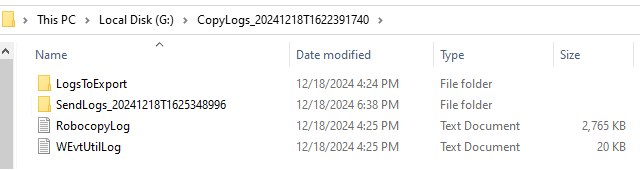
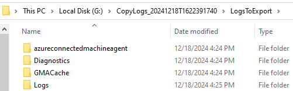
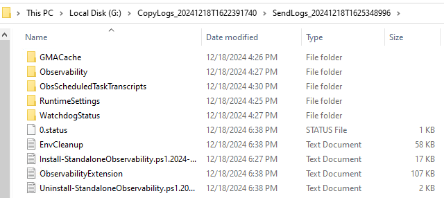

# Appliance fallback log collection for disconnected operations with Azure Local VMs enabled by Azure Arc (preview)

::: moniker range=">=azloc-2506"

This article explains how to use appliance fallback logging to export and send logs to Microsoft when Azure Local VMs operates in disconnected mode. This process helps you troubleshoot issues when standard log collection is unavailable.

[!INCLUDE [IMPORTANT](../includes/disconnected-operations-preview.md)]

## About fallback logging

Use appliance fallback logging to collect and send logs to Microsoft when the Azure Local disconnected operations virtual machine (VM) is down. Use this method when standard log collection can't start and you need logs for troubleshooting.

## Prerequisites

- [Import the appliance logging](#import-appliance-logging).

## Import appliance logging

To import appliance logging, run the following command:

```PowerShell
Import-Module "C:\azurelocal\OperationsModule\ApplianceFallbackLogging.psm1" -Force
```

## Export logs for the fallback scenario

To export logs for the fallback scenario, use three cmdlets:

- [**Copy-DiagnosticData**](#copy-diagnosticdata)
- [**Send-DiagnosticData**](#send-diagnosticdata)
- [**Get-ObservabilityStampId**](#get-observabilitystampid-optional)

### Copy-DiagnosticData

The **Copy-DiagnosticData** command is used to copy diagnostic logs from mounted virtual hard disks (VHDs) to a specified folder. This command is part of the operations module and helps you collect diagnostic data from a VHD for analysis.

Since the Azure Local VM running disconnected operations isn't expected to work in the appliance fallback logging scenario, shut it down to retrieve logs. To obtain the logs, mount and unlock the VHDs, then copy the logs from the mounted VHDs to a local `LogsToExport` folder nested in the user-defined folder location specified by `DiagnosticLogPath`. You can set the time window and roles to collect. If the `Observability Stamp ID` is set, the cmdlet includes it in the return values.

Make sure this location has enough space for the logs, because the Azure Local VMs running disconnected VHDs are temporarily mounted there during the copy action.

Use these parameters with the `Copy-DiagnosticData` cmdlet.

- **DiagnosticLogPath**: Required. The destination path contains the copied logs and temporarily mounted VHDs. If the `DiagnosticLogPath` cmdlet is piped into the `Send-DiagnosticData` cmdlet, it also serves as the default location where the Standalone Observability pipeline is installed and logs activity.

- **Roles**: Optional. Roles available: **Agents**, **Oplets**, **MASLogs**, **ServiceFabric**, **ArcADiagnostics**, **Observability**, **WindowsEventLogs**, **CosmosDB**, and **Storage**. By default, all roles except **CosmosDB** and **Storage** are included.

- **FromDate** and **ToDate**: Optional. Start and end times of logs included in the collection. Logs before the FromDate and after the ToDate are excluded. By default, logs from the **last four hours** of the current time are collected, if these parameters aren't provided.

- **RecoveryKeySet** (BitLocker): Optional. The RecoveryKeySet containing relevant **ProtectorId** and **RecoveryPassword** pairs for BitLocker encrypted volumes used for log collection retrieval. If recovery keys aren't provided, manual entry of the keys is required during the mount process.

    > [!NOTE]
    > The BitLocker recovery key set is required to unlock the mounted VHDs used for log collection. These keys should be retrieved and saved upon successful deployment of the appliance using the BitlockerRecoveryKeys endpoint.

    Here's an example:

    ```console
    #ClientAuth certificate location and password may be for your environment
    
    $clientAuthCertificatePath = "${env:localappdata}\AzureLocalOpModuleDev\certs\ManagementEndpoint\ManagementEndpointClientAuth.pfx"
    
    $passwordPlainText = Get-Content "${env:localappdata}\AzureLocalOpModuleDev\certificatePassword.txt"
        
    $clientAuth = [System.Security.Cryptography.X509Certificates.X509Certificate2]::new($clientAuthCertificatePath, $passwordPlainText)
        
    $bitlockerRecoveryKeys = (Invoke-WebRequest -Certificate $clientAuth https://169.254.53.25:9443/sysconfig/BitlockerRecoveryKeys -UseBasicParsing).Content | ConvertFrom-Json
    
    $bitlockerRecoveryKeys.recoverykeyset
    <#
    protectorid                            recoverypassword
    -----------                            ----------------
    {xxxxxxxx-xxxx-xxxx-xxxx-xxxxxxxxxxxx} ######-######-######-######-######-######-######-######
    
    {xxxxxxxx-xxxx-xxxx-xxxx-xxxxxxxxxxxx} ######-######-######-######-######-######-######-######
    
    {xxxxxxxx-xxxx-xxxx-xxxx-xxxxxxxxxxxx} ######-######-######-######-######-######-######-######
    
    {xxxxxxxx-xxxx-xxxx-xxxx-xxxxxxxxxxxx} ######-######-######-######-######-######-######-######
    
    {xxxxxxxx-xxxx-xxxx-xxxx-xxxxxxxxxxxx} ######-######-######-######-######-######-######-######
    
    #>
    ```

    To manually construct a RecoveryKeySet parameter, use this template:

    ```console
    $bitLockerKeysPasswords = @(
    [PSCustomObject]@{protectorid = "{<Protector Id>}"; recoverypassword = "<Recovery password>"})
    ```

    You can also retrieve BitLocker recovery keys using the `Get-ApplianceBitlockerRecoveryKeys` cmdlet. For more information, see [Collect logs on-demand with Azure Local disconnected operations (preview)](disconnected-operations-on-demand-logs.md).

#### Copy from the Azure Local VMs running disconnected and mount VHDs

To copy diagnostic logs from the mounted VHDs to a folder location you specify in `DiagnosticLogPath`, follow these steps:

1. Enter a drive or path for the `-DiagnosticLogPath` where the logs are copied. Optionally, include specific roles and a log collection window.

    - If you specify a new file destination in the `-DiagnosticLogPath`, that destination is used to store the LogsToExport file. Otherwise, a parent folder named **CopyLogs_{timestamp}** (with the timestamp reflecting the time the cmdlet was called) is created by default.

    - The available roles are **Agents**, **Oplets**, **MASLogs**, **ServiceFabric**, **ArcADiagnostics**, **Observability**, **WindowsEventLogs**, **CosmosDB**, and **Storage**. By default, all roles except **Storage** and **CosmosDB** are included.

    > [!TIP]
    > The standalone pipeline used to send logs to Microsoft  is limited regarding the log volume it can handle. The more targeted the collection (the shorter the collection window and fewer the roles), the better the chance of avoiding errors during log ingestion.

1. Specify a collection window using the `-FromDate` and `-ToDate` parameters. By default, the cmdlet collects logs from the **last four hours**.

1. Run the `Copy-DiagnosticData` cmdlet:

    ```console
    $diagnosticLogPath = "C:\path\to\LogsToExport"
    $roles = @("Agents", "Oplets", "ServiceFabric")
    $fromDate = [datetime]"03/13/2024 12:00:00"
    $toDate = [datetime]"03/13/2024 15:00:00"
    $recoveryKeySet = @()
     
    Copy-DiagnosticData [-DiagnosticLogPath] <String> [[-Roles] <String[]>] [[-FromDate] <Nullable`1>] [[-ToDate] <Nullable`1>] [[-RecoveryKeySet] <PSObject[]>] [<CommonParameters>]
    ```

    Here's an example:

    ```powershell
    Copy-DiagnosticData -DiagnosticLogPath $diagnosticLogPath -Roles $role -FromDate $fromDate -ToDate $toDate -RecoveryKeySet $recoveryKeySet
    ```

    Here's the example output:

    ```PowerShell
    PS C:\Users\administrator.s46r2004\Documents> Copy-DiagnosticData -DiagnosticLogPath $diagnosticLogPath -RecoveryKeySet $recoveryKeySet  
    VERBOSE: [2025-03-26 22:10:58Z] [Get-ValidCollectionWindow] $ToDate not provided, set to: 03/26/2025 22:10:58 (current time)  
    VERBOSE: [2025-03-26 22:10:58Z] [Get-ValidCollectionWindow] #FromDate not provided, set to: 03/26/2025 18:10:58 (4hr collection window)  
    VERBOSE: [2025-03-26 22:10:58Z] [Copy-DiagnosticData] Collecting logs for range: '03/26/2025 18:10:58' - '03/26/2025 22:10:58'  
    VERBOSE: [2025-03-26 22:10:58Z] [Copy-DiagnosticData] Collecting logs for roles: 'Agents', 'Oplets', 'MASLogs', 'ServiceFabric', 'ArcADiagnostics', 'Observability', 'WindowsEventLogs'  
    VERBOSE: [2025-03-26 22:10:59Z] [Invoke-StopIRVMAndMountVHDs] Stopping the IRVM...  
    VERBOSE: [2025-03-26 22:11:55Z] [Invoke-StopIRVMAndMountVHDs] Attempting to mount VHD 'C:\ClusterStorage\UserStorage_1\InfraVms\IRVM01\Virtual Hard Disks\OSAndDocker_A.vhdx'...      
    ```

    Here's an example of the copy output with the StampId, if it exists:

    ```output
    | DiagnosticLogPath                                       | StampId                                  |
    |---------------------------------------------------------|------------------------------------------|
    | C:\CopyLogs_20240501T1525097418\LogsToExport            | <Stamp ID>                               |
    ```

    > [!NOTE]
    > The Azure Local VM running disconnected is **restarted** after this operation is completed.

The autogenerated output folder, **CopyLogs_20240501T1525097418**, has the copied logs in the **LogsToExport** folder. It also includes a **RobocopyLog.log** file and a **WEvtUtilLog.log** file, which show the status of the copy actions.

- **RobocopyLog.log**: Records the copying of all file types except Windows Event files.
- **wevtutil**: A tool used to copy Windows events. This activity is logged in the **WEvtUtilLog.log** file.

Here are examples of the **LogsToExport** folder structures:

Overall file structure:

[](media/disconnected-operations/fallback-log/overall-file-structure.png#lightbox)

Azure Local VM running disconnected nested file structure:  

[](media/disconnected-operations/fallback-log/nested-file-structure.png#lightbox)

### Send-DiagnosticData  

After you collect logs into a directory, either by using the `Copy-DiagnosticData` cmdlet or by copying them manually, send them to Microsoft with the standalone pipeline. This pipeline Arc-enables the host (the machine running the cmdlet) to perform the operation, targets all the logs in the file location you provide, and sends them for ingestion to Microsoft. If log ingestion fails, the cmdlet tries up to three times and then outputs the results of the send activity when it's complete.

The **Send-DiagnosticData** cmdlet downloads and runs the standalone observability pipeline. You need to enter the credentials required to connect to Azure for the pipeline. There are two options for providing these credentials:

- **Interactive registration with device code**. Prompts you to manually sign in to Azure once the cmdlet is invoked.
- **Registration with Service Principal Credential**. Takes the required credentials upfront and uses them to run to completion. For more information, see [Collect logs on-demand with Azure Local disconnected operations (preview)](disconnected-operations-on-demand-logs.md).

Provide these required parameters for either option:

- **ResourceGroupName**  
- **SubscriptionId**  
- **TenantId**  
- **RegistrationRegion**  
- **DiagnosticLogPath**  

Optional parameters:

- **ObsRootFolderPath**

  - Where the observability pipeline is installed
  - Defaults to the parent directory of **DiagnosticLogPath** and is nested in a folder **SendLogs_{timestamp}**
  
- **StampId** (If set it defaults to `$env:STAMP_GUID`. If not the host machine's **UUID** is used.)

> [!NOTE]
> The `RegistrationRegion` is equivalent to `Location` with reference to the ObservabilityConfiguration endpoint's $arcContext JSON.

Here's an example using the **Interactive registration with device code**:

```powershell  
Send-DiagnosticData 
-ResourceGroupName "Resource group" `  
-SubscriptionId "Subscription ID" `  
-TenantId "Tenant ID" `  
-RegistrationWithDeviceCode `
-RegistrationRegion "Region" `  
-DiagnosticLogPath "C:\path\to\LogsToExport"   
```  

The **-RegistrationWithDeviceCode** switch is optional. If you don't use **-RegistrationWithCredential**, interactive registration is used.

Here's an example using **Registration with Service Principal Credential**:

```powershell  
$spId = "{...}"
$spSecret = "{...}"
$ss = ConvertTo-SecureString -String $spSecret -AsPlainText -Force
$spCred = New-Object System.Management.Automation.PSCredential($spId, $ss)  
   
Send-DiagnosticData 
-ResourceGroupName "Resource group" `  
-SubscriptionId "Subscription ID" `  
-TenantId "Tenant ID" `  
-RegistrationWithCredential {$spCred} `  
-RegistrationRegion "Region" `  
-DiagnosticLogPath "C:\path\to\LogsToExport" `  
-StampId "Stamp ID"  
```  

The cmdlet returns the stamp ID, also called the **AEOStampId**. It also shows any errors and the location of the send activity logs.

Here's an example of the output:

```console
AEOStampID '<Stamp ID>' used for log tracking.

Logs and artifacts from send action can be found under:  
G:\CopyLogs_20241218T1622391740\SendLogs_20241218T1625348996  
  
Log parsing engine results can be found under:  
G:\CopyLogs_20241218T1622391740\SendLogs_20241218T1625348996\ObsScheduledTaskTranscripts  
```

Here's an example of the file structure for the send logs:

[](media/disconnected-operations/fallback-log/send-logs-file-structure.png#lightbox)

The send logs file structure has all the logs and installation files from the standalone observability pipeline, including the **GMACache logs** and pipeline install and uninstall logs.

### Get-ObservabilityStampId (optional)

> [!NOTE]
> You don't need to use this cmdlet with `Copy-DiagnosticData`.

The `Get-ObservabilityStampId` cmdlet is a heavy operation and is only needed in rare cases. This cmdlet also shuts down the Azure Local VM running disconnected and mounts the OS volume VHD to get the stamp ID. After the operation, the Azure Local VM running disconnected restarts.

Use these parameters with the `Get-ObservabilityStampId` cmdlet:

- **MountPath**: Optional. A valid drive or path to temporarily hold mounted VHDs used to retrieve the stamp ID. The file is removed on cleanup at the end of the cmdlet.
- **Recoverykeyset**: Optional. The RecoveryKeySet containing relevant **ProtectorId** and **RecoveryPassword** pairs for BitLocker encrypted volumes used for log collection retrieval. If recovery keys aren't provided, manual entry of the keys is required during the mount process.

> [!TIP]
> You can provide a desired path for the mounted VHD. Otherwise, the default path `${env:USERPROFILE}\MountedVHDs` is used.

Here's an example of the output with a custom path:

```powershell  
Get-ObservabilityStampId -MountPath "C:/temp/path"  
```  

```console
StampId
-------
<Stamp Id>
```

If the command doesn't return a `StampId`, the stamp ID isn't set and you need to pass it into [Send-DiagnosticData](#send-diagnosticdata) manually. If the stamp ID isn't set and you don't pass it manually, it defaults to the host **UUID**.

Alternatively, you can use the `Get-ApplianceInstanceConfiguration` command to get the stamp ID.

```powershell
$stampId = (Get-ApplianceInstanceConfiguration).StampId
```

## Appendix  

To view detailed information about each cmdlet, use these commands:

<details>

<summary>Get-Help Copy-DiagnosticData -Detailed</summary>

```plaintext  
EXAMPLE 1  
PS C:\> Copy-DiagnosticData -DiagnosticLogPath "C:"

EXAMPLE 2
PS C:\>Copy-DiagnosticData -DiagnosticLogPath "C:/path/to/copied_logs_parent_directory"
  
EXAMPLE 3
PS C:\>Copy-DiagnosticData -DiagnosticLogPath "C:" -Roles @("Agents", "Oplets", "ServiceFabric")
  
EXAMPLE 4
PS C:\>$fromDate = [datetime]"03/13/2024 12:00:00"
$toDate = [datetime]"03/13/2024 15:00:00"
Copy-DiagnosticData -DiagnosticLogPath "C:" -FromDate
$fromDate -ToDate $toDate
```

</details>

<details>

<summary>Get-Help Get-ObservabilityStampId -Detailed</summary>

```plaintext  
EXAMPLE 1 
PS C:\>Get-ObservabilityStampId  
  
EXAMPLE 2 
PS C:\>Get-ObservabilityStampId -MountPath "C:/temp/path” 
```

</details>

<details>

<summary>Get-Help Send-DiagnosticData -Detailed</summary>

```plaintext  
EXAMPLE 1 
PS C:\># Interactive registration with device code (used by default)  

Send-DiagnosticData -ResourceGroupName "Resource group" ` -SubscriptionId "Subscription Id" ` -TenantId "Tenant Id" ` -RegistrationRegion "eastus" ` -DiagnosticLogPath "C:\path\to\LogsToExport" ` -StampId "Stamp ID"  
  
EXAMPLE 2
PS C:\># Interactive registration with device code (declared explicitly)  

Send-DiagnosticData -ResourceGroupName "Resource group" `  
-SubscriptionId "Subscription Id" ` -TenantId "Tenant Id" ` -RegistrationWithDeviceCode ` -RegistrationRegion "eastus" ` -DiagnosticLogPath "C:\path\to\LogsToExport" ` -StampId "Stamp ID"  
  
EXAMPLE 3
PS C:\># Registration with Service Principal Credential  

Send-DiagnosticData -ResourceGroupName "Resource group" ` -SubscriptionId "Subscription Id" ` -TenantId "Tenant Id" ` -RegistrationWithCredential {$credential} ` -RegistrationRegion "eastus" ` -DiagnosticLogPath "C:\path\to\LogsToExport" ` -StampId "Stamp ID"  
  
EXAMPLE 4
PS C:\># Get-ObservabilityStampId pipes the Observability Id as the 'StampId' if available.  

Get-ObservabilityStampId | Send-DiagnosticData ` -ResourceGroupName "Resource group" ` -SubscriptionId "Subscription Id" ` -TenantId "Tenant Id" ` -RegstrationRegion “eastus” ` -DiagnosticLogPath "C:\path\to\LogsToExport"  
  
EXAMPLE 5
PS C:\># Copy-DiagnosticData pipes the 'DiagnosticLogPath' (always) and the Observability Id
# as the 'StampId' if available.

Copy-DiagnosticData -DiagnosticLogPath "C:" -Roles @("ServiceFabric") `  | Send-DiagnosticData -ResourceGroupName "Resource group" `  -SubscriptionId "Subscription Id" ` -TenantId "Tenant Id" ` -RegstrationRegion “eastus”

EXAMPLE 6
PS C:\> $roles = @("Agents", "Oplets", "MASLogs")  

PS C:\> Copy-DiagnosticData -DiagnosticLogPath "G:" -Roles $roles ` | Send-DiagnosticData ` -ResourceGroupName "Resource group" ` -RegistrationRegion "eastus" ` -SubscriptionId "Subscription Id" ` -TenantId "Tentant Id" ` -RegistrationWithCredential $sp
```

</details>

::: moniker-end

::: moniker range="<=azloc-2505"

This feature is available only in Azure Local 2506.

::: moniker-end
