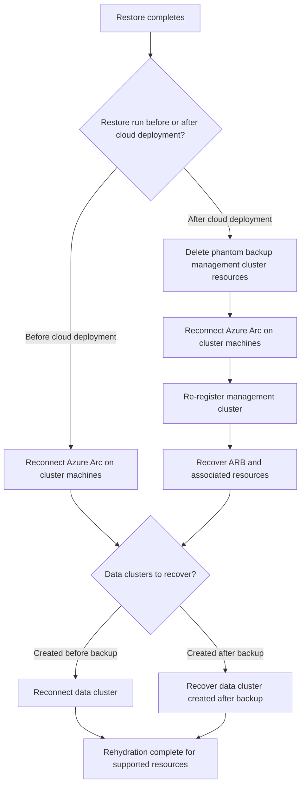

# Post-restore rehydration overview for disconnected operations

::: moniker range=">=azloc-2603"

After you [restore a disconnected operations for Azure Local environment](disconnected-operations-restore.md), the control plane data is recovered, but the clusters, Azure Arc agents, and cluster-scoped resources still point to the pre-restore environment. Rehydration is the sequence of steps that reconnects and re-registers those components against the restored environment.

This article gives you the end-to-end order, the key decision point that determines which path to follow, and the validation checkpoints for each stage. Use it as the map for the individual procedures.

For more information, see [Disconnected operations for Azure Local](/azure/azure-local/manage/disconnected-operations-overview?view=azloc-2602&preserve-view=true).

## Decision point: when did you run the restore?

The rehydration path depends on whether you restored the backup *before* or *after* cloud deployment on the new instance.

- **Restore before cloud deployment (recommended)**: The management cluster deploys as in a regular setup. You don't need to repair-register the management cluster. You only rehydrate data clusters and their resources.
- **Restore after cloud deployment (restore on the same instance as the backup)**: The restore replaces the newly deployed management cluster with the backup's management cluster, which no longer exists on-premises. You must repair-register the management cluster before you recover its associated resources.

## Recommended sequence

Complete the common stages first. Complete the management cluster stages only if you restored after cloud deployment. Then recover each data cluster based on when it was created. Each stage links to its detailed procedure and lists the checkpoint that confirms the stage succeeded before you continue.

Automated recovery for the reconnect and re-register procedures is available in Azure Local 2609 and later. In earlier versions, follow the manual steps in each linked procedure.

### Common stages

| Order | Stage | Procedure | Validation checkpoint |
| --- | --- | --- | --- |
| 1 | Confirm the restore finished | [Restore for disconnected operations](disconnected-operations-restore.md) | `Get-ApplianceRestore` reports the restore as complete. |
| 2 | Reconnect Azure Arc on each cluster machine | [Reconnect Azure Arc on cluster machines after a disconnected operations restore](disconnected-operations-post-restore-reconnect-arc.md) | `azcmagent show` reports **Agent Status: Connected** on every machine. |

### Management cluster stages (only if you restored after cloud deployment)

Skip this section if you restored before cloud deployment. In that case, the management cluster deploys as in a regular setup, so you go straight to data cluster recovery.

| Order | Stage | Procedure | Validation checkpoint |
| --- | --- | --- | --- |
| 3 | Re-register the management cluster | [Re-register the management or data cluster (created post backup) on a restored disconnected operations for Azure Local setup](disconnected-operations-post-restore-repair-register-management-cluster.md) | `Register-AzStackHCI -RepairRegistration` completes and reports all nodes linked to the cluster. |
| 4 | Recover the Azure Arc resource bridge (ARB) and associated resources | [Recover ARB and associated resources after cluster re-registration](disconnected-operations-post-restore-recover-azure-resource-bridge-resources.md) | `Get-ClusterGroup` shows the control-plane group **Online**, and the ARB resource appears in the portal. |

### Data cluster recovery

Recover each data cluster based on when it was created. These two cases are disjoint—choose the one that matches the data cluster. There's no ordering between them.

- **Data cluster created before the backup**: [Reconnect the data cluster](disconnected-operations-post-restore-reconnect-cluster.md). Checkpoint: `Resolve-DnsName` returns the new IRVM IP, and the cluster is manageable in the portal.
- **Data cluster created after the backup**: [Recover the data cluster created after backup](disconnected-operations-post-restore-recover-data-cluster-created-post-backup.md), which reconnects and then re-registers the cluster. Checkpoint: re-registration completes and the ARB resource appears in the portal.

## Reconcile the metadata drift

The restore returns the environment to the backup's point in time, so the restored metadata can differ from the current physical state. Before you consider rehydration complete, reconcile each drift category described in [Post restore environment mismatch](disconnected-operations-restore.md#post-restore-environment-mismatch), including untracked Arc resources, phantom resources, and cluster infra drift.

## Scope and limitations

- Rehydration covers cluster registration for both management and data clusters, Azure Arc connectivity, and cluster-scoped resources (ARB, custom location, logical network, and storage).
- Workload rehydration, such as for VMs and Kubernetes, isn't automated yet and is planned for a future release.
- Automated recovery for the reconnect and re-register procedures is available in Azure Local 2609 and later. In earlier versions, the steps are manual.

## Related content

- [Restore for disconnected operations for Azure Local](disconnected-operations-restore.md)
- [Back up disconnected operations](disconnected-operations-back-up-restore.md)
- [Reconnect Azure Arc on cluster machines after a disconnected operations restore](disconnected-operations-post-restore-reconnect-arc.md)
- [Reconnect a data cluster after a disconnected operations restore](disconnected-operations-post-restore-reconnect-cluster.md)
- [Re-register the management or data cluster (created post backup) on a restored disconnected operations for Azure Local setup](disconnected-operations-post-restore-repair-register-management-cluster.md)
- [Recover ARB and associated resources after cluster re-registration](disconnected-operations-post-restore-recover-azure-resource-bridge-resources.md)
- [Recover a data cluster created after backup following a disconnected operations restore](disconnected-operations-post-restore-recover-data-cluster-created-post-backup.md)
- [Disconnected operations for Azure Local](/azure/azure-local/manage/disconnected-operations-overview?view=azloc-2602&preserve-view=true)

::: moniker-end

::: moniker range="<=azloc-2602"

This feature is available only in Azure Local 2603 or later.

::: moniker-end
