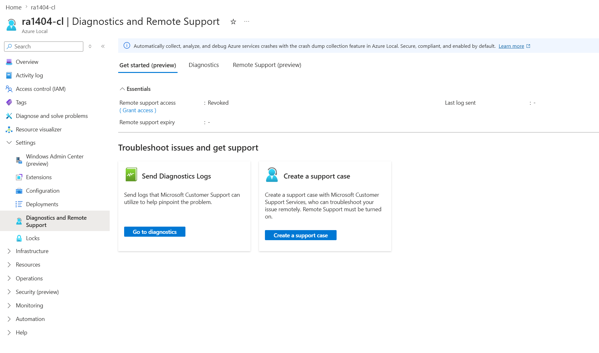
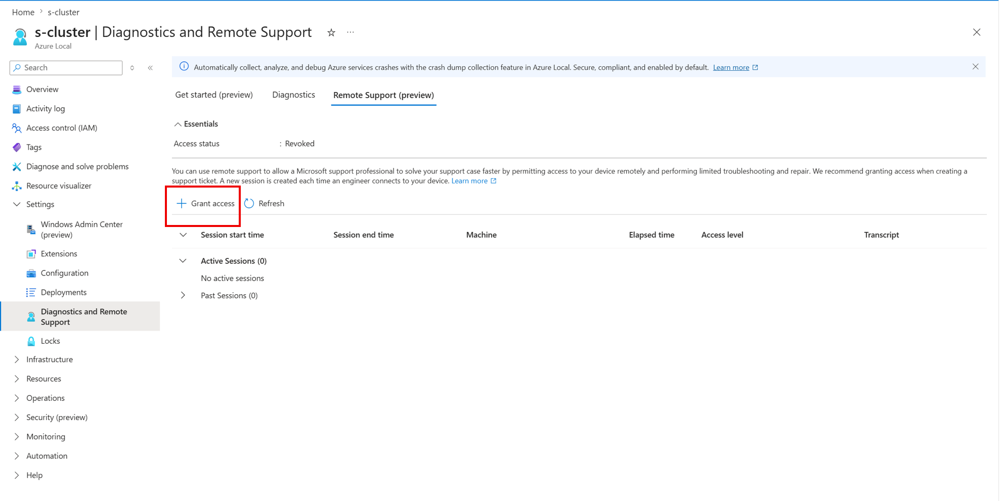
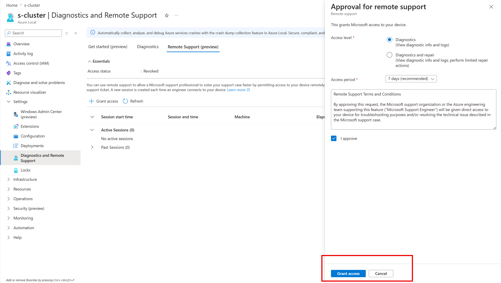
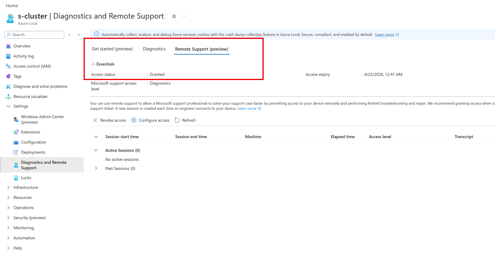
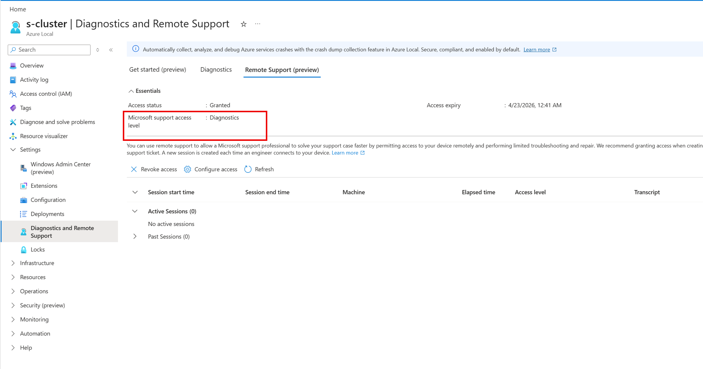
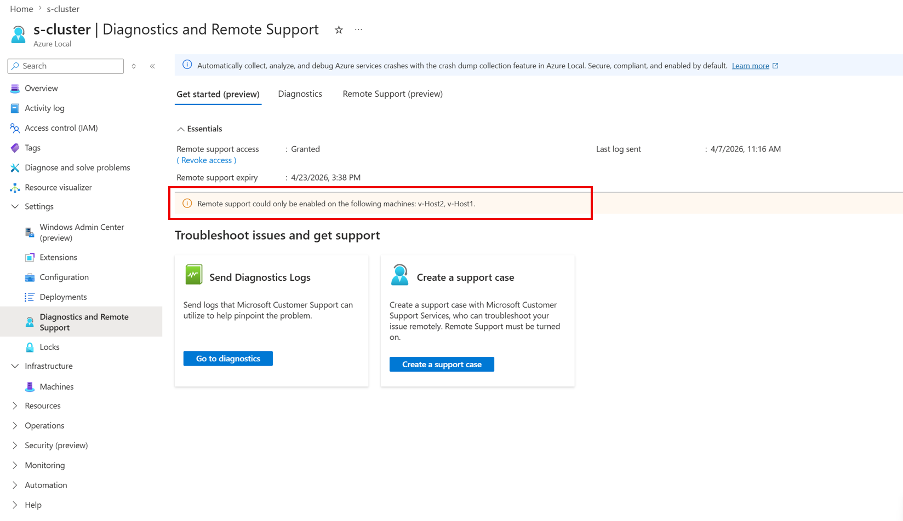
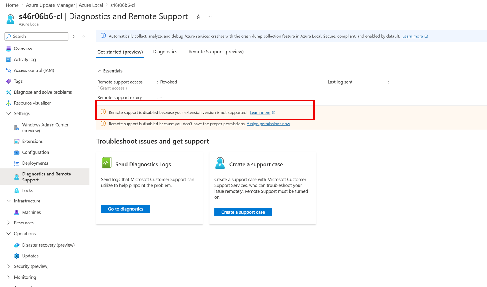
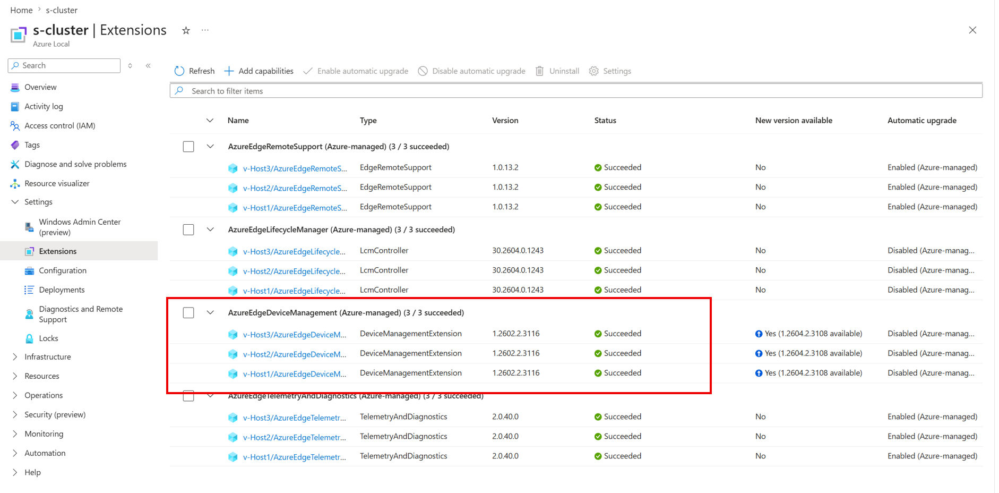
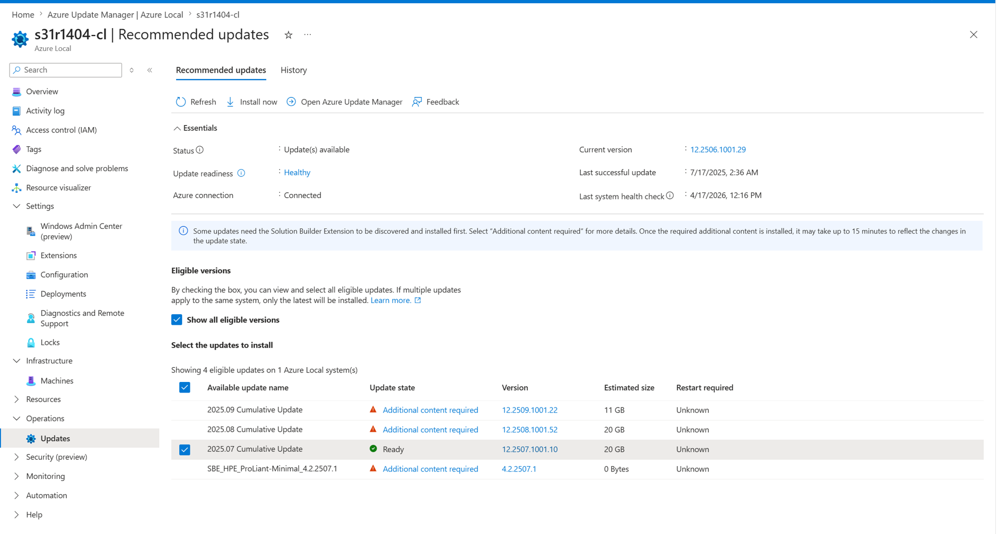

# Get remote support for Azure Local

[!INCLUDE [hci-applies-to-23h2-22h2](../includes/hci-applies-to-23h2-22h2.md)]

This article explains how to get Remote Support for the Azure Stack HCI operating system for Azure Local. It gives an overview of Remote Support, the terms and conditions, and the steps to enable Remote Support on your Azure Local. It also covers setting up proxy settings, submitting a support request, and other remote support tasks.

## Overview

Remote Support lets a Microsoft support professional fix your support case faster by letting them access your device for limited troubleshooting and repair. You can enable Remote Support by granting consent and choosing the access level and duration.

:::image type="content" source="media/get-remote-support/remote-support-workflow.png" alt-text="Diagram that shows the Azure Local remote support workflow with authenticated access between the customer and Microsoft support for diagnostics, troubleshooting, and remediation actions." lightbox="media/get-remote-support/remote-support-workflow.png" :::

After you enable Remote Support, Microsoft support gets just-in-time (JIT) limited time access to your device. Access is provided over a secure, audited, and compliant channel to ensure all activities are monitored. Microsoft support can only access your device after you submit a support request, which ensures that your device remains secure and your privacy is maintained.

## Remote support terms and conditions

The following are the data handling terms and conditions for remote access. Carefully read them before granting access. <!--Everything under this section should remain as is without making any changes to the text.-->

> By approving this request, the Microsoft support organization or the Azure engineering team supporting this feature ("Microsoft Support Engineer") will be given direct access to your device for troubleshooting purposes and/or resolving the technical issue described in the Microsoft support case.
>
> During a remote support session, a Microsoft Support Engineer may need to collect logs. By enabling remote support, you have agreed to a diagnostics log collection by a Microsoft Support Engineer to address a support case. You also acknowledge and consent to the upload and retention of those logs in an Azure storage account managed and controlled by Microsoft. These logs may be accessed by Microsoft in the context of a support case and to improve the health of Azure Local.
>
> The data will be used only to troubleshoot failures that are subject to a support ticket, and will not be used for marketing, advertising, or any other commercial purposes without your consent. The data may be retained for up to ninety (90) days and will be handled following our standard privacy practices.
>
> Any data previously collected with your consent will not be affected by the revocation of your permission.

For more information about the personal data that Microsoft processes, how Microsoft processes it, and for what purposes, see the [Microsoft Privacy Statement](https://privacy.microsoft.com/privacystatement).

## Workflow

Here's the high-level workflow to enable remote support:

- [Configure proxy settings](#configure-proxy-settings)
- [Enable remote support](#enable-remote-support)
- [Submit a support request](#submit-a-support-request)
- [Other remote support operations](#other-remote-support-operations)

## Configure proxy settings

If you use a proxy with Azure Local, add these endpoints to your allow list:

- \*.servicebus.windows.net
- \*.core.windows.net
- login.microsoftonline.com
- https\://asztrsprod.westus2.cloudapp.azure.com
- https\://asztrsprod.westeurope.cloudapp.azure.com
- https\://asztrsprod.eastus.cloudapp.azure.com
- https\://asztrsprod.westcentralus.cloudapp.azure.com
- https\://asztrsprod.southeastasia.cloudapp.azure.com
- https\://edgesupprd.trafficmanager.net

## Enable Remote Support

### [PowerShell](#tab/powershell)

The Remote Support Arc extension, listed as **AzureEdgeRemoteSupport** in the Azure portal, simplifies setup and improves support efficiency. It's preinstalled on all system nodes, so you don't need to take any action. For more information about the Remote Support Arc extension, see [Azure Local remote support Arc extension](./remote-support-arc-extension.md).

To enable remote support on your Azure Local, follow these steps:

1. On the client you use to connect to your system, run PowerShell as an admin.

1. Open a remote PowerShell session to a node on your Azure Local. Run the following command, and enter your node credentials when prompted:

    ```powershell
    $cred = Get-credential
    Enter-PsSession -ComputerName <NodeName> -Credential $cred
    ```

    Here's a sample output:

    ```console
    PS C:\Users\Administrator> etsn -ComputerName v-host1 -Credential $cred
    ```

1. To enable remote support, run this command:

    ```powershell
    Enable-RemoteSupport -AccessLevel <Diagnostics or DiagnosticsRepair> -ExpireInMinutes <1440>
    ```

    Here's sample output:

    ```console
    PS C:\Users\Administrator> etsn -ComputerName v-host1 -Credential $cred

    PS C:\Users\HciDeploymentUser\Documents> Enable-RemoteSupport -AccessLevel Diagnostics -ExpireInMinutes 1440

    By approving this request, the Microsoft support organization or the Azure engineering team supporting this feature ('Microsoft Support Engineer') will be given direct access to your device for troubleshooting purposes and/or resolving the technical issue described in the Microsoft support case.

    During a remote support session, a Microsoft Support Engineer may need to collect logs. By enabling remote support, you have agreed to a diagnostic logs collection by Microsoft Support Engineer to address a support case You also acknowledge and consent to the upload and retention of those logs in an Azure storage account managed and controlled by Microsoft. These logs may be accessed by Microsoft in the context of a support case and to improve the health of Azure Local.

    The data will be used only to troubleshoot failures that are subject to a support ticket, and will not be used for marketing, advertising, or any other commercial purposes without your consent. The data may be retained for up to ninety (90) days and will be handled following our standard privacy practices (https://privacy.microsoft.com/en-US/). Any data previously collected with your consent will not be affected by the revocation of your permission.

    Proceed with enabling remote support?
    [Y] Yes  [N] No  [?] Help (default is "Y"): Y
         
    Enabling Remote Support for 'Diagnostics' expiring in '1440' minutes.
    Remote Support successfully Enabled.
     
    State                  : Active
    CreatedAt              : 9/6/2023 10:05:52 PM +00:00
    UpdatedAt              : 9/6/2023 10:05:52 PM +00:00
    ConnectionStatus       : Connecting
    ConnectionErrorMessage :
    TargetService          : PowerShell
    AccessLevel            : Diagnostics
    ExpiresAt              : 9/7/2023 10:05:50 PM +00:00
    SasCredential          :
    ```

    > [!NOTE]
    > First time users, if you enable Remote Support through a remote PowerShell session, you might receive the following error:
    >
    > `Processing data from remote server NodeName failed with the following error message: The I/O operation has been aborted because of either a thread exit or an application request.`
    >
    > For more information, see [Error handling](#error-handling).

After you enable remote support, you can perform different operations to grant remote access for Microsoft Support. The next sections show some examples.

### Enable remote support for diagnostics

In this example, you grant Remote Support access for diagnostic-related operations only. The consent expires in 1,440 minutes (one day) after which remote access can't be established.

```powershell
Enable-RemoteSupport -AccessLevel Diagnostics -ExpireInMinutes 1440
```

Use the `ExpireInMinutes` parameter to set the duration of the session. In the example, consent expires in 1,440 minutes (one day). After one day, remote access can't be established.

You can set `ExpireInMinutes` with a minimum duration of 60 minutes (one hour) and a maximum of 20,160 minutes (14 days).

If you don't define a duration, the remote session expires in 480 minutes (8 hours) by default.

### Enable Remote Support for diagnostics and repair

In this example, you grant Remote Support access for diagnostic and repair related operations only. Since an expiration isn't explicitly provided, access expires in eight hours by default.

```powershell
Enable-RemoteSupport -AccessLevel DiagnosticsRepair
```

For information about access levels, see [List of Microsoft support operations](./remote-support-arc-extension.md#list-of-microsoft-support-operations).

For information on other available operations, see [Other remote support operations](#other-remote-support-operations).

## Other remote support operations

To get information about access or a remote session, you can perform other operations. The next sections detail some examples of those operations.

### Retrieve existing consent grants

In this example, you retrieve any previously granted consent. The result includes expired consent from the last 30 days.

```powershell
Get-RemoteSupportAccess -IncludeExpired
```

### Revoke remote access consent

In this example, you revoke remote access consent. The action terminates any existing sessions and prevents new sessions from being established.

```powershell
Disable-RemoteSupport
```

### List existing remote sessions

In this example, you list all remote sessions made to the device since FromDate.

```powershell
Get-RemoteSupportSessionHistory -FromDate <Date>
```

### Get details on a specific remote session

In this example, you get the details for the remote session with the ID SessionID.

```powershell
Get-RemoteSupportSessionHistory -IncludeSessionTranscript -SessionId <SessionId>
```

> [!NOTE]
> Session transcript details are kept for 90 days. You can retrieve details for a remote session within 90 days after the session.

### [Azure portal](#tab/azureportal)

This section provides an overview of the Remote Support experience in the Azure Local portal, including how to enable it, what to expect when it's active, and how to monitor support sessions.

1. In **Diagnostics and Remote Support settings**, you see a new **Remote Support** tab. Select this tab or select **Grant access** directly to enable remote support.

   [  ](media/get-remote-support/remote-support-overview-page.png#lightbox)

   This section explains the steps and prerequisites required to enable Remote Support through the Azure portal.

1. Select **Grant access** to enable remote support.

   [  ](media/get-remote-support/grant-access-remote-support-overview.png#lightbox)

1. To grant access, select the appropriate **access level** - either **Diagnostics** or **Diagnostics and Repair**. Then, specify the **access period**, which defines how long support can access your device.

1. Review and approve the **terms and conditions** to complete the process.

   [  ](media/get-remote-support/terms-conditions.png#lightbox)

1. When Remote Support is enabled, you can see indicators in the management experience showing that remote access is active.

   [  ](media/get-remote-support/access-granted-view.png#lightbox)

1. You can view the access level, which also indicates the level of access granted.

   [  ](media/get-remote-support/access-granted-level.png#lightbox)

    This section explains the behavior when Remote Support is only partially enabled or not enabled on all nodes in the cluster.

1. A banner appears to indicate the specific machines where remote support is enabled. If no banner is displayed for a cluster, it means remote support is enabled across all nodes.

   [  ](media/get-remote-support/remote-support-machines.png#lightbox)

1. What happens if the required version isn't present: A warning banner appears: "Remote support is disabled because your extension version is not supported. Learn more."

   To learn more, see [Azure Local Remote Support Arc extension and remote support overview](../manage/remote-support-arc-extension.md).

   [  ](media/get-remote-support/extension-warning-banner.png#lightbox)

1. Remote Support depends on a minimum version of the __DME (Device Management Extension)__. This section documents:

   - The minimum required DME extension version: "1.2510.0.3012"

   - How you can check the installed version

1. Go to **Extensions**, you can see the **AzureEdgeDeviceManagement** extension along with its version details.

   [  ](media/get-remote-support/extensions-overview-page.png#lightbox)

1. You can update the extension by updating your environment. Navigate to **Operations → Updates**, select the latest eligible version, and select **Install now**.

1. To complete the update, see the steps [here](/azure/azure-local/update/azure-update-manager-23h2?&tabs=azureupdatemanager).

   [  ](media/get-remote-support/updates-overview.png#lightbox)

---

## Submit a support request

Microsoft support can access your device only after you submit a support request. To learn how to create and manage support requests, see [Create an Azure support request](/azure/azure-portal/supportability/how-to-create-azure-support-request).

## Error handling

When you enable Remote Support on Azure Local, you might encounter an error. This section describes the error message, its cause, and suggested resolutions.

When you run the enable Remote Support command for the first time, you might see the following error message:

```console
PS C:\Users\Administrator> etsn -ComputerName v-host1 -Credential $cred

PS C:\Users\HciDeploymentUser\Documents> Enable-RemoteSupport -AccessLevel Diagnostics -ExpireInMinutes 1440

Proceed with enabling remote support?
[Y] Yes  [N] No  [?] Help (default is "Y"): Y

Type            Keys                                Name
----            ----                                ----
Container       {Name=SupportDiagnosticEndpoint}    SupportDiagnosticEndpoint

Processing data from remote server NodeName failed with the following error message: The I/O operation has been aborted because of either a thread exit or an application request.
```

**Error Message**: Processing data from remote server `NodeName` failed with the following error message: The I/O operation has been aborted because of either a thread exit or an application request.

**Cause**: When you enable Remote Support, a Windows Remote Management (WinRM) service restart is required to activate Just Enough Administration (JEA). During the remote support JEA configuration, WinRM restarts twice, which can disrupt the PowerShell session to the node.

**Suggested resolutions**: To resolve this error and enable Remote Support, choose one of the following options:

- Wait for a few minutes. Repeat step #2 and #3 for each JEA endpoint to reconnect to your machine and enable remote support.
    - After the third run of the enable Remote Support command, you shouldn't see any other error. Refer to the output at step #3 for a successful example of the remote support installation.
- Instead of using the Remote PowerShell session, you can enable Remote Support by connecting to each node by using [Remote Desktop Protocol](https://support.microsoft.com/en-us/windows/how-to-use-remote-desktop-5fe128d5-8fb1-7a23-3b8a-41e636865e8c) and enabling it.

## Next steps

- Learn about [Azure Arc extension management](../manage/arc-extension-management.md).
- Learn about the [Azure Local remote support Arc extension](../manage/remote-support-arc-extension.md).
