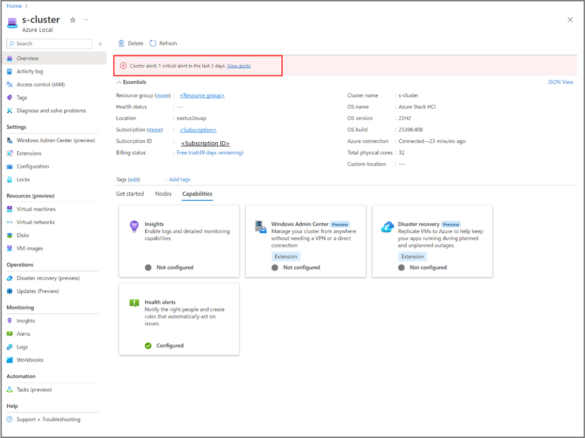

# Respond to Azure Local health alerts using Azure Monitor alerts

[!INCLUDE [hci-applies-to-23h2](../includes/hci-applies-to-23h2.md)]

The OS health service for Azure Local continuously monitors your Azure Local system to detect over 80 health issues across various components, such as physical and virtual disk, storage pool capacity, volume capacity, network interface, storage QoS, virtual machines (VMs), and VHDs. It provides information about the affected component, including the cause, time of the issue, and recommendations to mitigate it. You can view health issues like unsupported hardware, unresponsive disk, bad block writes, detached drives, repair needs, exceeded CPU, memory and storage usage, and high latency. For a complete list of supported health faults, see [View Health Service faults](./health-service-faults.md).

This article describes how to use [Azure Monitor alerts](/azure/azure-monitor/alerts/alerts-overview) to proactively identify, notify, and respond to Azure Local health alerts.

## Azure Local health alerts integration with Azure Monitor

The integration of Azure Monitor alerts with Azure Local enhances the health alerts capability of Azure Local. With this integration, any health alerts generated within your on-premises Azure Local system are automatically forwarded to Azure Monitor alerts. You can link these alerts with your automated incident management systems, ensuring timely and efficient responses.

For more information about Azure Monitor alerts, see [What are Azure Monitor alerts?](/azure/azure-monitor/alerts/alerts-overview)

## Benefits

The integration of Azure Monitor alerts with Azure Local offers several key benefits:

- **No additional cost.** By enabling the health alerts capability, you automatically get Azure Monitor alerts for all your Azure Local system health issues at no additional cost. There's no need to set up Log Analytics or manually author any alert rules.

- **Near real-time monitoring.** With Azure Local health alerts providing near real-time monitoring, you can detect issues as they occur and take immediate action, thereby reducing downtime.

- **Customizability.** The Azure Local health alerts experience is built on top of Azure Monitor alerts. You can configure the alert processing rules to notify the right team via your preferred [Incident management partners](/azure/azure-monitor/partners), ensuring quick and effective response to the issues.

## Prerequisites

Here are the prerequisites for using health alerts with Azure Local:

- Have access to an Azure Local system that is deployed and registered. For more information, see [Deploy Azure Local via Azure portal](../deploy/deploy-via-portal.md).

## Configure health alerts for Azure Local

Here are the high-level steps to configure health alerts for Azure Local:

- **Step 1:** Turn on the health alerts capability.
- **Step 2:** Configure alert processing rules.

### Step 1: Turn on the health alerts capability

When you enable alerts via the Azure portal, the Azure Monitor extension is installed in the background. To verify that this extension is installed, go to **Settings** > **Extensions** in the Azure portal. This extension shows up as **AzureEdgeAlerts** in the list of extensions.

Follow these steps to turn on health alerts via the Azure portal.

1. Go to your Azure Local system resource page and select your cluster. Under the **Capabilities** tab, select the **Health alerts** tile.

   :::image type="content" source="./media/health-alerts-via-azure-monitor-alerts/alerts-tile-1.png" alt-text="Screenshot of Azure Local system resource page, with your cluster and the Health alerts tile selected." lightbox="./media/health-alerts-via-azure-monitor-alerts/alerts-tile-1.png":::

2. On the **Turn on health alerts** pane on the right, select the **Turn on** button.  

   :::image type="content" source="./media/health-alerts-via-azure-monitor-alerts/turn-on-health-alerts-2.png" alt-text="Screenshot of health alerts pane on the right with Turn on button selected." lightbox="./media/health-alerts-via-azure-monitor-alerts/turn-on-health-alerts-2.png":::

   The installation of the Azure Monitor alerts extension begins in the background.

3. After the extension is successfully installed, you're taken to the **Capabilities** tab. Verify that the **Health alerts** tile under the **Capabilities** tab now shows as **Configured**.

   :::image type="content" source="./media/health-alerts-via-azure-monitor-alerts/health-alerts-are-configured-3.png" alt-text="Screenshot of the Capabilities tab, with Health alerts tile showing as Configured." lightbox="./media/health-alerts-via-azure-monitor-alerts/health-alerts-are-configured-3.png":::

### Step 2: Configure alert processing rules

In this step, you configure alert processing rules, consisting of a series of configurations and actions to determine how to handle the incoming alerts. These rules enable you to add or suppress action groups, apply filters, or specify predefined schedules to apply the rule.

Here are some common use cases of how you can configure alert processing rules to handle Azure Local health alerts:

- Configure an action group to determine who receives a notification and the type of notification to send. Notifications can be sent via email, SMS message, or both.
- Specify that all alerts for storage-related health faults should be directed to the team responsible for addressing storage issues.
- Configure when to apply the rule. By default, the rule is always active. You can set it to work at a specific time, or you can set up a recurring schedule.

For information about alert processing rules and how to configure them, see [Alert processing rules](/azure/azure-monitor/alerts/alerts-processing-rules?tabs=portal) and [Configure an alert processing rule](/azure/azure-monitor/alerts/alerts-processing-rules?tabs=portal#configure-an-alert-processing-rule).

## Review health alerts

In the Azure portal, you can review health alerts on your Azure Local system in real-time from the **Monitoring** > **Alerts** blade.

The **Alerts** blade has a high-level summary of alerts at each severity level. You can drill down to see individual alerts at each severity level.

   :::image type="content" source="./media/health-alerts-via-azure-monitor-alerts/health-alerts-summary-4.png" alt-text="Screenshot of a high-level summary of alerts at each severity level." lightbox="./media/health-alerts-via-azure-monitor-alerts/health-alerts-summary-4.png":::

<!--The **Overview** page of your Azure Local system resource page also displays the alerts.

   -->

## Modify health alerts threshold

You can modify the threshold of some health alerts, such as CPU, memory, storage usage via PowerShell. For more information, see [Modify Health Service settings](./health-service-settings.md).

To view the current threshold settings for different health faults, run the following command:

```powershell
Get-StorageSubSystem Cluster* | Get-StorageHealthSetting -Name <SettingName>
```

For example, to view the storage volume capacity warning and critical threshold, run the following commands:

```powershell
Get-StorageSubSystem Cluster* | Get-StorageHealthSetting -Name "System.Storage.Volume.CapacityThreshold.Warning"
Get-StorageSubSystem Cluster* | Get-StorageHealthSetting -Name "System.Storage.Volume.CapacityThreshold.Critical"
```

To change the threshold to desirable setting, run the following command:

```powershell
Get-StorageSubSystem Cluster* | Set-StorageHealthSetting -Name <SettingName> -Value <Value>
```

For example, to change the storage volume capacity warning threshold, run the following command:

```powershell
Get-StorageSubSystem Cluster* | Set-StorageHealthSetting -Name "System.Storage.Volume.CapacityThreshold.Warning" -Value 70
```

## Disable health alerts

To disable the health alerts capability, uninstall the Azure Monitor alerts extension that you installed earlier.

For instructions, see [Uninstall an extension from the Azure portal](./arc-extension-management.md#uninstall-an-extension).

## Next steps

[View a list of health alerts](./health-service-faults.md) that you might run across within your Azure Local system.
