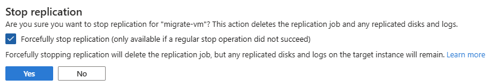

# What's new in Azure Migrate for Azure Local

This article lists the various features and improvements that are available in virtual machine (VM) migration to Azure Local. This article applies to both Hyper-V (Preview) and VMware VM migrations.

[!INCLUDE [hci-applies-to-2503](../includes/hci-applies-to-2503.md)]

[!INCLUDE [azure-local-banner-23h2](../includes/azure-local-banner-23h2.md)]

## November 2025

This release includes these features and improvements:

- **Key bug fix for Hyper-V migration boot failures** - Fixed a critical issue causing some VMs migrated from Hyper-V to fail at boot due to mismatched source and target data.
- **Improved Hyper-V source environment cleanup** - Enhanced the cleanup process for Hyper-V environments and resolved issues where snapshot creation failed or old snapshots weren’t removed when the snapshot name exceeded 100 characters.
- **Support for migrating Hyper-V VMs hosted on SOFS** - Added support for discovering and replicating Hyper-V source VMs whose virtual disks are stored on external Scale-Out File Server (SOFS) shares. Previously, replication failed because the source appliance could not read disks hosted on SOFS. With this release, replication and migration work as long as the source Hyper-V credentials have read access to the SOFS shares. This feature only enables Azure Migrate to read from SOFS during replication. After migration, VMs run on Azure Local storage.
- **Replication workflows in deployments** - Replication workflow and validation now execute through the standard Azure deployment model, providing improved visibility, consistent execution, and full tracking through the Activity Log and target resource group.
- **Pagination on replication, events, and jobs pages** - Improved performance and usability by adding paginated views to replication, events, and jobs pages in the Azure portal.
- **Force delete now available for replications and migrations** - You can now forcefully stop replications and complete migrations if your target appliance becomes unresponsive or the migrate project is in a bad state. For more information, see [Can I forcefully stop replications or complete migrations?](https://go.microsoft.com/fwlink/?linkid=2335712).

## October 2025

This release marks the **General Availability (GA) of Azure Migrate support for migrating VMware VMs to Azure Local**.

This milestone highlights several capabilities shaped by customer and partner feedback during the preview, including:

- Static IP address retention for Windows and Linux VMs via scripts.

- PowerShell migration support for scripting and automation.

- Advanced compute and disk customization options during migration.

For more information, see [Overview of Azure Migrate based VMware migration for Azure Local](migration-azure-migrate-vmware-overview.md).

## September 2025

This release includes these features and improvements:

- **Improved PowerShell validation** – Fixed an issue in the Az.Migrate PowerShell module where VM replications were blocked if source disk names contained reserved words. Replications now proceed correctly using validated target VM names for disk naming.

- **Additional PowerShell reliability improvements** – Fixed an issue requiring `-PhysicalSectorSize` when replicating VHD disks and enhanced ARM ID validation for resources in PowerShell migrations

## August 2025

This release includes these features and improvements:

- **Tag updates for Data Replication Vault** – You can now correctly create and update tags for the Azure Migrate Data Replication Vault resource in Azure portal. This improves organization, tag-based policies, and automation.

- **Azure portal UX improvements** – Fixed a set of minor issues across Azure Migrate blades for Azure Local to make replication and migration flows smoother and more reliable.

## July 2025

This release includes these features and improvements:

- **PowerShell support for replication and migration** – You can now use the Azure Migrate PowerShell module to replicate and migrate VMs to Azure Local. This enables automation and scripting for streamlined migration workflows. For more information, see [Migrate VMs to Azure Local using PowerShell](migrate-via-powershell.md).

- **Monitor migrations via diagnostic settings** – You can now enable diagnostic settings in Azure Migrate to monitor Azure Local migrations. This provides improved observability and troubleshooting capabilities. For more information, see [Monitor Azure Local migrations using diagnostic settings](monitor-migration.md).  

## June 2025

This release includes these features and improvements:

- **Improved cleanup for failed replications** – Fixed an issue where failed replication jobs left behind data on the target Azure Local instance. The leftover data is now properly removed when replication fails in such cases.
- **Static IP address migration Windows script improvements** – Made several improvements to the Windows VM static IP migration script:
    - Updated the scheduled task execution policy to resolve permission issues.
    - Improved handling of file paths containing spaces.
    - Implemented automatic cleanup to retain only the three most recent log files.
- **Improved error resolution guidance** – Enhanced error messaging and added detailed resolution steps for common issues, including replication failures.
- **Stricter static IP validation** – Added error handling to prevent Network Interface Card (NIC) creation if the specified static IP is outside the defined pool range.
- **Generation 1 VM Guest Management Enablement Message** – Added a warning message in the portal to ensure that generation 1 VMs are powered off prior to enabling guest management.

    :::image type="content" source="./media/migrate-whats-new/guest-enablement-warning-message.png" alt-text="Screenshot showing the warning message in the portal when enabling guest management on generation 1 VMs." lightbox="./media/migrate-whats-new/guest-enablement-warning-message.png":::

## May 2025

This release includes these features and improvements:

- **Improved error messaging** - Improved service error messaging, recommended actions, and [troubleshooting guidance](./migrate-troubleshoot.md).
- **Bug fix for missing resources** – Fixed bug to surface `NotFound` errors for missing Azure Local resources.
- **Appliance error improvements** – Updated appliance error messages to correctly identify which migrate appliance is unresponsive.
- **Static IP support enhancements** – Enabled static IP migrations to support multiple IP pools on a single logical network.

## April 2025

This release includes these features and improvements:

- **Linux VM static IP migration support** – Azure Migrate to Azure Local migrations now offers scripts that preserve static IP addresses during Linux virtual machine (VM) migrations. See [Maintain static IP addresses during migration](migrate-maintain-ip-addresses.md?&tabs=linux).

- **Customizable physical sector size on migrated disks** – You can now select either 512B or 4KB physical sector sizes for migrated disks, enabling better alignment with your workload and storage configuration.

- **Critical bug fixes** – Resolved several user-reported issues, including:

    - An Azure portal issue where more than 10 VMs weren't displayed on the Replication summary page.

    - A timeout bug affecting certain migrations.

- **User experience enhancements** – Multiple UX improvements were introduced to streamline migration workflows:

    - Added a banner in the **Select VMs for replication** view that explains how to enable VMs for replication.

    - Implemented a paginated **Replication Summary** view to improve performance and searchability.

- **Documentation updates** – Updated screenshots and guidance throughout the Azure Migrate documentation to reflect the latest portal UI and feature set.

## March 2025

This release includes these features and improvements:

- **Critical bug fixes (released in version 2503)** – Azure Local version 2503 includes fixes for two major issues that previously affected migrated VMs:

    - A bug that prevented cleanup of the seed ISO on generation 1 VMs, resulting in migration failure.

    - An issue where VMs failed to migrate due to a gallery image provisioning failure.

    View the full list of [Fixed issues in 2503](../known-issues.md?view=azloc-2503&preserve-view=true#fixed-issues).

- **Smarter replication experience** – Starting with this release, Azure portal automatically includes or excludes VMs from replication based on migration eligibility. This improvement reduces setup errors and simplifies replication.

- **Expanded target resource group options** – You can now create and select VM resource groups across subscriptions, not just within the Azure Local target instance's resource group, thus giving you more flexibility in how and where VMs are deployed.

    :::image type="content" source="./media/migrate-whats-new/azure-migrate-replicate.png" alt-text="Screenshot showing the Replicate screen in Azure Migrate." lightbox="./media/migrate-whats-new/azure-migrate-replicate.png":::

- **Enhanced security** – This release has backend API updates to improve the security posture of Azure Migrate to Azure Local.

- **More resilient error handling** – This release has improved handling of common failure scenarios, including:

    - Auto-cancelling Azure Arc operations that exceed expected completion times.

    - Preserving data integrity during retries of failed migrations.

- **Improved error messaging** – This release includes enhanced error messages with clearer explanations and actionable resolution steps.
