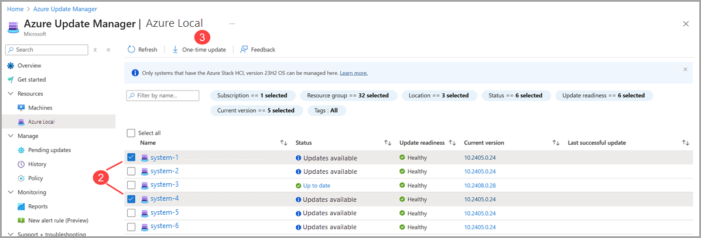
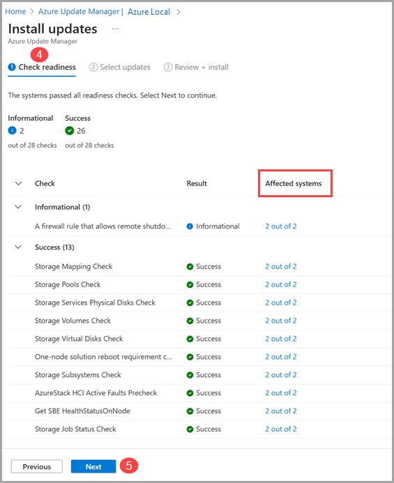
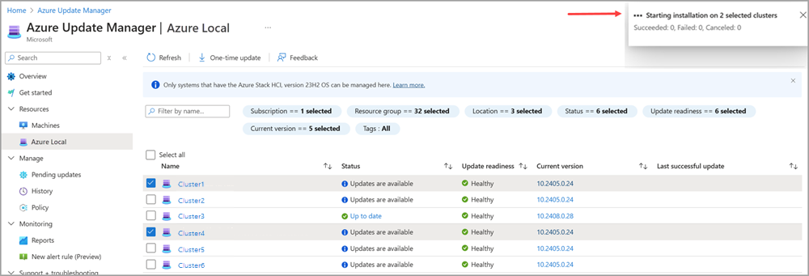
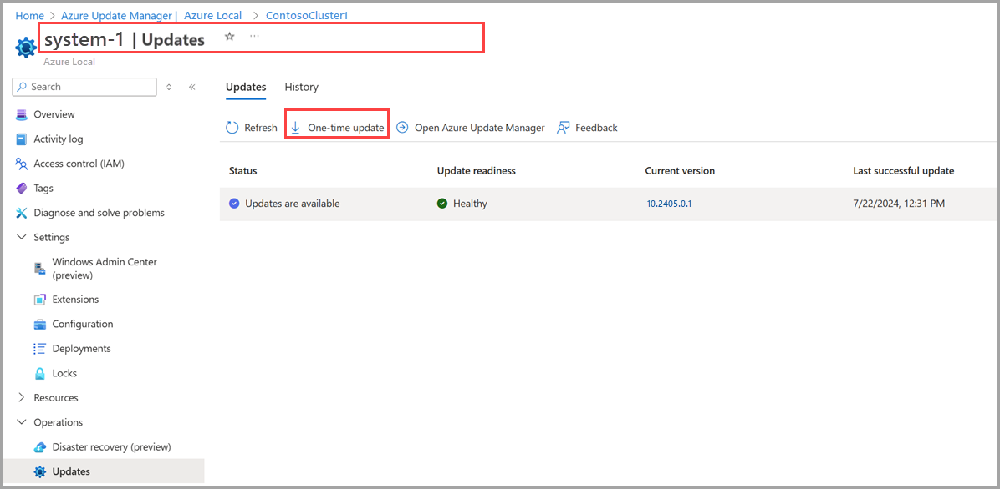
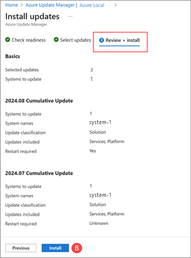
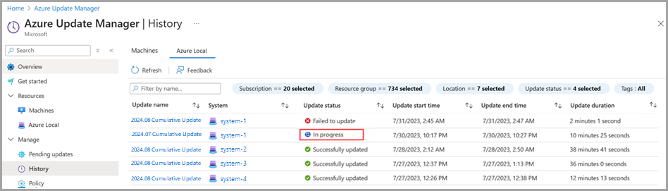
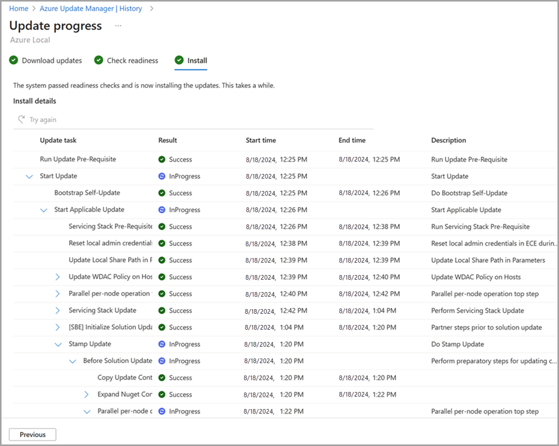

# Use Azure Update Manager to update Azure Local

[!INCLUDE [applies-to](../includes/hci-applies-to-23h2.md)]

[!INCLUDE [azure-local-end-of-support-banner-23h2](../includes/azure-local-end-of-support-banner-23h2.md)]

[!INCLUDE [IMPORTANT](../includes/hci-applies-to-23h2-cluster-updates.md)]

This article describes how to use Azure Update Manager to find and install available updates on Azure Local. It also describes how to review, track progress, and browse the history of system updates.

[!INCLUDE [azure-local-banner-new-releases](../includes/azure-local-banner-new-releases.md)]

## About Azure Update Manager

Azure Update Manager is an Azure service that allows you to apply, view, and manage updates for each of your Azure Local machines. You can monitor your entire infrastructure, including remote and branch offices, and perform updates at scale.

Here are some benefits of the Azure Update Manager:

- The update agent checks Azure Local instances for update health and available updates daily.
- You can view the update status and readiness for each system.
- You can update multiple systems at the same time.
- You can view the status of updates while they're in progress.
- You can view the results and history of updates, after they're complete.

## About readiness checks

[!INCLUDE [about-readiness-checks](../includes/about-readiness-checks.md)]

## Prerequisites

- An Azure Local system deployed and registered with Azure.
- Make sure to apply updates via supported navigation paths in Azure portal. Microsoft only supports updates applied from the **Azure Local** resource page or via the **Azure Update Manager > Resources > Azure Local**. Additionally, use of 3rd party tools to install updates isn't supported. 

For Azure Local, Azure Update Manager is supported only in the regions where Azure Local is supported. For more information, see [List of supported Azure Local regions](../concepts/system-requirements-23h2.md#azure-requirements).

## Browse for system updates

To browse for available system updates using Azure Update Manager, follow these steps:

1. Sign into [the Azure portal](https://portal.azure.com) and go to **Azure Update Manager**.

2. Under the **Resources** dropdown, select **Azure Local**.
   - Filter by Subscription, Resource group, Location, Status, Update readiness, Current version, and/or Tags to view a list of systems.

3. In the systems list, view the update Status, Update readiness, Current version, and the date and time of the Last successful update.

    > [!NOTE]
    > It can take up to 15 minutes for system values to update in the Azure portal.

    

## Install system updates

> [!IMPORTANT]
> - Microsoft only supports updates applied from the **Azure Local** resource page or via the **Azure Update Manager > Resources > Azure Local**.
> - Use of 3rd party tools to install updates isn't supported. 

You can install updates from the Azure Local resource page or via the **Azure Update Manager > Resources > Azure Local page**. Select the appropriate tab to view the detailed steps.

# [Azure Update Manager](#tab/azureupdatemanager)

To install system updates using Azure Update Manager, follow these steps:

1. Sign into [the Azure portal](https://portal.azure.com) and go to **Azure Update Manager**.

2. Under the **Resources** dropdown, select **Azure Local**.

3. Select one or more systems from the list, then select **One-time Update**.

    

4. On the **Check readiness** page, review the list of readiness checks and their results.

    - You can select the links under **Affected systems** to view more details and individual system results. For information on the check types, see [About readiness checks](#about-readiness-checks).
    - For failed readiness checks, review the details and remediation messages via the **View details** links. To further troubleshoot, see [Troubleshoot updates](./update-troubleshooting-23h2.md) before proceeding.

    

[!INCLUDE[azure-portal-install-updates](../includes/azure-portal-install-updates.md)]

8. On the **Review + install** page, verify your update deployment options, and then select **Install**.

    

    You should see a notification that confirms the installation of updates. If you don’t see the notification, select the **notification icon** in the top right taskbar.

    

# [Azure Local resource page](#tab/azurelocalresourcepage)

In addition to using Azure Update Manager, you can update individual systems from the Azure Local resource page.

To install updates on a single system from the resource page, follow these steps:

1. Sign into [the Azure portal](https://portal.azure.com) and go to **Azure Update Manager**.

2. Under the **Resources** dropdown, select **Azure Local**.

3. Select the system name from the list, the update, and then select **One-time update**.

    

4. On the **Check readiness** page, review the list of readiness checks and their results.
    - You can select the links under **Affected systems** to view more details and individual system results. For information on the check types, see [About readiness checks](azure-update-manager-23h2.md#about-readiness-checks).

[!INCLUDE[azure-portal-install-updates](../includes/azure-portal-install-updates.md)]

8. On the **Review + install** page, verify your update deployment options, and then select **Install**.

    

    You should see a notification that confirms the installation of updates. If you don’t see the notification, select the **notification icon** in the top right taskbar.

    

---

## Track system update progress and history

You can use Azure Update Manager to track the progress of Azure Local updates, regardless of the method you use to start the updates. This means you can check the progress of updates started via PowerShell, the Azure Local resource page, or Azure Update Manager.

> [!NOTE]
> After you trigger an update, it can take up to 15 minutes for the update run to show up in the Azure portal.

To view the progress of your update installation, and completion results, follow these steps:

1. Sign into [the Azure portal](https://portal.azure.com) and go to **Azure Update Manager**.

2. Under the **Manage** dropdown, select **History**.

3. Select an update run that you want to monitor or review:
    - Select an **In progress** update to monitor a current updates progress.
    - Select a **Failed to update** or **Successfully updated** update to review historical results.

    

4. On the **Download updates** page, review the progress of the download and preparation, and then select **Next**.

5. On the **Check readiness** page, review the list of readiness checks and their results.
    - You can select the links under **Affected systems** to view more details and individual system results. For information on the check types, see [About readiness checks](#about-readiness-checks).
    - For failed readiness checks, review the details and remediation messages via the **View details** links. To further troubleshoot, see [Troubleshoot updates](./update-troubleshooting-23h2.md#resume-an-update) before proceeding.

6. Select **Next**.

7. On the **Install** page, review the progress of the update installation.

    

## Install hardware updates

[!INCLUDE [azure-local-install-harware-updates](../includes/azure-local-install-harware-updates.md)]

## Get solution version

Follow these steps to find the solution version of your Azure Local instance:

1. In the Azure portal, go to your Azure Local resource page and then go to **Overview**.
1. In the right pane, go to the **Properties** tab and then to **Updates**.
1. Identify the solution version for your Azure Local instance.

    :::image type="content" source="./media/azure-update-manager/get-solution-version-1.png" alt-text="Screenshot of the Overview page for your Azure Local resource in Azure portal." lightbox="./media/azure-update-manager/get-solution-version-1.png":::

## Next steps

Learn to [Understand update phases](./update-phases-23h2.md).

Learn more about how to [Troubleshoot updates](./update-troubleshooting-23h2.md).
