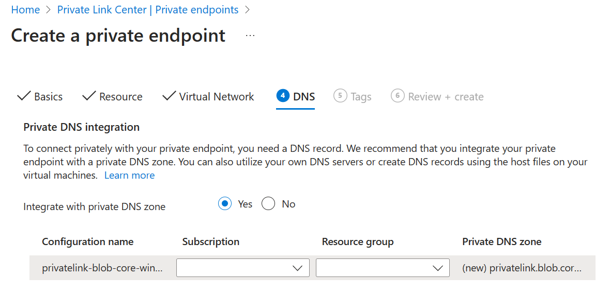

# Azure Managed Lustre file system prerequisites

This article explains prerequisites that you must configure before creating an Azure Managed Lustre file system.

* [Network prerequisites](#network-prerequisites)
* [Blob integration prerequisites](#blob-integration-prerequisites-optional)

## Network prerequisites

Azure Managed Lustre file systems exist in a virtual network subnet. The subnet contains the Lustre Management Service (MGS) and handles all client interactions with the virtual Lustre cluster.

Each file system you create must have its own unique subnet. You can't move a file system from one network or subnet to another after you create the file system.

Azure Managed Lustre accepts only IPv4 addresses. IPv6 isn't supported.

### Network size requirements

The size of subnet that you need depends on the size of the file system you create. The following table gives a rough estimate of the minimum subnet size for Azure Managed Lustre file systems of different sizes.

| Storage capacity     | Recommended CIDR prefix value |
|----------------------|-------------------------------|
| 4 TiB to 16 TiB      | /27 or larger                 |
| 20 TiB to 40 TiB     | /26 or larger                 |
| 44 TiB to 92 TiB     | /25 or larger                 |
| 96 TiB to 196 TiB    | /24 or larger                 |
| 200 TiB to 400 TiB   | /23 or larger                 |

#### Other network size considerations

When you plan your virtual network and subnet, take into account the requirements for any other services you want to locate within the Azure Managed Lustre subnet or virtual network. For example, consider the following factors.

* If you're using an Azure Kubernetes Service (AKS) cluster with your Azure Managed Lustre file system:

  * You can locate the AKS cluster in the same subnet as the managed Lustre system. In that case, you must provide enough IP addresses for the AKS nodes and pods in addition to the address space for the Lustre file system.

  * If you use more than one AKS cluster within the virtual network, make sure the virtual network has enough capacity for all resources in all of the clusters.
  
  To learn more about network strategies for Azure Managed Lustre and AKS, see [AKS subnet access](use-csi-driver-kubernetes.md#provide-subnet-access-between-aks-and-azure-managed-lustre).

* If you plan to use another resource to host your compute VMs in the same virtual network, check the requirements for that process before creating the virtual network and subnet for your Azure Managed Lustre system.

### Subnet access and permissions

By default, no specific changes need to be made to enable Azure Managed Lustre. If your environment includes restricted network or security policies, the following guidance should be considered:

| Access type | Required network settings |
|-------------|---------------------------|
| DNS access  | Use the default Azure-based DNS server. |
|Azure cloud service access | Configure your network security group to permit the Azure Managed Lustre file system to access Azure cloud services from within the file system subnet.  Add an outbound security rule with the following properties: - **Port**: Any - **Protocol**: Any - **Source**: Virtual Network - **Destination**: "AzureCloud" service tag - **Action**: Allow  Note: Configuring the Azure cloud service also enables the necessary configuration of the Azure Queue service.  For more information, see [Virtual network service tags](/azure/virtual-network/service-tags-overview).|
|Lustre network port access| Your network security group must allow inbound and outbound access on port 988 and ports 1019-1023. The default rules `65000 AllowVnetInBound` and `65000 AllowVnetOutBound` meet this requirement.|

> [!NOTE]
> After you create your Azure Managed Lustre file system, several new network interfaces appear in the file system's resource group. Their names start with **amlfs-** and end with **-snic**. Don't change any settings on these interfaces. Specifically, leave the default value, **enabled**, for the **Accelerated networking** setting. Disabling accelerated networking on these network interfaces degrades your file system's performance.

## Blob integration prerequisites (optional)

If you plan to integrate your Azure Managed Lustre file system with Azure Blob Storage, complete the following prerequisites before you create your file system.

An integrated blob container can automatically import files to the Azure Managed Lustre system when you create the file system. You can then create archive jobs to export changed files from your Azure Managed Lustre file system to that container.

If you don't add an integrated blob container when you create your Lustre system, you can write your own client scripts or commands to move files between your Azure Managed Lustre file system and other storage.

When you plan blob integration for your file system, it's important to understand the following differences in how metadata is handled based on whether a storage account has hierarchical namespace enabled:

* For a container in a storage account with hierarchical namespace enabled, Azure Managed Lustre reads POSIX attributes from the blob header.

* For a container in a storage account with a flat namespace (non-hierarchical), Azure Managed Lustre reads POSIX attributes from the blob metadata. A separate empty file with the same name as your blob container contents is created to hold the metadata. This file is a sibling to the actual data directory in the Azure Managed Lustre file system.

To integrate Azure Blob Storage with your Azure Managed Lustre file system, you must create the following items before you create the file system:

- **Storage account**
    - **Account type** - A compatible storage account type. See [Supported storage account types](#supported-storage-account-types).
    - **Access roles** - Must have roles that permit the Azure Managed Lustre system to modify data. See [Required access roles](#access-roles-for-blob-integration).
    - **Access keys** - The storage account must have the storage account key access setting set to **Enabled**.
- **Data containers**
    - **Files for Lustre** - A data container in the storage account that contains the files you want to use in the Azure Managed Lustre file system.
    - **Import/export logs** - A second container for import/export logs in the storage account. You must store the logs in a different container from the data container.

> [!NOTE]
> You can add files to the file system later from clients. However, files added to the original blob container after you create the file system won't be imported to the Azure Managed Lustre file system.

### Supported storage account types

The following storage account types can be used with Azure Managed Lustre file systems.

| Storage account type  | Redundancy                          |
|-----------------------|-------------------------------------|
| Standard              | Locally redundant storage (LRS), geo-redundant storage (GRS)  Zone-redundant storage (ZRS), read-access-geo-redundant storage (RAGRS), geo-zone-redundant storage (GZRS), read-access-geo-zone-redundant storage (RA-GZRS) |
| Premium - Block blobs | LRS, ZRS |

For more information about storage account types, see [Types of storage accounts](/azure/storage/common/storage-account-overview#types-of-storage-accounts).

### Access roles for blob integration

Azure Managed Lustre needs authorization to access your storage account. Use [Azure role-based access control (Azure RBAC)](/azure/role-based-access-control/) to give the file system access to your blob storage.

A storage account owner must add these roles before creating the file system:

* [Storage Account Contributor](/azure/role-based-access-control/built-in-roles#storage-account-contributor)
* [Storage Blob Data Contributor](/azure/role-based-access-control/built-in-roles#storage-blob-data-contributor)

> [!IMPORTANT]
> You must add these roles before you create your Azure Managed Lustre file system. If the file system can't access your blob container, file system creation fails. Validation performed before the file system is created can't detect container access permission problems. It can take up to five minutes for the role settings to propagate through the Azure environment.

To add the roles for the service principal **HPC Cache Resource Provider**, do these steps:

1. Open your storage account, and select **Access control (IAM)** in the left navigation pane.

1. Select **Add** > **Add role assignment** to open the **Add role assignment** page.

1. Assign the role.

1. Then add the **HPC Cache Resource Provider** to that role.

   > [!TIP]
   > If you can't find the HPC Cache Resource Provider, search for **storagecache** instead. **storagecache Resource Provider** was the service principal name before general availability of the product.

1. Repeat steps 3 and 4 for to add each role.

For detailed steps, see [Assign Azure roles using the Azure portal](/azure/role-based-access-control/role-assignments-portal).

### Private endpoints (optional)

If you're using a private endpoint with your blob setup, in order to ensure Azure Managed Lustre can resolve the SA name, you must enable the private endpoint setting **Integrate with private DNS Zone** during the creation of a new endpoint.

- **Integrate with Private DNS zone** - Must be set to **Yes**.

## Next steps

* [Create an Azure Managed Lustre file system in the Azure portal](create-file-system-portal.md)
